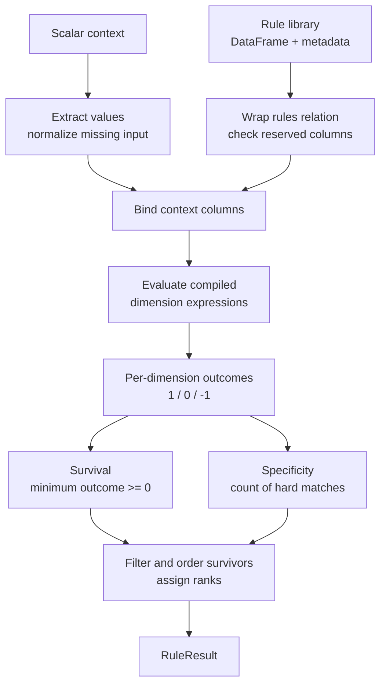

# Chapter 1: From Rule Tables to Decisions

Business logic that lives in `if`/`elif` chains is slow to change: a new pricing tier, eligibility rule, or regional exception means a code review and a deploy. [mountainash-rules](https://github.com/mountainash-io/mountainash-rules) moves that logic into data instead. A **rule** is a row in a table. A **decision** is what happens when you compare a row's values to a real situation — a **context** — one dimension at a time. This chapter builds the small vocabulary that every later chapter assumes: what a rule table is, why matching needs three outcomes instead of two, what a context is, and the two portable abstractions (`mountainash.expressions` and `mountainash.relations`) that let the same rules run against more than one DataFrame library.

None of this requires you to build a working rule library yet — that is [Chapter 2](../02-authoring-rule-libraries/index.md). It also is not a tour of every match strategy, hit policy, or internal algorithm; those come in Chapters 2 through 7. This chapter is deliberately small: ten ideas, one worked rule table, and the diagram that ties them together.

## What a rule table represents

Before any engine is involved, ask a narrower question: what, structurally, is a "rule"? mountainash-rules answers this with a single, unglamorous idea — a rule is a row in a DataFrame, and a rule table is nothing more than that DataFrame plus a declaration of what each column means.

<!-- concept:3 -->
### Rules are rows; comparisons are match strategies

Rather than writing `if region == "AU" and 1000 <= spend <= 9999`, you write the comparison's *shape* once and let every row supply its own values. `src/mountainash_rules/core/constants.py` defines that shape as a `MatchStrategy` enum ([constants.py](https://github.com/mountainash-io/mountainash-rules/blob/94659bb0c096485c87d329f09e944577427f129f/src/mountainash_rules/core/constants.py)), with thirteen members: `EXACT`, `EXACT_KEY`, `NOT_EQUAL`, `RANGE`, `GREATER_THAN`, `LESS_THAN`, `PREFIX`, `SUFFIX`, `CONTAINS`, `REGEX`, `CONTEXT_REGEX`, `SET_MEMBERSHIP`, and `SET_EXCLUSION`. Each one answers the same question — "does this context value satisfy this rule cell?" — with different semantics: exact equality, a numeric interval, a string prefix, list membership, and so on. [Chapter 2](../02-authoring-rule-libraries/index.md) works through every strategy's edge cases; this chapter only needs the pattern: **a dimension pairs one or more columns with one match strategy**, and the engine compiles the comparison from that declaration rather than from hand-written conditionals.

The rest of this chapter reuses one small rule table, adapted from the package [`README.md`](https://github.com/mountainash-io/mountainash-rules/blob/94659bb0c096485c87d329f09e944577427f129f/README.md) Quick Start:

| rule_name | region | spend_min | spend_max |
|---|---|---|---|
| premium_au | AU | 1000 | 9999 |
| standard | AU | 0 | 999 |
| fallback | `<NA>` | -999999999 | -999999999 |

Two dimensions are declared over these columns: `region` uses `MatchStrategy.EXACT` against the `region` column, and `spend` uses `MatchStrategy.RANGE` against the paired `spend_min`/`spend_max` columns. Nothing in the DataFrame itself marks it as "a rule table" — a plain DataFrame with these four columns is just tabular data until dimension metadata says which columns are conditions, which strategy compares them, and which are payload (`rule_name` here). The `fallback` row's `region` value (`<NA>`) and `spend_min`/`spend_max` values (`-999999999`) are not real business values; they are sentinels meaning "this rule does not constrain this dimension." The next section gives that idea a precise name.

<!-- concept:5 -->
### Vectorized evaluation: column operations, not row loops

A naive Python implementation might loop over every rule and dimension. Mountainash Rules instead builds one expression per active dimension, aliases its output `__t_<dimension>`, and combines those columns with reductions for survival and specificity. For a table with $n$ rows and $d$ dimensions, those expressions still process values across the rows: vectorization removes the application-level nested loop, not the dependence on $n \times d$ matching work. The backend executes the column operations, and the batch path applies the same matching logic to context–rule pairs. [Chapter 4](../04-scoring-batches/index.md) explains that larger intermediate relation.

<!-- concept:6 -->
### Backend-agnostic design: the same expressions, different execution engines

The normal implementation boundary is `mountainash.expressions` for expression construction and `mountainash.relations` for table operations. The relation abstraction accepts Polars, Pandas, Narwhals-wrapped frames and supported Ibis relations, including the backend configurations exercised by the package's tests. For batches, `_conform_to_rules_backend` rehosts the already-prepared contexts relation to match the rules relation before joining; it does not change the dimension metadata or match strategy.

That abstraction is not a promise that every operation works on every backend or produces bit-identical results. Per-row `REGEX`, for example, has a documented Polars-native implementation. Backend-specific behavior still needs verification for the operations your library uses. [Chapter 8](../08-extending-and-maintaining/index.md) explains the import guard, its documented exceptions and the limits of what that test proves.

<!-- concept:7 -->
### The DataFrame as the rule store

A rule table is stored as an ordinary DataFrame: each row is a rule, each column is either a dimension the rule constrains or a payload field it carries (`rule_name`, an output price, a priority). During evaluation, the engine layers temporary columns on top without requiring you to pre-modify your data: context values are broadcast as literal columns under a reserved prefix, `CTX_PREFIX = "__ctx_"` (`core/constants.py`), and per-dimension results land in columns named `__t_<dimension>`, alongside bookkeeping columns `__survived`, `__specificity`, `__rank`, and `__rule_index`. `engines/filter/engine.py` guards this reserved namespace explicitly: `_check_reserved` inspects the caller's rules or contexts frame and raises `ValueError(f"{what} frame contains reserved engine columns: {colliding}")` if any of those names — or anything already starting with `__t_` or `__ctx_` — is already present. In practice this means one concrete constraint on your rule tables: do not name a real column `__survived`, `__rank`, or anything starting with `__ctx_` or `__t_`; the engine treats that prefix as its own working space, layered onto the relation via chained `.with_columns()` calls that build a new result rather than mutating the table you passed in.

## Matches, unknowns and wildcards

The rule table above already used two ideas without defining them: a rule can decline to constrain a dimension (`fallback`'s `<NA>` and `-999999999`), and matching apparently has more than two outcomes. This section makes both precise, because the distinction between "the rule doesn't care" and "the context didn't say" is the single most consequential thing to get right when reading or debugging a decision.

<!-- concept:1 -->
### Ternary logic: match, unknown, and non-match

Classical Boolean logic has two states. Rule matching needs a third, because a rule that never mentions a dimension should neither pass nor fail on it — it should be neutral. mountainash-rules represents this with signed integers: **1 means TRUE** (a hard match), **0 means UNKNOWN** (the dimension is a wildcard or don't-care), and **-1 means FALSE** (a real conflict) — stated explicitly as "signed-integer ternary logic (-1 = non-match, 0 = unknown, 1 = match)" in `docs-site/profile-readme.md`'s Architecture section, and implemented exactly that way in `engines/filter/engine.py`.

That encoding is not arbitrary; it makes the two whole-table reductions from the previous section trivial arithmetic. Survival is `ma.least(*t_cols).ge(ma.lit(0))`: take the minimum ternary value across every active dimension, and keep the rule only if that minimum is at least zero. A single `-1` anywhere drags the minimum to `-1`, and the rule is eliminated regardless of how many other dimensions matched; if every dimension is `0` or `1`, the rule survives. Specificity is `sum(c.eq(ma.lit(1)).cast(int) for c in t_cols)`: a plain count of the dimensions that hit a hard `1`. A rule that matches every dimension precisely outranks one that matches fewer and wildcards the rest — "unknown" contributes to survival but never to specificity.

Applying this to the running rule table with a context of `{"region": "AU", "spend": 1500}`:

| Rule | `region` ternary | `spend` ternary | Survives (min ≥ 0) | Specificity (count of 1s) |
|---|---|---|---|---|
| premium_au | 1 (`AU == AU`) | 1 (`1500` in `[1000, 9999]`) | yes | 2 |
| standard | 1 (`AU == AU`) | -1 (`1500` not in `[0, 999]`) | no | — |
| fallback | 0 (`<NA>` wildcard) | 0 (`-999999999` wildcard) | yes | 0 |

Two rules survive — `premium_au` at specificity 2, `fallback` at specificity 0 — matching exactly the `README.md` Quick Start's stated result of `result.count == 2` with `premium_au` ranked ahead of `fallback`. [Chapter 3](../03-evaluating-decisions/index.md) covers how survival and specificity turn into a ranked, filterable result; this chapter only needs the arithmetic to be legible when you read it in a rule table.

<!-- concept:2 -->
### Sentinel values: telling "no constraint" apart from "no answer"

Ternary logic needs a way to detect, inside ordinary table cells, that a value should be treated as UNKNOWN rather than compared literally. mountainash-rules reserves specific constants for this — **sentinel values** — that can never appear as legitimate business data. `core/constants.py` defines four of them directly:

```python
UNKNOWN = "<NA>"                  # rule-side wildcard for string dimensions
NOT_SET = "<NOT_SET>"             # context-side "missing value" for strings
UNKNOWN_NUMERIC = -999999999      # rule-side wildcard for numeric dimensions
NOT_SET_NUMERIC = -999999998      # context-side "missing value" for numerics
```

The same paired convention extends to dates and datetimes, using reserved year-one values for rule-side UNKNOWN and context-side NOT_SET. Those values must remain outside the application's legitimate data domain. `sentinels_for`, `unknown_sentinel_for` and `not_set_sentinel_for` expose the constants; [Chapter 2](../02-authoring-rule-libraries/index.md) explains their types and the separate Boolean handling.

The names distinguish two meanings; do not confuse either stored sentinel with the numeric ternary outcome:

- A rule cell containing `<NA>` (or `-999999999`, or the temporal floor) means **the rule does not constrain this dimension** — it is a wildcard, chosen by whoever wrote the rule.
- A context field containing `<NOT_SET>` (or `-999999998`) means **the caller did not supply a value** for this dimension — it is missing input, not a design choice.

For the sentinel-aware `EXACT` and `RANGE` comparisons in this example, a missing context contributes ternary `0`. That is not a universal rule across strategies: raw string matching, `EXACT_KEY` and `CONTEXT_REGEX` have different sentinel boundaries, detailed in [Chapter 2](../02-authoring-rule-libraries/index.md). The following example evaluates a `region` (`EXACT`) and `amount` (`RANGE`) rule against `{"region": "AU"}`, with the amount omitted:

```python
import polars as pl
from mountainash_rules import Dimension, DimensionsMetadata, ExpressionRulesEngine, MatchStrategy

rules = pl.DataFrame({
    "rule_name": ["in_range"],
    "region": ["AU"],
    "amount_min": [0],
    "amount_max": [100],
})
metadata = DimensionsMetadata(dimensions=[
    Dimension(dimension_name="region", match_strategy=MatchStrategy.EXACT, data_type=str),
    Dimension(
        dimension_name="amount", match_strategy=MatchStrategy.RANGE, data_type=int,
        range_min_field="amount_min", range_max_field="amount_max",
    ),
])
engine = ExpressionRulesEngine(rules=rules, dimension_metadata=metadata)

result = engine.evaluate({"region": "AU"})
assert result.count == 1
assert result.explain("in_range") == {"region": 1, "amount": 0}
```

The rule's `amount_min`/`amount_max` are ordinary integers (`0`, `100`) — nothing about the *rule* wildcards this dimension. The `amount` entry is `0` (UNKNOWN) purely because the caller's context left it out; internally, `extract_context_values` fills the missing field with `NOT_SET_NUMERIC` before the range comparison ever runs. The practical consequence: **a rule survives and can even rank on a technicality if the caller simply forgets to pass a field**, in exactly the same ternary shape as a rule that deliberately wildcards that dimension. The `explain()` result does not distinguish "the rule didn't care" from "the caller didn't say" — both read as `0` — so when a survival result looks surprising, the right place to look is not the ternary output but the raw values feeding it: is the *rule* column holding a sentinel, or is the *context* missing the field? Those are different bugs with different fixes, and only one of them is fixed by editing the rule table.

## Context and portable execution

The examples above already leaned on two things this section names properly: a `context` — a dictionary or Pydantic model describing one situation — and the machinery, `mountainash.expressions` and `mountainash.relations`, that turns dimension metadata and a context into the ternary columns from the previous section. This is also where configuration mistakes get caught, before any of that machinery runs.

<!-- concept:4 -->
### Pydantic models validate configuration before evaluation

Dimension metadata is not a loose dictionary; it is a `pydantic.BaseModel`. `core/dimension.py` defines `Dimension` and `DimensionsMetadata` as Pydantic models, and Pydantic's `model_validator` runs after every field is assigned to enforce strategy-specific constraints — for example, `_validate_strategy_fields` on `Dimension` checks that orderable strategies (`RANGE`, `GREATER_THAN`, `LESS_THAN`) are only used with numeric or temporal `data_type`s. If a constraint is violated, construction raises a `ValueError` with a descriptive message immediately, rather than letting an inconsistent dimension reach the compiler and fail — or worse, silently misbehave — during evaluation:

```python
from mountainash_rules import Dimension, MatchStrategy

# Valid: RANGE with a numeric data_type and both range fields
dim = Dimension(
    dimension_name="spend", match_strategy=MatchStrategy.RANGE, data_type=int,
    range_min_field="spend_min", range_max_field="spend_max",
)

# Raises ValueError at construction: RANGE requires an orderable data_type
# Dimension(dimension_name="spend", match_strategy=MatchStrategy.RANGE, data_type=str,
#           range_min_field="spend_min", range_max_field="spend_max")
```

This front-loads correctness: by the time the compiler in [Chapter 6](../06-expression-execution-internals/index.md) turns a `Dimension` into an expression, Pydantic has already guaranteed the fields that compilation depends on are present and type-consistent. [Chapter 2](../02-authoring-rule-libraries/index.md) works through every validator this way — what it checks and what each failure means — in depth; this chapter only needs the fact that validation happens at construction, not at evaluation time.

<!-- concept:10 -->
### The context object

A context is whatever describes "the situation to decide about" — a dictionary, or a Pydantic `BaseModel` instance, with one field per dimension the engine will evaluate. `core/context.py`'s `extract_context_values` function is the (internal — it is not part of the public `mountainash_rules` API surface, shown here to illustrate the mechanism) helper that normalizes either input shape into a plain dictionary of dimension values:

```python
from mountainash_rules.core.context import extract_context_values

# Dictionary context
values = extract_context_values(
    {"region": "AU", "product_category": "electronics"},
    ["region", "product_category", "tier"],
)
# {"region": "AU", "product_category": "electronics", "tier": "<NOT_SET>"}
```

If a Pydantic `BaseModel` is passed instead, `extract_context_values` calls `.model_dump()` first and proceeds identically. For each requested dimension name, it looks up the corresponding field in that dict; when the field is missing *or* `None`, it substitutes a sentinel — but which one depends on whether dimension metadata was supplied. Without metadata, every missing field becomes the string `NOT_SET`. With metadata, the function reads each dimension's `resolved_context_field` (letting a dimension named `"spend"` read from a differently-named context field) and substitutes the *type-correct* sentinel: `NOT_SET_NUMERIC` for an `int`/`float` dimension, the temporal floor for a `date`/`datetime` dimension, and `NOT_SET` otherwise — except for `DataType.BOOL`, where a missing or `None` value stays `None` rather than becoming a sentinel, because a boolean dimension has no spare value to reserve as "don't-care." This is exactly the mechanism the previous section's worked example depended on: it is why an absent `amount` key became `NOT_SET_NUMERIC`, not the string `"<NOT_SET>"`, before the `RANGE` comparison ran.

<!-- concept:8 -->
### Mountainash expressions: what to compute

`mountainash.expressions` — imported as `ma` throughout `core/compiler.py` and `engines/filter/engine.py` — is the library that builds the comparisons a dimension compiles to. An expression describes a computation without running it; it is only evaluated when a relation collects it. The building blocks the compiler actually uses are narrow and consistent across every strategy:

- **`ma.col(name)`** references an existing column by name — used, for example, to read a rule's raw value for `EXACT_KEY` or a bool dimension, where sentinel-wrapping does not apply.
- **`ma.t_col(name, unknown={...})`** wraps a column so that any value equal to one of the given sentinels — `sentinels_for(dim.data_type)` — automatically reads as `0` (UNKNOWN) under ternary operators, regardless of the other operand. Every `EXACT`, `NOT_EQUAL`, `GREATER_THAN`, `LESS_THAN`, and `RANGE` comparison in `core/compiler.py` wraps both its rule column and its `__ctx_`-prefixed context column this way before comparing them.
- **`ma.lit(value)`** is a literal broadcast to every row — used, for instance, to compare a rule column against the literal sentinel `UNKNOWN` or `NOT_SET` directly, for strategies (like string prefix/suffix matching) that need to special-case the sentinel explicitly rather than relying on `t_col`'s automatic wrapping.
- **`ma.when(cond).then(value).otherwise(value)`** builds a conditional expression — the shape every compiled strategy ultimately reduces to: "if the rule cell is a sentinel, `0`; otherwise, `1` or `-1` depending on the comparison."
- **Ternary comparison methods** on a `t_col`-wrapped expression — `.t_eq()`, `.t_ne()`, `.t_gt()`, `.t_lt()`, `.t_le()`, `.t_ge()`, `.t_is_in()`, `.t_is_not_in()` — produce the `1`/`0`/`-1` result directly, folding the sentinel check and the comparison into one expression.

Putting two of these together reproduces the `EXACT` strategy exactly as `_compile_exact` in `core/compiler.py` does:

```python
import mountainash.expressions as ma
from mountainash_rules.core.constants import CTX_PREFIX, sentinels_for, DataType

sentinels = sentinels_for(DataType.STR)
rule_col = ma.t_col("region", unknown=sentinels)
ctx_col = ma.t_col(f"{CTX_PREFIX}region", unknown=sentinels)
region_expr = rule_col.t_eq(ctx_col)
```

`region_expr` describes a comparison; it is not the result of one. The expression API also has an explicit native escape hatch. `_compile_regex_per_row` uses `ma.native(...)` with a Polars string expression because the portable `regex_contains` operation accepts a literal pattern, not a column of per-row patterns. [Chapter 6](../06-expression-execution-internals/index.md) traces that boundary alongside the portable strategy implementations.

<!-- concept:9 -->
### Mountainash relations: where and how it executes

If expressions describe *what* to compute, `mountainash.relations` describes *where* it runs. `engines/filter/engine.py` imports `concat` and `relation` from it and wraps every DataFrame the engine touches — the rules table, a batch of contexts, a chunk of a larger batch — with `relation(...)` before doing anything else. A relation exposes the operations the engine's pipeline is built from, all confirmed directly in `_scored_relation` and `_evaluate_batch_frame`:

- **`.with_columns(*exprs)`** adds or replaces columns from expression results — this is how `__ctx_*` literal columns, `__t_<dim>` ternary columns, `__survived`, and `__specificity` are added, one call at a time.
- **`.filter(expr)`** keeps only rows where an expression is truthy — used to drop non-survivors (`.filter(ma.col("__survived"))`) and, later, to enforce a `min_specificity` threshold.
- **`.join(other, on=..., how=...)`** — batch evaluation cross-joins the rules relation against the prepared contexts relation (`how="cross"`) so every rule is compared against every context in one pass, and an inner join later re-attaches each context's minimum rank for per-context numbering.
- **`.sort(*cols, descending=...)`** and **`.with_row_index(name=...)`** order rows and assign a 0-based row index — together these produce the `__rank` column, one-based, after sorting survivors by the active hit policy's ordering keys.
- **`.group_by(...).agg(...)`**, **`.head(n)`**, **`.count_rows()`**, and **`.drop(*cols)`** round out the pipeline: grouping computes each context's minimum rank base, `head` implements `top_n` truncation, `count_rows` detects whether a filter actually removed anything (for the `truncated` flag), and `drop` removes temporary columns before the final result is returned.
- **`.collect()`** materializes the built-up computation into a native DataFrame of the same type the caller originally supplied — the point at which every prior `.with_columns()`/`.filter()`/`.sort()` call actually executes. `concat([relation(f) for f in frames]).collect()` is how chunked batch evaluation reassembles one result from several chunk relations.

The entire filter engine's evaluation pipeline — bind context columns, evaluate dimension expressions, compute survival and specificity, filter, rank, and drop temporaries — is expressed as one chain of these relation calls, ending in a single `.collect()`. Nothing in that chain names Polars, Pandas, or Ibis directly; the relation layer is what makes the backend-agnostic design from the first section of this chapter actually executable rather than aspirational.

## From rule library to decision: the shape of one evaluation

The ten ideas above compose into a fixed, five-stage pipeline every time you call `evaluate()`. This is not the full construction/policy/result contract — that is [Chapter 3](../03-evaluating-decisions/index.md) in full — but every stage is now something this chapter has named precisely:



For the running rule table, `{"region": "AU", "spend": 1500}` produces hard matches for the specific rule and unknown outcomes for the fallback; both survive, then ranking distinguishes them. Omitting `spend` still leaves eligible rules because this `RANGE` comparison receives a missing-context sentinel and contributes `0`. The outcome column alone does not say whether an unknown came from missing input or a wildcard rule. Other strategies have their own missing-input behavior, so consult the strategy definition rather than generalizing this range example.

From here, [Chapter 2](../02-authoring-rule-libraries/index.md) shows how to build a real `DimensionsMetadata` covering every match strategy and validation rule; [Chapter 3](../03-evaluating-decisions/index.md) picks the pipeline back up at the `RANK`/`RESULT` boundary and covers hit policies, result accessors, and the two explanation interfaces in full. [Chapters 6](../06-expression-execution-internals/index.md) and [7](../07-combination-search-internals/index.md) reopen the `EXPR` and `REL` stages from the implementation side, once the observable contract established here and in Chapter 3 is something their internals are required to preserve.
