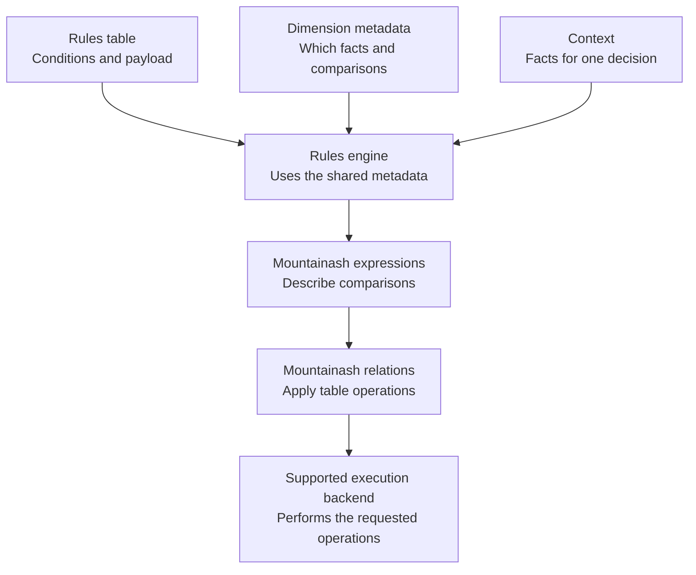

# Chapter 1: Two Rule Engines, One Shared Model

Mountainash Rules is a Python package for evaluating business rules stored in tables. Each row defines a rule: conditions that determine when it applies, together with values to return or combine. The input values for an evaluation are supplied in a **context**, such as a dictionary of request fields.

The package provides two engines:

- The **Expression Rules Engine** compares a context with the rules table and returns matching rules, with configurable ordering and selection.
- The **Accumulator Engine** builds combinations of rules whose conditions can hold together and aggregates selected numeric values within each combination. It then compares a context with the built combinations to find those that apply.

Both engines use **dimension metadata** to interpret the rules table. A dimension defines one comparison between rule conditions and a context value. Its metadata specifies the fields to read, the data type and the comparison strategy, such as exact equality or a numeric range.

This chapter explains column-wise evaluation, the rules table, context objects and the interfaces to DataFrame libraries. A worked example shows how the shared model supports both individual rule matching and numeric accumulation. The Python blocks form one session and use Polars.

<!-- concept:5 -->
## Vectorized evaluation {#comparing-rules-as-columns}

**Vectorized evaluation** compares a context with a rules table using column operations. For each dimension, the engine computes a comparison result for every rule, then combines the results within each row to determine whether that rule survives. The DataFrame library executes these operations.

For example, consider rules that select warehouse tasks for a delivery. Each rule specifies a destination region and a delivery service. Both dimensions use exact matching, so a task applies when the delivery's region and service equal the values in its rule.

An Australian delivery sent by standard service supplies the context values `region="AU"` and `service="standard"`. The engine compares the rule-region column with `AU` and the rule-service column with `standard`.

The four rules supply these condition values:

```text
Rule regions:  AU        AU        NZ        AU
Rule services: standard  standard  standard  express
```

The region comparison produces `match, match, non-match, match`; the service comparison produces `match, match, match, non-match`. Combining the two results for each rule gives:

| Rule | Region compared with `AU` | Service compared with `standard` | Keep this rule? |
|---|---|---|---|
| `inspect_au` | Match | Match | Yes |
| `pack_au` | Match | Match | Yes |
| `inspect_nz` | Non-match | Match | No |
| `rush_au` | Match | Non-match | No |

The inspection and packing rules for Australian standard deliveries match both conditions. The New Zealand inspection rule fails the region comparison, and the Australian express-service rule fails the service comparison. The engine retains `inspect_au` and `pack_au`.

Mountainash Rules also has an *unknown* comparison outcome, used for cases such as a **wildcard**, which leaves a rule condition unrestricted. This three-outcome representation is called **ternary matching**. The example above uses only specific values, so every comparison yields match or non-match. Chapter 3 covers unknown outcomes, wildcards and missing context values.

### Matching cost {#what-vectorization-doesand-does-notsave}

Four rules and two dimensions give us eight values to compare. Two column operations still process all eight values. Adding rows gives the backend more values to process; adding dimensions gives it more comparison columns to compute and combine.

Vectorization lets the backend handle repeated comparisons with its own implementation and optimizations. Throughput depends on the workload and backend and should be measured for the intended use.

Matching and ordering the retained rows are separate stages. The accumulator also searches for compatible combinations, creating rows that did not exist in the original table. For multiple contexts, the work grows again: the [batch chapter](../06-batch-evaluation/index.md#understand-the-work-behind-a-batch) explains the cost of comparing many contexts with many rules.

The [filter implementation][filter-source] binds context values, computes the comparison columns and combines them to determine which rules survive. The implementation chapters explain the expressions involved.

<!-- concept:7 -->
## The rules table {#put-the-rules-in-a-table}

The rules table is a DataFrame containing condition values and associated output data. Each row represents one rule, and the schema defines the column types.

Here is the complete table for the warehouse example. In addition to the conditions, each rule has a task name and an estimated processing time in minutes:

| `rule_name` | `region` | `service` | `minutes` |
|---|---|---|---:|
| inspect_au | AU | standard | 2 |
| pack_au | AU | standard | 5 |
| inspect_nz | NZ | standard | 3 |
| rush_au | AU | express | 8 |

The first row assigns the inspection task to Australian standard deliveries, with an estimate of two minutes. The second assigns packing to the same deliveries, with an estimate of five minutes. Both tasks apply under the same conditions and are stored as separate rules.

We can store the table directly in Polars:

```python
import polars as pl

rules = pl.DataFrame({
    "rule_name": ["inspect_au", "pack_au", "inspect_nz", "rush_au"],
    "region": ["AU", "AU", "NZ", "AU"],
    "service": ["standard", "standard", "standard", "express"],
    "minutes": [2, 5, 3, 8],
})
```

`region` and `service` contain conditions. `rule_name` identifies the task, and `minutes` carries its estimate. This carried information is the **payload**. The accumulator can combine numeric payload, such as summing the minutes across compatible tasks.

### Dimension metadata {#the-table-needs-an-interpretation}

**Dimension metadata** specifies how rule columns are compared with context fields. For a region dimension, the comparison might require equality or exclude a specified region. The comparison is configured independently of the values stored in each row.

`Dimension` describes one comparison; `DimensionsMetadata` holds the declarations for the rule library. `DataType.STR` declares a string dimension. Unless you override the fields, a declaration reads the rule column and context field with the dimension's name. The [dimension definitions][dimension-source] implement these defaults.

We declare two string dimensions using exact matching: the supplied region must equal the rule's region, and the supplied service must equal the rule's service. Exact matching is the default, so we can omit the strategy argument:

```python
from mountainash_rules import DataType, Dimension, DimensionsMetadata

metadata = DimensionsMetadata(dimensions=[
    Dimension(dimension_name="region", data_type=DataType.STR),
    Dimension(dimension_name="service", data_type=DataType.STR),
])
```

The engine matches on the declared `region` and `service` dimensions and carries the task name and time estimate as payload. A dimension can also use more than one physical column: a range can have separate lower- and upper-bound columns. Chapter 2 explains those field mappings and configuration checks.

Rule values and comparison configuration can therefore be maintained separately. Changing a task's time estimate updates the rules table; changing region matching from equality to exclusion updates the metadata. The first changes a payload value, while the second changes how the engine determines which rules apply.

The engine reserves names such as `__rank` and prefixes such as `__ctx_` and `__t_` for its working columns. It adds context values, comparison results and ordering information during evaluation. Application columns must avoid these reserved names.

<!-- concept:10 -->
## Contexts {#describe-one-delivery}

A **context object** supplies the input values against which the rules are evaluated. For an Australian standard delivery, the context is:

```python
context = {"region": "AU", "service": "standard"}
```

The field names are the same, but their roles differ. In a rule row, `region="AU"` is a condition: the rule applies to that region. In the context, it is a fact about this delivery. Metadata connects the two, and the engine makes that single context value available to every row's comparison.

Each input has a separate job:

| Structure | Question it answers | In this example |
|---|---|---|
| Rules table | What conditions and outcomes have we defined? | Four task rules and their estimates |
| Dimension metadata | How should rule values be compared with facts? | Exact string comparisons for region and service |
| Context | What is true of this particular situation? | An Australian standard delivery |

The configured dimensions determine which context fields the engine reads. By default, those fields have the dimensions' names, as `region` and `service` do here. Chapter 2 explains how to map a dimension to a differently named context field.

To evaluate the context, construct an `ExpressionRulesEngine` with the rules table and metadata, then call `evaluate()`. The returned result object's `survivors` accessor exposes the retained rows. `relation()` wraps that table in Mountainash's common table interface; `to_polars()` converts it to Polars for display.

```python
from mountainash.relations import relation
from mountainash_rules import ExpressionRulesEngine

engine = ExpressionRulesEngine(rules=rules, dimension_metadata=metadata)
result = engine.evaluate(context)
matched = relation(result.survivors).to_polars()
print(matched.select("rule_name", "minutes").to_dicts())
```

```text
[{'rule_name': 'inspect_au', 'minutes': 2}, {'rule_name': 'pack_au', 'minutes': 5}]
```

With the default selection settings, the result contains both matching task rules as separate rows. Each row retains its own time estimate. Chapters 4 and 5 explain the result interface and the policies that control ordering and selection when several rules match.

We can use the same table and metadata for another delivery. Supplying `{"region": "NZ", "service": "standard"}` would match `inspect_nz`, with its estimate of three minutes. Only the context changes. For many deliveries at once, [Chapter 6](../06-batch-evaluation/index.md) stores contexts as rows of an input table and keeps their identities separate.

### Missing context values {#an-absent-fact-is-not-a-negative-answer}

The engine accepts both dictionaries and Pydantic `BaseModel` instances as contexts. An application can use a Pydantic model to validate required fields before evaluation.

Leaving out a field does not necessarily make the rules requiring it fail. The [context extraction code][context-source] recognizes missing keys and `None`, represents absence according to the declared type, and leaves the outcome to the match strategy. It does not validate application inputs in general.

With these two exact string dimensions, omitting `service` makes its comparison unknown. We no longer know that the delivery is standard, so the service comparison cannot exclude the Australian express rule:

```python
incomplete = engine.evaluate({"region": "AU"})
print(sorted(relation(incomplete.survivors).to_polars()["rule_name"].to_list()))
```

```text
['inspect_au', 'pack_au', 'rush_au']
```

Omitting `service` broadens the result to include `rush_au` because its service condition can no longer exclude it. Missing-value behavior depends on the dimension's type and match strategy. Applications that require a service value should validate its presence before evaluation. Chapter 3 distinguishes missing context values from rule conditions that are deliberately unrestricted.

<!-- concept:6 -->
## DataFrame backends {#using-other-dataframe-libraries}

A **backend** stores the data or executes table operations. Mountainash Rules accesses supported backends through the `mountainash` package's expression and relation interfaces. The examples here use Polars for storage and execution.

**Backend-agnostic design** separates matching logic from the implementation of DataFrame operations. The normal engine code uses two shared abstractions:

- An **expression** describes a calculation, such as comparing the region column with the context's region.
- A **relation** exposes table operations, such as adding a comparison column or retaining matching rows, over a supported input.

Expressions and relations work together within an engine. An expression defines a calculation, and a relation applies it to a table through the selected backend. The dimension metadata specifies the matching behavior independently of that backend. Chapter 2 introduces both APIs.

The diagram shows how the rules table, metadata and context connect to these execution interfaces:



The relation layer accepts Polars and Pandas frames, Narwhals-wrapped frames and supported Ibis relations. Ibis can describe tables backed by another execution system, so a rule store need not be an in-memory Polars table. The backend affects execution and conversion while the business meaning of our two dimensions stays the same.

### Backend support and conversion {#portability-has-an-operation-boundary}

Backend support depends on both the accepted input types and the operations used by an engine call. The relevant boundaries are:

| Boundary | What it means for an application |
|---|---|
| Ordinary expression-engine matching uses Mountainash's expression and relation interfaces | Shared dimension definitions can be reused where the backend supports the required operations. |
| Per-row `REGEX` uses a Polars-native expression | A table of different regex patterns is not a portable example for every backend. |
| Accumulator `build()` materializes input to Polars | Accepting another input type does not make the whole combination build native to that original backend. |
| Batch evaluation prepares compatible inputs before joining them | Reusing metadata does not eliminate table conversion or staging costs. |

The [comparison compiler][compiler-source] contains the Polars-native per-row regex path. The [accumulator build implementation][accumulator-source] converts its input to Polars before constructing combinations.

Moving the warehouse rules from Polars to Pandas would change their representation while preserving the intended exact comparisons for `region` and `service`. A rule library using list membership or per-row regex also needs backend support for those operations. Verify the actual comparisons and engine calls when selecting a backend.

`engine.evaluate()` returns a result object with table accessors for inspecting or converting the retained rows. In this example, `to_polars()` selects Polars as the display format. The executable examples in this chapter have been verified with Polars.

## Individual rules and combinations {#individual-rules-or-compatible-combinations}

The Accumulator Engine constructs combinations of compatible rules and aggregates selected values within them. For the warehouse example, summing the task estimates in a combination gives its total processing time. We can use the same four rules and Australian standard context to compare this result with the expression engine's output.

The expression engine returned `inspect_au` and `pack_au` as two individual rows, carrying two and five minutes respectively. The accumulator first checks which rules have conditions that can hold together. Inspection and packing agree on both region and service, so they can form a combination. The New Zealand rule conflicts on region; the rush rule conflicts on service.

If we configure the accumulator to sum `minutes`, its build produces an inspection-and-packing combination with an estimate of seven minutes. Applying our context to the built table returns that combination:

| Engine | What one returned row represents | Result for this context |
|---|---|---|
| Expression Rules Engine | An individual applicable rule | `inspect_au`: 2 minutes; `pack_au`: 5 minutes |
| Accumulator Engine | A compatible combination with accumulated values | `inspect_au` + `pack_au`: 7 minutes |

In this comparison table, `inspect_au` + `pack_au` identifies the contributing source rules. The actual numeric total is stored in an accumulator result field. An aggregate declaration specifies the source column and operation: `minutes` and sum in this example. Chapter 7 covers the configuration and result fields.

The built combination table is called a **lattice**. The engine constructs it from the rules' conditions before evaluating a context, then uses the shared matching machinery to compare the context with the combined conditions. A built lattice can be reused for multiple contexts. The combination search has its own costs and limits, separate from those of matching a context against the lattice.

A lattice can contain combinations of different sizes. With wildcards, a single unrestricted rule can remain alongside a more specific combination of several rules. Applying a context can therefore return more than one combination. Chapters 7 and 8 explain how the build retains combinations and how to interpret these results.

## Summary {#key-takeaways}

- Vectorization lets the backend perform repeated comparisons as column operations. The number of rules and dimensions still determines how much data it processes.
- The rules table stores conditions and payload; metadata tells the engine how to interpret them.
- A context supplies the facts for one decision. Missing-value behavior depends on each dimension's type and match strategy.
- Backend abstraction separates matching logic from execution. Check the capabilities and conversions required by the engine path you use.
- The expression engine returns individual rules. The accumulator builds and applies compatible combinations using the same shared model.

## Next chapters {#continue-with-the-shared-rule-model}

[Chapter 2](../02-shared-rule-model/index.md) covers tables, contexts and dimension metadata. Chapter 3 explains matching strategies, unknowns and wildcards. Chapters 4 to 6 cover the Expression Rules Engine, and Chapters 7 and 8 cover the Accumulator Engine. Implementation and extension follow the public workflows.

The [book contents](../index.md) list the chapters in reading order. Chapter 2 provides [dimension configuration examples](../02-shared-rule-model/index.md#the-dimension-class), and [Chapter 3](../03-matching-concepts/index.md) explains matching strategies, unknowns and wildcards. [Chapter 6](../06-batch-evaluation/index.md) extends single-context evaluation to a table of contexts.

## Sources and examples {#source-and-example-notes}

The examples use Rules revision `730a8583ee9d4fd6b52dc5350699eb66cc7487e9`. This manual's [license and attribution](../../license.md) apply to the chapter. The implementation references are:

- [Filter engine][filter-source]: dimension compilation, context binding and column-wise scoring.
- [Dimension models][dimension-source]: exact/string defaults and field resolution.
- [Context extraction][context-source]: dictionary/model inputs and typed handling of absence.
- [Comparison compiler][compiler-source]: exact matching and the per-row regex backend boundary.
- [Accumulator engine][accumulator-source]: build-time materialization and context application.

[filter-source]: https://github.com/mountainash-io/mountainash-rules/blob/730a8583ee9d4fd6b52dc5350699eb66cc7487e9/src/mountainash_rules/engines/filter/engine.py
[dimension-source]: https://github.com/mountainash-io/mountainash-rules/blob/730a8583ee9d4fd6b52dc5350699eb66cc7487e9/src/mountainash_rules/core/dimension.py
[context-source]: https://github.com/mountainash-io/mountainash-rules/blob/730a8583ee9d4fd6b52dc5350699eb66cc7487e9/src/mountainash_rules/core/context.py
[compiler-source]: https://github.com/mountainash-io/mountainash-rules/blob/730a8583ee9d4fd6b52dc5350699eb66cc7487e9/src/mountainash_rules/core/compiler.py
[accumulator-source]: https://github.com/mountainash-io/mountainash-rules/blob/730a8583ee9d4fd6b52dc5350699eb66cc7487e9/src/mountainash_rules/engines/accumulator/engine.py
