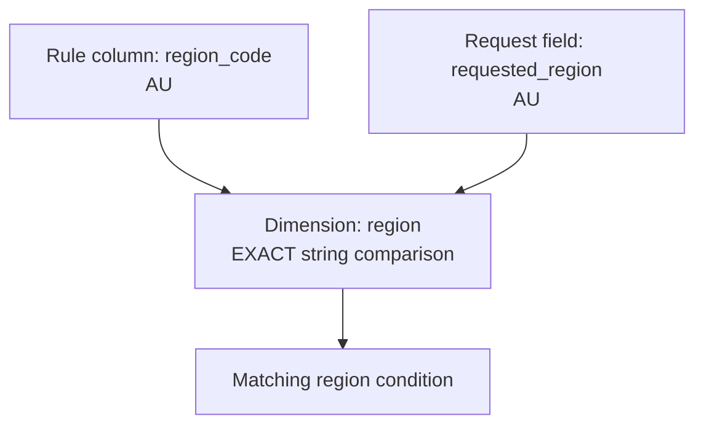
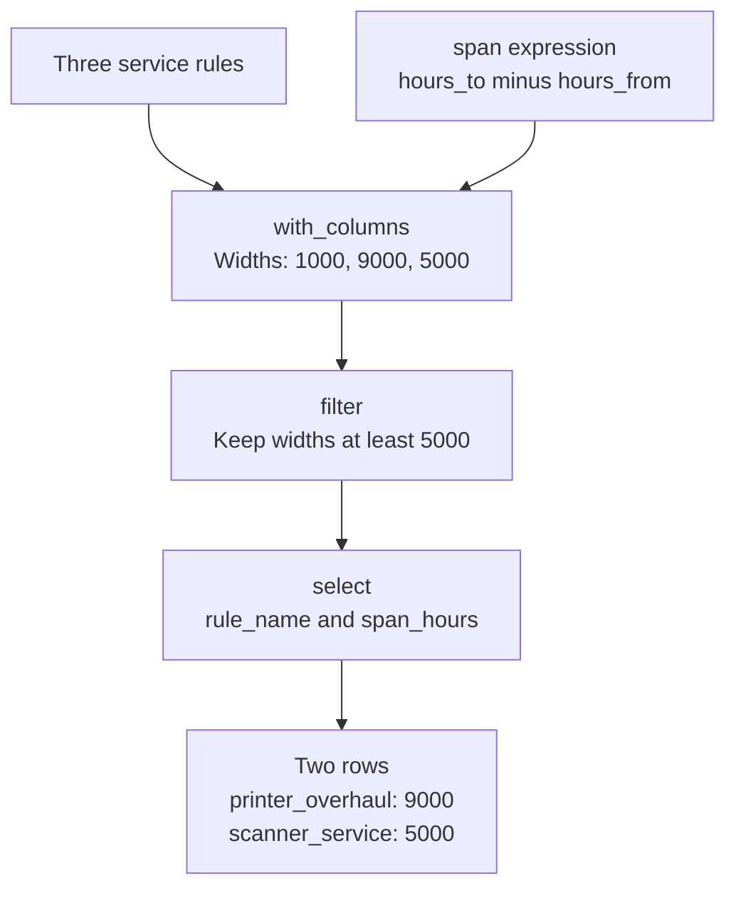

# Chapter 2: The Shared Rule Model: Tables, Contexts and Dimensions

Mountainash Rules uses dimension metadata to define how a rules table is interpreted during evaluation. The metadata specifies which rule columns and context fields to read, the types of their values, and the comparison to perform.

The package provides two configuration models. `Dimension` describes one logical comparison, including its strategy, data type, field mappings and role. `DimensionsMetadata` collects the dimensions and table-level selection settings. Both the Expression Rules Engine and the Accumulator Engine use these models.

This chapter explains how to define dimensions, validate their configuration and save metadata as YAML. It distinguishes configuration validation from application input validation, then introduces the expression and relation APIs used to execute the comparisons. The Python examples form one session and use Polars tables.

<!-- concept:3 -->
## Match strategy patterns {#rules-are-rows-comparisons-are-match-strategies}

A match strategy specifies the comparison between a context value and a rule's condition. With exact matching, the values must be equal. With a range, the context value must fall between bounds supplied by the rule. The strategy stays the same across the table; each row supplies its own values.

For example, a rules table can select a maintenance team from an equipment request containing a product line, region and operating-hours reading. In the following table, product line and region use exact matching, and operating hours use a range. Each range includes its lower bound and excludes its upper bound:

| Rule | Product line | Region | Hours from | Hours to | Team |
|---|---|---|---:|---:|---|
| `printer_routine` | printer | AU | 0 | 1000 | routine |
| `printer_overhaul` | printer | AU | 1000 | 10000 | overhaul |
| `scanner_service` | scanner | NZ | 0 | 5000 | optics |

A printer in Australia with 750 operating hours meets the first rule. At 1000 hours, it meets the second. The region comparison is equality in both cases; the hours comparison uses the same interval shape with different bounds.

The table alone does not specify that the upper bounds are exclusive. Nor does the name `region_code` force equality: a string column could hold exact values, prefixes or patterns. Those choices belong in metadata. Choose the strategy from the meaning of the condition, then store the values it needs.

`team` is the payload: the answer our application wants to read. `rule_name` identifies a row. The matching dimensions are product line, region and operating hours.

The strategy families use different rule shapes:

| Kind of condition | Rule-side data | Example question |
|---|---|---|
| Equality or inequality | One scalar value | Is this the requested region? |
| Range | Lower and upper columns | Does the operating-hours value fall in this interval? |
| Threshold | One scalar bound | Is the context above or below this limit? |
| String comparison | A prefix, suffix, substring or pattern | Does the context text fit this condition? |
| Set comparison | A list of values | Is the context value included or excluded? |

A metadata-level context pattern is a special case: it stores one pattern on the dimension instead of reading a pattern from each rule. We will distinguish those fields below. Chapter 3 works through the outcomes for each strategy, including absent values and wildcards. The examples here use concrete values so that we can concentrate on the schema.

<!-- concept:11 -->
## The MatchStrategy enum {#the-matchstrategy-enum}

`MatchStrategy` defines thirteen comparisons and is exported from `mountainash_rules`.

```python
from mountainash_rules import MatchStrategy

print(MatchStrategy.RANGE.value)
print(MatchStrategy("range") is MatchStrategy.RANGE)
```

```text
range
True
```

It is a Python `StrEnum`: each member has a lowercase string value. Python code can use `MatchStrategy.RANGE`; serialized configuration uses `range`. Constructing the enum from that string recovers the same member. The uppercase member name `RANGE` is not the serialized value.

A library may need only a few strategies, but any of these names can appear in a schema:

| Members | Serialized values | Comparison family |
|---|---|---|
| `EXACT`, `EXACT_KEY`, `NOT_EQUAL` | `exact`, `exact_key`, `not_equal` | Equality and inequality |
| `RANGE` | `range` | Interval |
| `GREATER_THAN`, `LESS_THAN` | `greater_than`, `less_than` | Ordered threshold |
| `PREFIX`, `SUFFIX`, `CONTAINS` | `prefix`, `suffix`, `contains` | String fragment |
| `REGEX`, `CONTEXT_REGEX` | `regex`, `context_regex` | Regular expression |
| `SET_MEMBERSHIP`, `SET_EXCLUSION` | `set_membership`, `set_exclusion` | Membership in a rule-side list |

`EXACT` is the default on a dimension. `EXACT_KEY` differs in its treatment of missing context values and rule wildcards. `REGEX` and `CONTEXT_REGEX` differ in where the pattern comes from. Chapter 3 develops each strategy's semantics through worked examples.

The compiler translates a strategy into a column expression. These expressions return a common three-valued result: match (`1`), unknown (`0`) or non-match (`-1`). That common result lets the engine combine dimensions that use different comparisons.

The enum names the comparisons in the shared model; support still depends on the backend and engine operation. Matching a context against a row and merging two rows' conditions require different operations. Check the relevant engine's support before adopting a strategy throughout a library. The declarations are in the [constants source][constants-source]; their compilation is in the [comparison compiler][compiler-source].

<!-- concept:4 -->
## Configuration and input validation {#pydantic-models-validate-configuration-before-evaluation}

`Dimension` and `DimensionsMetadata` are Pydantic models. Their constructors parse fields, supply defaults and check combinations of settings. A misspelled strategy therefore fails while constructing metadata, before any table is evaluated:

```python
from pydantic import ValidationError
from mountainash_rules import Dimension

try:
    Dimension(dimension_name="region", match_strategy="approximate")
except ValidationError as exc:
    error = exc.errors()[0]
    print(error["loc"], error["type"])
```

```text
('match_strategy',) enum
```

The location identifies the field; the error type says that its value is outside the enum. The full exception also includes a message and input details. `ValidationError` is a subclass of `ValueError`, so either can be caught, but `ValidationError.errors()` is useful when an application needs structured diagnostics.

Configuration validation has a limited job. A valid dimension does not prove that a rule table contains the named columns, that all stored values have suitable types, or that an incoming request satisfies your application's requirements. A dimension can be constructed without any table or request present.

You may use a separate Pydantic model for requests. For the service desk, the application accepts two product lines, two regions and a nonnegative integer reading:

```python
from typing import Literal
from pydantic import BaseModel, Field

class ServiceRequest(BaseModel):
    product_line: Literal["printer", "scanner"]
    requested_region: Literal["AU", "NZ"]
    operating_hours: int = Field(ge=0, strict=True)

request = ServiceRequest(
    product_line="printer",
    requested_region="AU",
    operating_hours=750,
)
print(request.model_dump())
```

```text
{'product_line': 'printer', 'requested_region': 'AU', 'operating_hours': 750}
```

`Literal` restricts the accepted strings. `ge=0` requires a value greater than or equal to zero, and `strict=True` requires an integer rather than coercing a text reading such as `"750"`. These are application decisions, not restrictions inferred from the rule library.

```python
try:
    ServiceRequest(
        product_line="printer",
        requested_region="AU",
        operating_hours=-1,
    )
except ValidationError as exc:
    error = exc.errors()[0]
    print(error["loc"], error["type"])
```

```text
('operating_hours',) greater_than_equal
```

The expression engine accepts this validated model as a context. It also accepts a dictionary, but passing a dictionary does not cause the engine to construct `ServiceRequest` for you. If your application requires these checks, create the model at its input boundary and pass the resulting object to evaluation.

Keep those responsibilities separate when diagnosing a failure. A metadata error concerns how the rules should be interpreted. A request error concerns the facts an application accepts. A valid request can still match no rule; that is a matching result, not a Pydantic validation failure.

<!-- concept:94 -->
## The DataType enum {#the-datatype-enum}

A dimension's `data_type` declares the kind of value the comparison expects. `DataType` provides six portable names instead of requiring a Polars, Pandas or database-specific type object:

| Member | Serialized value | Python type |
|---|---|---|
| `STR` | `str` | `str` |
| `INT` | `int` | `int` |
| `FLOAT` | `float` | `float` |
| `BOOL` | `bool` | `bool` |
| `DATE` | `date` | `datetime.date` |
| `DATETIME` | `datetime` | `datetime.datetime` |

Each member exposes `python_type`. The `is_numeric` property is true for `INT` and `FLOAT`; `is_temporal` is true for `DATE` and `DATETIME`. The dimension validator uses those groups when checking ordered comparisons.

```python
from mountainash_rules import DataType

print(DataType.INT.python_type is int)
print(DataType.INT.is_numeric, DataType.INT.is_temporal)
print(DataType("date").is_temporal)
```

```text
True
True False
True
```

Our product line and region are strings; operating hours are integers. Declaring `DataType.INT` does not convert a rule column full of text into integers. Prepare the table with suitable types, and validate or normalize incoming values at the application boundary. The declaration also guides the engine's treatment of missing values, which Chapter 3 explains.

For a set strategy, the declared type describes the list's elements and the scalar context value. A list of region names uses `DataType.STR`.

Older examples may pass a Python class, such as `data_type=int`. That spelling is still accepted for the six supported classes, but emits a `DeprecationWarning`. Use `DataType.INT` or the serialized string `"int"` in new metadata.

<!-- concept:23 -->
## Dimension roles {#the-dimensionrole-enum}

A strategy tells the engine how to compare values. A role tells the accumulator whether a dimension separates independent groups of rules or contributes a condition within a group. `DimensionRole` has two members, `CONSTRAINT` and `CONTEXT_KEY`, serialized as `constraint` and `context_key`.

The distinction matters when building combinations. Suppose printer rules and scanner rules belong to independent service programs. The accumulator should build their combinations separately. Within the printer program, region and operating hours describe which conditions can hold together. Product line can therefore be a context key, while region and hours remain constraints.

This role choice does not change how the expression engine compares the product-line column. It compiles and evaluates both roles according to their strategies. A printer context still fails to match a concrete scanner rule. Marking a field `CONTEXT_KEY` does not make the expression engine ignore it.

| Role | Expression-engine evaluation | Accumulator build |
|---|---|---|
| `CONSTRAINT` | Compares the dimension when it is active | Checks and combines its conditions within a partition |
| `CONTEXT_KEY` | Compares the dimension when it is active | Identifies the partition to build |

Here, a *partition* is one group of rules with a particular combination of key values. With one key, it might be all printer rules. With multiple keys, it might be all rules for a particular product line and service program. Rules from different partitions are not combined into one lattice node.

Choose context keys to identify independent groups of rules for combination building. Expression-engine dimension selection is a separate evaluation setting. The [accumulator constructor][accumulator-source] separates key and constraint dimensions; the [filter engine][filter-source] compiles the supplied dimension definitions without excluding keys.

<!-- concept:24 -->
### Constraint dimensions {#constraint-role}

`CONSTRAINT` is the default role. A constraint describes something a rule requires of the context. In our example, the routine printer rule requires an Australian region and fewer than 1000 operating hours.

During expression evaluation, those requirements help decide whether the row survives and how specifically it matched. During accumulator construction, supported constraint strategies also determine whether rules are compatible. *Coalescing* means deriving a combined condition that satisfies the participating rules. For two ordinary overlapping ranges, that is their intersection; incompatible ranges cannot describe one jointly applicable combination.

A constraint is not an output to add or otherwise aggregate. The `hours_from` and `hours_to` columns describe eligibility. If a later accumulator example needs to add estimated service minutes, it must declare a separate aggregate for that payload. Chapter 7 develops that workflow.

<!-- concept:25 -->
### Context keys {#context_key-role}

A `CONTEXT_KEY` identifies an accumulator partition. With `product_line` as the key, the printer rows go into one group and the scanner row into another. Building all partitions creates separate lattices for those groups. A lattice holds combinations for its own partition, rather than a mixture of every product line in the source table.

The key is part of the metadata and the rules. A context later supplies the key values needed to choose a lattice. That routing is distinct from testing the constraints inside the chosen lattice. Exact keys are easy to picture; wildcard partitions and ambiguous routes need more care and receive their full treatment in Chapter 8.

`CONTEXT_KEY` and `EXACT_KEY` name different settings. The former is a role for partitioning; the latter is a match strategy with particular missing-value semantics. Setting a role does not silently change the dimension's strategy. Our example uses the default `EXACT` strategy for `product_line`, with concrete product names on both sides. We will verify its expression-engine behavior when we assemble the metadata.

<!-- concept:26 -->
## The Dimension model {#the-dimension-class}

A `Dimension` joins the comparison settings to the names used by the rule table and the context. Define one per logical comparison, not necessarily one per physical column. Our hours comparison reads two bound columns but is still one dimension.

The common fields are:

| Field | Default | Meaning |
|---|---|---|
| `dimension_name` | Required | Logical name used to identify the comparison |
| `context_field` | `None` | Request field to read; otherwise use the logical name |
| `rule_field` | `None` | Rule column to read for a single-column strategy; otherwise use the logical name |
| `match_strategy` | `MatchStrategy.EXACT` | Comparison operation |
| `data_type` | `DataType.STR` | Declared value type |
| `role` | `DimensionRole.CONSTRAINT` | Accumulator partition or constraint role |
| `valid_values` | Empty list | Declarative domain for external consumers, not an engine-enforced restriction |

For a range, `range_min_field` and `range_max_field` name its rule columns. `range_min_inclusive` and `range_max_inclusive` determine whether equality at each bound is allowed; both default to `True`. For `CONTEXT_REGEX`, `regex_pattern` supplies the nonempty literal pattern. Other strategies must leave that field unset.

We can now define the three comparisons for the service table:

```python
from mountainash_rules import DimensionRole

product = Dimension(
    dimension_name="product_line",
    role=DimensionRole.CONTEXT_KEY,
)
region = Dimension(
    dimension_name="region",
    rule_field="region_code",
    context_field="requested_region",
    valid_values=["AU", "NZ"],
)
hours = Dimension(
    dimension_name="hours",
    context_field="operating_hours",
    match_strategy=MatchStrategy.RANGE,
    data_type=DataType.INT,
    range_min_field="hours_from",
    range_max_field="hours_to",
    range_max_inclusive=False,
)
```

`product` needs only its logical name and role because both sides use `product_line`, and exact string matching is appropriate. `region` keeps the same strategy and type but maps differently named fields. `hours` reads the request's `operating_hours` value and compares it against each row's bounds.

Setting `range_max_inclusive=False` gives adjacent service intervals a shared boundary without an overlap. A reading of 1000 is outside `[0, 1000)` and inside `[1000, 10000)`. The closing parenthesis means that the upper endpoint is excluded. This convention belongs to the dimension and applies to every row, rather than being a separate flag on each rule.

The `valid_values` list records the region domain for tools that consume the metadata, including Babel's coverage validation. Neither Rules engine checks membership in it. Our earlier `ServiceRequest` model enforces the application's accepted regions through `Literal`; it does not derive that restriction from `region.valid_values`. If you maintain both declarations, your application owns their agreement. Temporal domains in `valid_values` are represented as ISO strings.

Assemble and validate the metadata before handing it to an engine. The models hold configuration, not rule rows or evaluated results. Treat later edits as a new configuration: changing a model does not recompile an existing engine's expressions.

<!-- concept:28 -->
## Field mappings {#field-resolution}

The logical name, the rule column and the context field can all differ. In the `region` dimension, those names are `region`, `region_code` and `requested_region` respectively. Keeping them separate lets a rule library use an existing table schema without requiring the application's request model to adopt its column names.

```python
print(region.dimension_name)
print(region.resolved_rule_field)
print(region.resolved_context_field)
print(product.resolved_rule_field, product.resolved_context_field)
```

```text
region
region_code
requested_region
product_line product_line
```

The two resolved properties return the override when it is nonempty, otherwise `dimension_name`. The compiler uses the rule mapping to read a column; context extraction uses the request mapping to obtain a value. Metadata lookup still uses the logical name `region`.

The mapping for our equality comparison is:



A range reads `range_min_field` and `range_max_field` instead of `resolved_rule_field`. `CONTEXT_REGEX` reads its pattern from the dimension metadata. Rule-schema checks therefore need to account for the fields each strategy actually consumes.

<!-- concept:30 -->
## Type and strategy compatibility {#data-type-constraints}

A declared type must support the chosen comparison. Ordering an operating-hours reading makes sense for integers; applying a text prefix operation to that declaration does not. The dimension validator enforces the following combinations:

| Strategy family | Accepted `DataType` members |
|---|---|
| `EXACT`, `EXACT_KEY`, `NOT_EQUAL` | All six |
| `RANGE`, `GREATER_THAN`, `LESS_THAN` | `INT`, `FLOAT`, `DATE`, `DATETIME` |
| `PREFIX`, `SUFFIX`, `CONTAINS`, `REGEX`, `CONTEXT_REGEX` | `STR` |
| `SET_MEMBERSHIP`, `SET_EXCLUSION` | All except `BOOL` |

Boolean set dimensions are rejected: the package has no typed Boolean set-wildcard sentinel. Scalar Boolean equality uses its own null-aware treatment. The fact that Python's `bool` is related to `int` does not make `DataType.BOOL` an accepted numeric range type.

This table describes configuration acceptance, not a backend support matrix. It also says nothing about whether a particular interval is sensible business data. A range dimension can be valid even if a stored row has its lower bound above its upper bound. Checking actual row values and units belongs in rule-data preparation; a type declaration cannot tell whether an integer counts hours or minutes.

<!-- concept:29 -->
## Dimension validation {#the-dimension-validator}

Some settings only make sense together. A range needs both bound-column names. A context-regex dimension needs a nonempty `regex_pattern`, while a per-row regex dimension must read its patterns from the table and leave that metadata field unset.

The private `_validate_strategy_fields` model validator checks these relationships after Pydantic has parsed the individual fields and supplied defaults. Applications invoke it by constructing a `Dimension` or loading metadata, not by calling the private method directly. The [dimension source][dimension-source] contains the complete checks.

An incomplete range fails even when its declared type is correct:

```python
try:
    Dimension(
        dimension_name="hours",
        match_strategy=MatchStrategy.RANGE,
        data_type=DataType.INT,
        range_min_field="hours_from",
    )
except ValidationError as exc:
    print(exc.errors()[0]["msg"])
```

```text
Value error, Dimension 'hours' uses range strategy but is missing range_min_field or range_max_field
```

The repair is to supply `range_max_field`, as the working `hours` definition does. Changing the type will not fix a missing field. Conversely, supplying both fields will not make a string range valid.

A nonempty pattern passes the metadata presence check; that is not proof that the regex syntax is valid for the execution backend. The validator also cannot check whether a named column exists in a table it has never received. Treat construction as one validation stage, followed by schema checks and representative evaluations against real rule data.

<!-- concept:27 -->
## DimensionsMetadata {#dimensionsmetadata}

`DimensionsMetadata` collects the dimension definitions and table-level selection settings into the object you pass to an engine. The list determines which logical comparisons the rule library defines. An undeclared payload column does not become a condition.

```python
from mountainash_rules import DimensionsMetadata

metadata = DimensionsMetadata(
    dimensions=[product, region, hours],
    output_fields=["team"],
)
print(metadata.get_dimension("hours").resolved_context_field)
```

```text
operating_hours
```

`get_dimension()` looks up a logical name and raises `KeyError` when it is absent. The model rejects duplicate `dimension_name` values, because two different comparisons must not share one identity. It also requires `priority_field` when `hit_policy` is `PRIORITY`.

Table-level settings concern selection rather than the definition of a comparison:

| Field | Default | Purpose |
|---|---|---|
| `hit_policy` | `HitPolicy.COLLECT` | How to select from matching rules |
| `priority_field` | `None` | Rule column used by priority selection |
| `output_fields` | Empty list | Explicit business-output columns, including those compared by the `ANY` policy |

Declaring `output_fields=["team"]` identifies our business output. It does not remove all other columns from the survivors table. We will select columns explicitly for display. Chapter 5 explains the policies and output-schema rules; this example uses the default policy, which keeps all matching rules.

The data now needs to match the declared field mappings:

```python
import polars as pl

rules = pl.DataFrame({
    "rule_name": ["printer_routine", "printer_overhaul", "scanner_service"],
    "product_line": ["printer", "printer", "scanner"],
    "region_code": ["AU", "AU", "NZ"],
    "hours_from": [0, 1000, 0],
    "hours_to": [1000, 10000, 5000],
    "team": ["routine", "overhaul", "optics"],
})
```

Evaluate the 750-hour request against these definitions. As in Chapter 1, `relation(...).to_polars()` makes the returned table convenient to inspect; the relation interface is explained at the end of this chapter.

```python
from mountainash.relations import relation
from mountainash_rules import ExpressionRulesEngine

engine = ExpressionRulesEngine(rules=rules, dimension_metadata=metadata)
result = engine.evaluate(request)
print(relation(result.survivors).to_polars().select("rule_name", "team").to_dicts())
```

```text
[{'rule_name': 'printer_routine', 'team': 'routine'}]
```

The engine reads `requested_region` from our model and `region_code` from each rule. It compares 750 with `hours_from` and `hours_to`. The printer key still participates in expression matching, despite its accumulator role. Only the routine printer row meets all the conditions.

At exactly 1000 hours, the exclusive upper bound should move the request to the overhaul team:

```python
boundary_request = ServiceRequest(
    product_line="printer",
    requested_region="AU",
    operating_hours=1000,
)
boundary_result = engine.evaluate(boundary_request)
print(
    relation(boundary_result.survivors)
    .to_polars()
    .select("rule_name", "team")
    .to_dicts()
)
```

```text
[{'rule_name': 'printer_overhaul', 'team': 'overhaul'}]
```

Both rows would include 1000 if both ends were inclusive. Our metadata excludes the routine rule's upper endpoint. Either convention passes configuration validation; this result checks that we chose the one our service rules need.

When evolving metadata, construct a validated replacement rather than relying on mutation to rerun validators. For example, a new input schema might rename `requested_region` to `destination_region`. The rule table and logical dimension can stay the same:

```python
revised_data = metadata.model_dump()
for definition in revised_data["dimensions"]:
    if definition["dimension_name"] == "region":
        definition["context_field"] = "destination_region"
revised_metadata = DimensionsMetadata.model_validate(revised_data)
print(revised_metadata.get_dimension("region").resolved_context_field)
print(metadata.get_dimension("region").resolved_context_field)
```

```text
destination_region
requested_region
```

The original metadata still matches our existing request model. Before using the replacement, update the request schema and construct an engine with the revised metadata. Editing configuration objects or loading a file does not provide a live reload mechanism for an existing engine.

<!-- concept:96 -->
## Metadata in YAML {#yaml-round-trip}

`DimensionsMetadata.to_yaml()` produces text that can be stored and reviewed separately from Python code. `from_yaml(text)` reconstructs the model and runs its validation. The round-trip preserves the metadata values under the package version doing the loading:

```python
yaml_text = metadata.to_yaml()
restored = DimensionsMetadata.from_yaml(yaml_text)
print(restored == metadata)
print(yaml_text, end="")
```

The equality check prints `True`. The serialized metadata is:

```yaml
dimensions:
- dimension_name: product_line
  role: context_key
- dimension_name: region
  context_field: requested_region
  rule_field: region_code
  valid_values:
  - AU
  - NZ
- dimension_name: hours
  context_field: operating_hours
  match_strategy: range
  data_type: int
  range_min_field: hours_from
  range_max_field: hours_to
  range_max_inclusive: false
output_fields:
- team
```

The serializer omits defaults. The first dimension therefore has no `match_strategy: exact` or `data_type: str` lines, and the table has no `hit_policy: collect` line. The loader supplies those values. Enum members appear as ordinary strings, not Python object tags.

For files, `to_yaml_file(path)` writes UTF-8 text and returns the path; `from_yaml_file(path)` reads it. This example uses a temporary directory so it leaves no configuration file behind:

```python
from pathlib import Path
from tempfile import TemporaryDirectory

with TemporaryDirectory() as directory:
    path = metadata.to_yaml_file(Path(directory) / "service-metadata.yaml")
    loaded = DimensionsMetadata.from_yaml_file(path)
    print(loaded == metadata)
```

```text
True
```

Loading uses `yaml.safe_load` followed by Pydantic model validation. Missing range fields, incompatible types and duplicate names still fail; moving the declaration into a file does not bypass the model checks. The YAML contains metadata only. It does not save the rule rows, the `ServiceRequest` class or a constructed engine.

Omitted defaults also mean that the file depends on the defaults of the version loading it. This round-trip is not a guarantee that a future version with changed defaults will interpret an old file identically. Version your metadata with the rule data and application code that use it, and exercise representative decisions when upgrading.

<!-- concept:8 -->
## Mountainash expressions {#mountainash-expressions-what-to-compute}

The Rules compiler turns metadata into expressions. An expression describes a computation involving columns and literals. It does not contain a table of results. You can build one before supplying the table on which it will operate.

For example, the service rules contain two hours columns. Subtracting the lower bound from the upper bound describes the width of each rule's interval:

```python
import mountainash.expressions as ma

span = ma.col("hours_to") - ma.col("hours_from")
wide_interval = span >= ma.lit(5000)
```

`ma.col("hours_to")` references a column by name. `ma.lit(5000)` supplies a constant for comparison with each row. The subtraction creates another expression, and `wide_interval` describes a Boolean condition. None of these assignments reads the three service rows or stores three calculated widths.

The expected values are straightforward to calculate by hand:

| Rule | Subtraction | Interval width | At least 5000 hours? |
|---|---|---:|---|
| `printer_routine` | 1000 minus 0 | 1000 | No |
| `printer_overhaul` | 10000 minus 1000 | 9000 | Yes |
| `scanner_service` | 5000 minus 0 | 5000 | Yes |

The example describes an authoring query about the rules themselves. It does not evaluate a service request. That distinction helps when reading engine code: the same expression API can describe arithmetic, ordinary Boolean filtering or the engine's matching calculations.

Several expression operations recur in the Rules implementation:

| Operation | Meaning |
|---|---|
| `ma.col(name)` | Reference a column |
| `ma.lit(value)` | Supply a literal value |
| `.alias(name)` | Name the expression's output column |
| `ma.when(condition).then(value).otherwise(other)` | Choose a value conditionally |
| `ma.t_col(name, unknown={...})` | Reference a column with designated values treated as unknown in ternary comparisons |

The ordinary `>=` comparison in our example produces a Boolean condition. The Rules compiler often uses ternary-aware operations instead, so it can distinguish unknown from non-match. Chapter 3 explains that distinction through rule outcomes; Chapter 9 follows its implementation. A raw Boolean expression should not be substituted for an engine matching expression without preserving those semantics.

Expressions let the compiler describe a comparison without implementing it separately in each DataFrame library. The backend still needs to support the requested operation. The package's per-row regex path, for example, uses a Polars-native fallback. The shared API reduces backend-specific engine code; it does not prove that every expression is implemented everywhere.

<!-- concept:9 -->
## Mountainash relations {#mountainash-relations-where-and-how-it-executes}

A relation supplies the table interface on which expressions operate. `relation(rules)` wraps our Polars table in Mountainash's relational API. We can add a calculated column, filter rows and select the columns to display without rewriting the expression in Polars syntax.

The two abstractions meet when we pass `span` and `wide_interval` to relation methods:

```python
preview = (
    relation(rules)
    .with_columns(span.alias("span_hours"))
    .filter(wide_interval)
    .select("rule_name", "span_hours")
    .collect()
)
print(relation(preview).to_polars().to_dicts())
```

```text
[{'rule_name': 'printer_overhaul', 'span_hours': 9000}, {'rule_name': 'scanner_service', 'span_hours': 5000}]
```

`with_columns()` adds the named interval width. `filter()` retains the two rows whose width is at least 5000, and `select()` keeps only the identifying name and width. This follows the hand calculation above. It does not imply that the scanner rule matches our printer request: this is a query about interval widths, not an engine evaluation.

The sequence is:



Relations also expose the sorting and joining operations used throughout the engines. These methods transform tables using the column calculations and conditions supplied as expressions. During single-context evaluation, the engine represents context values as literals; batch evaluation uses a context table.

The relation chain above builds a plan. For this Polars example, Mountainash's adapter turns the input DataFrame into a lazy frame; `collect()` materializes the result as a Polars DataFrame. Other backends have different native execution models. In particular, `compile()` can return an unexecuted plan for a lazy backend but a materialized result for an eager one. Treat terminal operations and conversions as execution boundaries rather than assuming that every backend behaves like Polars.

`to_polars()` requests a concrete Polars representation and can execute or convert data from another backend. It is convenient for display, but repeated conversions can repeat that work on remote or lazy data. Converting an already returned result does not evaluate the rules again.

`Dimension` and `DimensionsMetadata` configure the expressions the engine constructs. The expression and relation APIs also support rule-table preparation, result inspection and engine implementation.

## Summary

The service library now has a rule table, a validated request model and reusable dimension metadata. The dimensions map different field names, distinguish equality from intervals, and declare an accumulator partition without disabling expression matching. The interval-boundary example checks a modeling choice that successful construction alone cannot verify.

Pydantic checks configuration and, when you explicitly define a request model, application inputs. `valid_values` remains a declaration for external tools. YAML saves the metadata rather than the whole library. Expressions describe computations, and relations apply them through the selected table backend.

[Chapter 3](../03-matching-concepts/index.md) develops matching outcomes, missing facts and wildcard conventions. The [book contents](../index.md) show how these shared foundations lead into each engine's workflows and implementation.

## Sources and examples

The examples use Polars and Rules source revision `730a8583ee9d4fd6b52dc5350699eb66cc7487e9`; they do not establish a backend support matrix. This manual's [license and attribution](../../license.md) apply to the chapter.

- [Constants][constants-source]: thirteen strategies, dimension roles and declared types.
- [Dimension models][dimension-source]: field resolution, validation, declarative domains and YAML serialization.
- [Context extraction][context-source]: reading dictionary or model fields without invoking an application request validator.
- [Filter engine][filter-source]: compiling supplied dimensions, applying contexts and using relation operations.
- [Accumulator engine][accumulator-source]: separating partition keys from combination constraints.
- [Comparison compiler][compiler-source]: expression construction and backend-specific comparison boundaries.
- [Serialization examples and tests][serialization-tests]: metadata round-trips, type migration and declared domains.
- [Mountainash relation API][relation-source] and [Polars read adapter][polars-read-source]: relation plans, materialization and conversion.

[constants-source]: https://github.com/mountainash-io/mountainash-rules/blob/730a8583ee9d4fd6b52dc5350699eb66cc7487e9/src/mountainash_rules/core/constants.py
[dimension-source]: https://github.com/mountainash-io/mountainash-rules/blob/730a8583ee9d4fd6b52dc5350699eb66cc7487e9/src/mountainash_rules/core/dimension.py
[context-source]: https://github.com/mountainash-io/mountainash-rules/blob/730a8583ee9d4fd6b52dc5350699eb66cc7487e9/src/mountainash_rules/core/context.py
[filter-source]: https://github.com/mountainash-io/mountainash-rules/blob/730a8583ee9d4fd6b52dc5350699eb66cc7487e9/src/mountainash_rules/engines/filter/engine.py
[accumulator-source]: https://github.com/mountainash-io/mountainash-rules/blob/730a8583ee9d4fd6b52dc5350699eb66cc7487e9/src/mountainash_rules/engines/accumulator/engine.py
[compiler-source]: https://github.com/mountainash-io/mountainash-rules/blob/730a8583ee9d4fd6b52dc5350699eb66cc7487e9/src/mountainash_rules/core/compiler.py
[serialization-tests]: https://github.com/mountainash-io/mountainash-rules/blob/730a8583ee9d4fd6b52dc5350699eb66cc7487e9/tests/core/test_dimension_serialization.py
[relation-source]: https://github.com/mountainash-io/mountainash/blob/6255670d4faefaf4032bb4b501e9cbcca0851953/src/mountainash/relations/core/relation_api/relation.py
[polars-read-source]: https://github.com/mountainash-io/mountainash/blob/6255670d4faefaf4032bb4b501e9cbcca0851953/src/mountainash/relations/backends/relation_systems/polars/substrait/relsys_pl_read.py
