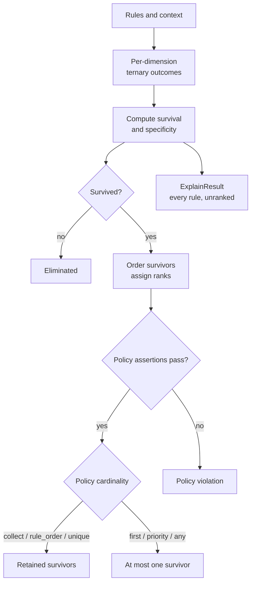

# Evaluating, Selecting and Explaining Decisions

Chapter 2 turned a rule table into validated `Dimension` and `DimensionsMetadata` objects. This chapter takes that metadata through one complete decision: build an `ExpressionRulesEngine`, evaluate a context, understand why each rule survived or was eliminated, rank the survivors, choose which ones to return, and explain the outcome. Construction, ranking and explanation are kept together deliberately — they are one reader task, not three source-module tours. By the end you will be able to read every field a `RuleResult` exposes and predict, from the rules and the context alone, exactly which rules it will contain.

The examples in this chapter use [Polars](https://pola.rs/) DataFrames and a single running rule library so that later sections can build on earlier results. Everything shown is exercised against the actual `mountainash-rules` source at commit [`94659bb0`](https://github.com/mountainash-io/mountainash-rules/tree/94659bb0c096485c87d329f09e944577427f129f).



The evaluation branch filters, orders and selects survivors. The explanation branch stops at scoring, before filtering, ranking or policy assertions, so it can show what every rule did.

## Construct an engine and evaluate a context

<!-- concept:40 -->
### The `ExpressionRulesEngine` class

`ExpressionRulesEngine` is the entry point for single-context rule evaluation. It wraps a rules DataFrame and a set of compiled per-dimension expressions, and exposes one primary method, `evaluate()`, that turns a context into a ranked, policy-selected `RuleResult`. The class is defined in [`engines/filter/engine.py`](https://github.com/mountainash-io/mountainash-rules/blob/94659bb0c096485c87d329f09e944577427f129f/src/mountainash_rules/engines/filter/engine.py#L40-L77).

The engine is backend-agnostic in the sense introduced in Chapter 1: the DataFrame type you pass as `rules` (Polars, Ibis, or a Narwhals-wrapped Pandas/PyArrow frame) determines the backend the engine operates in, and `RuleResult.survivors` returns a DataFrame in that same backend. Nothing about the API changes across backends; only the concrete return type does.

Start the running example with a three-dimension rule library — `region` matched exactly, `amount` matched as a range, and `code` validated against a literal regular expression supplied on the metadata rather than per rule:

```python
import polars as pl
from mountainash_rules import (
    Dimension,
    DimensionsMetadata,
    ExpressionRulesEngine,
    HitPolicy,
    MatchStrategy,
    UNKNOWN,
    UNKNOWN_NUMERIC,
)

rules = pl.DataFrame({
    "rule_name":  ["specific", "general", "mid", "no_match"],
    "region":     ["AU", UNKNOWN, "AU", "US"],
    "amount_min": [0, UNKNOWN_NUMERIC, 0, 0],
    "amount_max": [100, UNKNOWN_NUMERIC, 100, 100],
})

metadata = DimensionsMetadata(dimensions=[
    Dimension(dimension_name="region", match_strategy=MatchStrategy.EXACT, data_type=str),
    Dimension(
        dimension_name="amount",
        match_strategy=MatchStrategy.RANGE,
        data_type=int,
        range_min_field="amount_min",
        range_max_field="amount_max",
    ),
    Dimension(
        dimension_name="code",
        match_strategy=MatchStrategy.CONTEXT_REGEX,
        data_type=str,
        regex_pattern="^PRE.*",
    ),
])

engine = ExpressionRulesEngine(rules=rules, dimension_metadata=metadata)
```

`region` and `amount` follow the strategies from [Chapter 2](../02-authoring-rule-libraries/index.md); `code` is a `CONTEXT_REGEX` dimension, which validates the *context* value against `regex_pattern` and therefore needs no rule-side column at all — every surviving rule receives the same ternary outcome for `code`, driven entirely by whether the context matches the pattern.

<!-- concept:41 -->
### Constructing an engine

The constructor takes three parameters: `rules` (required), and exactly one of `dimension_metadata` or `dimension_expressions`. Supplying both, or neither, raises `ValueError` before any rule is touched:

```python
try:
    ExpressionRulesEngine(rules=rules, dimension_metadata=metadata,
                           dimension_expressions={"region": None})
except ValueError as e:
    print(e)  # Provide dimension_metadata or dimension_expressions, not both

try:
    ExpressionRulesEngine(rules=rules)
except ValueError as e:
    print(e)  # Must provide either dimension_metadata or dimension_expressions
```

Construction is where compilation happens: when `dimension_metadata` is given, the engine builds a `DimensionCompiler` internally and compiles every dimension into an expression template once (see [`__init__`](https://github.com/mountainash-io/mountainash-rules/blob/94659bb0c096485c87d329f09e944577427f129f/src/mountainash_rules/engines/filter/engine.py#L57-L77)). Nothing about the rules DataFrame or the metadata is copied or mutated — the constructor only stores references and the compiled expression dict. `evaluate()` can then be called any number of times with different contexts against the same compiled engine.

<!-- concept:42 -->
### Convenience vs. advanced construction

The metadata path above is the convenience path: you describe dimensions declaratively and the engine compiles them for you. The advanced path skips `DimensionsMetadata` entirely and hands the engine an already-compiled `dict[str, BaseExpressionAPI]` — one expression per dimension name:

```python
from mountainash_rules import DimensionCompiler

compiled = DimensionCompiler().compile_dimensions(metadata)
print(sorted(compiled.keys()))  # ['amount', 'code', 'region']

engine_advanced = ExpressionRulesEngine(rules=rules, dimension_expressions=compiled)
result_advanced = engine_advanced.evaluate(
    context={"region": "AU", "amount": 50, "code": "PRE-001"}
)
assert result_advanced.count == 3
```

Both engines behave identically here because `compiled` is exactly what the convenience path would have produced internally. The advanced path exists for cases the declarative metadata cannot express directly: expressions composed programmatically, expressions from a different compiler, or tests that need to substitute one dimension's behavior without touching the others. `DimensionCompiler` itself, and how each strategy becomes an expression, is Chapter 6's subject — this chapter only needs the shape of its output.

One consequence of the advanced path: without `DimensionsMetadata`, the engine has no `hit_policy`, `priority_field`, `output_fields`, or per-dimension rule/context field names to fall back on. Anywhere those matter below, the effective default is `HitPolicy.COLLECT` and the field lists are empty.

<!-- concept:43 -->
### Evaluating a context in one pass

`evaluate()` is the method you call for every decision:

```text
def evaluate(
    self,
    context: BaseModel | dict,
    dimensions: list[str] | None = None,
    top_n: int | None = None,
    min_specificity: int | None = None,
    include_observability: bool = True,
    hit_policy: HitPolicy | None = None,
    priority_field: str | None = None,
) -> RuleResult: ...
```

`context` is a Pydantic model or a plain `dict`; `dimensions` restricts evaluation to a named subset (all configured dimensions are used when omitted); `top_n`, `min_specificity`, `include_observability`, `hit_policy` and `priority_field` are covered later in this chapter. Calling it with the running example:

```python
result = engine.evaluate(context={"region": "AU", "amount": 50, "code": "PRE-001"})
assert result.count == 3
```

Internally, `evaluate()` does three things before any DataFrame work happens: it resolves the active dimension list (raising `KeyError` immediately if you name a dimension that was not configured), it resolves the effective hit policy (the explicit `hit_policy` argument, or `metadata.hit_policy`, or `HitPolicy.COLLECT` when there is no metadata at all), and it extracts context values into a plain `dict[str, Any]` via `extract_context_values()`, substituting the correct sentinel for any field the context does not supply. It then runs a *single pass* through the rules DataFrame — one `with_columns` call binds the context as literals, one applies the compiled expressions, one computes survival and specificity, and one sorts/ranks/filters — and wraps the resulting materialized frame in a `RuleResult`. There is no per-rule Python loop and no second pass over the data; every rule is scored against the context in the same vectorized operation. See [`evaluate()`](https://github.com/mountainash-io/mountainash-rules/blob/94659bb0c096485c87d329f09e944577427f129f/src/mountainash_rules/engines/filter/engine.py#L96-L151) for the full method.

```python
try:
    engine.evaluate(context={"region": "AU"}, dimensions=["nonexistent"])
except KeyError as e:
    print(e)  # "Dimension 'nonexistent' not found in expressions"
```

## Understand survival and ranking

<!-- concept:46 -->
### Survival: the outcome rule over ternary values

Chapter 1 introduced ternary matching: every dimension's compiled expression produces `1` (hard match), `0` (unknown/wildcard) or `-1` (non-match) for each rule row, stored in a column named `__t_<dimension>`. Survival is the outcome rule built on top of those values: **a rule survives if and only if no active dimension produced `-1`.** Equivalently, it survives when the minimum ternary value across all active dimensions is `>= 0`:

```text
__survived = min(__t_region, __t_amount, __t_code) >= 0
```

This is exactly how [`_scored_relation()`](https://github.com/mountainash-io/mountainash-rules/blob/94659bb0c096485c87d329f09e944577427f129f/src/mountainash_rules/engines/filter/engine.py#L428-L460) computes it — a single element-wise minimum across the ternary columns, compared against zero. There is no separate "AND" step to reason about: because `-1 < 0 <= 1`, taking the minimum and checking it is non-negative is exactly ternary AND across every dimension.

Evaluating the running context against all four rules produces:

| rule_name  | `__t_region` | `__t_amount` | `__t_code` | `__survived` |
|---|---|---|---|---|
| specific   | 1  | 1 | 1 | true  |
| general    | 0  | 0 | 1 | true  |
| mid        | 1  | 1 | 1 | true  |
| no_match   | -1 | 1 | 1 | false |

`no_match` has `region="US"`, which produces `-1` against a context of `region="AU"`; because that single dimension is `-1`, `no_match` is eliminated regardless of what the other two dimensions decide. `general` wildcards both `region` and `amount` (its rule columns hold the sentinel values `UNKNOWN`/`UNKNOWN_NUMERIC`), so those dimensions are `0`, not `-1`, and it survives. `RuleResult.survivors` and `.count` therefore report three rules, not four:

```python
assert result.count == 3
assert set(result.survivors["rule_name"]) == {"specific", "general", "mid"}
assert "no_match" not in result.survivors["rule_name"]
```

A wildcard dimension can never eliminate a rule on its own; only an explicit non-match can. This is the boundary readers most often get wrong when a rule library grows: a missing rule-side value that resolves to a real sentinel is a deliberate "don't care" for that dimension, not an automatic pass, and it never turns into a fail either.

<!-- concept:47 -->
### Specificity: how many dimensions matched

Surviving is binary, but survivors are rarely equally good matches. `__specificity` counts how many active dimensions produced a **hard** match (`1`) — wildcards (`0`) do not count, even though they did not disqualify the rule:

```text
__specificity = count(__t_d == 1 for d in active_dims)
```

Continuing the table above with specificity added:

| rule_name | `__t_region` | `__t_amount` | `__t_code` | `__specificity` |
|---|---|---|---|---|
| specific  | 1 | 1 | 1 | 3 |
| general   | 0 | 0 | 1 | 1 |
| mid       | 1 | 1 | 1 | 3 |

```python
rows = result.survivors.select("rule_name", "__specificity").to_dicts()
spec = {r["rule_name"]: r["__specificity"] for r in rows}
assert spec == {"specific": 3, "mid": 3, "general": 1}
```

`specific` and `mid` are, in this example, defined identically (same `region`/`amount` values, different names) and tie at specificity 3; `general` wildcards two of the three dimensions and only reaches 1 through the context-driven `code` dimension. Specificity is what lets `evaluate()` return survivors ordered from "most precisely targeted at this context" to "broadest applicable rule" without any extra configuration — it falls directly out of counting hard matches, computed for every rule in the same vectorized pass that computed survival. Non-surviving rules still get a specificity value (you will see this in the `explain()` section below, where `no_match` shows `__specificity == 2` despite not surviving) — specificity says how targeted a rule's *matching* dimensions are, independent of whether one dimension eliminated it.

<!-- concept:48 -->
### Rank: ordering and breaking ties

After survival and specificity are computed, `evaluate()` filters to survivors, orders them by the active hit policy's ordering keys, and assigns a 1-based `__rank`. The default (`COLLECT`) policy orders by `__specificity` descending, then by `__rule_index` ascending — `__rule_index` being the survivor's original 0-based position in the input rules DataFrame, assigned before filtering. That second key is not cosmetic: it is what makes tie-breaking deterministic. `specific` (row 0) and `mid` (row 2) tie at specificity 3; `specific` wins the tie and is ranked first because it appears earlier in the rules table:

```python
ranked = result.survivors.select("rule_name", "__specificity", "__rank", "__rule_index").sort("__rank")
assert ranked.to_dicts() == [
    {"rule_name": "specific", "__specificity": 3, "__rank": 1, "__rule_index": 0},
    {"rule_name": "mid",      "__specificity": 3, "__rank": 2, "__rule_index": 2},
    {"rule_name": "general",  "__specificity": 1, "__rank": 3, "__rule_index": 1},
]
```

Every hit policy's ordering keys end in `("__rule_index", False)` for exactly this reason — see [`ordering_keys()`](https://github.com/mountainash-io/mountainash-rules/blob/94659bb0c096485c87d329f09e944577427f129f/src/mountainash_rules/core/hit_policy.py#L61-L76): `COLLECT`, `UNIQUE` and `ANY` order by `(specificity desc, rule_index asc)`; `FIRST` and `RULE_ORDER` order by `(rule_index asc)` alone, ignoring specificity entirely; `PRIORITY` orders by `(priority_field desc, specificity desc, rule_index asc)`. Rank is always assigned *before* the optional `top_n`/`min_specificity` post-filters run, so a returned rule's `__rank` reflects its position in the full survivor set, not its position among whatever remains after filtering — a detail that matters once you start combining `top_n` with `min_specificity` in the [result filters](#min_specificity-excluding-weak-matches) below.

## Read the result contract

<!-- concept:49 -->
### The `RuleResult` wrapper

`evaluate()` returns a [`RuleResult`](https://github.com/mountainash-io/mountainash-rules/blob/94659bb0c096485c87d329f09e944577427f129f/src/mountainash_rules/core/result.py#L19-L140) containing the retained frame, active dimension names and `SelectionInfo`. That snapshot is created on both construction paths, but the expressions-only path lacks dimension metadata for classifying rule-input and business-output columns. Accessor return types differ: some return frames, `count` returns an integer and `explain()` returns a dictionary. The following sections spell out those contracts.

<!-- concept:50 -->
### `survivors`

`result.survivors` is a property, not a method, and returns every surviving rule already ranked by the active policy — it is the DataFrame you saw built up through the previous section, with no additional filtering applied by the accessor itself:

```python
assert len(result.survivors) == 3
```

<!-- concept:51 -->
### `best_match`

`result.best_match` returns the single top-ranked row — implemented as `relation(self._df).head(1).collect()`, i.e. rank 1 under whatever ordering the active policy produced. It is a one-row DataFrame, not a dict or a Series, and it materializes even when the underlying result was lazy:

```python
best = result.best_match
assert best["rule_name"][0] == "specific"
assert best["__specificity"][0] == 3
```

When there are zero survivors, `best_match` does not raise — it returns a DataFrame with zero rows and the same schema, which callers must check for explicitly (`best.is_empty()` in Polars, or `result.count == 0`) rather than assuming a row exists.

<!-- concept:52 -->
### `count`

`result.count` returns the number of surviving rules as a plain `int`, computed via `relation(self._df).count_rows()`. It is the cheapest way to branch on "did anything match" without materializing or inspecting rows:

```python
assert result.count == 3

empty_rules = pl.DataFrame({"rule_name": ["only_us"], "region": ["US"]})
empty_metadata = DimensionsMetadata(dimensions=[
    Dimension(dimension_name="region", match_strategy=MatchStrategy.EXACT, data_type=str),
])
empty_engine = ExpressionRulesEngine(rules=empty_rules, dimension_metadata=empty_metadata)
empty_result = empty_engine.evaluate(context={"region": "AU"})
assert empty_result.count == 0
assert empty_result.best_match.is_empty()
```

Zero survivors is not an error condition anywhere in this API — an engine with no rule matching the context simply returns an empty `RuleResult`, and every accessor on it (`count`, `survivors`, `best_match`) behaves consistently with "nothing matched" rather than raising.

<!-- concept:53 -->
### `active_dimensions`

`result.active_dimensions` returns the list of dimension names that were actually evaluated — the `dimensions` argument passed to `evaluate()`, or every configured dimension when it was omitted:

```python
assert result.active_dimensions == ["region", "amount", "code"]

subset_result = engine.evaluate(
    context={"region": "AU", "amount": 50, "code": "PRE-001"},
    dimensions=["region"],
)
assert subset_result.active_dimensions == ["region"]
assert subset_result.count == 3  # no_match's region mismatch is the only rejection here too
```

`active_dimensions` matters beyond bookkeeping: `RuleResult.explain()` (below) uses it to know which `__t_<dim>` columns to read, so a result produced from a dimension subset only ever explains that subset.

## Choose and reapply a hit policy

<!-- concept:100 -->
### The `HitPolicy` enum

`HitPolicy` is a `StrEnum` with six members, defined in [`core/constants.py`](https://github.com/mountainash-io/mountainash-rules/blob/94659bb0c096485c87d329f09e944577427f129f/src/mountainash_rules/core/constants.py#L25-L33): `COLLECT`, `UNIQUE`, `FIRST`, `PRIORITY`, `ANY` and `RULE_ORDER`. A policy controls two independent things at once: the **ordering** applied to survivors (via `ordering_keys()`, seen above) and the **cardinality** of what is returned — whether all survivors come back or the result is trimmed to one row (via `apply_cardinality()`). `evaluate(..., hit_policy=...)` and `DimensionsMetadata(hit_policy=...)` both accept the same enum, and passing a string value (`HitPolicy("first")`) resolves to the matching member.

The next five sections work through each policy against a small two-rule library designed to make the differences visible — a wildcard `generic` rule and a specific `AU` rule, with a `salience` column for priority ordering and a `price` column to compare outputs:

```python
policy_rules = pl.DataFrame({
    "rule_name": ["generic", "specific"],
    "region":    [UNKNOWN, "AU"],
    "salience":  [10, 1],
    "price":     [1.0, 2.0],
})
region_metadata = DimensionsMetadata(dimensions=[
    Dimension(dimension_name="region", match_strategy=MatchStrategy.EXACT, data_type=str),
])
policy_engine = ExpressionRulesEngine(rules=policy_rules, dimension_metadata=region_metadata)
```

Both rules survive a context of `{"region": "AU"}`: `specific` matches exactly (`__specificity == 1`) and `generic` wildcards region (`__specificity == 0`).

<!-- concept:101 -->
### `COLLECT`: the default, unfiltered ranking

`COLLECT` is the default whenever `hit_policy` is omitted and no metadata (or metadata with no explicit `hit_policy`) says otherwise. It returns every survivor, ordered by specificity descending then rule index ascending — exactly the ordering used throughout the previous section:

```python
collect_result = policy_engine.evaluate({"region": "AU"})
assert collect_result.count == 2
ranked_names = collect_result.survivors.sort("__rank")["rule_name"].to_list()
assert ranked_names == ["specific", "generic"]  # specificity 1 beats specificity 0
```

`COLLECT` never raises for ambiguity and never trims survivors — it is the right policy when the caller wants to see and reason about the whole survivor set itself, and it is the only policy that keeps every survivor available for `select()` to re-rank later.

<!-- concept:102 -->
### `UNIQUE`: assert at most one survivor

`UNIQUE` uses the same ordering as `COLLECT` but adds an assertion: the survivor set must contain zero or one rule. Two or more survivors raise `HitPolicyViolationError` rather than silently picking one:

```python
from mountainash_rules import HitPolicyViolationError

try:
    policy_engine.evaluate({"region": "AU"}, hit_policy=HitPolicy.UNIQUE)
except HitPolicyViolationError as e:
    assert e.policy is HitPolicy.UNIQUE
    assert len(e.offending) == 2
    print(e)  # hit_policy=unique but 2 rules survived
```

Zero survivors pass the assertion — `UNIQUE` treats "nothing matched" as a valid, unambiguous outcome, distinct from "more than one rule matched":

```python
lonely_rules = pl.DataFrame({"rule_name": ["r"], "region": ["NZ"]})
lonely_engine = ExpressionRulesEngine(rules=lonely_rules, dimension_metadata=region_metadata)
lonely_result = lonely_engine.evaluate({"region": "AU"}, hit_policy=HitPolicy.UNIQUE)
assert lonely_result.count == 0
```

`UNIQUE` is the policy to reach for when overlapping rules indicate a genuine authoring bug in the library — the exception surfaces the exact conflicting rows via `e.offending` (the materialized survivor frame) so the caller can report which rules need to be disambiguated.

<!-- concept:103 -->
### `FIRST` and `PRIORITY`: pick a single winner

`FIRST` and `PRIORITY` retain at most one survivor through `.head(1)`; an empty survivor set remains empty. They differ in ordering. `FIRST` uses only `__rule_index`, so the earliest-declared surviving rule wins regardless of specificity:

```python
first_result = policy_engine.evaluate({"region": "AU"}, hit_policy=HitPolicy.FIRST)
assert first_result.count == 1
assert first_result.best_match["rule_name"][0] == "generic"  # declared first, wins despite specificity 0
```

`PRIORITY` orders by an explicit column — `priority_field`, either passed to `evaluate()` or read from `metadata.priority_field` — descending, with specificity and rule index only as tie-breakers:

```python
priority_result = policy_engine.evaluate(
    {"region": "AU"}, hit_policy=HitPolicy.PRIORITY, priority_field="salience",
)
assert priority_result.best_match["rule_name"][0] == "generic"  # salience 10 beats salience 1
```

`PRIORITY` without a usable priority field raises before any DataFrame work happens: `ordering_keys()` requires `priority_field` to be truthy for `PRIORITY` and raises a plain `ValueError` ("hit_policy=priority requires priority_field") if neither the call nor the metadata supplied one. `DimensionsMetadata` itself enforces the same rule at construction time — building metadata with `hit_policy=HitPolicy.PRIORITY` and no `priority_field` raises a pydantic `ValidationError` (a `ValueError` subclass, so `except ValueError` still catches it) immediately, before an engine even exists.

<!-- concept:104 -->
### `ANY`: survivors that must agree

`ANY` also returns one row, but instead of picking a winner by position or priority, it first checks that every survivor *agrees* on the columns that matter — the same "output fields" `default_output_fields()` would infer for the caller (explicit dimension/rule-condition columns, `rule_name` and the priority field excluded; every other non-`__`-prefixed column counted). If they agree, any one of them can stand in for the group, and `ANY` returns the top-ranked one by the `COLLECT` ordering:

```python
agreeing_rules = pl.DataFrame({
    "rule_name": ["a", "b"], "region": ["AU", UNKNOWN], "price": [5.0, 5.0],
})
agreeing_engine = ExpressionRulesEngine(rules=agreeing_rules, dimension_metadata=region_metadata)
any_result = agreeing_engine.evaluate({"region": "AU"}, hit_policy=HitPolicy.ANY)
assert any_result.count == 1
assert any_result.best_match["price"][0] == 5.0
```

If survivors disagree on any output column, `ANY` raises `HitPolicyViolationError` instead of arbitrarily choosing one:

```python
try:
    policy_engine.evaluate({"region": "AU"}, hit_policy=HitPolicy.ANY)
except HitPolicyViolationError as e:
    print(e)  # hit_policy=any but survivors disagree on outputs ['salience', 'price']
```

`policy_rules` disagrees on both `salience` and `price`, so this raises. `ANY` requires `output_fields` to be resolvable — either explicit metadata `output_fields`, or at least one non-dimension, non-internal column left over after exclusion — otherwise it raises a plain `ValueError` rather than silently treating "no comparable columns" as agreement.

<!-- concept:105 -->
### `RULE_ORDER`: preserve declaration order

`RULE_ORDER` retains survivors in `__rule_index` order rather than sorting by specificity. Matching ternaries determine survival; specificity is a separate score and can still be used by the optional `min_specificity` filter:

```python
rule_order_result = policy_engine.evaluate({"region": "AU"}, hit_policy=HitPolicy.RULE_ORDER)
assert rule_order_result.survivors["rule_name"].to_list() == ["generic", "specific"]
```

This is the policy to choose when a rule library is intentionally authored as an ordered list of cases — the first applicable row, in a full ranked view rather than a single-row cut — as opposed to `FIRST`, which shares the same ordering but reduces the result to that first row alone.

<!-- concept:107 -->
### `HitPolicyViolationError`

Both violation cases above raise the same exception type, [`HitPolicyViolationError`](https://github.com/mountainash-io/mountainash-rules/blob/94659bb0c096485c87d329f09e944577427f129f/src/mountainash_rules/core/hit_policy.py#L27-L33), a subclass of `ValueError` carrying two extra attributes: `policy` (the `HitPolicy` member that was violated) and `offending` (the materialized survivor frame at the point of violation — always more than one row, since zero and one survivors never violate `UNIQUE` or `ANY`). Catch it specifically when you need to distinguish a genuine policy violation from other `ValueError`s the engine or metadata can raise (a missing `priority_field`, an unresolvable `ANY` output set, or an invalid dimension request), since all of those share the `ValueError` base:

```python
try:
    policy_engine.evaluate({"region": "AU"}, hit_policy=HitPolicy.UNIQUE)
except HitPolicyViolationError as e:
    conflicting_names = e.offending["rule_name"].to_list()
    assert conflicting_names == ["specific", "generic"]
```

<!-- concept:97 -->
### Table-level hit policy fields

`DimensionsMetadata` carries three fields that give a rule library its own default selection behavior, so callers do not have to repeat `hit_policy=...` on every `evaluate()` call: `hit_policy` (default `HitPolicy.COLLECT`), `priority_field` (default `None`), and `output_fields` (default `[]`, used by `ANY` and by `select()`'s output inference when non-empty). A model validator enforces the same `PRIORITY`-needs-`priority_field` rule shown above at the metadata level:

```python
try:
    DimensionsMetadata(
        dimensions=[Dimension(dimension_name="region")],
        hit_policy=HitPolicy.PRIORITY,
    )
except ValueError as e:  # pydantic raises ValidationError, itself a ValueError subclass
    assert "hit_policy=priority requires priority_field" in str(e)
```

An explicit `hit_policy` argument to `evaluate()` always overrides the metadata's value for that one call; the metadata's value is only the fallback when the argument is `None`:

```python
first_by_default = DimensionsMetadata(
    dimensions=[Dimension(dimension_name="region")], hit_policy=HitPolicy.FIRST,
)
default_engine = ExpressionRulesEngine(rules=policy_rules, dimension_metadata=first_by_default)
assert default_engine.evaluate({"region": "AU"}).count == 1                              # FIRST from metadata
assert default_engine.evaluate({"region": "AU"}, hit_policy=HitPolicy.COLLECT).count == 2  # explicit override
```

<!-- concept:111 -->
### Reapplying a policy with `RuleResult.select()`

Choosing a hit policy up front means re-evaluating the context if you decide you actually wanted a different policy. `select()` avoids that: it re-applies a different `HitPolicy` to the survivor set a `RuleResult` already holds, without touching the rules DataFrame or the engine again:

```python
collect_result = policy_engine.evaluate({"region": "AU"})  # COLLECT, both survivors kept

first_selected = collect_result.select(HitPolicy.FIRST)
assert first_selected.best_match["rule_name"][0] == "generic"

priority_selected = collect_result.select(HitPolicy.PRIORITY, priority_field="salience")
assert priority_selected.best_match["rule_name"][0] == "generic"

try:
    collect_result.select(HitPolicy.UNIQUE)
except HitPolicyViolationError as e:
    print(e)  # hit_policy=unique but 2 rules survived
```

`select()` re-sorts, re-ranks (dropping and recomputing `__rank`), re-checks assertions and re-applies cardinality exactly as `evaluate()` would — see [`RuleResult.select()`](https://github.com/mountainash-io/mountainash-rules/blob/94659bb0c096485c87d329f09e944577427f129f/src/mountainash_rules/core/result.py#L43-L77) — but it needs the `SelectionInfo` `evaluate()` attached to the result, and it needs `__specificity`/`__rule_index` still present in the frame; calling it on a result with no selection info raises `ValueError`.

Two boundaries matter here. First, `select()` refuses a result that was *truncated* by `top_n` or `min_specificity`, because the discarded rows can no longer be re-ranked into the picture:

```python
truncated_result = policy_engine.evaluate({"region": "AU"}, top_n=1)
try:
    truncated_result.select(HitPolicy.UNIQUE)
except ValueError as e:
    print(e)  # select() on a truncated result (...); re-evaluate without truncation instead
```

Second, `select()` does *not* protect you from re-selecting on a result whose cardinality was already reduced by `FIRST`, `PRIORITY` or `ANY` — those policies call `.head(1)` without setting the `truncated` flag, so `select()` will run without error, but it has only that one surviving row left to reorder:

```python
first_result = policy_engine.evaluate({"region": "AU"}, hit_policy=HitPolicy.FIRST)
reselected = first_result.select(HitPolicy.RULE_ORDER)
assert reselected.count == 1
assert reselected.survivors["rule_name"].to_list() == ["generic"]  # "specific" is already gone
```

Reapply `select()` productively on results produced by `COLLECT`, `UNIQUE` or `RULE_ORDER` — the policies that keep every survivor — and re-evaluate the engine directly for anything that started as `FIRST`, `PRIORITY` or `ANY`.

## Explain a decision and refine the result

<!-- concept:54 -->
### `RuleResult.explain()`: inspect a retained rule's outcomes

`result.explain(rule_name)` answers a narrower question than anything above: given a result you already have, what ternary value did one specific rule receive on each active dimension? It looks the rule up by name, takes the first matching row, and returns a `dict[str, int]` keyed by dimension name:

```python
assert result.explain("specific") == {"region": 1, "amount": 1, "code": 1}
assert result.explain("general") == {"region": 0, "amount": 0, "code": 1}

try:
    result.explain("does_not_exist")
except KeyError as e:
    print(e)  # "Rule 'does_not_exist' not found in survivors"
```

Because `explain()` reads from `self._df` — the already-filtered survivor frame — it can only explain rules that survived; `no_match` is not in `result.survivors` and looking it up raises `KeyError`, the same exception raised for any nonexistent name. Use the engine-level `explain()` below when you need to see why a rule was eliminated, not just how a survivor scored.

<!-- concept:109 -->
### The `ExplainResult` class

Engine-level `explain()` (below) returns a different type, [`ExplainResult`](https://github.com/mountainash-io/mountainash-rules/blob/94659bb0c096485c87d329f09e944577427f129f/src/mountainash_rules/core/result.py#L142-L177), deliberately not a `RuleResult` subclass. `RuleResult`'s surface — `best_match`, `select()`, `SelectionInfo` — assumes a ranked, policy-selected survivor frame; an unranked, unfiltered "every rule, scored" frame has no rank to report and no policy to reapply, so inheriting `RuleResult`'s accessors would advertise operations that do not make sense on it. `ExplainResult` instead exposes exactly four things: `frame` (every rule, ternary columns plus `__survived` and `__specificity`, no `__rank`), `active_dimensions`, `count` (total rules scored, survivors and non-survivors together), and two convenience filters, `survivors` and `non_survivors`, that split `frame` on `__survived` without changing anything else about it.

<!-- concept:110 -->
### Engine-level `explain()`: scoring every rule

`engine.explain(context, dimensions=None)` runs the same ternary-and-survival computation as `evaluate()`, but stops there — it never filters non-survivors out, never sorts, never assigns `__rank`, and never consults a hit policy at all. Its purpose is diagnostic: "why did or didn't each rule match", as opposed to `evaluate()`'s "which rule wins":

```python
explain_result = engine.explain(context={"region": "AU", "amount": 50, "code": "PRE-001"})

assert explain_result.count == 4  # all four rules, survivors and non-survivors
assert explain_result.non_survivors["rule_name"].to_list() == ["no_match"]

rows = explain_result.frame.select(
    "rule_name", "__t_region", "__t_amount", "__t_code", "__survived", "__specificity",
).to_dicts()
by_name = {r["rule_name"]: r for r in rows}
assert by_name["no_match"] == {
    "rule_name": "no_match", "__t_region": -1, "__t_amount": 1, "__t_code": 1,
    "__survived": False, "__specificity": 2,
}
```

`no_match` is the clearest illustration of the survival/specificity distinction from earlier: it scores `__specificity == 2` (it hard-matches `amount` and `code`) yet still did not survive, because `region` alone produced `-1`. `evaluate()` would never show you this row at all; `explain()` exists precisely to answer "why not" for rules `evaluate()` silently dropped. `explain()` requires at least one active dimension — passing `dimensions=[]` explicitly raises `ValueError`, distinct from the `KeyError` raised for a dimension name that was never configured:

```python
try:
    engine.explain(context={"region": "AU"}, dimensions=[])
except ValueError as e:
    print(e)  # explain requires at least one active dimension
```

<!-- concept:58 -->
### Observability columns

The `__t_<dim>` ternary columns that both explain paths rely on are called observability columns, and `evaluate()` controls whether they survive into its own result via `include_observability` (default `True`):

```python
observed = engine.evaluate(
    context={"region": "AU", "amount": 50, "code": "PRE-001"}, include_observability=True,
)
assert {"__t_region", "__t_amount", "__t_code"}.issubset(set(observed.survivors.columns))

lean = engine.evaluate(
    context={"region": "AU", "amount": 50, "code": "PRE-001"}, include_observability=False,
)
assert not any(c.startswith("__t_") for c in lean.survivors.columns)
```

Dropping observability columns is a real tradeoff, not just a cosmetic one: `RuleResult.explain()` reads exactly those columns, so calling it on a result built with `include_observability=False` fails, since the columns it needs are already gone:

```python
try:
    lean.explain("specific")
except KeyError as e:
    print(e)  # '__t_region' is not a column in this DataFrame
```

Keep `include_observability=True` (the default) whenever a result might later be explained; turn it off only for results you will only ever read through `survivors`, `best_match`, `count` or `at_least()`, where the ternary columns are pure overhead. `explain()` at the engine level always includes the ternary columns — `include_observability` is an `evaluate()`-only parameter.

<!-- concept:55 -->
### `at_least()`: filtering the returned survivors

`result.at_least(n)` filters the *already-returned* survivor frame down to rows with `__specificity >= n`, and returns a plain DataFrame — not a new `RuleResult` — in the caller's backend:

```python
assert set(result.at_least(2)["rule_name"]) == {"specific", "mid"}
assert len(result.at_least(0)) == 3    # every survivor qualifies
assert len(result.at_least(10)) == 0   # none reach specificity 10
```

Because it operates after `evaluate()` has already run, `at_least()` cannot resurrect a rule that `evaluate()`'s own `min_specificity` argument (below) already excluded — it can only narrow what is already in `result.survivors` further, and it never raises for an empty outcome.

<!-- concept:56 -->
### `top_n`: limiting how many survivors return

`top_n`, an `evaluate()` argument, keeps only the first `n` rows *after* ranking — so with the default `COLLECT` ordering, that means the `n` most specific survivors, ties broken by rule index exactly as before:

```python
top2 = engine.evaluate(context={"region": "AU", "amount": 50, "code": "PRE-001"}, top_n=2)
assert top2.count == 2
assert top2.survivors.sort("__rank")["rule_name"].to_list() == ["specific", "mid"]

top_all = engine.evaluate(context={"region": "AU", "amount": 50, "code": "PRE-001"}, top_n=100)
assert top_all.count == 3  # top_n larger than the survivor set is a no-op, not an error
```

Requesting more rows than survived is never an error; the filter simply has nothing left to remove. `top_n` only ever removes rows, and only rows with lower rank than the cutoff — it does not change `__rank` itself, since rank was already assigned in the previous pipeline step.

<!-- concept:57 -->
### `min_specificity`: excluding weak matches

`min_specificity`, also an `evaluate()` argument, removes survivors whose `__specificity` falls below the threshold, applied after ranking for the same reason as `top_n`:

```python
filtered = engine.evaluate(
    context={"region": "AU", "amount": 50, "code": "PRE-001"}, min_specificity=2,
)
names = filtered.survivors["rule_name"].to_list()
assert "specific" in names and "mid" in names
assert "general" not in names  # specificity 1 falls below the threshold of 2
```

`top_n` and `min_specificity` can be combined in the same call, and because both run after `__rank` is assigned, a returned row's `__rank` still reflects its position in the *full* survivor set, not its position among whatever the other filter also removed. If `min_specificity` eliminates ranks 2–4 and `top_n=3` is also requested, a returned row can carry `__rank == 5` — the rank is a fact about the original ranking, not a count of what made it through both filters. Read `__rank` as "position under the policy's ordering" and `result.count` as "how many rows survived every filter," and the two will never contradict each other even when their numbers do not visually line up.

## Where this leaves you

A `RuleResult` now has a precise, source-grounded meaning: the rules that survived every active dimension, ranked and possibly reduced by a hit policy, with enough observability retained to explain any surviving rule after the fact. `engine.explain()` and `ExplainResult` give you the same ternary and specificity computation without the filtering, ranking or policy assumptions, for the cases where you need to see what did *not* survive and why. [Chapter 4](../04-scoring-batches/index.md) reuses every concept in this chapter — survival, specificity, rank, hit policies — against many contexts at once, and is explicit about what stays per-context and what changes when the DataFrame holds a cross-join instead of one context's literals. [Chapter 6](../06-expression-execution-internals/index.md) goes the other direction: it explains how the compiled expressions that produce `__t_<dim>` are actually built, now that you have seen exactly what they are expected to produce.
