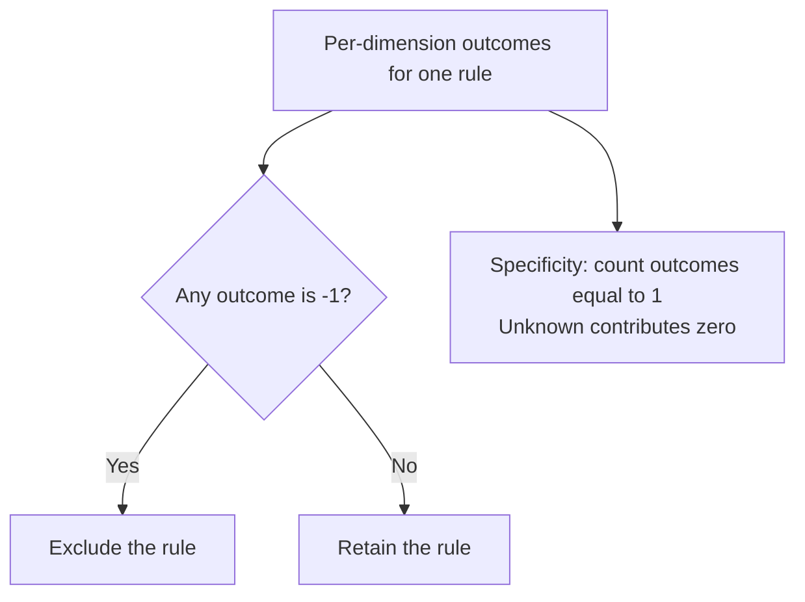

# Chapter 3: Matching Concepts: Strategies, Unknowns and Wildcards

Mountainash Rules compares each rule's conditions with values from an evaluation context. A dimension's match strategy determines the comparison: equality, an interval, a string pattern or membership in a set. Each comparison produces a numeric outcome that the engine uses to decide whether the rule applies.

This chapter explains those outcomes and the thirteen strategies in `MatchStrategy`. It covers rule wildcards, missing context values, inclusive and exclusive boundaries, Boolean comparisons and list-valued conditions. It also distinguishes strategies available for expression-engine matching from those the accumulator can use to combine rules.

The examples build on the [dimension configuration model](../02-shared-rule-model/index.md#the-dimension-class). They form one Python session and use Polars. Small tables isolate each comparison so that its inputs and results can be inspected directly.

<!-- concept:1 -->
## Ternary matching {#ternary-logic-match-unknown-and-non-match}

A dimension comparison has three possible outcomes:

| Value | Outcome | Effect on a rule |
|---:|---|---|
| `1` | Match | The condition is satisfied and contributes one specificity point. |
| `0` | Unknown | The condition does not exclude the rule and contributes no specificity point. |
| `-1` | Non-match | The condition excludes the rule. |

This representation is called **ternary logic**. It gives an unrestricted rule condition a distinct outcome from a condition that has matched a specific value. Missing context values can also produce unknown, depending on the strategy.

A rule survives matching when every dimension produces `0` or `1`. Any `-1` excludes it, regardless of the other comparisons. Equivalently, the smallest outcome across the rule's dimensions must be at least zero.

The rule's **specificity** is the number of dimensions that produced `1`. Unknown values participate in survival but add nothing to this count. Ordering and selection use further settings, covered with the Expression Rules Engine in Chapters 4 and 5.

For example, consider three rules that select equipment-service tasks. The context describes a printer in Australia: `product="printer"` and `region="AU"`. Both dimensions use exact matching. The second rule leaves its region unrestricted.

| Rule | Product condition | Region condition | Product outcome | Region outcome | Survives? | Specificity |
|---|---|---|---:|---:|---|---:|
| `printer_au` | printer | AU | `1` | `1` | Yes | 2 |
| `printer_anywhere` | printer | Any region | `1` | `0` | Yes | 1 |
| `scanner_au` | scanner | AU | `-1` | `1` | No | 1 |

Both printer rules survive. The unrestricted region in `printer_anywhere` contributes `0`, so that rule is less specific than `printer_au`. The scanner rule is excluded by its product condition; its matching region does not change that result. Specificity can still be calculated for an excluded rule, but it cannot make that rule survive.

The [filter engine][filter-source] implements the survival test as a conjunction of non-negative comparisons and computes specificity separately:



Some strategies combine two comparisons within a dimension. A range, for example, combines its lower-bound and upper-bound checks. Their ternary conjunction is the minimum of the two outcomes:

| First outcome | Second `1` | Second `0` | Second `-1` |
|---:|---:|---:|---:|
| `1` | `1` | `0` | `-1` |
| `0` | `0` | `0` | `-1` |
| `-1` | `-1` | `-1` | `-1` |

In particular, combining a match with an unknown gives unknown. This distinction matters for a range with one unrestricted bound: it can permit survival without earning a specificity point.

<!-- concept:2 -->
## Sentinel values {#sentinel-values-telling-no-constraint-apart-from-no-answer}

A **sentinel** is a reserved value stored in a rule table or supplied internally for an absent context field. It represents a matching state while retaining the column's data type. Mountainash Rules distinguishes two meanings:

- **UNKNOWN** represents an unrestricted rule condition, also called a **wildcard**.
- **NOT_SET** represents a context value that was not supplied.

For strings and numbers, the reserved values are:

| Declared type | UNKNOWN | NOT_SET |
|---|---|---|
| `DataType.STR` | `"<NA>"` | `"<NOT_SET>"` |
| `DataType.INT` | `-999999999` | `-999999998` |
| `DataType.FLOAT` | `-999999999.0` | `-999999998.0` |

The sentinel is an input value; the ternary integer `0` is a comparison result. A numeric rule containing the ordinary value `0` still describes a condition involving zero. It is the reserved numeric sentinel, not zero, that represents an unrestricted numeric condition.

The package exports the string constants and type-aware lookup functions. The following imports are also used by the later examples:

```python
import polars as pl
from mountainash.relations import relation
from mountainash_rules import (
    DataType, Dimension, DimensionsMetadata, ExpressionRulesEngine,
    MatchStrategy, UNKNOWN, NOT_SET,
    unknown_sentinel_for, not_set_sentinel_for,
)

print(UNKNOWN, NOT_SET)
print(unknown_sentinel_for(DataType.INT), not_set_sentinel_for(DataType.INT))
```

```text
<NA> <NOT_SET>
-999999999 -999999998
```

When a context field is omitted or contains Python `None`, the engine substitutes the declared type's NOT_SET value. Boolean dimensions use a separate null-based representation, explained below. This context normalization does not convert arbitrary invalid input or `NaN` into a missing value. Application validation remains responsible for required fields and their accepted values. The behavior is defined in [context extraction][context-source].

Ordinary exact, inequality and threshold comparisons recognize both members of the typed sentinel pair. Other strategies have narrower rules. `EXACT_KEY` permits a wildcard on the rule side but rejects a missing context against a specific key. `CONTEXT_REGEX` rejects missing input for every rule. Those distinctions are part of the strategy, not a property of the sentinel alone.

Reserve these values when designing the application's data domain. For non-Boolean scalar rule columns, use the typed UNKNOWN sentinel for a wildcard; arbitrary null rule cells do not have a uniform, portable wildcard contract. List-valued rules have their own normalization rules later in this chapter.

<!-- concept:95 -->
## Date and datetime sentinels {#temporal-sentinels}

Date and datetime dimensions use reserved values of the corresponding Python type. This allows temporal conditions to use the same equality and ordering strategies as numeric conditions.

| Declared type | UNKNOWN | NOT_SET |
|---|---|---|
| `DataType.DATE` | `date(1, 1, 1)` | `date(1, 1, 2)` |
| `DataType.DATETIME` | `datetime(1, 1, 1)` | `datetime(1, 1, 2)` |

These year-one values are reserved by the package. A data domain that needs them as ordinary dates cannot also use them as distinct business values in these comparisons.

```python
from datetime import date, datetime

print(unknown_sentinel_for(DataType.DATE))
print(not_set_sentinel_for(DataType.DATETIME))
```

```text
0001-01-01
0001-01-02 00:00:00
```

Use actual date or datetime values in a temporal rules table and context. Declaring `DataType.DATE` selects matching semantics; it does not parse an arbitrary string column into dates. The temporal range example below shows a concrete date interval and an unrestricted lower bound. Sentinel definitions and lookup behavior are in the [constants source][constants-source].

## Equality comparisons

<!-- concept:12 -->
### EXACT {#exact-strategy}

`EXACT` compares the rule value with the context value for equality. Two equal concrete values produce `1`; unequal values produce `-1`. A typed sentinel on either side produces `0`. It is the default strategy and is available for every `DataType`, with the Boolean null handling described later.

To inspect these outcomes, the examples use `ExpressionRulesEngine.explain()`. Its `frame` contains every rule, including non-matches. A column named `__t_<dimension>` holds that dimension's ternary result. The helper below constructs an engine for one dimension and returns `(rule_name, outcome)` pairs in table order:

```python
def outcomes(rules, dimension, context):
    metadata = DimensionsMetadata(dimensions=[dimension])
    engine = ExpressionRulesEngine(rules=rules, dimension_metadata=metadata)
    frame = relation(engine.explain(context).frame).to_polars()
    return frame.select("rule_name", f"__t_{dimension.dimension_name}").rows()
```

Here the rule table has a specific Australian rule, a specific New Zealand rule and a wildcard rule. The dimension reads `region` on both sides and uses exact string matching:

```python
region_rules = pl.DataFrame({
    "rule_name": ["au", "nz", "any_region"],
    "region": ["AU", "NZ", UNKNOWN],
})
exact = Dimension(dimension_name="region", data_type=DataType.STR)
print(outcomes(region_rules, exact, {"region": "AU"}))
print(outcomes(region_rules, exact, {}))
```

```text
[('au', 1), ('nz', -1), ('any_region', 0)]
[('au', 0), ('nz', 0), ('any_region', 0)]
```

The Australian context matches `au`, conflicts with `nz` and leaves the wildcard rule unknown. With the region omitted, all three comparisons are unknown. All three rules therefore survive this dimension, but none gains specificity from it.

This is why an exact condition does not enforce the presence of an application field. Required input should be validated before evaluation; exact matching describes how supplied or normalized values compare.

<!-- concept:91 -->
### EXACT_KEY {#exact_key-strategy}

`EXACT_KEY` is equality with a **rule-side wildcard only**. A specific rule key matches an equal concrete context key. A rule containing the typed UNKNOWN sentinel produces `0`, including when the context is absent. A specific rule produces `-1` when the context is missing or contains either reserved marker.

Changing the strategy on the same region table makes the difference visible:

```python
exact_key = Dimension(
    dimension_name="region", match_strategy=MatchStrategy.EXACT_KEY,
)
print(outcomes(region_rules, exact_key, {"region": "AU"}))
print(outcomes(region_rules, exact_key, {}))
```

```text
[('au', 1), ('nz', -1), ('any_region', 0)]
[('au', -1), ('nz', -1), ('any_region', 0)]
```

The concrete Australian request behaves as it did with `EXACT`. With no region supplied, only the wildcard rule survives. The specific Australian and New Zealand rules are excluded.

This asymmetry supports partition routing: missing partition information can use a wildcard partition without selecting a specific one. `LatticeIndex` uses this matching behavior; Chapter 8 develops the routing workflow. `EXACT_KEY` is a match strategy, while `CONTEXT_KEY` is a dimension role. Setting one does not implicitly set the other.

Only UNKNOWN is a non-Boolean rule wildcard for `EXACT_KEY`. A rule-side NOT_SET marker is not a wildcard, and an equally spelled context marker does not turn it into a match. The [comparison compiler][compiler-source] checks rule wildcards and non-concrete contexts before concrete equality.

<!-- concept:13 -->
### NOT_EQUAL {#not_equal-strategy}

`NOT_EQUAL` matches a concrete context value when it differs from the rule value. It expresses exclusion of one value: a rule containing `AU` applies to other regions. Equality produces `-1`, and inequality produces `1`.

The same region table can illustrate this change in interpretation:

```python
not_equal = Dimension(
    dimension_name="region", match_strategy=MatchStrategy.NOT_EQUAL,
)
print(outcomes(region_rules, not_equal, {"region": "AU"}))
print(outcomes(region_rules, not_equal, {}))
```

```text
[('au', -1), ('nz', 1), ('any_region', 0)]
[('au', 0), ('nz', 0), ('any_region', 0)]
```

The row containing `AU` now excludes the Australian context. The row containing `NZ` admits it because the values differ. The wildcard remains unknown, and a missing region also produces unknown.

Ternary negation reverses `1` and `-1` while preserving `0`. It therefore does not turn an unspecified value into evidence that two values differ. For exclusion of several values stored in one rule, use `SET_EXCLUSION` rather than separate scalar exclusions.

## Numeric and temporal comparisons

`RANGE`, `GREATER_THAN` and `LESS_THAN` accept `DataType.INT`, `FLOAT`, `DATE` and `DATETIME`. The [dimension validator][dimension-source] rejects string and Boolean dimensions for these strategies. Their comparisons are oriented around the context value: it must fall inside the rule interval, exceed the rule threshold or remain below it.

<!-- concept:14 -->
### RANGE {#range-strategy}

`RANGE` reads two rule columns, named by `range_min_field` and `range_max_field`. With the default inclusive bounds, the context value must be at least the rule's minimum and at most its maximum.

`range_min_inclusive=False` makes the lower comparison strict. `range_max_inclusive=False` makes the upper comparison strict. The flags belong to the dimension and apply to every row. Both field names are required, including when some rows have an unrestricted bound.

For example, equipment-service rules can divide operating hours into adjacent intervals. The following dimension uses `[minimum, maximum)`: the lower endpoint is included and the upper endpoint is excluded. `below_1000` uses a wildcard for its lower bound.

```python
unknown_hours = unknown_sentinel_for(DataType.INT)
hours_rules = pl.DataFrame({
    "rule_name": ["routine", "overhaul", "below_1000"],
    "hours_min": [0, 1000, unknown_hours],
    "hours_max": [1000, 10000, 1000],
})
hours = Dimension(
    dimension_name="hours", match_strategy=MatchStrategy.RANGE,
    data_type=DataType.INT, range_min_field="hours_min",
    range_max_field="hours_max", range_max_inclusive=False,
)
print(outcomes(hours_rules, hours, {"hours": 750}))
print(outcomes(hours_rules, hours, {"hours": 1000}))
print(outcomes(hours_rules, hours, {}))
```

```text
[('routine', 1), ('overhaul', -1), ('below_1000', 0)]
[('routine', -1), ('overhaul', 1), ('below_1000', -1)]
[('routine', 0), ('overhaul', 0), ('below_1000', 0)]
```

At 750 hours, the routine interval matches. The overhaul interval fails its lower bound. The `below_1000` rule has a passing upper check and an unknown lower check; their ternary minimum is `0`. It survives but gains no specificity from this dimension.

At exactly 1000 hours, routine service ends and overhaul service begins. The upper-exclusive flag also excludes `below_1000`. If both ends of adjacent intervals were inclusive, the shared boundary would match both intervals.

An unrestricted bound is therefore not equivalent to a concrete infinite bound for scoring. It produces an unknown comparison. A conflicting concrete bound still excludes the rule, but a passing concrete bound combined with unknown leaves the whole dimension unknown. When both bounds are unknown, or the context value is missing, the dimension also produces `0`.

For temporal intervals, use the same fields and flags with typed dates. This example compares a January interval with a rule that only imposes an exclusive February endpoint:

```python
date_rules = pl.DataFrame({
    "rule_name": ["january", "before_february"],
    "valid_from": [date(2026, 1, 1), unknown_sentinel_for(DataType.DATE)],
    "valid_to": [date(2026, 2, 1), date(2026, 2, 1)],
})
valid_on = Dimension(
    dimension_name="valid_on", match_strategy=MatchStrategy.RANGE,
    data_type=DataType.DATE, range_min_field="valid_from",
    range_max_field="valid_to", range_max_inclusive=False,
)
print(outcomes(date_rules, valid_on, {"valid_on": date(2026, 1, 15)}))
print(outcomes(date_rules, valid_on, {"valid_on": date(2026, 2, 1)}))
```

```text
[('january', 1), ('before_february', 0)]
[('january', -1), ('before_february', -1)]
```

January 15 satisfies both concrete bounds of `january`. It also survives `before_february`, but with an unknown outcome because the lower bound is unrestricted. February 1 fails both exclusive upper bounds. A datetime interval follows the same comparison rules using `DataType.DATETIME` and datetime values.

<!-- concept:15 -->
### GREATER_THAN {#greater_than-strategy}

`GREATER_THAN` checks whether the **context value is greater than the rule's threshold**. It is strict: equality returns `-1`. A typed sentinel in the rule or context produces `0`.

For operating-hours thresholds, the following rules require a value above 1000 or above 5000. The third leaves hours unrestricted:

```python
threshold_rules = pl.DataFrame({
    "rule_name": ["at_1000", "at_5000", "unrestricted"],
    "hours": [1000, 5000, unknown_hours],
})
above = Dimension(
    dimension_name="hours", match_strategy=MatchStrategy.GREATER_THAN,
    data_type=DataType.INT,
)
print(outcomes(threshold_rules, above, {"hours": 1000}))
print(outcomes(threshold_rules, above, {"hours": 5001}))
```

```text
[('at_1000', -1), ('at_5000', -1), ('unrestricted', 0)]
[('at_1000', 1), ('at_5000', 1), ('unrestricted', 0)]
```

A reading of 1000 exceeds neither threshold. A reading of 5001 exceeds both. The wildcard contributes no specificity in either case.

Use this strategy for a strict lower threshold. To include the threshold itself, use an inclusive lower bound in a range. A wildcard upper bound permits open-ended survival, with the unknown scoring behavior explained in the range section.

<!-- concept:16 -->
### LESS_THAN {#less_than-strategy}

`LESS_THAN` checks whether the **context value is less than the rule's threshold**. Equality again returns `-1`, while typed sentinels produce `0`.

Using the threshold table with this strategy makes the stored values upper limits:

```python
below = Dimension(
    dimension_name="hours", match_strategy=MatchStrategy.LESS_THAN,
    data_type=DataType.INT,
)
print(outcomes(threshold_rules, below, {"hours": 1000}))
print(outcomes(threshold_rules, below, {"hours": 999}))
```

```text
[('at_1000', -1), ('at_5000', 1), ('unrestricted', 0)]
[('at_1000', 1), ('at_5000', 1), ('unrestricted', 0)]
```

A reading of 1000 fails the first upper limit but remains below 5000. At 999, both concrete limits match. The rule values did not change; the dimension strategy changed their interpretation from lower thresholds to upper thresholds.

For a date or datetime threshold, the corresponding meaning is strictly before the stored date or timestamp. An inclusive upper range bound expresses “at or before,” subject to the scoring effect of an unrestricted opposite bound.

## String comparisons

`PREFIX`, `SUFFIX`, `CONTAINS`, `REGEX` and `CONTEXT_REGEX` require `DataType.STR`. The first four read a value or pattern from each rule row and compare it with the context string. `CONTEXT_REGEX` instead reads one pattern from metadata.

For the four row-based strategies, either reserved string marker in the rule produces `0`. A missing context, Python `None` or a context equal to either reserved marker also produces `0`. An ordinary string that merely contains marker-like text remains an ordinary string: the reservation applies to the complete sentinel value.

<!-- concept:17 -->
### PREFIX {#prefix-strategy}

`PREFIX` checks whether the context string starts with the rule string. For example, a rule containing `PR-` can match a product code such as `PR-0042`. The direction is from the complete context code to the stored prefix.

Here `rule_field="prefix"` maps the logical `code` dimension to the prefix column. The context field remains `code`:

```python
prefix_rules = pl.DataFrame({
    "rule_name": ["printer", "scanner", "any_code"],
    "prefix": ["PR-", "SC-", UNKNOWN],
})
prefix = Dimension(
    dimension_name="code", rule_field="prefix",
    match_strategy=MatchStrategy.PREFIX,
)
print(outcomes(prefix_rules, prefix, {"code": "PR-0042"}))
print(outcomes(prefix_rules, prefix, {"code": NOT_SET}))
```

```text
[('printer', 1), ('scanner', -1), ('any_code', 0)]
[('printer', 0), ('scanner', 0), ('any_code', 0)]
```

The code starts with `PR-`, so it matches the printer rule. It does not start with `SC-`. The wildcard remains unknown. With a missing-value marker in the context, all rows produce unknown, including the concrete prefixes.

Literal prefix matching is case-sensitive. If an application treats `pr-0042` and `PR-0042` as equivalent, normalize the case of its rule and context values before matching.

<!-- concept:18 -->
### SUFFIX {#suffix-strategy}

`SUFFIX` checks whether the context string ends with the rule string. It can express a trailing code component, file extension or domain suffix.

For product codes carrying a region suffix, the stored values below include the hyphen that separates the final component:

```python
suffix_rules = pl.DataFrame({
    "rule_name": ["au_code", "nz_code", "any_code"],
    "suffix": ["-AU", "-NZ", UNKNOWN],
})
suffix = Dimension(
    dimension_name="code", rule_field="suffix",
    match_strategy=MatchStrategy.SUFFIX,
)
print(outcomes(suffix_rules, suffix, {"code": "PR-0042-AU"}))
```

```text
[('au_code', 1), ('nz_code', -1), ('any_code', 0)]
```

The context ends in `-AU`, so only the Australian suffix is a concrete match. The delimiter is part of the literal condition. This strategy checks the end of the string; it does not interpret the code's components independently.

Suffix matching is case-sensitive and uses the same wildcard and missing-context rules as prefix matching. A missing code produces `0`, not a successful suffix check.

<!-- concept:19 -->
### CONTAINS {#contains-strategy}

`CONTAINS` searches for the rule string anywhere within the context string. Its position is unrestricted, but the text is literal and case-sensitive.

This table looks for the text `PR`, a literal full stop, or an unrestricted value:

```python
fragment_rules = pl.DataFrame({
    "rule_name": ["printer_text", "literal_dot", "any_text"],
    "fragment": ["PR", ".", UNKNOWN],
})
contains = Dimension(
    dimension_name="code", rule_field="fragment",
    match_strategy=MatchStrategy.CONTAINS,
)
print(outcomes(fragment_rules, contains, {"code": "service-PR-0042"}))
```

```text
[('printer_text', 1), ('literal_dot', -1), ('any_text', 0)]
```

`PR` occurs inside the context, so the first rule matches. The full stop does not occur, so the second rule fails. A `.` in this strategy is a literal character; regex metacharacters only acquire regex meaning under a regex strategy.

Use `CONTAINS` when location within the string is irrelevant. When a condition requires a particular beginning, ending or structured format, the corresponding prefix, suffix or regex strategy expresses that requirement more precisely.

<!-- concept:20 -->
### REGEX {#regex-strategy}

`REGEX` reads a regular-expression pattern from each rule row and searches the context string for a match. Different rows can therefore accept different formats. Use `^` and `$` anchors when the pattern must cover the entire context string.

For example, these patterns require `PR-` or `SC-` followed by four digits:

```python
pattern_rules = pl.DataFrame({
    "rule_name": ["printer_format", "scanner_format", "any_code"],
    "pattern": [r"^PR-\d{4}$", r"^SC-\d{4}$", UNKNOWN],
})
regex = Dimension(
    dimension_name="code", rule_field="pattern",
    match_strategy=MatchStrategy.REGEX,
)
print(outcomes(pattern_rules, regex, {"code": "PR-0042"}))
print(outcomes(pattern_rules, regex, {}))
```

```text
[('printer_format', 1), ('scanner_format', -1), ('any_code', 0)]
[('printer_format', 0), ('scanner_format', 0), ('any_code', 0)]
```

The printer pattern matches the complete code; the scanner pattern does not. A wildcard pattern or missing code produces `0`. An unanchored pattern such as `0042` would also match inside a longer code.

Per-row regex matching currently uses a Polars-native expression. It is not a portable strategy across all relation backends. The [compiler source][compiler-source] documents this boundary. Pattern syntax follows the execution backend's regex implementation; constructing a `Dimension` does not validate the regex syntax stored in rule rows. Invalid patterns can raise execution errors rather than producing a ternary non-match.

For this strategy, the pattern belongs in the rule column. The metadata field `regex_pattern` is reserved for `CONTEXT_REGEX`.

<!-- concept:92 -->
### CONTEXT_REGEX {#context_regex-strategy}

`CONTEXT_REGEX` applies one metadata-level regex pattern to the context. Every rule receives the same outcome for this dimension. A concrete matching context produces `1`; a non-matching or missing context produces `-1`. There is no unknown outcome or rule-side wildcard for this strategy.

The following rules have only names. Their shared code-format condition is declared entirely in metadata. `context_field="code"` tells the logical `code_format` dimension which request field to inspect:

```python
format_rules = pl.DataFrame({"rule_name": ["standard", "priority"]})
code_format = Dimension(
    dimension_name="code_format", context_field="code",
    match_strategy=MatchStrategy.CONTEXT_REGEX,
    regex_pattern=r"^PR-\d{4}$",
)
print(outcomes(format_rules, code_format, {"code": "PR-0042"}))
print(outcomes(format_rules, code_format, {"code": "SC-0042"}))
print(outcomes(format_rules, code_format, {}))
```

```text
[('standard', 1), ('priority', 1)]
[('standard', -1), ('priority', -1)]
[('standard', -1), ('priority', -1)]
```

A valid printer code contributes one specificity point to every rule. A scanner code fails the shared condition and excludes every rule. Omitting the code has the same excluding effect. Explicit UNKNOWN and NOT_SET context markers also fail, even when the regex could otherwise match their spelling.

This strategy is useful when all rules require the same input format. It participates in matching: a failed format gives a non-match rather than a Pydantic validation error. Application-model validation remains a separate choice when invalid input should be rejected before evaluation.

The pattern must be nonempty, but metadata validation does not compile it for regex syntax. As with per-row regex, syntax errors can surface during execution. Both strategies use regex search semantics; anchors are needed for a whole-string requirement.

<!-- concept:93 -->
## Boolean comparisons {#bool-ternary-comparison}

Boolean dimensions use `True`, `False` and null. Both Boolean values are concrete conditions. Null is the wildcard or absent-value representation because there is no additional in-band Boolean value available for a sentinel.

For Boolean `EXACT` and `NOT_EQUAL`, a null on either side produces `0`. Two concrete values are compared normally. `EXACT_KEY` preserves its asymmetry: a null rule is a wildcard, but a null context produces `-1` against a concrete rule.

This table includes rules requiring an enabled flag, a disabled flag and either state. An explicit Polars Boolean dtype preserves the intended type alongside the null:

```python
boolean_rules = pl.DataFrame({
    "rule_name": ["enabled", "disabled", "either"],
    "enabled": pl.Series([True, False, None], dtype=pl.Boolean),
})
boolean = Dimension(dimension_name="enabled", data_type=DataType.BOOL)
print(outcomes(boolean_rules, boolean, {"enabled": False}))
print(outcomes(boolean_rules, boolean, {}))
```

```text
[('enabled', -1), ('disabled', 1), ('either', 0)]
[('enabled', 0), ('disabled', 0), ('either', 0)]
```

`False` is a concrete match for the disabled rule. It is distinct from an omitted field, which becomes null and makes every comparison unknown under `EXACT`.

The missing-context difference between the three Boolean strategies is:

| Rule value | EXACT | NOT_EQUAL | EXACT_KEY |
|---|---:|---:|---:|
| `True` | `0` | `0` | `-1` |
| `False` | `0` | `0` | `-1` |
| Null | `0` | `0` | `0` |

Boolean dimensions support these equality strategies. They cannot use numeric ordering, string matching or the set strategies. Their null convention is specific to Boolean matching; it does not replace the typed sentinel convention for other scalar dimensions.

## Set comparisons

Set strategies compare one scalar context value with a list stored in each rule row. A list can describe allowed regions, excluded product categories or another finite collection of values. `Dimension.data_type` describes the list's **element type**, while the physical rule column must be list-typed.

<!-- concept:21 -->
### SET_MEMBERSHIP {#set_membership-strategy}

`SET_MEMBERSHIP` produces `1` when the context value occurs in the rule list and `-1` when it does not. A missing or sentinel context produces `0`.

The following rules allow Australia or New Zealand, allow Singapore, or allow no region. The `region` dimension reads the list column `regions` and a scalar context field named `region`:

```python
set_rules = pl.DataFrame({
    "rule_name": ["au_nz", "sg", "empty"],
    "regions": pl.Series([["AU", "NZ"], ["SG"], []], dtype=pl.List(pl.String)),
})
membership = Dimension(
    dimension_name="region", rule_field="regions",
    match_strategy=MatchStrategy.SET_MEMBERSHIP, data_type=DataType.STR,
)
print(outcomes(set_rules, membership, {"region": "AU"}))
print(outcomes(set_rules, membership, {}))
```

```text
[('au_nz', 1), ('sg', -1), ('empty', -1)]
[('au_nz', 0), ('sg', 0), ('empty', 0)]
```

Australia is a member of the first list only. The empty list matches no concrete region. When the context omits its region, even the empty-list comparison is unknown: the missing context has a distinct matching state from an ordinary value outside the list.

Set dimensions accept string, integer, float, date and datetime element types. Boolean set dimensions are rejected by metadata validation. Backend support must include the required list operations; the Polars examples here do not establish support on every backend.

<!-- concept:98 -->
### Set wildcards {#set-wildcard-sentinel}

A set wildcard is a one-element list containing the element type's UNKNOWN sentinel. For strings it is `["<NA>"]`; for integers it is `[-999999999]`. Float, date and datetime lists use their corresponding typed UNKNOWN value.

Both engines normalize a whole-cell null list to this wildcard representation. An empty list remains a concrete empty set. These three inputs therefore have different membership outcomes for a concrete region:

```python
wildcard_rules = pl.DataFrame({
    "rule_name": ["explicit_wildcard", "null_cell", "empty"],
    "regions": pl.Series([[UNKNOWN], None, []], dtype=pl.List(pl.String)),
})
print(outcomes(wildcard_rules, membership, {"region": "AU"}))
```

```text
[('explicit_wildcard', 0), ('null_cell', 0), ('empty', -1)]
```

The explicit wildcard and normalized null cell both leave the region unrestricted. They survive without adding specificity. The empty set excludes the Australian context because it contains no allowed value.

The UNKNOWN sentinel must be the sole element of a wildcard list. Lists such as `["<NA>", "AU"]` are rejected: they combine an unrestricted condition with concrete members. The reservation check also rejects repeated sentinel elements rather than treating them as ordinary duplicates.

A NOT_SET list is not a set wildcard. For example, `["<NOT_SET>"]` remains a concrete list, although a context equal to NOT_SET is still treated as missing. Use the typed UNKNOWN list to express an unrestricted set condition. The representation and guards are implemented in the shared [set-wildcard helpers][set-source].

<!-- concept:99 -->
### Set normalization {#set-value-normalization}

Set normalization sorts and deduplicates concrete lists. `['NZ', 'AU', 'NZ']` and `['AU', 'NZ']` therefore represent the same condition. The filter uses normalized values for matching; the accumulator also uses them when coalescing and comparing combined constraints. Normalization does not make duplicate rule rows into a single rule.

The two equivalent region lists below both match New Zealand. A separate malformed list demonstrates the reserved-sentinel check:

```python
reordered_rules = pl.DataFrame({
    "rule_name": ["repeated", "canonical"],
    "regions": [["NZ", "AU", "NZ"], ["AU", "NZ"]],
})
print(outcomes(reordered_rules, membership, {"region": "NZ"}))
bad_rules = pl.DataFrame({
    "rule_name": ["mixed_wildcard"], "regions": [[UNKNOWN, "AU"]],
})
try:
    outcomes(bad_rules, membership, {"region": "AU"})
except ValueError as error:
    print(type(error).__name__)
```

```text
[('repeated', 1), ('canonical', 1)]
ValueError
```

A null **element** differs from a null **cell**. The filter's list-membership operation tolerates an element such as the null in `["AU", None]`; the null element does not match an ordinary scalar. Accumulator build rejects null elements in concrete lists. A whole null cell, by contrast, is accepted and normalized to a wildcard by both paths.

| Input list cell | Interpretation or validation |
|---|---|
| `["NZ", "AU", "NZ"]` | Concrete set, canonicalized to `["AU", "NZ"]` |
| `[]` | Concrete empty set |
| Whole-cell null | Normalized to `["<NA>"]` for a string dimension |
| `["<NA>"]` | Wildcard |
| `["<NA>", "AU"]` | Rejected by both engines |
| `["AU", None]` | Tolerated by filter membership; rejected by accumulator build |

For a rule library shared by both engines, use concrete lists without null elements and the explicit typed wildcard list. The accumulator's stricter check is part of its build contract, not evidence that the standalone filter performs the same validation.

<!-- concept:22 -->
### SET_EXCLUSION {#set_exclusion-strategy}

`SET_EXCLUSION` produces `1` when a concrete context value is absent from the rule list and `-1` when it is present. The list describes excluded values. Ternary negation preserves unknown, so missing contexts and wildcard lists still produce `0`.

Applying exclusion to the earlier set tables gives:

```python
exclusion = Dimension(
    dimension_name="region", rule_field="regions",
    match_strategy=MatchStrategy.SET_EXCLUSION, data_type=DataType.STR,
)
print(outcomes(set_rules, exclusion, {"region": "AU"}))
print(outcomes(set_rules, exclusion, {}))
print(outcomes(wildcard_rules, exclusion, {"region": "AU"}))
```

```text
[('au_nz', -1), ('sg', 1), ('empty', 1)]
[('au_nz', 0), ('sg', 0), ('empty', 0)]
[('explicit_wildcard', 0), ('null_cell', 0), ('empty', 1)]
```

The Australian context is excluded by the list containing Australia and New Zealand. It is permitted by the Singapore exclusion and by the empty exclusion list.

An empty exclusion list and a wildcard both permit a concrete context to survive, but they score differently. The empty list produces a concrete match, `1`, because the value is not excluded. The wildcard produces `0` because the rule leaves the dimension unrestricted. This difference affects specificity when other dimensions also match.

## Matching support and accumulator compatibility

A strategy's matching operation compares a context with a rule. The accumulator needs an additional operation: deciding whether two rule conditions can hold together and merging them into a combined condition. These are separate capabilities.

The current [accumulator compiler][accumulator-compiler-source] supports the following strategies for **constraint dimensions**:

| Strategy | Combined condition |
|---|---|
| `EXACT` | A compatible concrete value, retaining wildcard semantics |
| `RANGE` | The intersection of compatible intervals |
| `GREATER_THAN` | The tighter, greater lower threshold |
| `LESS_THAN` | The tighter, smaller upper threshold |
| `SET_MEMBERSHIP` | The intersection of allowed sets |
| `SET_EXCLUSION` | The union of excluded sets |

`EXACT_KEY`, `NOT_EQUAL`, `PREFIX`, `SUFFIX`, `CONTAINS`, `REGEX` and `CONTEXT_REGEX` are not supported as accumulator constraint strategies. Constructing an accumulator with one of these constraint dimensions raises `ValueError`. Context-key dimensions are separated for partitioning and routing; the constraint table does not describe their role.

For set membership, rules allowing `["AU", "NZ"]` and `["NZ", "SG"]` can combine with the shared allowed set `["NZ"]`. Disjoint concrete allowed sets cannot combine. For set exclusion, the same lists combine as `["AU", "NZ", "SG"]`, because a context must avoid both sets of excluded values. Wildcards preserve the other rule's concrete constraint. The built lattice may also retain smaller combinations; coalescing one pair does not describe the complete build result.

Backend support is another boundary. All examples in this chapter use Polars. Per-row `REGEX` is Polars-native, and column-valued string or list predicates have limitations on other backends. Accumulator build materializes its input to Polars. The [backend support notes][backend-source] describe these restrictions; test the strategies and engine operations used by the application rather than assuming that accepting a table type establishes complete support.

## Summary

- Ternary matching distinguishes a match (`1`), unknown (`0`) and non-match (`-1`). A rule survives when no dimension produces `-1`; specificity counts only `1` outcomes.
- Wildcard rules and missing contexts have different meanings. Typed sentinels represent them, and each strategy determines how they affect matching.
- Exact matching is symmetric about sentinels; `EXACT_KEY` permits only a rule-side wildcard. `CONTEXT_REGEX` rejects missing input for every rule.
- Ranges have configurable endpoints. A wildcard bound can permit survival while leaving the dimension unknown. Threshold strategies are strict and compare the context against the rule value.
- String strategies differ in position and pattern source. Set strategies differ in whether the list contains allowed or excluded values; empty sets and wildcards have distinct outcomes.
- Expression matching, accumulator combination support and backend execution support must be considered separately.

Chapter 4 uses these comparisons in a complete Expression Rules Engine workflow, from construction and context evaluation to reading the matching rules. The [book contents](../index.md) show the subsequent chapters on selection policies, batches and accumulator workflows.

## Sources and examples

The examples use Polars and Rules source revision `730a8583ee9d4fd6b52dc5350699eb66cc7487e9`. The implementation references are:

- [Constants and typed sentinels][constants-source].
- [Dimension fields and strategy validation][dimension-source].
- [Context extraction and missing-value normalization][context-source].
- [Comparison compilation for all thirteen strategies][compiler-source].
- [Filter scoring, survival and explanation][filter-source].
- [Set wildcard representation, normalization and validation][set-source].
- [Accumulator compatibility and coalescing][accumulator-compiler-source].
- [Package backend support notes][backend-source].

The manual's [licence and attribution](../../license.md) apply to this chapter.

[constants-source]: https://github.com/mountainash-io/mountainash-rules/blob/730a8583ee9d4fd6b52dc5350699eb66cc7487e9/src/mountainash_rules/core/constants.py
[dimension-source]: https://github.com/mountainash-io/mountainash-rules/blob/730a8583ee9d4fd6b52dc5350699eb66cc7487e9/src/mountainash_rules/core/dimension.py
[context-source]: https://github.com/mountainash-io/mountainash-rules/blob/730a8583ee9d4fd6b52dc5350699eb66cc7487e9/src/mountainash_rules/core/context.py
[compiler-source]: https://github.com/mountainash-io/mountainash-rules/blob/730a8583ee9d4fd6b52dc5350699eb66cc7487e9/src/mountainash_rules/core/compiler.py
[filter-source]: https://github.com/mountainash-io/mountainash-rules/blob/730a8583ee9d4fd6b52dc5350699eb66cc7487e9/src/mountainash_rules/engines/filter/engine.py
[set-source]: https://github.com/mountainash-io/mountainash-rules/blob/730a8583ee9d4fd6b52dc5350699eb66cc7487e9/src/mountainash_rules/core/set_wildcard.py
[accumulator-compiler-source]: https://github.com/mountainash-io/mountainash-rules/blob/730a8583ee9d4fd6b52dc5350699eb66cc7487e9/src/mountainash_rules/engines/accumulator/compiler.py
[backend-source]: https://github.com/mountainash-io/mountainash-rules/blob/730a8583ee9d4fd6b52dc5350699eb66cc7487e9/README.md#backend-support
