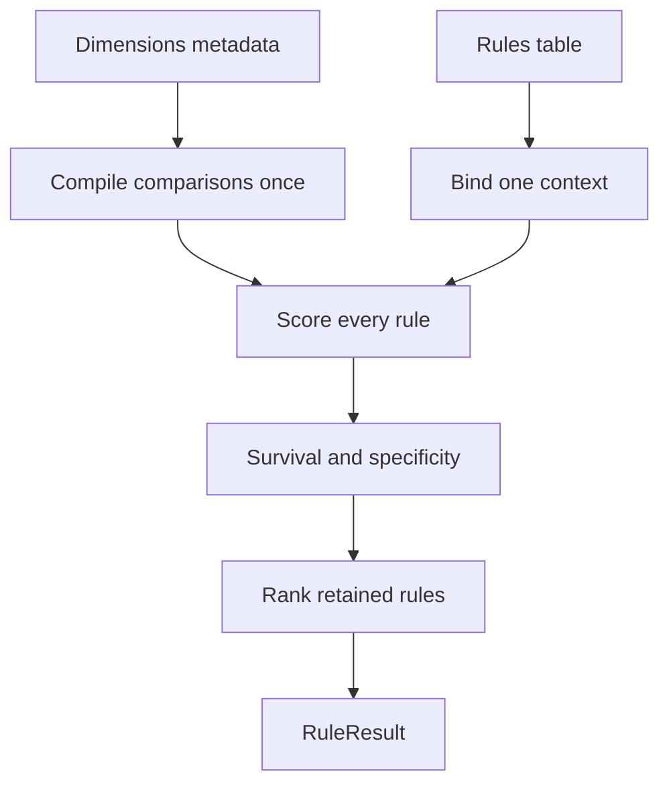

# Chapter 4: Using the Expression Rules Engine

`ExpressionRulesEngine` evaluates one context against every row in a rules table and returns the rows whose active conditions do not conflict with that context. It is the practical entry point for a filter-style decision: construct an engine once from a table and `DimensionsMetadata`, then evaluate many independent contexts with that engine.

This chapter follows one single-context workflow. [Chapter 2](../02-shared-rule-model/index.md#dimensionsmetadata) defines the metadata object and [Chapter 3](../03-matching-concepts/index.md#ternary-logic-match-unknown-and-non-match) defines ternary outcomes. Here those outcomes become a survivor set, a specificity score, and a rank. Chapter 5 develops policy selection and diagnostic explanation; [Chapter 6](../06-batch-evaluation/index.md#evaluate-a-table-of-requests) applies the same matching model to a table of contexts.

<!-- concept:40 -->
## Construct an engine and evaluate a context {#construct-an-engine-and-evaluate-a-context}

`ExpressionRulesEngine` accepts a rules DataFrame and one nonempty definition of the comparisons to make. The normal definition is `DimensionsMetadata`. It contains `Dimension` objects, so the engine can compile their declared strategies once during construction and can resolve context-field mappings and typed missing values when it evaluates a context.

The rules frame determines the execution backend. Passing a Polars frame produces Polars survivor frames; Ibis and Narwhals-wrapped supported frames use their corresponding backend through Mountainash relations and expressions. The public decision API is the same, but a comparison strategy still needs support in the backend and operation being used. The examples use Polars so that their table values are easy to inspect.

A discount library has a broad fallback, a regional rule, and a regional-and-tier rule. `"<NA>"` is the string wildcard introduced in Chapter 3. `discount` is an output column: it passes through the engine but is not a dimension.

```python
import polars as pl
from mountainash.relations import relation
from mountainash_rules import (
    DataType,
    Dimension,
    DimensionCompiler,
    DimensionsMetadata,
    ExpressionRulesEngine,
    UNKNOWN,
)

rules = pl.DataFrame({
    "rule_name": ["default", "au_standard", "au_gold", "nz_standard"],
    "region": [UNKNOWN, "AU", "AU", "NZ"],
    "tier": [UNKNOWN, UNKNOWN, "gold", UNKNOWN],
    "discount": [0, 5, 15, 8],
})

metadata = DimensionsMetadata(dimensions=[
    Dimension(dimension_name="region", data_type=DataType.STR),
    Dimension(dimension_name="tier", data_type=DataType.STR),
])
engine = ExpressionRulesEngine(rules=rules, dimension_metadata=metadata)
```

The engine is for filtering and ranking existing rows. It does not combine compatible rules or aggregate their payloads; that is the separate Accumulator Engine workflow in [Chapter 7](../07-accumulator-engine/index.md#accumulatorengine).

<!-- concept:41 -->
### Constructing an engine {#constructing-an-engine}

The constructor requires the rules table and exactly one of `dimension_metadata` or `dimension_expressions`. Supplying neither, supplying both, or supplying an empty definition is rejected before evaluation. The constructor also validates declared `output_fields` against actual rule columns; Chapter 5 explains why that schema matters for the `ANY` policy.

The metadata path retains the declarative configuration for context-field resolution, typed missing values and selection settings. The table supplies the rule store, while compiled expression templates are prepared for later contexts.

<!-- concept:42 -->
### Convenience versus advanced construction {#convenience-vs-advanced-construction}

The metadata constructor is the **convenience path**: `ExpressionRulesEngine` creates a `DimensionCompiler` and compiles the dimensions. The **advanced path** receives a dictionary of already-compiled expressions, keyed by dimension name. It is useful when an application deliberately supplies composed or custom ternary expressions.

The advanced path does not carry `DimensionsMetadata`. Consequently it has no metadata fallback for a context-field mapping, a default policy, a priority field, or output fields. On that path, context keys must match expression names and the default hit policy is `collect`. An explicit `output_fields` list is available only on this path, and becomes required for `ANY`.

For scalar contexts, missing keys and `None` values on the advanced path use the string `NOT_SET` sentinel because there is no declared dimension type. Use the metadata path when you need typed missing-value normalization, including Boolean absence.

This example compiles the same metadata explicitly, then evaluates through the advanced constructor. It has the same three survivors because the expressions are the same.

```python
compiled = DimensionCompiler().compile_dimensions(metadata)
advanced_engine = ExpressionRulesEngine(
    rules=rules,
    dimension_expressions=compiled,
)
print(advanced_engine.evaluate({"region": "AU", "tier": "gold"}).count)
```

```text
3
```

Custom expression construction and strategy compilation are implementation topics for [Chapter 9](../09-expression-engine-internals/index.md#dimensioncompiler). Most rule libraries should retain the metadata path because it keeps the table's declared comparison model available to the engine.

<!-- concept:43 -->
### Evaluating a context in one pass {#evaluating-a-context-in-one-pass}

`evaluate()` accepts a dictionary or a Pydantic model and returns a `RuleResult`. A context is one set of facts, such as `{"region": "AU", "tier": "gold"}`. The engine scores its active dimensions across the complete rule frame as a vectorized relation operation; it does not call a Python matching function once per row.

```python
result = engine.evaluate({"region": "AU", "tier": "gold"})
rows = relation(result.survivors).to_polars().select(
    "rule_name", "discount", "__t_region", "__t_tier",
    "__specificity", "__rank",
).rows()
print(rows)
```

```text
[('au_gold', 15, 1, 1, 2, 1), ('au_standard', 5, 1, 0, 1, 2), ('default', 0, 0, 0, 0, 3)]
```

The context value is bound as an internal literal column for each active dimension, each compiled comparison produces `__t_<dimension>`, and the engine derives survival and specificity from those columns. It then filters non-survivors, orders the remainder, assigns ranks, applies the active policy, and removes temporary context columns. The default policy is `COLLECT`, so this call retains every survivor.



The rule table and its metadata are inputs to a decision; the context changes between decisions. A later call can use another context without reconstructing the engine.

## Understand survival and ranking {#matching-and-ordering}

<!-- concept:46 -->
### Survival computation {#understand-survival-and-ranking}

For each active dimension, a rule receives ternary `1`, `0`, or `-1`. A rule survives only if **every** active result is nonnegative. The implementation uses a conjunction of the `__t_<dimension> >= 0` checks. That is equivalent to the minimum-based ternary rule from Chapter 3, while retaining a reliable one-row-per-rule shape across supported backends.

| Rule | Region outcome | Tier outcome | Survives? | Reason |
|---|---:|---:|---|---|
| `au_gold` | 1 | 1 | Yes | Both concrete conditions match. |
| `au_standard` | 1 | 0 | Yes | Its tier wildcard is unknown, not a contradiction. |
| `default` | 0 | 0 | Yes | Both conditions are wildcards. |
| `nz_standard` | -1 | 0 | No | Its concrete region contradicts `AU`. |

A match in one dimension cannot compensate for a `-1` in another. The engine therefore drops `nz_standard`, but the remaining rows still retain their per-dimension outcomes by default.

<!-- concept:47 -->
### Specificity: how many dimensions matched {#specificity-how-many-dimensions-matched}

`__specificity` counts active dimensions whose result is exactly `1`. It is a score of definite agreement, not a count of dimensions that merely allowed a row to survive.

| Retained rule | `__t_region` | `__t_tier` | `__specificity` |
|---|---:|---:|---:|
| `au_gold` | 1 | 1 | 2 |
| `au_standard` | 1 | 0 | 1 |
| `default` | 0 | 0 | 0 |

The wildcard rules remain candidates because their zeroes are nonnegative. They rank below a concrete match because an unrestricted condition supplied no evidence that the row is tailored to this context. A non-survivor also has a specificity value during scoring, but it cannot become a result row.

<!-- concept:48 -->
### Rank ordering and breaking ties {#rank-ordering-and-breaking-ties}

After survival, the default ordering is specificity descending, with original rule order as the deterministic tie-breaker. `__rank` is one-based. The example has no specificity tie, so its ranks are 1, 2, and 3 in the displayed order.

Dimension selection changes both survival and specificity. Here the engine evaluates only `region`. Both Australian rows now have specificity one, so their original rule positions break the tie: `au_standard` precedes `au_gold`.

```python
region_only = engine.evaluate(
    {"region": "AU", "tier": "gold"},
    dimensions=["region"],
)
print(relation(region_only.survivors).to_polars().select(
    "rule_name", "__specificity", "__rank",
).rows())
print(region_only.active_dimensions)
```

```text
[('au_standard', 1, 1), ('au_gold', 1, 2), ('default', 0, 3)]
['region']
```

A supplied dimension list must be a nonempty list of distinct configured names. This prevents an empty projection from becoming an accidental "everything matches" request and prevents a dimension from being counted twice. An unknown well-formed name raises `KeyError`; malformed or duplicate lists raise `ValueError`.

The ordering can change under `FIRST`, `PRIORITY`, or `RULE_ORDER`; those policy choices are deliberate, not incidental row order. Chapter 5 gives their complete ordering and cardinality contracts.

## Read the result contract {#result-interface}

<!-- concept:49 -->
### The RuleResult class {#read-the-result-contract}

`evaluate()` returns a `RuleResult`, not a scalar discount. It holds the retained, ranked frame, the names of active dimensions, and selection provenance for a later safe policy re-selection. It gives backend-agnostic accessors while preserving the native backend frame through `survivors`.

A `RuleResult` describes rows kept after matching and any requested policy or limit. It is not a record of every row the engine considered. For the complete scored table, including failed rules, use `engine.explain()` in Chapter 5.

<!-- concept:50 -->
### Survivors {#survivors}

`result.survivors` is the native DataFrame containing the retained rows in applied-policy rank order. It includes the original rule columns, `__rule_index`, `__specificity`, `__rank`, and — unless disabled — one `__t_` column for each active dimension. A Polars-backed engine returns a `DataFrame` here.

```python
print(type(result.survivors).__name__)
print(result.count)
```

```text
DataFrame
3
```

Use `relation(result.survivors)` when application code needs Mountainash's common relation interface, as the earlier display did. Use the native frame when its backend-specific operations are the intended next step.

<!-- concept:51 -->
### Best match {#best_match}

`best_match` returns a one-row native frame holding the retained row with the smallest `__rank`; it is not a dictionary or a scalar. With the default unfiltered result, that is `au_gold`.

```python
print(relation(result.best_match).to_polars().select(
    "rule_name", "discount", "__rank",
).rows())
```

```text
[('au_gold', 15, 1)]
```

When no row remains, `best_match` is an empty frame with the result schema. It does not raise merely because the rule library has no answer for a context.

<!-- concept:52 -->
### Count {#count}

`count` is the number of retained rows as a Python integer. A no-match result is an ordinary outcome under `COLLECT`, and `count` is the direct way to distinguish it from a decision that produced one or more candidates.

```python
strict_rules = pl.DataFrame({"rule_name": ["nz_only"], "region": ["NZ"]})
strict_engine = ExpressionRulesEngine(
    strict_rules,
    dimension_metadata=DimensionsMetadata(
        dimensions=[Dimension(dimension_name="region")],
    ),
)
no_match = strict_engine.evaluate({"region": "AU"})
print(no_match.count, relation(no_match.best_match).to_polars().height)
```

```text
0 0
```

Whether a no-match is acceptable depends on the application. The engine represents it faithfully; application-level input requirements and fallback behavior remain application decisions.

<!-- concept:53 -->
### Active dimensions {#active_dimensions}

`active_dimensions` records the names that actually participated in the decision. It is the full configured list when `dimensions` is omitted and the validated subset when it is supplied. That record makes a result auditable: the `region_only` result above does not claim to have considered tier, and later `RuleResult.explain()` reads only its recorded ternary columns.

<!-- concept:58 -->
### Observability columns {#observability-columns}

The `__t_<dimension>` columns are **observability columns**. They make a survivor's ternary outcomes visible and enable `RuleResult.explain(rule_name)`. They are retained by default. Set `include_observability=False` only when the result will not need per-dimension explanation.

```python
lean = engine.evaluate(
    {"region": "AU", "tier": "gold"},
    include_observability=False,
)
print([name for name in lean.survivors.columns if name.startswith("__t_")])
```

```text
[]
```

The lean frame still contains the original rule values, specificity, rank, and the ordinary result accessors. It simply no longer contains the ternary evidence that `RuleResult.explain()` needs. Engine-level explanation always scores all rules independently and retains its diagnostic columns.

## Next steps

A single-context expression decision is now a repeatable workflow: define metadata, construct once, evaluate a context, then interpret survival, specificity, rank, and the result frame. [Chapter 5](../05-expression-results-and-policies/index.md#choose-and-reapply-a-hit-policy) chooses how multiple survivors are handled, filters or reselects a result safely, and compares result-level with engine-level explanations. [Chapter 6](../06-batch-evaluation/index.md#evaluate-a-table-of-requests) keeps the same semantics while evaluating a table of contexts.

## Source references

- [`ExpressionRulesEngine`](https://github.com/mountainash-io/mountainash-rules/blob/730a8583ee9d4fd6b52dc5350699eb66cc7487e9/src/mountainash_rules/engines/filter/engine.py) — construction, active-dimension validation, scoring, ranking, and result construction.
- [`RuleResult`](https://github.com/mountainash-io/mountainash-rules/blob/730a8583ee9d4fd6b52dc5350699eb66cc7487e9/src/mountainash_rules/core/result.py) — native survivor frame and result accessors.
- [`DimensionsMetadata` and `Dimension`](https://github.com/mountainash-io/mountainash-rules/blob/730a8583ee9d4fd6b52dc5350699eb66cc7487e9/src/mountainash_rules/core/dimension.py) — declarative metadata consumed by the convenience constructor.
