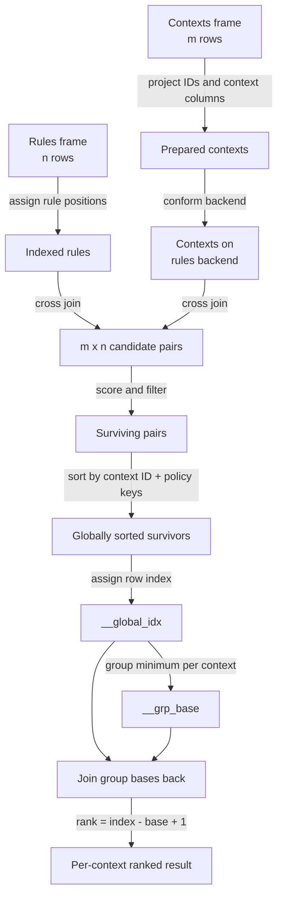

# Chapter 4: Scoring Batches of Contexts

Chapter 3 evaluated one context at a time: [`ExpressionRulesEngine.evaluate()`](../03-evaluating-decisions/index.md) binds a single set of context values to the rules table, computes ternary outcomes, filters to survivors, and ranks them under a hit policy. Many real workloads do not arrive one context at a time. A batch of pending orders, a day's worth of support tickets, or a page of API requests all need the same rule table applied to every row, with the results kept separate per row.

`ExpressionRulesEngine.evaluate_batch()` is the batch counterpart to `evaluate()`. It does not loop over contexts and call `evaluate()` repeatedly. Instead, it prepares every context row once, joins the entire prepared batch against the entire rules table in a single relational operation, and then reconstructs per-context groups out of that combined result so that ranking, hit-policy assertions, and truncation all still operate *within* each context rather than across the whole batch. The matching semantics — ternary outcomes, the survival rule, and specificity scoring from Chapters 1 and 3 — do not change. What changes is the shape of the computation and the bookkeeping needed to keep contexts from bleeding into each other's rankings.

This chapter follows that bookkeeping in the order a caller experiences it: preparing the batch and understanding the cross-join it produces, ranking and conforming the joined result back into per-context groups, and finally bounding the size of the join and reading one context back out of a batch result. Every claim here is checked against `src/mountainash_rules/engines/filter/engine.py`, `src/mountainash_rules/core/batch_result.py`, and `tests/filter/test_batch_evaluation.py` at commit `94659bb0c096485c87d329f09e944577427f129f`.



Every code example below continues one running session. The rule table and dimensions are the ones `tests/filter/test_batch_evaluation.py` uses to check batch behavior against single-context `evaluate()`, so the expected values quoted throughout are drawn from that source, not invented:

```python
import polars as pl
from mountainash.relations import relation
from mountainash_rules import (
    Dimension,
    DimensionsMetadata,
    ExpressionRulesEngine,
    HitPolicy,
    MatchStrategy,
)
from mountainash_rules.core.hit_policy import HitPolicyViolationError

rules = pl.DataFrame({
    "rule_name": ["au_low", "au_high", "nz_any", "prefix_x"],
    "region": ["AU", "AU", "NZ", "<NA>"],
    "amt_min": [0, 100, -999999999, -999999999],
    "amt_max": [99, 999, -999999999, -999999999],
    "code": ["<NA>", "<NA>", "<NA>", "X-"],
    "price": [1.0, 2.0, 3.0, 4.0],
})

metadata = DimensionsMetadata(dimensions=[
    Dimension(dimension_name="region"),
    Dimension(
        dimension_name="amount",
        match_strategy=MatchStrategy.RANGE,
        data_type=int,
        range_min_field="amt_min",
        range_max_field="amt_max",
    ),
    Dimension(
        dimension_name="code",
        match_strategy=MatchStrategy.PREFIX,
        context_field="product_code",
    ),
])

engine = ExpressionRulesEngine(rules=rules, dimension_metadata=metadata)
```

`region` uses the default `EXACT` strategy from Chapter 2 (see [Give rule columns meaning](../02-authoring-rule-libraries/index.md)); `amount` is a `RANGE` dimension read from `amt_min`/`amt_max`; `code` is a `PREFIX` dimension that reads its context value from `product_code` rather than from a field named `code`. `au_low`, `au_high`, and `nz_any` wildcard the `code` dimension with the rule-side unknown sentinel `"<NA>"`; `prefix_x` wildcards `region` the same way and wildcards `amount` with the numeric unknown sentinel `-999999999`. These sentinel meanings are Chapter 1 material ([What a rule table represents](../01-rule-tables-and-decisions/index.md)); this chapter only relies on them, it does not redefine them.

---

## Prepare a batch and understand the work

Before ranking or grouping can happen, `evaluate_batch()` has to turn a caller-supplied contexts frame into something it can cross-join against the rules frame, and then actually perform that join. This section covers the public method, the projection step that prepares each context row, and the join itself.

<!-- concept:113 -->
### The evaluate_batch method

`evaluate_batch()` is declared as:

```text
def evaluate_batch(
    self,
    contexts: t.Any,
    *,
    context_id_field: str | None = None,
    dimensions: list[str] | None = None,
    hit_policy: HitPolicy | None = None,
    priority_field: str | None = None,
    top_n_per_context: int | None = None,
    min_specificity: int | None = None,
    include_observability: bool = True,
    chunk_size: int | None = None,
) -> BatchRuleResult:
```

(`src/mountainash_rules/engines/filter/engine.py`, `evaluate_batch`.) This is real source shown for reference; it is a method on `ExpressionRulesEngine` and cannot run standalone.

`contexts` is the only required argument: a dataframe-like object with one row per context to evaluate. Every other argument is keyword-only, which keeps call sites readable when several are supplied together. `dimensions` behaves exactly as it does for `evaluate()`: omitting it evaluates every dimension the engine compiled; naming an unknown dimension raises `KeyError` before any evaluation happens. `hit_policy` and `priority_field` select and parameterize the hit policy exactly as in [Choose and reapply a hit policy](../03-evaluating-decisions/index.md); when `hit_policy` is omitted, the engine falls back to `DimensionsMetadata.hit_policy` when metadata is attached, or `HitPolicy.COLLECT` when it is not.

Three arguments are specific to batches:

| Argument | Effect |
|---|---|
| `context_id_field` | Names a column in `contexts` whose values identify each row. Omitted: the engine assigns a zero-based row index as the identifier. |
| `top_n_per_context` | Keeps at most this many ranked survivors *inside each context's own group*, not globally across the batch. |
| `chunk_size` | Switches from one whole-batch cross-join to sequential chunks of prepared context rows (covered later in this chapter). |

A minimal call scores every prepared context against every rule with the metadata's policy and no truncation:

```python
contexts = pl.DataFrame({
    "region": ["AU", "XX"],
    "amount": [50, 1],
    "product_code": ["X-1", "Q"],
})

batch = engine.evaluate_batch(contexts)
survivors = relation(batch.survivors).to_polars()
assert survivors["__context_id"].n_unique() == 1
assert sorted(survivors["rule_name"].to_list()) == ["au_low", "prefix_x"]
```

Only context `0` (`AU`, `50`, `X-1`) survives here; context `1` (`XX`, `1`, `Q`) matches nothing, because `XX` is not any rule's region and `Q` does not start with `X-`. That absence is itself meaningful — Section 3 revisits how a batch result distinguishes "zero matches" from "context not evaluated." The remainder of this section explains how the engine got from `contexts` to that `survivors` frame.

<!-- concept:114 -->
### Batch Context Preparation

Single-context `evaluate()` binds one context's values as literal columns broadcast across every rule row. A batch cannot bind context values as engine-wide literals, because different rows in the same batch need different values bound to the *same* rules frame. `_prepare_contexts()` solves this by projecting the whole contexts frame down to exactly one identifier column and one binding column per active dimension, so that a join — not a per-row literal — supplies each candidate pair with the right values.

```python
prepared = engine._prepare_contexts(contexts, ["region", "amount", "code"], None)
assert sorted(prepared.columns) == [
    "__context_id", "__ctx_amount", "__ctx_code", "__ctx_region",
]
```

(`_prepare_contexts` is an internal helper — the leading underscore marks it as implementation, exercised directly here and in the test suite only to show what the public `evaluate_batch()` produces internally; application code calls `evaluate_batch()`, not this method.) Every other input column, including any the caller did not intend for matching, is dropped by this projection. That is deliberate: it stops unrelated caller columns from silently colliding with rule columns during the join, and it keeps the join payload limited to exactly the values the compiled expressions read.

Each active dimension resolves its context field from metadata. Missing or null values are filled using `not_set_sentinel_for`: numeric types use `-999999998`, dates and datetimes use their typed year-one NOT_SET values, and strings use `"<NOT_SET>"`. Boolean batch handling is a current exception: it also uses the string sentinel, unlike the scalar path's `None`. On Polars, omitted or null Boolean context values can therefore eliminate concrete Boolean rules rather than produce unknown matches; [Chapter 6](../06-expression-execution-internals/index.md) demonstrates the difference. Context identity is separate: omitting `context_id_field` generates zero-based IDs, while a supplied ID column must contain unique values. The next example also demonstrates the reserved-column guard:

```python
try:
    engine._prepare_contexts(
        pl.DataFrame({"__rank": [1], "region": ["AU"]}), ["region"], None,
    )
    raise AssertionError("expected ValueError")
except ValueError as exc:
    assert "__rank" in str(exc)
```

This particular frame fails earlier than the uniqueness check: `_check_reserved()` scans every caller-supplied frame (contexts and rules alike) for column names the engine owns internally — `__context_id`, `__global_idx`, `__grp_base`, `__rule_index`, `__rank`, `__specificity`, `__survived`, and anything starting with `__t_` or `__ctx_` — and raises `ValueError` naming the offending column before preparation continues. A batch column named `__rank` would otherwise be indistinguishable from the rank the engine computes later, so this check runs unconditionally, not just when it happens to matter for a particular call.

<!-- concept:115 -->
### Cross-Join Evaluation

Once contexts are prepared, `_evaluate_batch_frame()` performs the join that gives batch evaluation its name: every prepared context row is paired with every rule row. With `m` prepared contexts and `n` rules, this produces `m × n` candidate pairs before any filtering — the Cartesian product of contexts and rules is the unit of work, not an optimization detail. The rules relation first receives a `__rule_index` column (used later for tie-breaking and for the `RULE_ORDER` and `FIRST` policies), then a cross join attaches every prepared context row to every rule row.

The compiled dimension expressions from Chapter 2's metadata run against this joined relation exactly as they do in `evaluate()`: one `with_columns` call adds a `__t_<dimension>` ternary column per active dimension, survival is `least(...)` across those columns being `>= 0`, and specificity counts how many of them equal `1`. This machinery is Chapter 3's ([Understand survival and ranking](../03-evaluating-decisions/index.md)); batch evaluation reuses it unchanged, just against `m × n` rows instead of `n`.

That reuse is the central batch invariant this chapter has to make concrete, not just assert: for a given context and rule set, batch evaluation produces the same surviving rules, the same specificity scores, and the same ranks as calling `evaluate()` on that context alone. Continuing the session, compare context `0`'s batch rows against a direct `evaluate()` call on the same values:

```python
detailed = engine.evaluate_batch(contexts, include_observability=True)
detail_survivors = (
    relation(detailed.survivors).to_polars().sort(["__context_id", "__rank"])
)
ctx0 = detail_survivors.filter(pl.col("__context_id") == 0)
assert ctx0["rule_name"].to_list() == ["au_low", "prefix_x"]
assert ctx0["__specificity"].to_list() == [2, 1]

single = engine.evaluate({"region": "AU", "amount": 50, "product_code": "X-1"})
single_rows = relation(single.survivors).to_polars().sort("__rank")
assert ctx0["rule_name"].to_list() == single_rows["rule_name"].to_list()
assert ctx0["__specificity"].to_list() == single_rows["__specificity"].to_list()
assert ctx0["__rank"].to_list() == single_rows["__rank"].to_list()
```

Both paths agree: `au_low` survives with specificity `2` (hard matches on `region` and `amount`, wildcarded `code`) and ranks first; `prefix_x` survives with specificity `1` (hard match on `code` only, wildcarded `region` and `amount`) and ranks second. Batch evaluation changes the *shape* of the computation — one join instead of `m` separate evaluations — not the matching rules that decide who survives or who ranks ahead of whom.

---

## Rank and conform per-context results

The cross join in the previous section produces one flat relation containing every context's surviving rows mixed together. Two more steps turn that into a genuinely per-context result: independent ranking inside each context group, and, before the join can even happen, making sure the prepared contexts and the rules frame share one dataframe backend. This section covers both, then introduces the `BatchRuleResult` wrapper that holds the outcome.

<!-- concept:116 -->
### Per-Context Ranking

A single global sort across all `m × n` survivors would rank contexts against each other, which is wrong: a rule with specificity `2` for context A must not out-rank a specificity-`1` rule for context B merely because A's rules happen to sort earlier. Ranking has to happen *within* each `__context_id` group.

Single-context `evaluate()` can rank with a plain `with_row_index()` after sorting, because there is only one context — a global row index and a per-context rank are the same thing. A batch has many contexts sharing one relation, and the implementation deliberately avoids backend-specific window functions to preserve portability across the dataframe backends Chapter 1 introduced. Instead, `_evaluate_batch_frame()` computes a portable equivalent with five ordinary relation operations:

1. Sort by `__context_id`, then by the active hit policy's ordering keys.
2. Add a global zero-based `__global_idx` over the whole sorted relation.
3. Group by `__context_id` and take each group's minimum `__global_idx`, called `__grp_base`.
4. Join those per-context bases back onto the sorted relation.
5. Compute `__rank = __global_idx - __grp_base + 1`.

The ordering keys come from the same `ordering_keys()` helper Chapter 3 uses for single-context ranking: `FIRST` and `RULE_ORDER` sort by `__rule_index` ascending; `PRIORITY` sorts by the priority field descending, then specificity descending, then `__rule_index`; `COLLECT`, `UNIQUE`, and `ANY` sort by specificity descending, then `__rule_index`. Because the sort always includes `__context_id` first, sorting is stable per group even though it runs once over the whole batch.

Hit-policy assertions from Chapter 3 run over each context's *complete* survivor set, before `min_specificity` or `top_n_per_context` remove any rows — so `UNIQUE` and `ANY` can catch a violation that per-context truncation would otherwise hide:

```python
policy_contexts = pl.DataFrame({
    "region": ["AU", "NZ"], "amount": [50, 500], "product_code": ["X-1", "Z"],
})

first_batch = engine.evaluate_batch(policy_contexts, hit_policy=HitPolicy.FIRST)
first_survivors = relation(first_batch.survivors).to_polars()
assert first_survivors.group_by("__context_id").len()["len"].to_list() == [1, 1]

try:
    engine.evaluate_batch(policy_contexts, hit_policy=HitPolicy.UNIQUE)
    raise AssertionError("expected HitPolicyViolationError")
except HitPolicyViolationError as exc:
    assert "0" in str(exc)  # context 0 (AU/50/X-1) has two survivors

topn_batch = engine.evaluate_batch(policy_contexts, top_n_per_context=1)
topn_survivors = relation(topn_batch.survivors).to_polars()
assert (topn_survivors["__rank"] <= 1).all()
assert topn_survivors["__context_id"].n_unique() == 2
```

`FIRST` keeps exactly one row per context independently of how many rows any other context has. `UNIQUE` raises because context `0` still has two survivors (`au_low` and `prefix_x`) even though context `1` (`NZ`/`500`/`Z`, matched only by `nz_any`) does not violate the policy at all — the assertion is per-context, and one violating context does not silence checking the others. `top_n_per_context=1` truncates each context's own ranking to its top row, independent of context `1` having fewer candidates to begin with.

<!-- concept:117 -->
### Backend Conforming

A cross join requires both sides to live in the same dataframe backend. Callers frequently build a contexts frame in whatever is convenient — Polars is the common case — even when the engine's `rules` frame was constructed through Ibis, Pandas, or a Narwhals wrapper. `_conform_to_rules_backend()` rehosts the already-prepared context relation into the backend `self._rules` uses, immediately before the join:

| Detected rules backend | Prepared contexts rehosted as |
|---|---|
| Ibis | `prepared.to_ibis()` |
| Narwhals or Pandas, and the rules object identifies as Pandas | `prepared.to_pandas()` |
| Narwhals or Pandas, otherwise | `prepared.to_polars()` |
| Anything else | `prepared.to_polars()` |

Backend detection and conversion go through `mountainash`, not through importing Pandas or Ibis directly inside the filter engine — this keeps the boundary where backend-specific code is allowed to live narrow and explicit, a concern Chapter 8 examines directly under backend purity. Conformance happens *after* projection and sentinel filling, so it never changes which columns are active or how a missing value is represented; it only moves an already-normalized relation onto the execution engine the rules already live on. Every worked example in this chapter uses a Polars rules frame, so conformance is a no-op here, but the same `evaluate_batch()` call works unchanged if `rules` were backed by Ibis or Pandas instead.

<!-- concept:112 -->
### The BatchRuleResult Class

`evaluate_batch()` returns a `BatchRuleResult`, the wrapper around the joined-and-ranked survivor frame. It stores four things: the evaluated dataframe (`survivors`), the `active_dimensions` used for this call, the public `context_id_field` label (the caller's column name, or `"__context_id"` for generated identifiers), and the `SelectionInfo` needed to re-wrap one context's rows as an ordinary `RuleResult` later.

The survivor frame is the joined relation after ranking, filtering, and column cleanup: it keeps `__context_id`, `__rule_index`, `__rank`, `__specificity`, and, unless `include_observability=False`, the `__t_<dimension>` ternary columns; the engine always removes its own temporary join scaffolding (`__ctx_<dimension>`, `__survived`, `__global_idx`, `__grp_base`) before returning. It is important to keep the two identity questions this frame answers straight: **rows** are `(context, rule)` pairs, and **groups** are contexts. `count` reports the former, not the latter:

```python
assert batch.count == 2  # two surviving (context, rule) pairs, not two contexts
```

Both of context `0`'s survivors count toward `count`; context `1` contributes nothing because it has no surviving rows at all. `best_matches` filters to rows whose `__rank` is `1` — with `COLLECT`, that is one row per matched context that has at least one survivor:

```python
best = relation(batch.best_matches).to_polars()
assert best["__context_id"].to_list() == [0]
```

`counts_per_context` answers "how many rows survived for each context," grouping the survivor frame by `__context_id`:

```python
counts = relation(batch.counts_per_context).to_polars()
assert dict(zip(counts["__context_id"], counts["__n"])) == {0: 2}
```

`matched_context_ids` returns the sorted, unique identifiers actually present in the survivor frame — context `1` is absent from it, because it has no rows to be present in:

```python
assert batch.matched_context_ids == [0]
```

`unmatched_context_ids(contexts)` closes the gap by comparing those matched identifiers against the *original* contexts frame, reading the configured `context_id_field` column when one was supplied, or comparing against positional identifiers `0` through `count_rows() - 1` when it was not:

```python
assert batch.unmatched_context_ids(contexts) == [1]
```

The wrapper deliberately does not copy the caller's original context columns into every survivor row — only the normalized `__context_id` travels through. An application that needs the full input row back joins the result on that identifier rather than expecting it pre-joined; `BatchRuleResult` answers "what did the rules decide," not "restate the input."

---

## Bound the work and inspect one context

The whole-batch cross join in Section 1 evaluates `m × n` candidate pairs in one relation. That is efficient when the intermediate relation fits comfortably in memory, but for a sufficiently large batch, materializing every candidate pair at once may not be practical. This section covers the opt-in mechanism for bounding that materialization, and the accessor that turns a batch result back into a single, familiar `RuleResult`.

<!-- concept:118 -->
### Chunked Batch Evaluation

Passing `chunk_size` switches `evaluate_batch()` from one whole-batch join to sequential chunks. The engine still prepares the *complete* context projection first — chunking only affects how many rows get cross-joined against the rules table at once, not how contexts are projected or identified. It converts the prepared frame to Polars for slicing, then runs `_evaluate_batch_frame()` — the same cross-join, scoring, per-context ranking, assertion, and truncation pipeline from Sections 1 and 2 — once per consecutive slice of at most `chunk_size` rows, and concatenates the successful chunk results.

Because `__context_id` is carried through the prepared rows rather than recomputed per chunk, chunk boundaries do not change ordinary results: each context still ranks independently of every other context, whichever chunk it happened to land in.

```python
big_contexts = pl.DataFrame({
    "region": ["AU"] * 5 + ["NZ"] * 5,
    "amount": list(range(0, 1000, 100)),
    "product_code": [f"X-{i}" for i in range(10)],
})

whole = relation(engine.evaluate_batch(big_contexts).survivors).to_polars()
chunked = relation(
    engine.evaluate_batch(big_contexts, chunk_size=3).survivors
).to_polars()

key = ["__context_id", "__rank"]
assert whole.sort(key).equals(chunked.sort(key))
```

Ten contexts, chunked in groups of three, land as follows:

| Chunk start | Context IDs in chunk |
|---|---|
| 0 | 0, 1, 2 |
| 3 | 3, 4, 5 |
| 6 | 6, 7, 8 |
| 9 | 9 |

Every context in this example — five in `AU` at amounts `0, 100, ..., 400` and five in `NZ` at amounts `500, ..., 900` — has exactly two survivors regardless of chunk boundary (either `au_low` or `au_high` plus `prefix_x` for the `AU` rows, or `nz_any` plus `prefix_x` tied at specificity `1` for the `NZ` rows), so `whole` and `chunked` agree row for row once both are sorted by `(__context_id, __rank)`. This equality is a correctness check on chunking, not evidence that chunking runs faster; nothing in this chapter measures execution time, and no speed claim should be inferred from the fact that chunked evaluation is *available*. Chunking exists to bound how many candidate pairs must be materialized at once, which is a memory tradeoff, not a throughput one.

That tradeoff has a correctness detail specific to the `UNIQUE` and `ANY` assertions from Section 2: a violation can occur in one chunk while another violation occurs in a different chunk. `evaluate_batch()` catches each `HitPolicyViolationError` as its chunk runs, keeps evaluating the remaining chunks, and — only if any chunk raised — concatenates every offending frame into one final `HitPolicyViolationError` whose message lists every affected context, not just the first one encountered:

```python
violation_contexts = pl.DataFrame({
    "region": ["AU", "XX", "XX", "AU"],
    "amount": [50, 1, 1, 50],
    "product_code": ["X-1", "Q", "Q", "X-1"],
})

try:
    engine.evaluate_batch(
        violation_contexts, hit_policy=HitPolicy.UNIQUE, chunk_size=2,
    )
    raise AssertionError("expected HitPolicyViolationError")
except HitPolicyViolationError as exc:
    msg = str(exc)
    assert "0" in msg and "3" in msg
```

Contexts `0` and `3` are both `AU`/`50`/`X-1`, each with two survivors (`au_low` and `prefix_x`); `chunk_size=2` places them in different chunks (`[0, 1]` and `[2, 3]`). Both violations are still reported together, because the engine accumulates offending frames across chunks before raising rather than stopping at the first chunk's failure. A violation is never silently lost to whichever chunk it happened to fall into.

<!-- concept:119 -->
### For Context Accessor

`BatchRuleResult.for_context(context_id)` filters the stored survivor frame to rows matching that identifier, collects them, and wraps them as an ordinary `RuleResult` — the same class Chapter 3 introduced for single-context results ([Read the result contract](../03-evaluating-decisions/index.md)) — carrying through the batch's `active_dimensions` and `SelectionInfo`. This is what makes a batch compatible with single-context result-handling code without re-running the engine: an application can loop over `matched_context_ids`, call `for_context()` for each one, and use `RuleResult.count`, `.best_match`, `.explain()`, and every other Chapter 3 accessor exactly as if that one context had been evaluated on its own.

```python
one = batch.for_context(0)
assert one.count == 2
assert one.explain("au_low")["region"] == 1
```

`explain()` here behaves exactly as Chapter 3 describes it: it returns a mapping from each active dimension to that rule's ternary outcome for this context, independent of how the batch ranked or filtered anything.

A context absent from `matched_context_ids` has no rows to extract — calling `for_context()` on an unmatched identifier returns an empty `RuleResult` rather than raising, consistent with the survivor frame simply having no such rows to filter to. This is the same distinction `unmatched_context_ids()` exists to surface: "zero rules matched" and "this context was never evaluated" are different situations for a caller to handle, and a `BatchRuleResult`'s accessors are built so those situations stay distinguishable throughout.

---

## A complete batch workflow

Assembling every piece above into one call: a rule table, dimension metadata, a batch of contexts with a caller-supplied identifier column, an explicit hit policy, and both a per-context cap and a specificity floor.

```python
req_contexts = pl.DataFrame({
    "request_id": ["r-100", "r-101", "r-102"],
    "region": ["AU", "NZ", "XX"],
    "amount": [50, 500, 10],
    "product_code": ["X-1", "Z-9", "X-3"],
})

final_batch = engine.evaluate_batch(
    req_contexts,
    context_id_field="request_id",
    hit_policy=HitPolicy.COLLECT,
    top_n_per_context=2,
    min_specificity=1,
)

assert final_batch.matched_context_ids == ["r-100", "r-101", "r-102"]
assert final_batch.unmatched_context_ids(req_contexts) == []
assert final_batch.for_context("r-100").count == 2  # au_low, prefix_x
assert final_batch.for_context("r-101").count == 1  # nz_any
assert final_batch.for_context("r-102").count == 1  # prefix_x
```

All three requests match here — `r-100` against `au_low` and `prefix_x`, `r-101` against `nz_any` only (its product code `Z-9` does not start with `X-`, so `prefix_x` does not survive for it), and `r-102` against `prefix_x` only (its region `XX` matches no rule's region, but its code `X-3` does start with `X-`). Reading this pipeline in order: `_prepare_contexts()` projects `req_contexts` to `__context_id` plus three `__ctx_` columns; `_conform_to_rules_backend()` is a no-op because both frames are already Polars; the cross join, ternary scoring, and survival filter run once over all three requests paired against all four rules; per-context ranking sorts and reindexes within each `request_id` group; `min_specificity=1` and `top_n_per_context=2` apply after that ranking; and `BatchRuleResult` exposes the outcome through `matched_context_ids`, `unmatched_context_ids()`, and `for_context()` without the caller writing a loop over rules. Where a caller does still want to loop — over *contexts*, to react to each one individually — `for_context()` is exactly the seam that loop uses.

## Where this leads

Chapter 3's ranking, hit-policy, and result-reading rules extend to batches with only one addition: everything is scoped to `__context_id` instead of running once globally. Chapter 6 traces the same dimension-expression compilation this chapter relies on — `self._expressions[d].name` — down into how those expressions are built and bound in the first place, including the `CTX_PREFIX` column-injection pattern the single-context path shares with batch preparation. Chapter 8 returns to the backend-detection call this chapter's conforming step makes, as one of the few places in the engine that is allowed to know which backend it is running against.
