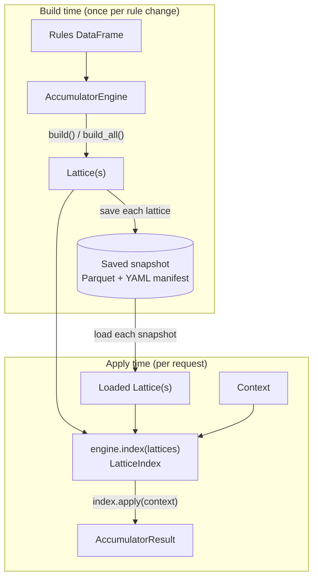

# Chapter 5: Combining, Persisting and Routing Rules

Chapters 3 and 4 answered a single question per context: which one rule (or ranked set of rules) is the best match? Some rule sets need a different answer. A transaction can be subject to a base fee, a regional surcharge, and a loyalty discount at the same time — the useful output is not "the one best rule" but "every rule that is simultaneously consistent with this context, combined." `AccumulatorEngine` answers that question by precomputing every **maximal consistent combination** of rules once, packaging the result in a `Lattice`, and then evaluating contexts against that lattice instead of against the raw rule table.

This chapter is a complete practical workflow: construct the engine, build a lattice, read what a lattice contains, apply contexts and interpret the aggregated results, split rules into routed partitions, and persist a lattice so a separate process can serve it without rebuilding. The algorithm that finds compatible combinations — prime-number identity, compatibility and coalescing algebra, and the search itself — is deferred to [Chapter 7](../07-combination-search-internals/index.md). None of that internal machinery is required to use the public API below.

## How building and applying fit together

Building a lattice is expensive and done rarely; applying a context to a built lattice is cheap and done often. The two phases are deliberately separated so that a batch job, a scheduled refresh, or a deploy step can pay the build cost once, while a request-serving process only ever applies:



A lattice built in one process is usable immediately in that process, saved for a later process to load, or handed to a `LatticeIndex` when the rule set is split into routed partitions. All three paths converge on the same `apply()` call.

## Build compatible rule combinations

<!-- concept:68 -->
### AccumulatorEngine

`AccumulatorEngine` is constructed with dimension metadata and an optional list of aggregate definitions:

```python
import polars as pl
from mountainash_rules import (
    AccumulatorEngine, Aggregate,
    Dimension, DimensionsMetadata, MatchStrategy,
)
from pydantic import BaseModel

metadata = DimensionsMetadata(dimensions=[
    Dimension(dimension_name="channel", match_strategy=MatchStrategy.EXACT),
    Dimension(
        dimension_name="lvr", match_strategy=MatchStrategy.RANGE,
        data_type=int, range_min_field="lvr_min", range_max_field="lvr_max",
    ),
    Dimension(dimension_name="foreign_resident", match_strategy=MatchStrategy.EXACT),
])

engine = AccumulatorEngine(
    dimension_metadata=metadata,
    aggregates=[Aggregate(column_name="margin")],
)
```

At construction, the engine splits `metadata.dimensions` into two lists using `DimensionRole` (Chapter 2): `CONTEXT_KEY` dimensions become partitioning keys and are set aside; every remaining dimension is a **constraint** dimension that participates in compatibility checking and coalescing. For each constraint dimension the engine immediately pre-compiles a *compatible* expression (are two rules allowed to coexist on this dimension?), a *coalesce* expression (what merged value represents both rules together?), and a coalesced-NA-flag expression. Those expressions are the building blocks the build phase reuses at every level of the search; their algebra is covered in Chapter 7.

Construction, not `build()`, is where an unsupported match strategy is rejected. Only `EXACT`, `RANGE`, `GREATER_THAN`, `LESS_THAN`, `SET_MEMBERSHIP`, and `SET_EXCLUSION` have compatible/coalesce expressions defined for the accumulator. A constraint dimension using any other strategy — `NOT_EQUAL`, `PREFIX`, `SUFFIX`, `CONTAINS`, `REGEX`, `CONTEXT_REGEX`, or `EXACT_KEY` — raises `ValueError(f"Strategy {dim.match_strategy.name} not supported by accumulator")` from `AccumulatorEngine.__init__`, before any rule is read. Fixing this means changing the dimension's strategy or excluding it from the metadata passed to the accumulator; it is a modelling decision, not a data problem.

The public surface is four methods, all covered in this chapter:

| Method | Purpose |
|---|---|
| `build(rules, partition_key=None)` | Construct one `Lattice` from a rules frame (or one `CONTEXT_KEY` partition of it). |
| `build_all(rules)` | Construct one `Lattice` per unique `CONTEXT_KEY` combination found in `rules`. |
| `apply(lattice, context, dimensions=None)` | Evaluate a context against a pre-built lattice, returning an `AccumulatorResult`. |
| `apply_auto(lattices, context, dimensions=None)` | Select the right lattice from a list by partition key, then apply. |

The rest of this chapter builds a running example around a three-rule pricing table, reused from `tests/accumulator/test_engine.py`:

```python
from mountainash_rules import UNKNOWN, UNKNOWN_NUMERIC

rules = pl.DataFrame({
    "rule_name":        ["R1",      "R2",    "R3"],
    "channel":          ["BROKER",  UNKNOWN, "BROKER"],
    "lvr_min":          [60,        70,      UNKNOWN_NUMERIC],
    "lvr_max":          [80,        90,      UNKNOWN_NUMERIC],
    "foreign_resident": [UNKNOWN,   "false", "false"],
    "margin":           [-0.10,     -0.05,   -0.15],
})

class PricingContext(BaseModel):
    channel: str
    lvr: int
    foreign_resident: str

lattice = engine.build(rules)
```

`UNKNOWN` (`"<NA>"`) and `UNKNOWN_NUMERIC` (`-999999999`) are the same rule-side wildcard sentinels introduced in Chapter 1 — a wildcard on `channel` or `lvr` means that rule does not constrain the dimension. `build()` assigns every rule a unique identity, expands compatible combinations level by level, and removes any combination that is a strict subset of another with the same merged constraints. For these three rules, the result has six outermost combinations: the three singletons, the two compatible pairs `{R1,R3}` and `{R2,R3}`, and the triple `{R1,R2,R3}` — `{R1,R2}` alone is dropped because its merged constraints are identical to (and dominated by) the triple's.

```python
assert lattice.count == 6
```

<!-- concept:87 -->
### The Aggregate Model

`Aggregate` is a small Pydantic model describing what to fold across the rules in a combination — it does not perform the fold itself. It has a required `column_name` and an `operation` that defaults to `AggregateOp.SUM`:

```python
from mountainash_rules import Aggregate, AggregateOp

margin_total = Aggregate(column_name="margin", operation=AggregateOp.SUM)
```

Pydantic validates the model shape (a string column name, an operation that is one of the four `AggregateOp` values) before the engine reads it. The engine reads the list of `Aggregate` models supplied to `AccumulatorEngine(aggregates=...)` once, at build time, and emits one `__agg_<column_name>` column per aggregate in every combination row. Several aggregates can be configured together and each operates independently over its own source column — for example, summing `margin` while separately taking the `max` of a `discount` column in the same build. Aggregates are entirely optional: an `AccumulatorEngine` with `aggregates=None` (the default) still builds and applies a lattice; it simply carries no accumulated numeric output.

<!-- concept:127 -->
### Aggregate Min, Max, and Product

`AggregateOp` defines `sum`, `min`, `max` and `product` as commutative, associative folds in their mathematical domains. This means their business interpretation is not meant to depend on rule encounter order. Finite-precision floating-point arithmetic still requires suitable numerical comparisons rather than an assumption of bit-identical reordered results.

```python
aggregates = [
    Aggregate(column_name="margin", operation=AggregateOp.SUM),
    Aggregate(column_name="discount", operation=AggregateOp.MAX),
    Aggregate(column_name="risk_factor", operation=AggregateOp.PRODUCT),
]
```

`sum` and `product` require a numeric source column; `min` and `max` require any orderable column, numeric or temporal. There is no dedicated dtype check in the `Aggregate` model — an incompatible column surfaces as a backend error at build time rather than a validation error at model-construction time.

The overflow guard protects the combination identity, `__prime_product`, not aggregate values. Construction first rules out impossible overflow cases, then checks potentially overflowing products as needed; Chapter 7 explains that tiered mechanism. **Aggregate arithmetic is unguarded and backend-defined.** For example, multiplying five values of 100 produces `10**10`, beyond signed Int32. Choose and verify the dtype and operation against the application's actual value range. Switching to floating point changes precision semantics; a successful lattice build is not proof that every business aggregate is numerically safe.

| Operation | Typical meaning | Value requirement |
|---|---|---|
| `sum` | Total charge across every contributing rule | Numeric |
| `min` | Lowest threshold or earliest bound in the combination | Numeric or temporal |
| `max` | Largest available discount in the combination | Numeric or temporal |
| `product` | Combined multiplicative factor (e.g. compounded risk) | Numeric |

<!-- concept:77 -->
### Lattice Class

`build()` and `build_all()` both return `Lattice` objects. A `Lattice` wraps a combinations DataFrame together with the metadata needed to interpret it: the `DimensionsMetadata` it was built from, the list of `Aggregate` models, and the partition key (or `None` for an unpartitioned lattice). The class is exported directly from the package, and its constructor is public — most callers only ever receive one from `build()`, but nothing stops assembling one directly (for example, when importing a lattice produced by `mountainash-rules-babel`). The snippet below wraps the same combinations frame `build()` already produced, to show the constructor's shape:

```python
from mountainash_rules import Lattice

manual_lattice = Lattice(
    dataframe=lattice.combinations,
    metadata=metadata,
    aggregates=[Aggregate(column_name="margin")],
    partition_key=None,
)
assert manual_lattice.count == lattice.count
```

Five read-only properties expose what the object carries: `combinations` (the wrapped frame), `count` (its row count, via `relation(...).count_rows()`), `partition_key`, `metadata`, and `aggregates`. Continuing the running example:

```python
print(lattice.count)          # 6
print(lattice.partition_key)  # None — no CONTEXT_KEY dimensions in this metadata
```

Treat `lattice.combinations` as read-only. `AccumulatorEngine.apply()` caches a filter engine keyed on lattice *identity* (see Apply-Phase Caching below); mutating the returned frame in place can leave a cached engine reading data that no longer matches what it was built against.

<!-- concept:78 -->
### Lattice Combinations

Each row of `lattice.combinations` is a compatible combination retained after frontier filtering. It need not be a globally maximal rule set: combinations with different coalesced constraints can both remain. The stored level is zero-based—0 for a singleton, 1 for a pair, and so on. Every row carries several column families beyond the original rule columns:

| Column family | Example name | Meaning |
|---|---|---|
| Coalesced value | `co_channel` | The merged constraint for this dimension across the combination's rules |
| Coalesced NA flag | `co_channel_na` | `1` when every contributing rule leaves this dimension unconstrained |
| Aggregate | `__agg_margin` | The folded numeric value for this combination |
| Prime product | `__prime_product` | The combination's identity, encoding which source rules contributed |
| Level | `__level` | Zero-based combination level; contributing-rule count is `__level + 1` |

For the running example, three of the six surviving combinations are singletons (`R1`, `R2`, `R3` alone), two are pairs (`{R1,R3}` and `{R2,R3}`), and one is the triple `{R1,R2,R3}`:

```python
rows = lattice.combinations  # native backend frame, e.g. polars.DataFrame
```

The exact coalesced field name follows the dimension's resolved rule field: `RANGE` dimensions get coalesced minimum and maximum fields (`co_lvr_min`, `co_lvr_max`), while other strategies get one coalesced field plus its `_na` flag. `apply()` remaps constraint metadata onto these `co_` fields internally — a caller still supplies plain context values like `{"channel": "BROKER"}`, never the `co_` column names directly.

## Inspect the lattice artifact

<!-- concept:80 -->
### Coalesced Columns

A coalesced column holds the tightest constraint that is still true of every rule in the combination. For an `EXACT` dimension, a concrete value wins over a wildcard, and two equal concrete values stay that value (two conflicting concrete values are never compatible, so they never reach the same row). For a `RANGE` dimension, compatible bounds are intersected — the merged interval uses the larger of the two lower bounds and the smaller of the two upper bounds. `SET_MEMBERSHIP` and `SET_EXCLUSION` dimensions coalesce by set intersection or union respectively (Chapter 7 covers the compiled expressions behind all of these).

In the triple combination `{R1,R2,R3}` from the running example, `co_channel` is `"BROKER"` (R1 and R3 agree, R2 was a wildcard), and `co_lvr_min`/`co_lvr_max` intersect R1's `[60,80]` with R2's `[70,90]` — R3 contributes no bound at all — to `[70,80]`.

<!-- concept:81 -->
### NA Flag Columns

Every constraint dimension has an NA flag that is `1` when the whole combined constraint remains unconstrained. Scalar and set strategies name it `co_<resolved_rule_field>_na`; `RANGE` uses `co_<dimension_name>_na` because it has two bound fields. A range is NA only when both bounds remain unconstrained. Inspecting one bound alone cannot establish that.

The singleton row for `R1` has `co_foreign_resident_na = 1` (R1's own `foreign_resident` cell is the wildcard `UNKNOWN`), while the pair `{R1,R3}` has `co_foreign_resident_na = 0` and `co_foreign_resident = "false"` (R3 contributes a concrete value once it joins the combination).

<!-- concept:82 -->
### Combination Depth

`__level` records the expansion level, not the contributing-rule count directly: 0 for a singleton, 1 for a pair and 2 for a triple. In the running example, `pp_to_level[2] == 0` for `R1`, and `pp_to_level[30] == 2` for `{R1,R2,R3}`. Add one when you need the number of contributing rules.

Depth often correlates with specificity — a deeper combination usually constrains more dimensions — but the two are computed differently and should not be treated as interchangeable. `__level` is fixed once a combination is built; specificity is computed per context, at apply time, from ternary match results. A shallow combination that happens to match every dimension exactly can outscore a deeper one that leaves a dimension unconstrained.

<!-- concept:126 -->
### Lattice Is Composed

`is_composed` reports the presence of the `__prime_product` tracking column normally produced by construction. It describes the frame's representation, not a verified history of which method created the object: wrapping a built frame in another `Lattice` preserves that flag.

```python
print(lattice.is_composed)  # True
```

This distinguishes a genuine build-phase output from a flat or externally imported lattice (for example, one assembled by `mountainash-rules-babel` from a CSV export, which strips tracking columns on the way in). It is a structural signal about provenance, not a claim about mergeability: two lattices with `is_composed == True` cannot simply be concatenated into a valid combined lattice, because their prime assignments and coalesced fingerprints were computed independently. Routing between separate lattices (below) selects one lattice per context; it does not merge their rows.

## Apply a lattice and interpret aggregate results

<!-- concept:83 -->
### AccumulatorResult Class

`engine.apply(lattice, context)` returns an `AccumulatorResult`, which extends the `RuleResult` contract from Chapter 3 with accumulator-specific accessors. Its constructor takes the matching DataFrame, the active dimension names, the list of `Aggregate` models, and the source `Lattice`:

```python
result = engine.apply(lattice, PricingContext(channel="BROKER", lvr=65, foreign_resident="false"))

print(result.count)         # 3 — R1's, R3's, and {R1,R3}'s combinations survive
print(result.best_match)    # the {R1,R3} combination (specificity 3, the unique top score)
print(result.best_combination)  # identical to best_match — an accumulator-flavoured alias
```

`best_combination` is a plain alias (`return self.best_match`) kept for readability in accumulator code. Every other `RuleResult` accessor from Chapter 3 — `survivors`, `count`, `active_dimensions`, `explain()`, `select()`, `at_least()` — is available unchanged; `AccumulatorResult` only adds the three accessors below plus `best_combination`.

For this context (`lvr=65`), `R2`'s singleton and every combination that includes `R2` are eliminated: `R2` alone requires `lvr` in `[70,90]`, and the triple's coalesced range narrows to `[70,80]` — both exclude `65`. Only `R1` (`lvr` in `[60,80]`), `R3` (no `lvr` constraint), and their pair `{R1,R3}` (`lvr` still `[60,80]`) survive, with the pair uniquely ranking first because it matches every dimension where `R1` alone leaves `foreign_resident` a wildcard.

<!-- concept:84 -->
### Accumulated Aggregates

`accumulated(aggregate_name)` selects the `__agg_<aggregate_name>` column from the matching combinations:

```python
margins = result.accumulated("margin")
# {R1,R3}: -0.10 + -0.15 = -0.25 (the surviving combination's aggregated margin)
```

The name passed in is the `column_name` configured on the corresponding `Aggregate` model, not the column's storage name — callers never need to know about the `__agg_` prefix directly. With several aggregates configured on one engine, `accumulated("margin")` and `accumulated("discount")` read two independent computed columns from the same result.

<!-- concept:85 -->
### Provenance Accessor

`provenance` returns the `__prime_product` column for the matching combinations — the same identity column introduced under Lattice Combinations above:

```python
print(result.provenance)
# {R1,R3}'s prime product is 10 = 2 * 5 — R1 and R3's assigned primes
```

Because prime factorization is unique, this integer is enough to recover exactly which source rules contributed to a combination, which supports audit questions like "which rules produced this aggregated margin?" How primes are assigned, and how the checked multiplication that protects this column's int64 range works, is Chapter 7's subject; here the accessor is simply a stable identity you can log, diff, or join back against a rule table by decomposing the product.

<!-- concept:86 -->
### Depths Accessor

`depths` returns the `__level` column for the matching combinations — the same depth measure described above, now scoped to one apply's survivors:

```python
print(result.depths)
# {R1,R3} has depth (level) 1 — two contributing rules
```

This is useful for lightweight diagnostics: a service can report whether a result came from a single rule or a deeper intersection, or compare depth against specificity to explain why one combination outranked another with the same depth.

<!-- concept:122 -->
### Apply-Phase Caching

Every `apply()` call needs a filter engine pointed at the lattice's coalesced columns — that requires building remapped `DimensionsMetadata` (constraint dimensions renamed onto their `co_` fields) and constructing an `ExpressionRulesEngine` over `lattice.combinations`. Rebuilding that on every call would recompile expressions on every request, so `AccumulatorEngine` memoises it per lattice:

```text
def _filter_engine_for(self, lattice: Lattice) -> ExpressionRulesEngine:
    engine = self._apply_engines.get(lattice)
    if engine is None:
        engine = ExpressionRulesEngine(
            rules=lattice.combinations,
            dimension_metadata=self._build_apply_metadata(),
        )
        self._apply_engines[lattice] = engine
    return engine
```

The cache is a `weakref.WeakKeyDictionary` created in `AccumulatorEngine.__init__`, keyed on lattice *object identity*. Repeated `apply(lattice, context)` calls against the same `Lattice` instance reuse the same compiled filter engine; once a lattice is no longer strongly referenced elsewhere, its cache entry disappears rather than leaking. The optional `dimensions` argument on `apply()` is still passed through to each `evaluate()` call, so selecting a dimension subset per query does not require — or invalidate — a separate cached engine. The cache lives on the `AccumulatorEngine` instance, not on the `Lattice`; constructing a second engine over the same lattice starts a fresh cache. `apply_auto()` and `LatticeIndex.apply()` both route to a lattice first and then call this same cached `apply()` path, so routing overhead is not repeated on every request either.

## Partition and route contexts

<!-- concept:79 -->
### Lattice Partition Key

A **partition key** is a dictionary identifying which slice of the rule space one lattice covers, keyed by `CONTEXT_KEY` dimension name. Context-key dimensions (Chapter 2) segment rules *before* combination building — they are never coalesced with each other or with constraint dimensions, only used to select which rows enter a given `build()` call.

```text
# Conceptual — no CONTEXT_KEY dimension exists yet in this chapter's running
# example. A concrete engine with CONTEXT_KEY dimensions is built below,
# under "Build All Partitions".
partitioned_lattice = engine.build(rules, partition_key={"product_type": "insurance"})
print(partitioned_lattice.partition_key)  # {'product_type': 'insurance'}
```

Two lattices built from disjoint partitions can never share a combination: an `insurance` rule and a `lending` rule are never cross-joined together, because they were never in the same `build()` call. A lattice with no `CONTEXT_KEY` dimensions — the running example above — has `partition_key=None`.

<!-- concept:88 -->
### Partition Key Filtering

`build(rules, partition_key=...)` performs the filtering: for each `CONTEXT_KEY` dimension, it keeps only rows whose resolved rule field equals the corresponding value in `partition_key`. If any `CONTEXT_KEY` dimensions are declared in the metadata but `partition_key` is omitted or empty, `build()` raises `ValueError` immediately — a partitioned metadata definition cannot be built without saying which partition. With no `CONTEXT_KEY` dimensions at all, `partition_key` is simply ignored (and can be omitted, as in every example so far).

The filtering itself is an equality filter on the raw rule column, not a ternary-aware match — a rule row with the literal wildcard sentinel value in its `CONTEXT_KEY` column belongs to the partition keyed by that sentinel value, exactly like any other partition. Whether a *context* should be routed to that partition as a fallback is a separate, ternary-aware decision made by `LatticeIndex`, described below.

<!-- concept:89 -->
### Build All Partitions

`build_all(rules)` is the multi-partition entry point: it discovers every unique combination of `CONTEXT_KEY` values present in `rules` and calls `build()` once per combination, returning a list of `Lattice` objects. With no `CONTEXT_KEY` dimensions, it returns a one-element list equal to `[build(rules)]`.

```python
from mountainash_rules import DimensionRole, UNKNOWN

routing_metadata = DimensionsMetadata(dimensions=[
    Dimension(dimension_name="region", match_strategy=MatchStrategy.EXACT, role=DimensionRole.CONTEXT_KEY),
    Dimension(dimension_name="channel", match_strategy=MatchStrategy.EXACT, role=DimensionRole.CONTEXT_KEY),
    Dimension(dimension_name="product", match_strategy=MatchStrategy.EXACT),
])
routing_engine = AccumulatorEngine(
    dimension_metadata=routing_metadata,
    aggregates=[Aggregate(column_name="margin")],
)

# One exact partition (region=AU, channel=BROKER) and one all-wildcard default.
routing_rules = pl.DataFrame({
    "region":    ["AU",      UNKNOWN],
    "channel":   ["BROKER",  UNKNOWN],
    "rule_name": ["au_broker", "default"],
    "product":   ["GOLD",    "GOLD"],
    "margin":    [15.0,      5.0],
})

lattices = routing_engine.build_all(routing_rules)
assert len(lattices) == 2
assert {l.partition_key["region"] for l in lattices} == {"AU", UNKNOWN}
```

Building every partition up front amortizes the expensive expansion and frontier-filter work once, ahead of serving traffic. The returned list feeds either `apply_auto()` directly or, for a routing layer that will be reused, `index()`.

<!-- concept:90 -->
### Apply Auto Selection

`apply_auto(lattices, context, dimensions=None)` is the convenience path over a `build_all()` list: it extracts the context's partition key, tries an exact dictionary match, and otherwise routes through the same ternary/specificity logic as `LatticeIndex` before delegating to `apply()`.

```python
result = routing_engine.apply_auto(
    lattices, {"region": "AU", "channel": "BROKER", "product": "GOLD"},
)
print(result.accumulated("margin"))  # 15.0 — the exact au_broker partition
```

Internally, `apply_auto()` constructs a fresh `LatticeIndex` with `validate=False` on every call. That keeps a single call cheap for a small number of applications, but it repeats index construction and skips the load-time ambiguity check described next. For a serving process that will route many contexts, build one `LatticeIndex` and reuse it instead.

<!-- concept:128 -->
### The LatticeIndex Router

`LatticeIndex` is the reusable partition router, built once via `engine.index(lattices, validate=True, max_witnesses=1_000_000)`. It accepts lattices from `build_all()` or from `Lattice.load()`, and it routes using the *same* ternary and specificity semantics as ordinary rule evaluation — not a second, ad hoc dispatch language. Internally it builds one meta rule row per partition and evaluates it with an embedded `ExpressionRulesEngine`; an exact tuple match is additionally checked through an O(1) dictionary before falling back to that meta-engine evaluation.

```python
index = routing_engine.index(lattices, validate=True)

exact_result = index.apply({"region": "AU", "channel": "BROKER", "product": "GOLD"})
print(exact_result.accumulated("margin"))     # 15.0 — dictionary fast path

fallback_result = index.apply({"region": "NZ", "channel": "DIRECT", "product": "GOLD"})
print(fallback_result.accumulated("margin"))  # 5.0 — the all-wildcard default partition
```

`index.apply_batch(contexts, **kwargs)` extends the same routing to a batch: it normalizes the `CONTEXT_KEY` columns, groups rows by normalized key, routes each group to its lattice, evaluates each group's `ExpressionRulesEngine.evaluate_batch()` (Chapter 4), and merges survivors back under one global context id — so batch and single-context serving share identical partition semantics.

`validate=True` (the default) runs an exhaustive load-time check before the index is usable at all: every `CONTEXT_KEY` dimension contributes its specific values plus one "other" class (the typed `NOT_SET` sentinel, or the null "don't care" representation for boolean dimensions), the cross-product of those classes is evaluated in chunks, and any witness context that ties two or more partitions at top specificity fails construction with `AmbiguousPartitionError` before a single request is served. If the number of witnesses would exceed `max_witnesses`, `index()` raises `ValueError` instead of silently sampling — raise the ceiling, restructure the key dimensions, or pass `validate=False` to accept runtime tie detection instead.

Prefer `LatticeIndex` over `apply_auto()` whenever the same lattice set serves many requests, when an ambiguous partition definition should fail at load time rather than on a live request, or when batch routing is needed.

<!-- concept:129 -->
### AmbiguousPartitionError

Two partitions can legitimately tie: a partition keyed `(region="AU", channel=wildcard)` and one keyed `(region=wildcard, channel="BROKER")` both score specificity 1 for a context with `region="AU", channel="BROKER"` — neither is more specific than the other. `AmbiguousPartitionError` reports exactly this:

```python
from mountainash_rules import AmbiguousPartitionError

crossing_rules = pl.DataFrame({
    "region":    ["AU",     UNKNOWN],
    "channel":   [UNKNOWN,  "BROKER"],
    "rule_name": ["au_any_channel", "any_region_broker"],
    "product":   ["GOLD",   "GOLD"],
    "margin":    [8.0,      12.0],
})
crossing_lattices = routing_engine.build_all(crossing_rules)

# validate=False here specifically to reach the *runtime* tie-detection path;
# the default validate=True would already have raised this at index() time.
crossing_index = routing_engine.index(crossing_lattices, validate=False)
try:
    crossing_index.apply({"region": "AU", "channel": "BROKER", "product": "GOLD"})
except AmbiguousPartitionError as error:
    print(error)  # names the tied partition keys
```

`AmbiguousPartitionError` subclasses `KeyError`, so code that already catches `KeyError` for a missing partition keeps working unchanged, while code that needs to distinguish "no partition matched" from "two partitions tied" can catch `AmbiguousPartitionError` specifically. With the default `validate=True`, a reachable ambiguity is normally caught while constructing the index rather than during a live `apply()` call.

<!-- concept:130 -->
### EXACT_KEY Partition Routing

The meta-engine inside `LatticeIndex` represents every `CONTEXT_KEY` dimension as an `EXACT_KEY` dimension (Chapter 2 covers the strategy's ordinary matching definition). What matters here is what that choice buys the router: because `EXACT_KEY` dimensions participate in ordinary ternary evaluation and specificity scoring, an all-wildcard partition naturally behaves as a default — it matches every context (ternary `0`, no penalty) but never outscores a partition with an exact match on the same dimension (ternary `1`). No separate "default partition" concept or precedence table is needed; it falls out of the same survival and specificity rules taught in Chapter 3.

Missing or explicit `None` context-key fields are normalized to the typed `NOT_SET` sentinel (the null "don't care" representation for boolean dimensions) before routing, so an absent field routes exactly like an explicit `None` — both reach only wildcard partitions, never a partition storing a concrete value. `NOT_SET` is a context-side marker, not a legal literal inside a stored partition key: constructing an index with a partition key that contains `NOT_SET` is rejected as a structural error, because it would be indistinguishable from "this context field is missing."

## Save and reload a lattice

<!-- concept:124 -->
### Lattice Save Method

Building a lattice can be the expensive part of this workflow — level expansion and the frontier filter examine every compatible pair at every level. `Lattice.save(dir_path)` persists a built lattice as a snapshot directory so a separate process can use it without rebuilding:

```python
import tempfile
from pathlib import Path
from mountainash_rules import Lattice

# build_all() does not guarantee list order, so select by partition key
# rather than assuming a position.
au_broker_lattice = next(
    l for l in lattices if l.partition_key == {"region": "AU", "channel": "BROKER"}
)

with tempfile.TemporaryDirectory() as tmp:
    snapshot_dir = au_broker_lattice.save(Path(tmp) / "au_broker")
    print(snapshot_dir.name)  # au_broker
```

`save()` creates the destination directory if needed, writes the combinations frame as `lattice.parquet`, and writes a `manifest.yaml` recording the serialized `DimensionsMetadata`, every `Aggregate` model, and the partition key. The manifest format is a strict superset of `mountainash-rules-babel`'s `LatticeManifest`, so tooling that understands the babel manifest reads the shared fields unchanged. This is a build-time operation, not something to call from a request path: a practical deployment shape is **build offline, save, then serve `apply()` calls from the saved snapshot**, keeping the expensive, potentially large build job out of the request-serving process.

<!-- concept:125 -->
### Lattice Load Method

`Lattice.load(dir_path)` reverses `save()`: it reads `manifest.yaml`, validates the serialized `DimensionsMetadata` and `Aggregate` models, reads `lattice.parquet`, and constructs a new `Lattice`. Nothing is recomputed — `__agg_*` columns, `__prime_product`, `__level`, coalesced values, and coalesced NA flags all survive the round trip exactly as they were written.

```python
with tempfile.TemporaryDirectory() as tmp:
    snapshot_dir = au_broker_lattice.save(Path(tmp) / "au_broker")
    loaded = Lattice.load(snapshot_dir)

    assert loaded.count == au_broker_lattice.count
    assert loaded.is_composed is True          # __prime_product travelled with it
    assert loaded.partition_key == {"region": "AU", "channel": "BROKER"}

    reloaded_result = routing_engine.apply(
        loaded, {"region": "AU", "channel": "BROKER", "product": "GOLD"},
    )
    print(reloaded_result.accumulated("margin"))  # same 15.0 margin as before the round trip
```

`Lattice.load()` raises `FileNotFoundError` when `dir_path` has no `manifest.yaml`. Its Parquet read uses `polars.read_parquet` directly rather than a backend-agnostic `mountainash.relations` call — this is one of the package's documented, explicitly tagged backend-purity exemptions, pending backend-agnostic file I/O; Chapter 8 covers backend purity enforcement and its other exemptions in full. In practice, the persistence workflow is concrete: build every partition offline with `AccumulatorEngine`, `save()` each `Lattice`, and `load()` those directories inside the process that calls `apply()`, `apply_auto()`, or holds a `LatticeIndex`.

## Where the limits come from

Two independent failures are worth recognizing. Exceeding the 10,000-rule prime table for one partition raises `IndexError` during identity assignment. An admitted combination whose exact prime product exceeds signed int64 raises `LatticeWidthExceededError`. There is no universal safe rule count for the latter: the product of the first fifteen primes fits, the first sixteen do not, and larger assigned primes can overflow with fewer members. Chapter 7 explains these bounds and why changing the table size does not change the product's representation.

## Key Takeaways

- `AccumulatorEngine` pre-compiles compatible/coalesce expressions for constraint dimensions at construction, rejecting an unsupported match strategy with `ValueError` before any rule is built.
- `Aggregate` describes a fold (`sum`, `min`, `max`, `product`); aggregate arithmetic overflow is backend-defined and unguarded. Only the `__prime_product` combination identity has the explicit int64 guard.
- A `Lattice` bundles a combinations frame with its dimensions metadata, aggregates, and partition key; rows carry coalesced values, `_na` flags, `__agg_*` aggregates, `__prime_product` provenance, and `__level` depth.
- `AccumulatorResult` extends `RuleResult` (Chapter 3) with `accumulated()`, `provenance`, `depths`, and the `best_combination` alias; apply-phase filter engines are cached per lattice identity.
- `CONTEXT_KEY` dimensions partition a build via `build()`/`build_all()`; `LatticeIndex` (or the simpler `apply_auto()`) routes contexts to the right partition using ordinary ternary and specificity semantics, raising `AmbiguousPartitionError` on a genuine tie.
- `Lattice.save()`/`Lattice.load()` round-trip a built lattice through Parquet plus a YAML manifest, enabling an offline-build, online-apply deployment split.
