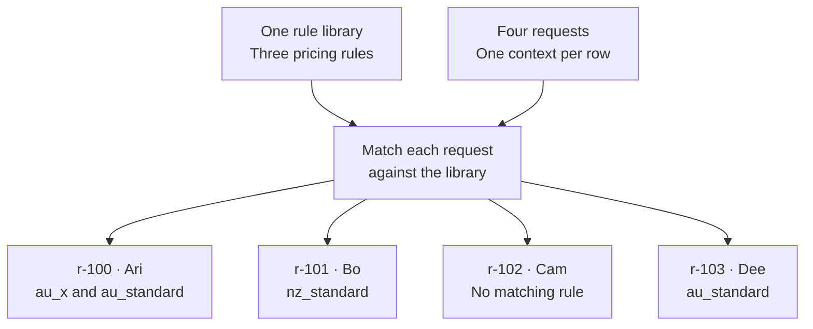
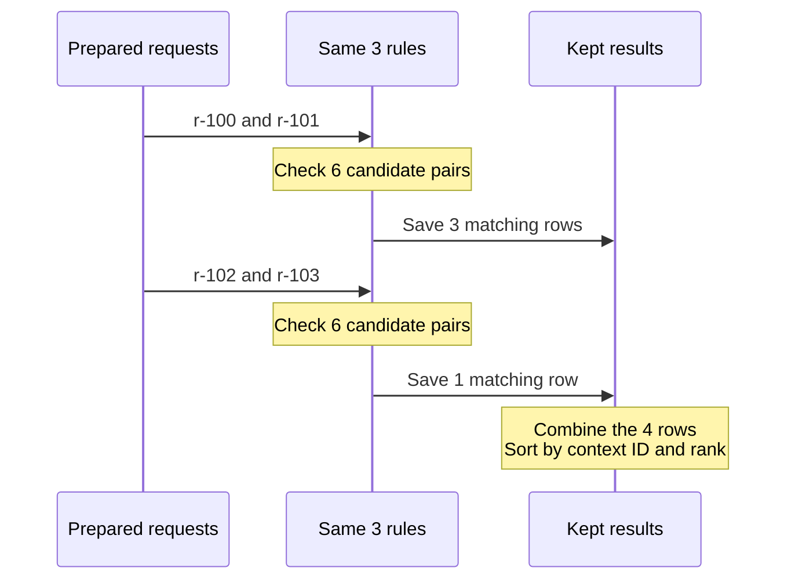

# Chapter 6: Expression Engine Batch Evaluation


Suppose your rules can quote a delivery price for one order. You supply the destination and product code, and the engine finds the rules that apply. Now you have a table of orders waiting for quotes. You want to use the same rules for all of them, without mixing one order's results with another's.

That is what batch evaluation does. Each row in your input table is a **context**: the facts for one decision. The rules table stays the same; the context changes from row to row. A context can match several rules, one rule, or none.

The matching ideas are the same as for a single decision. A **dimension** is one fact that the rules compare, such as the destination region. A **match strategy** tells the engine how to compare it. An exact strategy looks for equal values; a prefix strategy asks whether a value starts with a particular string. A wildcard rule can leave a dimension unrestricted.

We will build a small quoting example, read its results, and then follow what happens inside the engine. You need Python and basic DataFrame familiarity, but you do not need to know how a cross join or a per-context rank works before starting. The examples form one Python session and use Polars to make the tables easy to inspect.

<!-- concept:113 -->
## Evaluate a table of requests

Our rule library has three rows. Each row describes when a price applies:

| Rule | Region | Product code | Price |
|---|---|---|---:|
| `au_standard` | AU | Any code | 10.00 |
| `au_x` | AU | Starts with `X-` | 8.00 |
| `nz_standard` | NZ | Any code | 12.00 |

An Australian request with an `X-` product code matches **both** Australian rules. That is intentional. We will first keep all matching rules so we can see what happened, then consider how to choose among them.

In the stored rules, `"<NA>"` represents the wildcard. It is a reserved value with matching behavior, not a product code or an ordinary label for missing text.

```python
import polars as pl
from mountainash.relations import relation
from mountainash_rules import (
    DataType,
    Dimension,
    DimensionsMetadata,
    ExpressionRulesEngine,
    HitPolicy,
    HitPolicyViolationError,
    MatchStrategy,
)

rules = pl.DataFrame({
    "rule_name": ["au_standard", "au_x", "nz_standard"],
    "region": ["AU", "AU", "NZ"],
    "code": ["<NA>", "X-", "<NA>"],
    "price": [10.0, 8.0, 12.0],
})
```

The metadata gives those columns their meaning. `region` uses exact matching, the default strategy. `code` uses prefix matching. Its `context_field` tells the engine to read `product_code` from each request, even though the rule column is named `code`. The `price` column is an output, not another condition to match.

```python
metadata = DimensionsMetadata(
    dimensions=[
        Dimension(dimension_name="region", data_type=DataType.STR),
        Dimension(
            dimension_name="code",
            match_strategy=MatchStrategy.PREFIX,
            data_type=DataType.STR,
            context_field="product_code",
        ),
    ],
    output_fields=["price"],
)
engine = ExpressionRulesEngine(rules=rules, dimension_metadata=metadata)
```

Now give the engine four requests. `request_id` will let us connect each result to the request that produced it. `customer` is useful to our application but is not a matching dimension.

```python
contexts = pl.DataFrame({
    "request_id": ["r-100", "r-101", "r-102", "r-103"],
    "region": ["AU", "NZ", "XX", "AU"],
    "product_code": ["X-1", "Z-9", "Q", "Q"],
    "customer": ["Ari", "Bo", "Cam", "Dee"],
})
```

Before running anything, we can work out the matches. Ari's request matches both Australian rules. Bo's matches the New Zealand rule. No rule covers Cam's region, `XX`. Dee's request matches the Australian standard rule, but its code does not begin with `X-`.

The diagram keeps those four decisions separate. Every request uses the same rule library, but each produces its own group of matches:



Call `evaluate_batch()` once with the complete table:

```python
batch = engine.evaluate_batch(contexts, context_id_field="request_id")
rows = relation(batch.survivors).to_polars()
print(rows.select("__context_id", "rule_name", "price"))
```

The selected columns contain:

| `__context_id` | `rule_name` | `price` |
|---|---|---:|
| r-100 | au_x | 8.0 |
| r-100 | au_standard | 10.0 |
| r-101 | nz_standard | 12.0 |
| r-103 | au_standard | 10.0 |

We have not asked the engine to choose one price yet. The default policy, `COLLECT`, keeps all matches. The order within each request is meaningful; we will explain why `au_x` comes first when we reach ranking.

`relation()` wraps the returned table in Mountainash's common table interface. Here, `to_polars()` makes the result a Polars DataFrame for display. It does not run the rules again.

<!-- concept:112 -->
## Read the result as a batch

The object returned by `evaluate_batch()` is a `BatchRuleResult`. Its `survivors` table contains the rows kept after matching and any requested selection or filtering. Each row represents one **request–rule pair**, not one request.

That explains why four input requests can produce four output rows even though one request matched nothing: Ari contributes two rows, Bo and Dee contribute one each, and Cam contributes none. `batch.count` counts output rows. It is not a count of requests.

```python
print(batch.count)
print(batch.matched_context_ids)
print(batch.unmatched_context_ids(contexts))
```

```text
4
['r-100', 'r-101', 'r-103']
['r-102']
```

To count the kept rows for each matched request, use `counts_per_context`. Its `__n` column holds the count:

```python
counts = relation(batch.counts_per_context).to_polars().sort("__context_id")
print(counts)
```

| `__context_id` | `__n` |
|---|---:|
| r-100 | 2 |
| r-101 | 1 |
| r-103 | 1 |

There is no zero-count row for Cam in this table. `unmatched_context_ids(contexts)` finds that missing request by comparing the result with the original input.

Keep that original input. The result does not store a full copy of it, and cannot prove that a different table you pass later is the one you evaluated. Also, these accessors describe **kept results**: if you deliberately filter away a request's matches, it becomes unmatched from the result's point of view. That does not prove that no rule matched it before filtering.

The output always uses `__context_id`, even when your input field has another name. `batch.context_id_field` remembers the input name, `"request_id"`. Other input columns, such as `customer`, are not copied into every result row. When you need them, join the result back to your input:

```python
labelled = rows.join(
    contexts.select("request_id", "customer"),
    left_on="__context_id",
    right_on="request_id",
    how="left",
).sort("__context_id", "__rank")
print(labelled.select("customer", "rule_name", "price"))
```

Ari appears twice because two rules were kept. This join adds the customer name; it does not turn a list of possible prices into a single quote.

<!-- concept:114 -->
## Keep each context identifiable

A context identifier answers a simple question: *which input row does this result belong to?* It matters because a request can produce more than one output row, and requests with no kept matches disappear from the survivor table.

When you supply `context_id_field`, that column must exist and every identifier must be non-null and unique across the **whole input**, not merely within a chunk. A repeated identifier would make two different requests look like one decision. The engine rejects it before evaluation.

If you omit `context_id_field`, the engine assigns zero-based row positions: `0`, `1`, `2`, and so on. Those identifiers are convenient for an unchanged table, but they are not permanent request IDs. Sorting or filtering the original input afterwards changes what those positions mean.

### What the engine keeps from the input

Before matching, the engine makes a smaller table containing the identifier and the facts used by the active dimensions. For our example, its columns are:

```text
__context_id | __ctx_region | __ctx_code
```

This preparation is called a **projection**: selecting the columns the calculation needs. `product_code` becomes `__ctx_code` because `code` is the dimension's name. The `customer` column is left out.

The `__ctx_` prefix keeps context values separate from rule values. During matching, the engine needs both the rule's region and the request's region in the same row. Giving the context column a distinct name prevents one from being mistaken for the other.

You do not create these columns yourself or call the private preparation helper. `evaluate_batch()` does that work. In your input tables, avoid names beginning with `__ctx_` or `__t_`, and the reserved names `__context_id`, `__global_idx`, `__grp_base`, `__rule_index`, `__rank`, `__specificity`, and `__survived`. The engine rejects collisions even if the offending column would otherwise be unused.

### Missing facts are not necessarily false facts

A missing request ID is an error, but a missing matching value has a different meaning. For most declared types, the engine represents an absent fact using that type's `NOT_SET` sentinel. A missing string, for example, becomes `"<NOT_SET>"`. The chosen match strategy then decides what to do with it.

That distinction matters for Boolean values. If you do not know whether someone is a member, substituting `False` would invent an answer. A Boolean dimension has no spare in-band sentinel, so the engine preserves absence as a nullable Boolean. It does this for both a null cell and an entirely absent Boolean column.

Here is a small separate rule library to make the distinction visible:

```python
member_engine = ExpressionRulesEngine(
    rules=pl.DataFrame({
        "rule_name": ["member", "non_member"],
        "is_member": [True, False],
    }),
    dimension_metadata=DimensionsMetadata(dimensions=[
        Dimension(dimension_name="is_member", data_type=DataType.BOOL),
    ]),
)
member_contexts = pl.DataFrame({
    "request_id": ["missing", "no"],
    "is_member": pl.Series([None, False], dtype=pl.Boolean),
})
member_batch = member_engine.evaluate_batch(
    member_contexts, context_id_field="request_id",
)
print(relation(member_batch.survivors).to_polars().select(
    "__context_id", "rule_name", "__t_is_member",
))
```

| `__context_id` | `rule_name` | `__t_is_member` |
|---|---|---:|
| missing | member | 0 |
| missing | non_member | 0 |
| no | non_member | 1 |

The generated `__t_is_member` column records the comparison: `0` means unknown and `1` means a definite match. With no membership fact, neither rule can be ruled out, so both remain. With the explicit value `False`, only `non_member` remains.

Do not generalize this into “missing values always pass.” The strategy controls the outcome. In particular, a strict `CONTEXT_REGEX` validator rejects a non-concrete context rather than treating it as unknown. If a decision requires complete input, make that requirement part of your validation or rule design.

<!-- concept:115 -->
## Understand the work behind a batch

The engine needs to compare every request with every rule. A **cross join** constructs those pairs. With four requests and three rules, there are twelve candidate pairs before matching removes anything.

Our example produces this small comparison grid:

| Request | `au_standard` | `au_x` | `nz_standard` |
|---|---|---|---|
| r-100: AU, X-1 | Match | Match | Reject |
| r-101: NZ, Z-9 | Reject | Reject | Match |
| r-102: XX, Q | Reject | Reject | Reject |
| r-103: AU, Q | Match | Reject | Reject |

“Candidate” means a pair to check, not a pair that already matches. The engine adds the request's facts to each pair, evaluates the dimension expressions, and drops pairs with a contradiction. It performs these operations on tables rather than calling Python's single-context method once per input row.

Each dimension produces a ternary value:

| Value | Meaning for this comparison |
|---|---|
| `1` | The rule definitely matches this fact. |
| `0` | The comparison is unknown or the rule leaves it unrestricted. |
| `-1` | The rule contradicts this fact. |

A pair survives only when **every** active dimension is non-negative. One `-1` is enough to reject it; a definite match on another dimension cannot cancel that contradiction. The current implementation combines the per-dimension `>= 0` checks with Boolean AND.

A surviving pair's **specificity** is the number of dimensions with a definite match, `1`. Wildcards can keep a rule in consideration, but they do not increase that score.

For Ari's request, `au_x` matches both region and code, so its specificity is two. `au_standard` matches the region but leaves the code unrestricted, so its specificity is one. This explains a useful result property: a broad fallback and a more specific rule can both survive without being equally specific.

Batching should not change those comparisons. We can check our first request against an ordinary single-context evaluation:

```python
single = engine.evaluate({"region": "AU", "product_code": "X-1"})
columns = ["rule_name", "__specificity", "__rank"]
from_batch = rows.filter(pl.col("__context_id") == "r-100").select(columns)
from_single = relation(single.survivors).to_polars().select(columns)
assert from_batch.equals(from_single)
```

The assertion compares rule names, scores and ranks under the same policy and filters. It says nothing about execution speed. A batch changes how the work is arranged, not the meaning of a match.

<!-- concept:116 -->
## Rank matches within each request

Ranking answers which kept rule comes first **for one context**. Ari's best match should not push Bo's best match into second place merely because they share an output table.

Under `COLLECT`, the engine sorts each context's matches by specificity, highest first. Original rule order breaks ties. Ranks start at one separately for each context:

```python
print(rows.select("__context_id", "rule_name", "__specificity", "__rank"))
```

| Context | Rule | Specificity | Rank |
|---|---|---:|---:|
| r-100 | au_x | 2 | 1 |
| r-100 | au_standard | 1 | 2 |
| r-101 | nz_standard | 1 | 1 |
| r-103 | au_standard | 1 | 1 |

`batch.best_matches` gives one row per context with kept matches, choosing its lowest remaining rank. For this unfiltered result, those are all rank-one rows:

```python
best = relation(batch.best_matches).to_polars()
print(best.select("__context_id", "rule_name", "price"))
```

| Context | Rule | Price |
|---|---|---:|
| r-100 | au_x | 8.0 |
| r-101 | nz_standard | 12.0 |
| r-103 | au_standard | 10.0 |

“Best” follows the policy's ordering. It does not mean lowest price: price happens to be lower for Ari's more specific rule, but `COLLECT` did not compare the prices.

### Choosing and filtering are different operations

A **hit policy** tells the engine how to order matches, whether certain combinations are invalid, and whether to keep all matches or a single one. The policy applies independently to every context.

| Policy | What it does for each context |
|---|---|
| `COLLECT` | Orders by specificity, then rule order; keeps all matches unless filtered. |
| `UNIQUE` | Requires at most one match; multiple matches raise an error. |
| `FIRST` | Uses original rule order and keeps the first remaining match. |
| `PRIORITY` | Orders by a configured priority column descending, then specificity and rule order; keeps the first remaining match. |
| `ANY` | Requires matching rules to agree on the chosen output fields; orders by specificity and rule order, then keeps one. |
| `RULE_ORDER` | Keeps matches in original rule order without reducing them to one. |

An explicit `hit_policy` on the call takes precedence over the metadata's policy. Without either, the engine uses `COLLECT`. A policy can be supplied as an enum or its lowercase string value. `PRIORITY` requires an existing priority field. For `ANY`, our metadata explicitly identifies `price` as the output to compare; do not assume every non-matching column is necessarily a decision output.

`top_n_per_context` is a separate limit on how many ordered rows to keep. Asking for the top one does **not** prove that only one rule matched. Under `UNIQUE`, Ari's two matches remain an error even with that limit:

```python
try:
    engine.evaluate_batch(
        contexts,
        context_id_field="request_id",
        hit_policy=HitPolicy.UNIQUE,
        top_n_per_context=1,
    )
except HitPolicyViolationError as error:
    print(relation(error.offending).to_polars().select("__context_id", "__n"))
```

The offending table contains `r-100` with a count of two. Policy checks happen before result filters, so trimming the answer cannot hide an invalid decision.

### A kept rank need not be one

The `min_specificity` filter removes rows that do not have enough definite matches. The engine does not renumber the ranks afterwards. If a filter removes the original first row, the next kept row still carries its original rank.

To see this, switch to `RULE_ORDER`. Our broad `au_standard` rule comes before `au_x` in the library, so it initially has rank one. Requiring two definite matches removes that broad rule. `top_n_per_context=1` then keeps the first row **remaining after the filter**:

```python
filtered = engine.evaluate_batch(
    contexts,
    context_id_field="request_id",
    hit_policy=HitPolicy.RULE_ORDER,
    min_specificity=2,
    top_n_per_context=1,
)
print(relation(filtered.best_matches).to_polars().select(
    "__context_id", "rule_name", "__rank",
))
```

| Context | Rule | Retained rank |
|---|---|---:|
| r-100 | au_x | 2 |

`best_matches` finds this row because it chooses the minimum retained rank, not rows whose rank happens to equal one.

### How separate ranks are calculated

Inside the engine, all contexts' matches still occupy one table. The rank calculation first sorts that table by context ID and the policy's ordering keys. It then gives the sorted rows a zero-based global position and finds the first position for each context.

Subtracting a context's first position makes its numbering start at zero. Adding one gives its public rank:

```text
rank = global position - first position for this context + 1
```

For our unfiltered result:

| Context | Rule | Global position | Context's first position | Rank |
|---|---|---:|---:|---:|
| r-100 | au_x | 0 | 0 | 1 |
| r-100 | au_standard | 1 | 0 | 2 |
| r-101 | nz_standard | 2 | 2 | 1 |
| r-103 | au_standard | 3 | 3 | 1 |

The implementation uses a sort, row index, grouped minimum, join and subtraction rather than a backend-specific window-ranking function. Temporary columns `__global_idx` and `__grp_base` hold the two positions and are removed before you receive the result. Applications use `__rank`; they do not need to recreate this calculation.

<!-- concept:117 -->
## Use compatible table backends

A DataFrame backend is the library or execution system performing the table operations. Our examples use Polars for both rules and contexts. A cross join needs both tables in a compatible form, so the engine converts prepared contexts to suit the rules table before joining them. The source calls this **backend conforming**.

The conversion happens after context preparation. It changes the table representation, not which input fields the dimensions use. The current helper chooses these forms:

| Rules backend detected | Conversion of prepared contexts |
|---|---|
| Ibis | `to_ibis()` |
| Narwhals/Pandas backed by Pandas | `to_pandas()` |
| Other Narwhals cases or the Polars path | `to_polars()` |

The helper uses Mountainash's backend detection and conversion interfaces. That keeps backend-specific decisions out of the matching and ranking expressions.

This conversion is useful, but it is not proof that every strategy works on every possible backend. Check the strategies and backend used by your application. The executable examples in this chapter verify the Polars path; they do not establish an Ibis or Pandas compatibility matrix.

<!-- concept:118 -->
## Work in smaller chunks

A cross join's size grows with both inputs. Four contexts and three rules produce twelve candidate pairs. Ten thousand contexts and two thousand rules would produce twenty million pairs before filtering. The final answer may be small even when that intermediate table is large.

`chunk_size` limits how many contexts enter one cross join. The engine prepares the complete input first, assigns or validates its IDs, and then evaluates consecutive slices. With our four requests and `chunk_size=2`, it processes two slices:



Read the diagram from top to bottom. Each chunk uses the same matching, ranking and policy checks, and its kept rows accumulate on the right. The last step combines the results; it does not rank requests against one another.

```python
chunked = engine.evaluate_batch(
    contexts,
    context_id_field="request_id",
    chunk_size=2,
)
chunked_rows = relation(chunked.survivors).to_polars()
key = ["__context_id", "__rank"]
assert rows.sort(key).equals(chunked_rows.sort(key))
```

Generated IDs also stay consistent across chunks. They are assigned before slicing, so the second chunk does not start again at zero:

```python
positional_contexts = contexts.drop("request_id")
positional = engine.evaluate_batch(positional_contexts, chunk_size=2)
print(positional.matched_context_ids)
print(positional.unmatched_context_ids(positional_contexts))
```

```text
[0, 1, 3]
[2]
```

With generated IDs, keep the original row order and count when asking for unmatched contexts.

Chunking reduces the size of each cross join, but it is **not streaming**. The engine still prepares the whole context table, converts it to Polars for slicing, and retains result frames until it combines them. Choose a chunk size with both the number of rules and the likely number of matches in mind. Smaller chunks also mean more repeated table operations; this example makes no claim that they run faster.

### Errors can span several chunks

If one chunk has an ambiguous decision, another chunk may have one too. For `HitPolicyViolationError` from `UNIQUE` or `ANY`, the engine gathers the offending contexts across chunks and raises a combined error rather than stopping at the first one.

Here, requests `a` and `d` both match the two Australian rules, but they fall in different chunks:

```python
ambiguous = pl.DataFrame({
    "request_id": ["a", "b", "c", "d"],
    "region": ["AU", "NZ", "XX", "AU"],
    "product_code": ["X-1", "Z-9", "Q", "X-2"],
})
try:
    engine.evaluate_batch(
        ambiguous,
        context_id_field="request_id",
        hit_policy=HitPolicy.UNIQUE,
        chunk_size=2,
    )
except HitPolicyViolationError as error:
    print(relation(error.offending).to_polars().select("__context_id", "__n"))
```

| `__context_id` | `__n` |
|---|---:|
| a | 2 |
| d | 2 |

Use the `offending` table when handling the error programmatically. The readable message lists sorted context IDs, but limits that list to the first twenty with a truncation note when necessary. The offending data is not limited to those twenty IDs.

### An empty batch still has a result shape

An empty input is different from a request that matched nothing. There are no decisions to make, but the engine still returns an empty result with its normal identifying and ranking columns. You can continue using the result accessors:

```python
empty_contexts = contexts.head(0)
empty = engine.evaluate_batch(
    empty_contexts, context_id_field="request_id", chunk_size=2,
)
print(empty.count)
print(empty.matched_context_ids)
print(empty.unmatched_context_ids(empty_contexts))
```

```text
0
[]
[]
```

The `.head(0)` input retains the declared column types. An empty schema-bearing table is a clearer input than a newly constructed table with no columns.

<!-- concept:119 -->
## Inspect one context without evaluating it again

Batch processing does not force the rest of your application to handle every result at once. `for_context()` extracts one context's kept rows and returns a `RuleResult`, the same result type used for single-context evaluation. It reads the stored answer; it does not run matching again.

```python
one = batch.for_context("r-100")
print(one.count)
print(one.explain("au_standard"))
```

```text
2
{'region': 1, 'code': 0}
```

The explanation confirms our earlier reasoning: the standard rule definitely matches AU, while its wildcard code contributes an unknown rather than a second definite match. `one.best_match` returns the highest-ranked kept rule for Ari, `au_x`.

By default, batch results retain generated `__t_<dimension>` columns, which hold these explanations. Setting `include_observability=False` removes those columns. That can make the output smaller, but you then cannot use the stored result to explain dimension outcomes; evaluate again with observability enabled if you need them. Temporary `__ctx_` columns and the survival flag are removed in either case.

### An empty view cannot prove that an ID was submitted

Both an unmatched ID and an ID that was never in the input produce an empty `RuleResult`:

```python
print(batch.for_context("r-102").count)
print(batch.for_context("never-submitted").count)
```

```text
0
0
```

The result stores kept rows, not an independent register of submitted requests. Use the original input to distinguish those cases. `unmatched_context_ids(contexts)` answers which submitted IDs are absent from the kept results.

### Keep the complete result if you want to reconsider a policy

A complete collecting result retains the candidates needed to apply another policy. For example, selecting `FIRST` from Ari's full result chooses `au_standard`, because that policy follows the rule table's original order:

```python
first = one.select(HitPolicy.FIRST)
print(relation(first.best_match).to_polars()["rule_name"].to_list())
```

```text
['au_standard']
```

A filtered or single-winner result may already have discarded the rows another policy needs. Extracting one context does not restore them. Its selection metadata preserves that limitation, and `select()` raises `ValueError` rather than choosing from an incomplete basis. This restriction also applies to an empty view extracted from a potentially truncated batch.

If you need to reconsider such a decision, evaluate again without the earlier filters, or keep a separate complete collecting result for that purpose. A filter of zero is still a filter: `top_n_per_context=0` deliberately keeps no rows, so every submitted context appears unmatched in that returned result.

## Choose the controls you need

The main workflow is still one call. This version keeps at most one sufficiently specific match per request, processes two contexts at a time, and retains the columns needed for explanations:

```python
quotes = engine.evaluate_batch(
    contexts,
    context_id_field="request_id",
    hit_policy=HitPolicy.COLLECT,
    min_specificity=1,
    top_n_per_context=1,
    chunk_size=2,
    include_observability=True,
)
print(relation(quotes.best_matches).to_polars().select(
    "__context_id", "rule_name", "price",
))
print("Requests without a kept quote:", quotes.unmatched_context_ids(contexts))
```

The three quotes are 8.0 for `r-100`, 12.0 for `r-101`, and 10.0 for `r-103`. The unmatched list is `['r-102']`. Because we imposed filters, this `quotes` result is for consumption, not for reapplying a different policy with `select()`.

The remaining input rules are worth keeping close at hand:

| Control | Accepted form |
|---|---|
| `dimensions` | `None` for all compiled dimensions, or a nonempty list of distinct dimension-name strings. Unknown well-formed names raise `KeyError`; an empty list or malformed selection raises `ValueError`. |
| `top_n_per_context` | `None` or a non-Boolean Python integer greater than or equal to zero. |
| `min_specificity` | `None` or a non-Boolean Python integer greater than or equal to zero. |
| `chunk_size` | `None` or a non-Boolean Python integer greater than or equal to one. |
| `context_id_field` | `None` for generated IDs, or a nonempty string naming a present, non-null, globally unique input column. |

When metadata is attached, `ANY` can use explicit output fields or infer them. An inferred empty output set becomes an error when multiple rules survive for a context and need comparison. An expressions-only engine must declare its output fields before using `ANY`. An unknown policy string raises `ValueError` rather than silently falling back to collection.

The useful mental model is a set of separate decisions sharing one rule library. Context IDs connect those decisions to your input. Matching determines which pairs survive, policy determines their order and validity, and filters determine what you keep. Chunking changes how much matching work happens at once without changing those meanings.

## Source and further reading

The chapter's examples and described behavior were checked against Rules source [`730a858`](https://github.com/mountainash-io/mountainash-rules/tree/730a8583ee9d4fd6b52dc5350699eb66cc7487e9), using Python 3.12 and Polars 1.44.2. The implementations are [`evaluate_batch()` and its helpers](https://github.com/mountainash-io/mountainash-rules/blob/730a8583ee9d4fd6b52dc5350699eb66cc7487e9/src/mountainash_rules/engines/filter/engine.py), [`BatchRuleResult`](https://github.com/mountainash-io/mountainash-rules/blob/730a8583ee9d4fd6b52dc5350699eb66cc7487e9/src/mountainash_rules/core/batch_result.py), and [`RuleResult`](https://github.com/mountainash-io/mountainash-rules/blob/730a8583ee9d4fd6b52dc5350699eb66cc7487e9/src/mountainash_rules/core/result.py).

For related workflows, read [single-context evaluation](../04-expression-rules-engine/index.md), [hit policies and result explanations](../05-expression-results-and-policies/index.md), [expression execution internals](../09-expression-engine-internals/index.md), and [extension work](../11-extending-and-maintaining/index.md).
