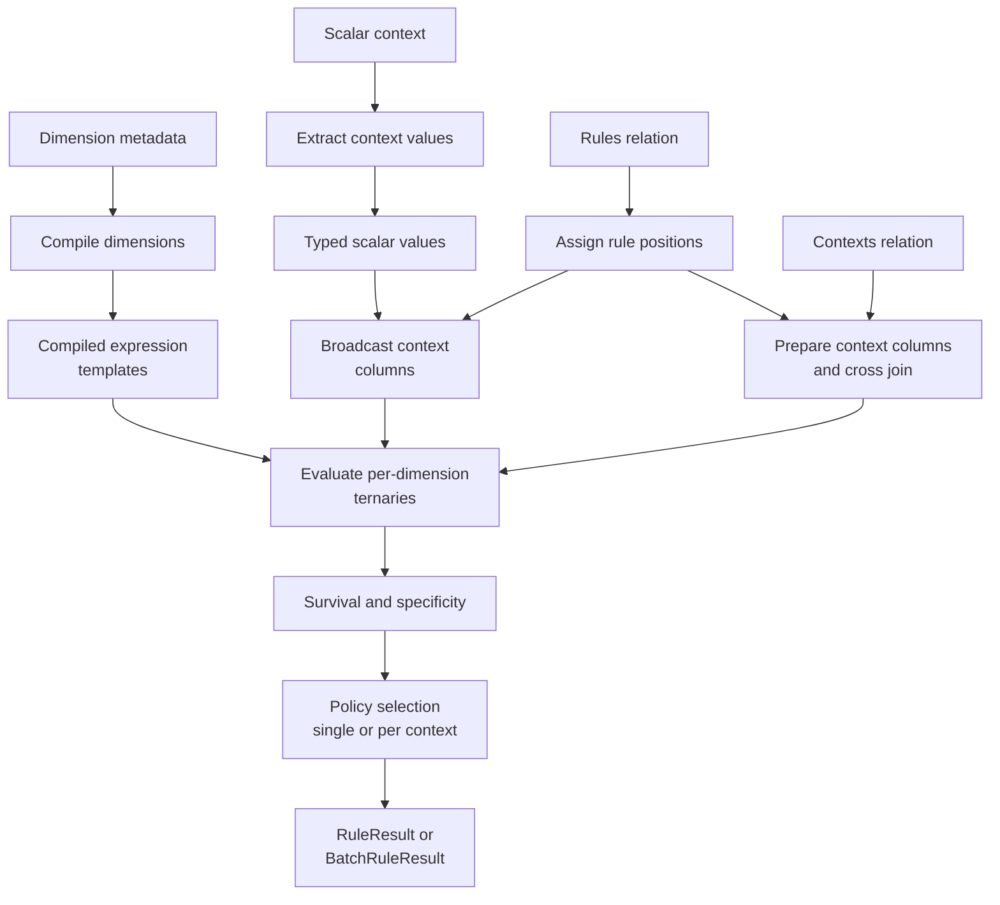

# Chapter 6: Inside Expression and Batch Evaluation

Chapters 1 through 5 taught the observable contract of the filter and accumulator engines: rule tables authored with [`Dimension`](../02-authoring-rule-libraries/index.md) metadata, evaluated with [`ExpressionRulesEngine.evaluate()`](../03-evaluating-decisions/index.md), selected with a [`HitPolicy`](../03-evaluating-decisions/index.md), and scaled with [`evaluate_batch()`](../04-scoring-batches/index.md). None of that required knowing how a `MatchStrategy` becomes a runnable computation, or how a Python dict of context values ends up compared against a rules `DataFrame`.

This chapter answers exactly that, for maintainers, contributors and anyone auditing the backend-portability guarantees the earlier chapters promised. It traces the real code path across five modules: `src/mountainash_rules/core/compiler.py`, `src/mountainash_rules/core/context.py`, `src/mountainash_rules/core/constants.py`, `src/mountainash_rules/core/hit_policy.py`, and `src/mountainash_rules/engines/filter/engine.py` — all at commit [`94659bb`](https://github.com/mountainash-io/mountainash-rules/blob/94659bb0c096485c87d329f09e944577427f129f). Every example below builds on the [Mountainash Expressions and Relations](../01-rule-tables-and-decisions/index.md) abstractions and the [ternary logic](../01-rule-tables-and-decisions/index.md) already introduced in Chapter 1; this chapter does not re-derive what a ternary outcome means, only how the engine produces one.

## Pipeline overview

The diagram below traces one context (or one batch of contexts) from metadata compilation through to a selected result. The left branch compiles once, at engine construction; the right branches bind fresh context values on every call. Both binding paths feed the same compiled expressions.



The rest of the chapter walks this diagram left to right: compilation, then binding, then the six strategy families that compilation dispatches to, then the evaluation and selection steps that turn bound, compiled expressions into a returned result.

The worked examples form one continuing Python session. Set it up once:

```python
import datetime

import polars as pl

from mountainash_rules import (
    Dimension,
    DimensionsMetadata,
    DataType,
    MatchStrategy,
    HitPolicy,
    ExpressionRulesEngine,
    DimensionCompiler,
)

# The next three imports reach into mountainash_rules.core directly. They are
# not part of the public mountainash_rules API (they do not appear in
# mountainash_rules.__all__); they are used here only to inspect the
# implementation from the maintainer's side of the boundary.
from mountainash_rules.core.constants import (
    CTX_PREFIX,
    UNKNOWN,
    NOT_SET,
    sentinels_for,
    unknown_sentinel_for,
    not_set_sentinel_for,
)
from mountainash_rules.core.context import extract_context_values
from mountainash_rules.core.hit_policy import selection_info_from_metadata

metadata = DimensionsMetadata(
    dimensions=[
        Dimension(
            dimension_name="region",
            match_strategy=MatchStrategy.EXACT,
            data_type=DataType.STR,
        ),
        Dimension(
            dimension_name="age",
            match_strategy=MatchStrategy.RANGE,
            data_type=DataType.INT,
            range_min_field="age_min",
            range_max_field="age_max",
        ),
        Dimension(
            dimension_name="sku",
            match_strategy=MatchStrategy.PREFIX,
            data_type=DataType.STR,
        ),
        Dimension(
            dimension_name="channel",
            match_strategy=MatchStrategy.SET_MEMBERSHIP,
            data_type=DataType.STR,
        ),
        Dimension(
            dimension_name="spend",
            match_strategy=MatchStrategy.GREATER_THAN,
            data_type=DataType.FLOAT,
        ),
        Dimension(
            dimension_name="is_vip",
            match_strategy=MatchStrategy.EXACT,
            data_type=DataType.BOOL,
        ),
    ],
)

rules_df = pl.DataFrame({
    "rule_name": ["specific", "fallback"],
    "region": ["AU", unknown_sentinel_for(DataType.STR)],
    "age_min": [18, unknown_sentinel_for(DataType.INT)],
    "age_max": [65, unknown_sentinel_for(DataType.INT)],
    "sku": ["ELEC-", unknown_sentinel_for(DataType.STR)],
    "channel": [["web", "app"], None],
    "spend": [100.0, float(unknown_sentinel_for(DataType.FLOAT))],
    "is_vip": [True, None],
})

engine = ExpressionRulesEngine(rules=rules_df, dimension_metadata=metadata)
active_dims = [d.dimension_name for d in metadata.dimensions]

context = {
    "region": "AU",
    "age": 30,
    "sku": "ELEC-1234",
    "channel": "web",
    "spend": 250.0,
    "is_vip": True,
}
```

`fallback` is deliberately built entirely from wildcard sentinels: an unknown region, an unknown age range, an unknown SKU prefix, a null (wildcard) channel list, an unknown spend threshold, and a null (wildcard) VIP flag. It is the catch-all row every strategy family below has to treat as "don't care" rather than "no match."

## From metadata to expression trees

### DimensionCompiler

<!-- concept:31 -->

`DimensionCompiler` turns dimension metadata into `BaseExpressionAPI` computation trees. It has no constructor arguments or persistent instance state: compilation derives expressions from the method arguments. The class groups thirteen strategy dispatch targets and two shared helpers, `_compile_bool_ternary` and `_compile_string_match`.

Two public methods form the whole interface:

```text
def compile_dimensions(self, metadata: DimensionsMetadata) -> dict[str, BaseExpressionAPI]:
    """Compile all dimensions in a metadata set to expression templates."""
    return {
        dim.dimension_name: self.compile_dimension(dim)
        for dim in metadata.dimensions
    }

def compile_dimension(self, dim: Dimension) -> BaseExpressionAPI:
    """Compile a single dimension to an expression template."""
    match dim.match_strategy:
        case MatchStrategy.EXACT:
            return self._compile_exact(dim)
        case MatchStrategy.EXACT_KEY:
            return self._compile_exact_key(dim)
        case MatchStrategy.RANGE:
            return self._compile_range(dim)
        case MatchStrategy.REGEX:
            return self._compile_regex_per_row(dim)
        case MatchStrategy.CONTEXT_REGEX:
            return self._compile_context_regex(dim)
        case MatchStrategy.NOT_EQUAL:
            return self._compile_not_equal(dim)
        case MatchStrategy.GREATER_THAN:
            return self._compile_greater_than(dim)
        case MatchStrategy.LESS_THAN:
            return self._compile_less_than(dim)
        case MatchStrategy.PREFIX:
            return self._compile_prefix(dim)
        case MatchStrategy.SUFFIX:
            return self._compile_suffix(dim)
        case MatchStrategy.CONTAINS:
            return self._compile_contains(dim)
        case MatchStrategy.SET_MEMBERSHIP:
            return self._compile_set_membership(dim)
        case MatchStrategy.SET_EXCLUSION:
            return self._compile_set_exclusion(dim)
        case _:
            raise ValueError(f"Unknown match strategy: {dim.match_strategy}")
```

`compile_dimension` dispatches over all thirteen `MatchStrategy` members. The sections below group them into six strategy families for explanation, not six identical expression-tree shapes. `PREFIX`, `SUFFIX` and `CONTAINS` share a wrapper; the two regex strategies obtain their patterns differently. `NOT_EQUAL` is a close variant of `EXACT`. `EXACT_KEY`, discussed alongside exact matching, is structurally different: it uses raw columns and an explicit conditional rather than `t_col`, with a rule-side UNKNOWN wildcard only.

On the metadata construction path, `ExpressionRulesEngine.__init__` calls `compile_dimensions` and stores its results as `self._expressions`. Calls to `evaluate()`, `explain()` and `evaluate_batch()` reuse those objects. The advanced construction path accepts expressions compiled by the caller instead, as Chapter 3 explains:

```python
compiler = DimensionCompiler()
region_dim = metadata.get_dimension("region")
region_expr = compiler.compile_dimension(region_dim)

standalone = compiler.compile_dimensions(metadata)
assert list(standalone.keys()) == active_dims
assert list(engine._expressions.keys()) == active_dims
```

(`engine._expressions` is a private attribute; reaching into it here is purely to demonstrate that the constructor's compiled dictionary is exactly what `compile_dimensions` produces on its own — application code never needs to touch it.)

### Sentinel-Aware Ternary

<!-- concept:38 -->

Every compiled expression has to answer three questions for each rule row: does it hard-match the context (`1`), hard-fail (`-1`), or does the dimension not constrain this rule at all (`0`, the ternary-unknown "don't care")? `compile_dimension` implements that third answer with one of two mechanisms, and which mechanism a strategy uses is a direct consequence of what kind of value the underlying comparison operates on.

**Column-level sentinel awareness.** `ma.t_col(field, unknown={...})` declares that specific literal values in a column are not real data — they are the rule-side wildcard (`UNKNOWN`) or the context-side missing-value marker (`NOT_SET`) — and every ternary operator applied to that column (`t_eq`, `t_ne`, `t_gt`, `t_lt`, `t_le`, `t_ge`, `t_is_in`, `t_is_not_in`) automatically returns `0` whenever either operand carries one of those values. `sentinels_for(data_type)` (`core/constants.py`) selects which set applies:

```python
assert sentinels_for(DataType.STR) == {"<NA>", "<NOT_SET>"}
assert sentinels_for(DataType.INT) == {-999999999, -999999998}
assert sentinels_for(DataType.FLOAT) == {-999999999, -999999998}
assert sentinels_for(DataType.DATE) == {
    datetime.date(1, 1, 1), datetime.date(1, 1, 2),
}
assert sentinels_for(DataType.DATETIME) == {
    datetime.datetime(1, 1, 1), datetime.datetime(1, 1, 2),
}
```

There are exactly four sentinel families — string, numeric (shared by `INT` and `FLOAT`), date, and datetime — because `DataType.is_numeric` and `DataType.is_temporal` group the six declared data types that way. The two members of each set are always the rule-side wildcard (`unknown_sentinel_for`) and the context-side missing-value marker (`not_set_sentinel_for`); a `t_col` reference does not need to know which one is present in a given row, because both collapse to the same `0`.

**Expression-level sentinel awareness.** A raw string comparison returns a Boolean, so the compiler wraps it in an explicit conditional: check the rule-side sentinel first and return `0`; otherwise map the comparison's result to `1` or `-1`. The string and per-row regex wrappers do not perform the same sentinel check on the context column.

Both mechanisms return the same integer encoding, but they do not classify every input identically. `t_col` comparisons recognize configured sentinels on either operand; raw string wrappers inspect the rule sentinel and compare the bound context literally. The strategy sections below make those differences explicit.

### Context Value Extraction

<!-- concept:39 -->

Before any compiled expression can run, every dimension needs a concrete value from the caller's context. `extract_context_values` (`core/context.py`) is the function that turns a Pydantic model or a dict into a plain `dict[str, Any]` keyed by dimension name, one value or sentinel per active dimension:

```text
def extract_context_values(
    context: BaseModel | dict,
    dimension_names: list[str],
    metadata: DimensionsMetadata | None = None,
) -> dict[str, t.Any]:
    if isinstance(context, BaseModel):
        raw = context.model_dump()
    elif isinstance(context, dict):
        raw = context
    else:
        raise TypeError(f"Context must be a BaseModel or dict, got {type(context).__name__}")

    result: dict[str, t.Any] = {}
    for name in dimension_names:
        dim = metadata.get_dimension(name) if metadata is not None else None
        field = dim.resolved_context_field if dim is not None else name
        value = raw.get(field)
        if value is None:
            if dim is not None and dim.data_type is DataType.BOOL:
                result[name] = None  # bool don't-care is null, not a sentinel
            elif dim is not None:
                result[name] = not_set_sentinel_for(dim.data_type)
            else:
                result[name] = NOT_SET
        else:
            result[name] = value
    return result
```

Three behaviors are worth tracing explicitly:

1. **Field resolution uses `resolved_context_field`**, so a dimension whose `context_field` differs from its `dimension_name` (Chapter 2's field-resolution mechanism) still reads the right key out of the raw dict or model dump — but the returned dict is always keyed by `dimension_name`.
2. **`raw.get(field)` cannot distinguish "key absent" from "key present with value `None`"** — both produce `value is None` and take the same branch. A caller who passes `{"channel": None}` gets exactly the same substitution as a caller who omits `"channel"` entirely.
3. **Bool dimensions get Python `None`, not a string or numeric sentinel.** Every other data type substitutes a real, type-correct value from `not_set_sentinel_for` so the value can sit in a typed `DataFrame` column; bool has no equivalent because `_compile_bool_ternary` (used by `EXACT`/`NOT_EQUAL` on `BOOL` dimensions) checks nullness directly rather than membership in a sentinel set.

```python
values = extract_context_values(context, active_dims, metadata=metadata)
assert values == context  # every field present, nothing substituted

partial_context = {
    "region": "AU", "age": 30, "sku": "ELEC-1234",
    "spend": 250.0, "is_vip": None,
}  # channel omitted entirely
partial_values = extract_context_values(partial_context, active_dims, metadata=metadata)
assert partial_values["channel"] == NOT_SET       # STR dimension: string sentinel
assert partial_values["is_vip"] is None           # BOOL dimension: null, not a sentinel
assert partial_values["region"] == "AU"           # present values pass through unchanged

# Without metadata, resolution falls back to dimension_name and a bare NOT_SET
# for every missing field, regardless of the dimension's real data type:
no_meta = extract_context_values({"region": None}, ["region"])
assert no_meta == {"region": NOT_SET}
```

## Bind contexts through temporary columns

### Context Binding Phase

<!-- concept:44 -->

Compiled expressions reference existing rule columns and context columns that binding must create. Single-context binding broadcasts values from the dictionary returned by `extract_context_values`. Batch binding instead projects and normalizes the caller's contexts relation directly, then joins it to the rules. Both paths use the same column names, but their missing-Boolean handling differs at this revision.

**Single-context binding** happens in `_scored_relation`, called from both `evaluate()` and `explain()`. Every context value is a Python scalar, so binding is a broadcast literal — one value repeated down every rule row:

```text
def _scored_relation(self, active_dims, context_values):
    self._validate_set_rules_once()
    rel = relation(self._rules)
    self._check_reserved(rel, "Rules")
    rel = rel.with_row_index(name="__rule_index")

    ctx_columns = [
        ma.lit(value).alias(f"{CTX_PREFIX}{name}")
        for name, value in context_values.items()
    ]
    rel = rel.with_columns(*ctx_columns)
    ...
```

**Batch binding** happens in `_prepare_contexts`, called from `evaluate_batch()`. It projects one `__context_id` column and one context column per active dimension, filling missing values with the result of `not_set_sentinel_for`. Existing columns are coalesced against that value; absent columns become literals. This is relation-level work, not a call to `extract_context_values`:

```text
def _prepare_contexts(self, contexts, active_dims, context_id_field):
    rel = relation(contexts)
    self._check_reserved(rel, "Contexts")
    ...
    available = set(rel.columns)
    ctx_exprs: list[t.Any] = [ma.col("__context_id")]
    for name in active_dims:
        dim = self._metadata.get_dimension(name) if self._metadata else None
        field = dim.resolved_context_field if dim is not None else name
        sentinel = (
            not_set_sentinel_for(dim.data_type) if dim is not None else NOT_SET
        )
        alias = f"{CTX_PREFIX}{name}"
        if field in available:
            ctx_exprs.append(ma.coalesce(ma.col(field), ma.lit(sentinel)).alias(alias))
        else:
            ctx_exprs.append(ma.lit(sentinel).alias(alias))
    return rel.select(*ctx_exprs)
```

The prepared contexts relation is then cross-joined with the rules. Every candidate pair carries the rule columns and the context columns expected by the compiled expressions. Numeric, string and temporal sentinel families follow the helper's declared types. Boolean handling needs a separate warning: scalar extraction uses `None` for missing Boolean input, but batch preparation uses the string `"<NOT_SET>"`.

On Polars at this revision, a supplied Boolean value matches normally, while omitted or null Boolean batch values do not behave like the scalar null wildcard. This small example makes the boundary observable:

```python
bool_boundary_engine = ExpressionRulesEngine(
    rules=pl.DataFrame({"rule_name": ["yes", "no"], "flag": [True, False]}),
    dimension_metadata=DimensionsMetadata(
        dimensions=[Dimension(dimension_name="flag", data_type=DataType.BOOL)]
    ),
)
assert bool_boundary_engine.evaluate({}).count == 2
assert bool_boundary_engine.evaluate_batch(pl.DataFrame({"flag": [True]})).count == 1
assert bool_boundary_engine.evaluate_batch(pl.DataFrame({"request": [1]})).count == 0
assert bool_boundary_engine.evaluate_batch(
    pl.DataFrame({"flag": [None]}, schema={"flag": pl.Boolean})
).count == 0
```

Do not infer universal scalar/batch parity from examples whose Boolean inputs are always populated. Account for this behavior when defining the input contract of a batch workflow.

```python
context_values = extract_context_values(context, active_dims, metadata=metadata)
scored = engine._scored_relation(active_dims, context_values)  # private; illustration only
ctx_columns = sorted(c for c in scored.columns if c.startswith(CTX_PREFIX))
assert ctx_columns == sorted(f"{CTX_PREFIX}{d}" for d in active_dims)
```

### CTX_PREFIX Column Injection Pattern

<!-- concept:132 -->

`CTX_PREFIX = "__ctx_"` (`core/constants.py`) is the single string constant that both binding implementations and every strategy-family compile method agree on. A compiled expression never receives the context literal column as a parameter — it hard-codes the name `CTX_PREFIX + dim.dimension_name` when it builds its `ma.col(...)`/`ma.t_col(...)` reference, and the engine is responsible for making sure a column of that exact name exists on the relation before the expression runs. This is a naming contract, not a passed argument, and it is deliberately asymmetric with how rule columns are named:

| Column | Named by | Reason |
|---|---|---|
| Rule column | `dim.resolved_rule_field` | Must match a real, user-owned column in the rules `DataFrame` |
| Context literal | `CTX_PREFIX + dim.dimension_name` | Internal convention; always keyed by dimension name, never by `resolved_context_field` |

The prefix exists to keep injected columns out of the way of anything a caller's own rules frame might already contain — `_check_reserved` (called at the top of every scoring/binding entry point) raises `ValueError` if a caller-supplied rules or contexts frame already has a column starting with `CTX_PREFIX`, `__t_`, or matching one of the other reserved engine columns (`__rule_index`, `__context_id`, `__survived`, and so on). Because the injected columns always use `dimension_name` rather than `resolved_context_field`, a dimension whose context field differs from its rule field never creates a naming collision between the two.

The columns are also strictly temporary. `_evaluate`, `_evaluate_batch_frame`, and `explain()` all drop every `CTX_PREFIX`-prefixed column before returning — `drop_cols = [...] + [f"{CTX_PREFIX}{d}" for d in active_dims]` — so no caller of `evaluate()`, `evaluate_batch()`, or `explain()` ever sees them:

```python
result = engine.evaluate(context)
assert not any(c.startswith(CTX_PREFIX) for c in result.survivors.columns)
assert result.count == 2  # both rows survive: 'fallback' is an all-wildcard catch-all
```

## Compile the strategy families

Each subsection below shows the expression shape one or more `MatchStrategy` members compile to, using the `region`/`age`/`sku`/`channel`/`spend`/`is_vip` dimensions and the `context` dict set up at the top of the chapter. To see every compiled ternary at once, run `explain()`, which scores every rule against a context without filtering, ranking, or consulting a hit policy (Chapter 3 covers `RuleResult`; `ExplainResult` is its unranked, unfiltered sibling used here purely to inspect ternary outcomes):

```python
explanation = engine.explain(context)
frame = explanation.frame.sort("rule_name")  # "fallback" < "specific"

specific_row = frame.filter(pl.col("rule_name") == "specific")
fallback_row = frame.filter(pl.col("rule_name") == "fallback")

for dim_name in active_dims:
    assert specific_row[f"__t_{dim_name}"].item() == 1
    assert fallback_row[f"__t_{dim_name}"].item() == 0

assert specific_row["__specificity"].item() == 6
assert fallback_row["__specificity"].item() == 0
assert bool(specific_row["__survived"].item())
assert bool(fallback_row["__survived"].item())
```

Every dimension on `specific` hard-matches this context (`1`); every dimension on `fallback` is a wildcard (`0`). Both rows survive — `fallback` because an all-`0` row still clears the `__survived = min(t_cols) >= 0` test — but `specific` ranks first because its specificity (the count of `1`s) is `6` against `fallback`'s `0`. The sections below explain why each column landed on the value it did.

### Compile Exact Expression

<!-- concept:32 -->

`EXACT` is the simplest strategy and the one every other column-level strategy resembles structurally. For non-`BOOL` data types it is one `t_col`-backed ternary equality:

```text
def _compile_exact(self, dim: Dimension) -> BaseExpressionAPI:
    if dim.data_type is DataType.BOOL:
        return self._compile_bool_ternary(dim, "__eq__")
    sentinels = sentinels_for(dim.data_type)
    rule_col = ma.t_col(dim.resolved_rule_field, unknown=sentinels)
    ctx_col = ma.t_col(CTX_PREFIX + dim.dimension_name, unknown=sentinels)
    return rule_col.t_eq(ctx_col)
```

For `region` (`STR`): `rule_col = ma.t_col("region", unknown={"<NA>", "<NOT_SET>"})`, `ctx_col = ma.t_col("__ctx_region", unknown=...)`, and the expression is `rule_col.t_eq(ctx_col)`. On `specific`, `"AU".t_eq("AU")` is a genuine, non-sentinel equality — `1`. On `fallback`, the rule value is the `"<NA>"` sentinel, so the column-level mechanism from the Sentinel-Aware Ternary section fires regardless of the context value: `0`. `_compile_not_equal` is `_compile_exact`'s mirror image — identical structure, `t_ne` instead of `t_eq` — and is not shown separately.

`is_vip` (`BOOL`) takes the other branch, `_compile_bool_ternary`, because a boolean column has no spare sentinel value to smuggle a wildcard into (unlike a string or numeric column, `True`/`False`/`null` are the *only* three states a bool column can hold, and `null` already means "don't care"):

```text
def _compile_bool_ternary(self, dim: Dimension, op_name: str) -> BaseExpressionAPI:
    rule_col = ma.col(dim.resolved_rule_field)
    ctx_col = ma.col(CTX_PREFIX + dim.dimension_name)
    either_null = rule_col.is_null().__or__(ctx_col.is_null())
    compared = getattr(rule_col, op_name)(ctx_col)
    return (
        ma.when(either_null).then(0)
        .when(compared).then(1)
        .otherwise(-1)
    )
```

`is_vip` on `specific` is `True`, and the context is `True`: neither side is null, `True.__eq__(True)` is `True`, so the result is `1`. `is_vip` on `fallback` is Python `None` — deliberately, from the `rules_df` construction — so `either_null` is `True` regardless of the context value, giving `0`. `_compile_bool_ternary` is shared by `EXACT` (`op_name="__eq__"`) and `NOT_EQUAL` (`op_name="__ne__"`) on `BOOL` dimensions; the semantics of *why* null means don't-care for a bool dimension are Chapter 2's [Bool Ternary Comparison](../02-authoring-rule-libraries/index.md). `EXACT_KEY` (Chapter 2's rule-side-wildcard-only partition key strategy) is compiled by a related but distinct method, `_compile_exact_key`, which deliberately treats a context-side sentinel as an ordinary non-match rather than a wildcard — the opposite of what `_compile_exact` does — because partition-key routing must never let an unset context field accidentally match a specific key.

`EXACT_KEY` also distinguishes the two rule-side sentinels: only `unknown_sentinel_for` identifies its wildcard. A rule cell holding NOT_SET is an ordinary value for this strategy, not the wildcard recognized by the generic `t_col` path.

### Compile Range Expression

<!-- concept:33 -->

`RANGE` is the only strategy that reads two rule columns for one dimension. It builds two independent bound checks and combines them with ternary AND:

```text
def _compile_range(self, dim: Dimension) -> BaseExpressionAPI:
    sentinels = sentinels_for(dim.data_type)
    ctx_col = ma.t_col(CTX_PREFIX + dim.dimension_name, unknown=sentinels)
    min_col = ma.t_col(dim.range_min_field, unknown=sentinels)
    max_col = ma.t_col(dim.range_max_field, unknown=sentinels)

    lower = min_col.t_le(ctx_col) if dim.range_min_inclusive else min_col.t_lt(ctx_col)
    upper = max_col.t_ge(ctx_col) if dim.range_max_inclusive else max_col.t_gt(ctx_col)
    return lower.t_and(upper)
```

`age` was declared with both bounds inclusive (the default), so `lower = age_min.t_le(ctx_age)` and `upper = age_max.t_ge(ctx_age)`. On `specific` (`age_min=18, age_max=65`, context `age=30`): `lower = 18 <= 30 → 1`, `upper = 65 >= 30 → 1`, and `t_and(1, 1) = 1`. On `fallback`, both bound columns hold `unknown_sentinel_for(DataType.INT)` (`-999999999`), so both `lower` and `upper` are `0` before the `AND` even runs, and `t_and(0, 0) = 0` — the range dimension is a full wildcard only when *both* bounds are sentinel, not just one.

Ternary AND is worth naming precisely, because it recurs later in this chapter under a different name: given the `-1`/`0`/`1` encoding, "false dominates, then unknown dominates, then true" is exactly `min(a, b)`. That is not a coincidence of this book's explanation — it is the same reduction `_evaluate` and `_evaluate_batch_frame` use to combine *all* of a rule's per-dimension ternaries into one `__survived` decision (`ma.least(*t_cols)`, covered in [Understand survival and ranking](../03-evaluating-decisions/index.md)). `_compile_range` is simply applying that reduction to two columns instead of many. Toggling `range_min_inclusive`/`range_max_inclusive` only swaps `t_le`/`t_ge` for the strict `t_lt`/`t_gt`; the AND structure is unchanged.

### Compile String Match

<!-- concept:34 -->

`PREFIX`, `SUFFIX`, and `CONTAINS` share one compile method, because `starts_with`/`ends_with`/`contains` are boolean string operations with no ternary-aware equivalent — this is the expression-level sentinel mechanism from the Sentinel-Aware Ternary section, made concrete:

```text
def _compile_string_match(self, dim: Dimension, op_name: str) -> BaseExpressionAPI:
    rule_col = ma.col(dim.resolved_rule_field)
    ctx_col = ma.col(CTX_PREFIX + dim.dimension_name)
    rule_is_sentinel = (
        rule_col.__eq__(ma.lit(UNKNOWN)) | rule_col.__eq__(ma.lit(NOT_SET))
    )
    match = getattr(ctx_col.str, op_name)(rule_col)
    return ma.when(rule_is_sentinel).then(0).when(match).then(1).otherwise(-1)

def _compile_prefix(self, dim):   return self._compile_string_match(dim, "starts_with")
def _compile_suffix(self, dim):   return self._compile_string_match(dim, "ends_with")
def _compile_contains(self, dim): return self._compile_string_match(dim, "contains")
```

`sku` is `PREFIX`, so `op_name="starts_with"` and `match = ctx_col.str.starts_with(rule_col)`. On `specific` (`sku="ELEC-"`), the rule column is not one of the two literal string sentinels, so the sentinel branch is skipped, and `"ELEC-1234".startswith("ELEC-")` is `True` — the `when(match).then(1)` branch fires, giving `1`. On `fallback`, `sku` holds the literal string `"<NA>"`, which *is* `UNKNOWN`, so the first branch fires unconditionally and the string operation's result is irrelevant: `0`.

Note the explicit `rule_col.__eq__(ma.lit(UNKNOWN)) | rule_col.__eq__(ma.lit(NOT_SET))` check against both string sentinel literals, rather than a `t_col(unknown=...)` reference. Because `ma.col` (not `ma.t_col`) is used here, sentinel detection has to be spelled out as a `when` branch instead of being implicit in the column reference — the price of using a strategy whose core operation (`starts_with`) has no ternary form.

### Compile Regex Expression

<!-- concept:35 -->

`REGEX` and `CONTEXT_REGEX` look similar at the metadata level (Chapter 2) but compile to structurally different — and differently portable — expressions, because they answer different questions: "does this rule's own pattern match the context?" versus "does the context satisfy one pattern shared by every rule?"

**`CONTEXT_REGEX`** stores its pattern as a literal string on the `Dimension` itself (`dim.regex_pattern`, validated non-empty by `Dimension`'s model validator), so the compiled expression needs no rule column at all:

```text
def _compile_context_regex(self, dim: Dimension) -> BaseExpressionAPI:
    ctx_col = ma.col(CTX_PREFIX + dim.dimension_name)
    match = ctx_col.str.regex_contains(dim.regex_pattern)
    return ma.when(match).then(1).otherwise(-1)
```

There is no `0` branch, because the pattern is always defined — every rule row gets the *same* verdict for a given context, which is why the compiler docstring calls `CONTEXT_REGEX` "a global context validator": if the context fails the pattern, every rule's `__t_<dim>` is `-1` and no rule can survive, independent of anything else in the rules table.

**`REGEX`** reads a per-row pattern from the rules `DataFrame` itself, so each rule can enforce a different pattern:

```text
def _compile_regex_per_row(self, dim: Dimension) -> BaseExpressionAPI:
    import polars as pl  # allow: native fallback pending mountainash column-pattern regex_contains

    rule_field = dim.resolved_rule_field
    ctx_name = CTX_PREFIX + dim.dimension_name
    rule_col = ma.col(rule_field)
    rule_is_sentinel = (
        rule_col.__eq__(ma.lit(UNKNOWN)) | rule_col.__eq__(ma.lit(NOT_SET))
    )
    match = ma.native(pl.col(ctx_name).str.contains(pl.col(rule_field)))
    return ma.when(rule_is_sentinel).then(0).when(match).then(1).otherwise(-1)
```

This is the one strategy family in the whole compiler that drops out of the backend-agnostic `ma.*` surface. mountainash's `regex_contains` only accepts a *literal* pattern string, not a column of per-row patterns, so there is no portable `ma.*` call that expresses "match this column against the pattern held in that column." The compiler falls back to a Polars-native expression (`ma.native(...)`) wrapping `pl.col(ctx_name).str.contains(pl.col(rule_field))` directly. The `# allow:` comment marks this as a documented backend-purity exemption (Chapter 8 covers the enforcement mechanism itself); the practical consequence is that `REGEX` — unlike every other strategy in this chapter, including its `CONTEXT_REGEX` sibling — only evaluates correctly when the rules relation is Polars-backed. Applying it to an Ibis- or pandas-backed rules frame fails at evaluation time with mountainash's native-expression error, rather than silently returning a wrong answer.

| | `REGEX` | `CONTEXT_REGEX` |
|---|---|---|
| Pattern source | Per-row rule column (`resolved_rule_field`) | Literal `dim.regex_pattern` on the `Dimension` |
| Unknown branch | Yes — sentinel pattern (`<NA>`/`<NOT_SET>`) → `0` | No — pattern is always defined |
| Portable across backends | No — Polars-native fallback (`ma.native`) | Yes — `ma.*` regex call only |
| Effective scope | One rule at a time | Every rule simultaneously (global filter) |

```python
regex_metadata = DimensionsMetadata(
    dimensions=[
        Dimension(
            dimension_name="path",
            match_strategy=MatchStrategy.REGEX,
            data_type=DataType.STR,
        ),
        Dimension(
            dimension_name="tenant_id",
            match_strategy=MatchStrategy.CONTEXT_REGEX,
            data_type=DataType.STR,
            regex_pattern=r"^tenant-\d+$",
        ),
    ],
)
# tenant_id needs no rules-frame column at all: CONTEXT_REGEX never
# references dim.resolved_rule_field.
regex_rules = pl.DataFrame({
    "rule_name": ["path_rule", "fallback_path"],
    "path": [r"^/api/v1/.*", unknown_sentinel_for(DataType.STR)],
})
regex_engine = ExpressionRulesEngine(rules=regex_rules, dimension_metadata=regex_metadata)

good_tenant = regex_engine.explain({"path": "/api/v1/users", "tenant_id": "tenant-42"})
bad_tenant = regex_engine.explain({"path": "/api/v1/users", "tenant_id": "nope"})

good_frame = good_tenant.frame.sort("rule_name")
bad_frame = bad_tenant.frame.sort("rule_name")

# path_rule's own pattern matches the context path either way.
assert good_frame.filter(pl.col("rule_name") == "path_rule")["__t_path"].item() == 1
assert good_frame.filter(pl.col("rule_name") == "fallback_path")["__t_path"].item() == 0

# tenant_id is the same verdict for every rule, because it never looks at
# the rule row at all.
assert good_frame["__t_tenant_id"].to_list() == [1, 1]
assert bad_frame["__t_tenant_id"].to_list() == [-1, -1]

assert good_tenant.survivors.height == 2   # tenant pattern satisfied: normal matching applies
assert bad_tenant.survivors.height == 0    # tenant pattern failed: every rule is vetoed
```

### Compile Set Expression

<!-- concept:36 -->

`SET_MEMBERSHIP` and `SET_EXCLUSION` compile to the ternary-aware `t_is_in`/`t_is_not_in` operators, but the rule column has to be normalized first, because a set-typed rule column represents its wildcard *in-band* (as a one-element list holding the type's sentinel) rather than as null — Chapter 2's [Set Wildcard Sentinel and Set Value Normalization](../02-authoring-rule-libraries/index.md) cover why. This chapter is concerned only with how the compiled expression consumes that already-normalized shape:

```text
def _compile_set_membership(self, dim: Dimension) -> BaseExpressionAPI:
    rule_col = normalize_set_expr(dim, ma.col(dim.resolved_rule_field))
    ctx_col = ma.t_col(CTX_PREFIX + dim.dimension_name, unknown=sentinels_for(dim.data_type))
    is_wild = set_wildcard_predicate(dim, rule_col)
    return ma.when(is_wild).then(0).otherwise(ctx_col.t_is_in(rule_col))

def _compile_set_exclusion(self, dim: Dimension) -> BaseExpressionAPI:
    rule_col = normalize_set_expr(dim, ma.col(dim.resolved_rule_field))
    ctx_col = ma.t_col(CTX_PREFIX + dim.dimension_name, unknown=sentinels_for(dim.data_type))
    is_wild = set_wildcard_predicate(dim, rule_col)
    return ma.when(is_wild).then(0).otherwise(ctx_col.t_is_not_in(rule_col))
```

`normalize_set_expr` turns a null rule cell into the wildcard list and sorts/deduplicates a concrete list; `set_wildcard_predicate` then tests whether the normalized list *is* that wildcard. Only the `otherwise` branch — the concrete-list case — uses `t_is_in`/`t_is_not_in`, and it uses them on a `t_col`-backed `ctx_col`, so a *context-side* sentinel also produces `0` even when the rule side is perfectly concrete. `channel` on `specific` has the concrete list `["web", "app"]` (not wild), and the context value `"web"` is not a sentinel, so `ctx_col.t_is_in(rule_col)` is a genuine membership test: `1`. On `fallback`, `channel` was built as a Polars `null` list cell, which `normalize_set_expr` turns into the wildcard, so `is_wild` is `True` and the `when` branch short-circuits to `0` without ever evaluating `t_is_in`.

```python
# Omit channel from the context entirely: extract_context_values substitutes
# NOT_SET, and ctx_col's t_col sentinel-awareness makes the whole dimension
# read as unknown -- even against specific's concrete ["web", "app"] list.
missing_channel = {**context, "channel": None}
explanation2 = engine.explain(missing_channel)
frame2 = explanation2.frame.sort("rule_name")
assert frame2["__t_channel"].to_list() == [0, 0]
```

This set example uses a context-side sentinel to produce unknown, but that behavior is not universal. The `t_col` families recognize configured sentinel operands; `RANGE` then combines its two bound comparisons with ternary AND. String wrappers and per-row `REGEX` check only the rule sentinel, so a missing string context is compared literally as `"<NOT_SET>"`: a concrete pattern may reject it or match it. `CONTEXT_REGEX` has no unknown branch, and `EXACT_KEY` deliberately recognizes only the rule-side UNKNOWN wildcard.

### Compile Threshold Expression

<!-- concept:37 -->

`GREATER_THAN` and `LESS_THAN` are the simplest ternary comparisons in the compiler — a single `t_col`-backed test, no compound structure like `RANGE` and no `when`/`then` conditional like the string or regex families:

```text
def _compile_greater_than(self, dim: Dimension) -> BaseExpressionAPI:
    sentinels = sentinels_for(dim.data_type)
    rule_col = ma.t_col(dim.resolved_rule_field, unknown=sentinels)
    ctx_col = ma.t_col(CTX_PREFIX + dim.dimension_name, unknown=sentinels)
    return ctx_col.t_gt(rule_col)

def _compile_less_than(self, dim: Dimension) -> BaseExpressionAPI:
    sentinels = sentinels_for(dim.data_type)
    rule_col = ma.t_col(dim.resolved_rule_field, unknown=sentinels)
    ctx_col = ma.t_col(CTX_PREFIX + dim.dimension_name, unknown=sentinels)
    return ctx_col.t_lt(rule_col)
```

The operand order is the detail worth internalizing: it is `ctx_col.t_gt(rule_col)`, context on the left, not the reverse. `spend` is `GREATER_THAN`, so the compiled question is "is the context's spend greater than this rule's threshold?" On `specific` (`spend=100.0` as the rule's threshold, context `spend=250.0`): `250.0 > 100.0` is a genuine, non-sentinel comparison, `1`. On `fallback`, the rule's threshold column holds `unknown_sentinel_for(DataType.FLOAT)`, so `t_gt` returns `0` regardless of the context value — an unset threshold constrains nothing. `Dimension`'s validator requires `GREATER_THAN`/`LESS_THAN` dimensions to be numeric or temporal (the same `orderable` check `RANGE` uses), so `sentinels_for` always resolves to the numeric, date, or datetime family here, never the string one.

The context-first operand order matters again when the accumulator engine coalesces two `GREATER_THAN` (or `LESS_THAN`) rules into one combined constraint: Chapter 7 shows that coalescing a pair of `GREATER_THAN` thresholds takes their `ma.greatest` (the stricter, higher bar), while `LESS_THAN` takes `ma.least` (the stricter, lower ceiling) — a direct consequence of which direction "stricter" points for each comparison.

## Evaluate expressions and apply selection

### Dimension Expression Phase

<!-- concept:45 -->

Once the compiled expressions exist and the context columns are bound, applying them is one `with_columns` call. This is the step that actually produces the `__t_<dim>` observability columns every example in this chapter has been reading:

```text
dim_columns = [
    self._expressions[dim_name].name.alias(f"__t_{dim_name}")
    for dim_name in active_dims
]
rel = rel.with_columns(*dim_columns)
```

`_scored_relation` (single context) runs this immediately after binding the `CTX_PREFIX` literal columns; `_evaluate_batch_frame` (batch) runs the *identical* list comprehension immediately after the cross join that binds per-context columns via `_prepare_contexts`. The dimension expression phase does not know or care which binding mechanism populated the `CTX_PREFIX` columns it reads — a compiled expression is just a computation over named columns, and both binding paths guarantee those columns exist with matching names by the time this step runs. That is what "batch reuses mechanisms" means concretely: not that batch calls the single-context code path, but that both paths converge on running the same compiled `BaseExpressionAPI` objects over a relation shaped the same way.

Immediately after this step, both `_scored_relation` and `_evaluate_batch_frame` reduce the resulting `__t_<dim>` columns to `__survived` (via `ma.least`, the ternary AND from the Compile Range Expression section, applied across *all* active dimensions rather than just two) and `__specificity` (a count of `1`s) — the mechanism Chapter 3's [Survival Computation and Specificity Scoring](../03-evaluating-decisions/index.md) already covers as an observable contract. This chapter stops at the boundary of producing the `__t_<dim>` inputs to that computation, rather than re-deriving it.

```python
contexts_df = pl.DataFrame({
    "region": ["AU", "AU"],
    "age": [30, 10],
    "sku": ["ELEC-1234", "ELEC-1234"],
    "channel": ["web", "web"],
    "spend": [250.0, 250.0],
    "is_vip": [True, True],
})
batch_result = engine.evaluate_batch(contexts_df)

context_0 = batch_result.for_context(0)  # age=30: within [18, 65]
context_1 = batch_result.for_context(1)  # age=10: below the rule's lower bound

assert context_0.count == 2  # specific and fallback both survive
assert context_1.count == 1  # only fallback (all-wildcard) survives

# Same compiled expressions, same column names, produced via a cross join
# instead of a literal broadcast:
assert {"__t_region", "__t_age", "__t_sku", "__t_channel", "__t_spend", "__t_is_vip"} <= (
    set(context_0.survivors.columns)
)
assert not any(c.startswith(CTX_PREFIX) for c in context_0.survivors.columns)
```

Context `1`'s `age=10` fails `specific`'s range (`age_min=18`), so `_compile_range`'s `lower = min_col.t_le(ctx_col)` evaluates to `-1` for that row, `t_and(-1, upper)` is `-1` regardless of `upper`, and `specific`'s overall `__survived` becomes false for that context — while `fallback`'s all-`0` row survives unconditionally, exactly as it did for the single-context examples earlier. The batch path did not need a separate implementation of range compilation, sentinel handling, or survival logic to produce that result; it needed only a different way of getting `CTX_PREFIX` columns onto the relation before this phase runs.

### SelectionInfo Dataclass

<!-- concept:106 -->

Chapter 3 introduced `RuleResult.select()` as the public way to re-apply a different hit policy to an already-evaluated result. That method — and `evaluate()`/`evaluate_batch()` themselves — need a small bundle of schema facts to do that safely without re-deriving them from the result frame's column names, which would be ambiguous (is a column an original rule field, a dimension condition column, or a caller-added extra?). `SelectionInfo` (`core/hit_policy.py`) is that bundle:

```text
@dataclass(frozen=True)
class SelectionInfo:
    dimension_rule_fields: tuple[str, ...]
    priority_field: str | None
    output_fields: tuple[str, ...]
    truncated: bool
    observability: bool
```

`selection_info_from_metadata(metadata, priority_field, observability)` is the sole constructor used in practice. For each dimension it records `resolved_rule_field`, except `RANGE` dimensions, which contribute *both* `range_min_field` and `range_max_field` — because a `RANGE` dimension occupies two rule columns, and `default_output_fields` (used by the `ANY` policy's inference path, Chapter 3) needs to exclude both from its guess at which columns are "outputs" rather than "conditions."

```python
info = selection_info_from_metadata(metadata, priority_field=None, observability=True)
assert info.dimension_rule_fields == (
    "region", "age_min", "age_max", "sku", "channel", "spend", "is_vip",
)
assert info.priority_field is None
assert info.output_fields == ()
assert info.truncated is False
```

`truncated` starts `False` from this constructor unconditionally; `evaluate()` only knows whether `top_n`/`min_specificity` actually removed a row *after* running the pipeline, so it replaces the field with `dataclasses.replace(info, truncated=truncated)` when it builds the returned `RuleResult`. That replaced value is what later makes `RuleResult.select()` refuse to operate on a truncated result (Chapter 3): the dataclass being frozen forces that update to go through `dataclasses.replace` rather than in-place mutation, so a `SelectionInfo` handed to one `RuleResult` can be trusted not to change underneath it.

### Cardinality Application

<!-- concept:108 -->

The last step of both `_evaluate` and `_evaluate_batch_frame`, after filtering to survivors, sorting by `ordering_keys()`, assigning `__rank`, and running `check_assertions()` for `UNIQUE`/`ANY`, is reducing the row count to whatever the policy demands:

```text
def apply_cardinality(rel: t.Any, policy: HitPolicy) -> t.Any:
    if policy in (HitPolicy.FIRST, HitPolicy.PRIORITY, HitPolicy.ANY):
        return rel.head(1)
    return rel
```

The function is deliberately minimal: three policies (`FIRST`, `PRIORITY`, `ANY`) take the first row after ordering and every other policy (`COLLECT`, `UNIQUE`, `RULE_ORDER`) is returned unchanged. `UNIQUE` needs no `head(1)` because `check_assertions` has already guaranteed at most one row survived by the time cardinality runs; `COLLECT` and `RULE_ORDER` are unbounded by design. `_evaluate_batch_frame` reaches the same outcome without calling this function directly — because ranking is per-context there, cardinality is instead expressed as a row filter, `joined.filter(ma.col("__rank").eq(ma.lit(1)))`, applied only `if hit_policy in (HitPolicy.FIRST, HitPolicy.PRIORITY, HitPolicy.ANY)` — the identical policy set, the identical "keep rank 1" rule, phrased as a filter because every context's survivors share one relation rather than each having its own.

Assertions run *before* cardinality in both `_evaluate` and `_evaluate_batch_frame` (see this chapter's `apply_cardinality` call site and the batch `filter` two steps after `check_assertions`'s batch-frame counterpart). That ordering is a correctness property, not an implementation accident: truncating to one row before checking `UNIQUE`/`ANY` would let a real ambiguity in the rule table disappear behind whichever row happened to sort first, defeating the assertion entirely.

```python
first_result = engine.evaluate(context, hit_policy=HitPolicy.FIRST)
assert first_result.count == 1  # head(1) after ordering by __rule_index
assert first_result.survivors["rule_name"].to_list() == ["specific"]
```

`specific` wins under `FIRST` here because it is row `0` in `rules_df` — `FIRST`'s ordering key is `__rule_index` ascending, ignoring specificity entirely, exactly as `apply_cardinality`'s `head(1)` promises once the frame is already sorted that way. `HitPolicy` member semantics, `ordering_keys()`'s column choices, and `RuleResult.select()`'s user-facing re-selection are Chapter 3's territory; this section is concerned only with the mechanical row-count rule that turns an ordered, validated survivor relation into the cardinality a policy actually promises.

## Summary

The implementation separates metadata compilation, context binding, ternary scoring and selection. The two evaluation paths reuse compiled expressions and the survival/specificity formulas, but scalar extraction and batch projection are different operations, and batch assertions/cardinality are implemented per context rather than by calling every scalar helper. Sentinel handling also follows the selected strategy, with the Boolean batch boundary demonstrated above. These distinctions explain where a change can preserve one workflow while breaking another.

Two topics this chapter deliberately left for later: how the accumulator engine compiles *compatibility* between two rules rather than a rule against a context, and how it searches for and encodes valid combinations — both in [Chapter 7](../07-combination-search-internals/index.md). The backend-purity mechanism that flags exemptions like `REGEX`'s Polars-native fallback, and concrete recipes for adding a new strategy to `DimensionCompiler`, are [Chapter 8](../08-extending-and-maintaining/index.md).
