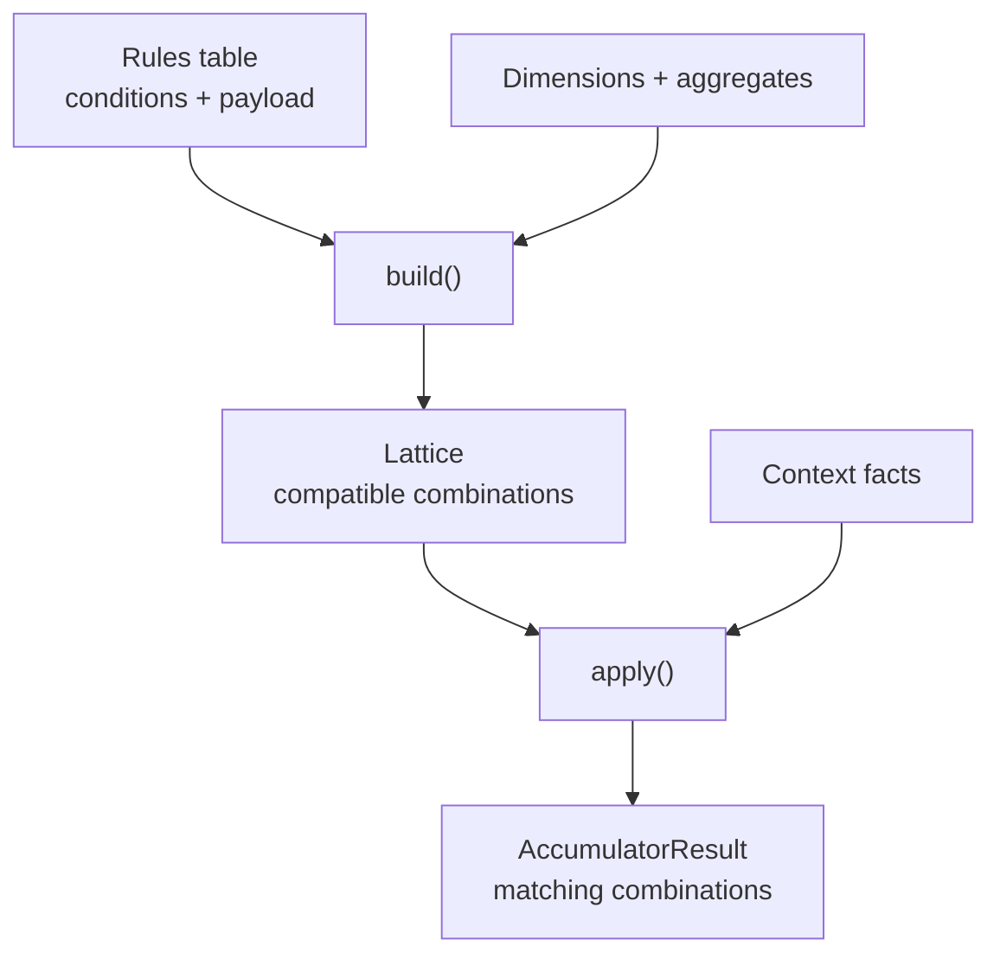

# Chapter 7: Using the Accumulator Engine

The Accumulator Engine answers a different question from the Expression Rules Engine. The expression engine returns the individual rules that match a context. The accumulator first builds rule combinations whose conditions can all hold at the same time, folds selected payload values across each combination, and then matches a context against those combined conditions.

This chapter develops that public workflow. The matching vocabulary—dimensions, exact matching, wildcards and ternary outcomes—comes from [Chapter 3](../03-matching-concepts/index.md). The build search and its prime identities are deliberately deferred to [Chapter 10](../10-accumulator-engine-internals/index.md). Here, a lattice is a prepared table that can be applied repeatedly.

Our table has a broad operational baseline plus inspection and packing work for Australia and inspection work for New Zealand. `"<NA>"` is the string wildcard described in Chapter 3. The baseline therefore applies everywhere; it can coexist with more specific work. The numeric columns are payload to fold, not conditions.

<!-- concept:68 -->
## AccumulatorEngine {#accumulatorengine}

`AccumulatorEngine` is constructed from `DimensionsMetadata` and an optional list of aggregates. Its two public phases have separate inputs and outputs:

1. `build(rules)` reads the rules table once and returns a `Lattice` of retained compatible combinations.
2. `apply(lattice, context)` compares one context with that prepared lattice and returns an `AccumulatorResult`.

Build when the rule library changes; apply for the contexts that need a decision. A context does not cause the engine to add another source rule to a lattice. It only selects combinations that the build phase already established.

The diagram separates the two kinds of data. Conditions become coalesced conditions in the lattice, while declared numeric payload becomes accumulated columns.



<!-- concept:87 -->
## The Aggregate model {#the-aggregate-model}

An `Aggregate` names one source column and an `AggregateOp`. It describes the fold; it does not calculate a value at construction. `Aggregate(column_name="minutes")` uses the default operation, `SUM`. Each declaration produces a `__agg_<column_name>` column in the lattice.

The complete example declares four independent aggregates. `minutes` is added; `minimum_risk` uses the smallest value; `maximum_priority` uses the largest; and `factor` is multiplied. The two string dimensions are conditions and therefore do not appear in the aggregate list.

```python
import polars as pl
from mountainash.relations import relation
from mountainash_rules import (
    AccumulatorEngine,
    Aggregate,
    AggregateOp,
    DataType,
    Dimension,
    DimensionsMetadata,
)

rules = pl.DataFrame({
    "rule_name": ["base", "inspect_au", "pack_au", "inspect_nz"],
    "region": ["<NA>", "AU", "AU", "NZ"],
    "service": ["<NA>", "standard", "standard", "standard"],
    "minutes": [1, 2, 3, 4],
    "minimum_risk": [9, 5, 7, 4],
    "maximum_priority": [1, 3, 2, 4],
    "factor": [1.0, 1.1, 1.2, 0.9],
})
metadata = DimensionsMetadata(dimensions=[
    Dimension(dimension_name="region", data_type=DataType.STR),
    Dimension(dimension_name="service", data_type=DataType.STR),
])
engine = AccumulatorEngine(metadata, aggregates=[
    Aggregate(column_name="minutes"),
    Aggregate(column_name="minimum_risk", operation=AggregateOp.MIN),
    Aggregate(column_name="maximum_priority", operation=AggregateOp.MAX),
    Aggregate(column_name="factor", operation=AggregateOp.PRODUCT),
])

lattice = engine.build(rules)
print("lattice", lattice.count, lattice.is_composed)
print(relation(lattice.combinations).to_polars().select(
    "co_region", "co_service", "__agg_minutes", "__agg_minimum_risk",
    "__agg_maximum_priority", "__agg_factor", "__level",
).sort("co_region", "__level").to_dicts())

result = engine.apply(lattice, {"region": "AU", "service": "standard"})
print("result", result.count)
print(relation(result.survivors).to_polars().select(
    "co_region", "co_service", "__agg_minutes", "__agg_minimum_risk",
    "__agg_maximum_priority", "__agg_factor", "__specificity", "__rank",
).to_dicts())
print("accumulated", relation(result.accumulated("minutes")).to_polars().to_dicts())
```

```text
lattice 3 True
[{'co_region': '<NA>', 'co_service': '<NA>', '__agg_minutes': 1, '__agg_minimum_risk': 9, '__agg_maximum_priority': 1, '__agg_factor': 1.0, '__level': 0}, {'co_region': 'AU', 'co_service': 'standard', '__agg_minutes': 6, '__agg_minimum_risk': 5, '__agg_maximum_priority': 3, '__agg_factor': 1.32, '__level': 2}, {'co_region': 'NZ', 'co_service': 'standard', '__agg_minutes': 5, '__agg_minimum_risk': 4, '__agg_maximum_priority': 4, '__agg_factor': 0.9, '__level': 1}]
result 2
[{'co_region': 'AU', 'co_service': 'standard', '__agg_minutes': 6, '__agg_minimum_risk': 5, '__agg_maximum_priority': 3, '__agg_factor': 1.32, '__specificity': 2, '__rank': 1}, {'co_region': '<NA>', 'co_service': '<NA>', '__agg_minutes': 1, '__agg_minimum_risk': 9, '__agg_maximum_priority': 1, '__agg_factor': 1.0, '__specificity': 0, '__rank': 2}]
accumulated [{'__agg_minutes': 6}, {'__agg_minutes': 1}]
```

Three combinations remain in the prepared lattice, and two apply to the Australian standard context. The context itself is not retained in the lattice. `__level` is zero-based: the singleton has level 0, the pair level 1 and the triple level 2. Chapter 8 develops this tracking information. `relation(...).to_polars()` is used here to display the table values.

<!-- concept:77 -->
## Lattice class {#lattice-class}

`Lattice` is the value returned by `build()`. It carries the combinations relation, the original metadata, the aggregate declarations and, when applicable, its partition key. Its `count` property counts combination rows: three in this example, representing the broad condition and the two regional conditions.

Treat a built lattice as prepared decision data. It can serve many `apply()` calls using different contexts. The next chapter adds partitions, routing and snapshot persistence; this chapter stays with a single unpartitioned lattice.

<!-- concept:78 -->
## Lattice combinations {#lattice-combinations}

Each row of `lattice.combinations` represents one compatible combination retained by the build. The three rows above mean:

| Coalesced condition | Contributing work represented | Accumulated minutes |
|---|---|---:|
| Any region, any service | `base` alone | 1 |
| AU, standard | `base` + `inspect_au` + `pack_au` | 6 |
| NZ, standard | `base` + `inspect_nz` | 5 |

The broad wildcard singleton remains because its unrestricted coalesced condition differs from the Australian and New Zealand conditions. The Australian combination contains three compatible rules, while the New Zealand combination contains two. These rows are not a list of globally largest rule sets. They are the undominated combinations for their respective coalesced conditions: one broad condition and two more specific conditions can all be useful outcomes.

A lattice also retains bookkeeping columns such as `__level`; Chapter 8 explains how to read them. Payload columns from a source row are not a reliable description of everything that contributed to a combined row. Use the coalesced and accumulated column families for the combined meaning.

<!-- concept:80 -->
## Coalesced columns {#coalesced-columns}

A `co_` column describes the condition after the component rules have been merged. The `co_region` and `co_service` columns in the output are the conditions that `apply()` actually evaluates.

For an exact dimension, a concrete value takes precedence over a wildcard when the two are compatible. Thus the Australian row has `co_region="AU"` and `co_service="standard"`, even though `base` supplied wildcards for both. Two contradictory concrete exact values cannot form one combination. Other supported strategies have their own merged condition: compatible ranges are intersected, greater-than and less-than thresholds are tightened, membership lists are intersected, and exclusion lists are unioned.

This example uses string exact dimensions. Accumulator construction does not correctly implement Boolean-null wildcards for `EXACT`; use the filter engine for that Boolean matching contract, and observe the accumulator data-type boundary in [Chapter 10](../10-accumulator-engine-internals/index.md#accumulatorcompiler).

The original `region` and `service` columns remain source-row payload in a build result. They do not replace the `co_` columns. This distinction matters when inspecting a combination whose first retained source row had wildcards: `co_region` still tells the truth about the combined condition.

<!-- concept:83 -->
## AccumulatorResult class {#accumulatorresult-class}

`apply()` returns an `AccumulatorResult`. It extends the ordinary rule-result interface, so `survivors`, `count`, `best_match`, `active_dimensions`, and ranking columns work as they do for expression evaluation. `best_combination` is a readability alias for `best_match`.

For the Australian context, the detailed combination ranks first because both `region` and `service` are definite matches, giving specificity two. The baseline still survives: its two wildcards produce unknown comparisons, so its specificity is zero. The result therefore keeps a broad fallback and a more specific accumulated answer at the same time.

`apply()` uses `COLLECT` matching and has no hit-policy argument. Use `best_combination` to read the highest-ranked combination, or `at_least(n)` to obtain a native frame filtered by specificity. Although `AccumulatorResult` inherits `select()`, the apply wrapper does not carry the expression result's `SelectionInfo`; calling `select()` on it raises `ValueError` for missing selection information. The complete-candidate reselection workflow in [Chapter 5](../05-expression-results-and-policies/index.md#reapplying-a-policy-with-ruleresultselect) applies to expression results carrying that provenance.

<!-- concept:84 -->
## Accumulated aggregates {#accumulated-aggregates}

`result.accumulated("minutes")` projects the `__agg_minutes` column from the matching combinations. In the example it returns 6 for the detailed Australian combination and 1 for the baseline. The return value is a native DataFrame—Polars in this example—with one value per surviving combination, rather than a Python scalar.

The aggregate values belong to a combination, not to the context. The six minutes mean one baseline minute plus two inspection minutes plus three packing minutes. The context only chose the row whose coalesced conditions are `AU` and `standard`.

<!-- concept:127 -->
## Aggregate min, max and product {#aggregate-min-max-and-product}

`AggregateOp` has four implemented operations: `SUM`, `MIN`, `MAX`, and `PRODUCT`. They are commutative and associative in their mathematical domains, so their intended business meaning does not depend on source-row encounter order.

| Operation | Example output for the AU combination | Required source kind |
|---|---:|---|
| `SUM` | `__agg_minutes = 6` | Numeric |
| `MIN` | `__agg_minimum_risk = 5` | Orderable, including numeric or temporal |
| `MAX` | `__agg_maximum_priority = 3` | Orderable, including numeric or temporal |
| `PRODUCT` | `__agg_factor = 1.32` | Numeric |

The `Aggregate` model validates the operation name, but it does not inspect a table column's type. An incompatible source column fails in the backend during `build()`. Aggregate-value overflow is likewise backend-defined; the package's checked integer limit protects combination identity, not a sum or product payload value. Floating-point folds should be compared with an appropriate numerical tolerance when that is relevant to an application.

## Next steps {#next-steps}

[Chapter 8](../08-lattices-results-and-routing/index.md#lattice-partition-key) explains partitions, result provenance, persistence and routing a context to the appropriate lattice. [Chapter 10](../10-accumulator-engine-internals/index.md) explains compatibility, coalescing and frontier retention without changing the public build/apply workflow used here.

## Implementation references {#implementation-references}

The example was executed against Rules revision `730a8583ee9d4fd6b52dc5350699eb66cc7487e9`.

- [Accumulator engine][accumulator-engine-source] — public construction, build, apply and the coalesced apply metadata.
- [Aggregate models][aggregate-source] — aggregate declarations and the four fold operations.
- [Lattice model][lattice-source] — combinations and public lattice properties.
- [Accumulator result][result-source] — `best_combination` and `accumulated()`.

[accumulator-engine-source]: https://github.com/mountainash-io/mountainash-rules/blob/730a8583ee9d4fd6b52dc5350699eb66cc7487e9/src/mountainash_rules/engines/accumulator/engine.py
[aggregate-source]: https://github.com/mountainash-io/mountainash-rules/blob/730a8583ee9d4fd6b52dc5350699eb66cc7487e9/src/mountainash_rules/engines/accumulator/aggregate.py
[lattice-source]: https://github.com/mountainash-io/mountainash-rules/blob/730a8583ee9d4fd6b52dc5350699eb66cc7487e9/src/mountainash_rules/engines/accumulator/lattice.py
[result-source]: https://github.com/mountainash-io/mountainash-rules/blob/730a8583ee9d4fd6b52dc5350699eb66cc7487e9/src/mountainash_rules/engines/accumulator/result.py
