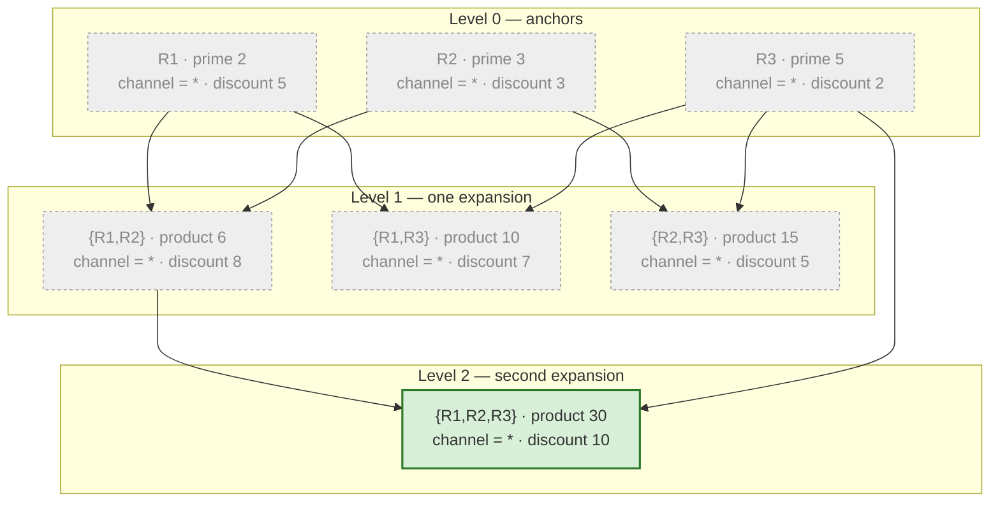

# Chapter 7: Inside Combination Search

Chapter 5 used `AccumulatorEngine.build()` as a black box: hand it rules, get back a `Lattice` of compatible combinations with coalesced values and NA flags. This chapter opens that box. Two questions drive everything here: *when can two rules coexist in one combination on a given dimension?* (compatibility), and *what is the combined constraint once they do?* (coalescing). A third question — *how does the engine avoid generating the same combination twice, or exploring combinations forever?* — is answered by a breadth-first search encoded with prime numbers.

The source for this chapter is `src/mountainash_rules/engines/accumulator/compiler.py` (`AccumulatorCompiler`), `src/mountainash_rules/engines/accumulator/engine.py` (`AccumulatorEngine.build` and its helpers), and `src/mountainash_rules/engines/accumulator/primes.py` (the prime table and its two guards). Reading this chapter is not a prerequisite for using a lattice — that workflow is in [Chapter 5](../05-combining-and-persisting-rules/index.md) — but it explains why a lattice contains exactly the combinations it does, and what to do when a build fails.

The code blocks below are implementation excerpts and signature summaries, not a sequential Python usage session. They omit surrounding imports or class context where that context is not needed for the explanation. Chapter 5 provides executable package-usage examples.

## Compile compatibility predicates

`AccumulatorCompiler` produces expressions that operate on **pairs** of rules rather than a rule and a context. During level expansion (covered later in this chapter), the engine cross-joins the combinations built so far against the full rule set, giving every row two column namespaces: the current combination's coalesced columns, prefixed `co_`, and the candidate rule's original columns, suffixed `_rhs`. Every expression in this chapter reads from that `co_*` / `*_rhs` pair.

<!-- concept:59 -->
### AccumulatorCompiler

`AccumulatorCompiler` is a stateless class, structurally similar to the `DimensionCompiler` from [Chapter 6](../06-expression-execution-internals/index.md) but compiling a different kind of question. Where `DimensionCompiler` asks "does this rule match this context?", `AccumulatorCompiler` asks "can this rule coexist with that other rule?" and, if so, "what does their combination constrain?" It exposes three public methods:

```text
class AccumulatorCompiler:
    def compile_compatible(self, dim: Dimension) -> BaseExpressionAPI: ...
    def compile_coalesce(self, dim: Dimension) -> list[BaseExpressionAPI]: ...
    def compile_coalesce_na_flag(self, dim: Dimension) -> BaseExpressionAPI: ...
```

`AccumulatorEngine.__init__` calls all three, once per CONSTRAINT dimension, and caches the results in three dictionaries keyed by dimension name (`_compatible_exprs`, `_coalesce_exprs`, `_coalesce_na_exprs`). CONTEXT_KEY dimensions are excluded from this compilation entirely — they partition the rule set before the search begins (Chapter 5) rather than participating in pairwise compatibility.

Not every `MatchStrategy` has a defined pairwise semantics. `compile_compatible` and `compile_coalesce` both dispatch on `dim.match_strategy` with a `match` statement and fall through to `raise ValueError(f"Strategy {dim.match_strategy.name} not supported by accumulator")` for anything they do not recognize:

| Strategy | Compatible when | Coalesced value | Accumulator support |
|---|---|---|---|
| `EXACT` | equal, or either side is the sentinel | the non-sentinel value | Yes |
| `RANGE` | effective intervals overlap, or a bound is the sentinel | the intersection interval | Yes |
| `GREATER_THAN` | always | the maximum (stricter) bound | Yes |
| `LESS_THAN` | always | the minimum (stricter) bound | Yes |
| `SET_MEMBERSHIP` | either side is the wildcard list, or the sets intersect | the set intersection | Yes |
| `SET_EXCLUSION` | always | the set union | Yes |
| `EXACT_KEY`, `NOT_EQUAL`, `PREFIX`, `SUFFIX`, `CONTAINS`, `REGEX`, `CONTEXT_REGEX` | — | — | No — raises `ValueError` |

Six of the thirteen `MatchStrategy` members are supported; the other seven — including `EXACT_KEY` and `NOT_EQUAL`, not only the string-pattern strategies — raise immediately if a CONSTRAINT dimension is configured with them. There is no partial or best-effort handling: an `AccumulatorEngine` cannot be constructed over dimension metadata that uses an unsupported strategy for a CONSTRAINT-role dimension, because the `__init__` compilation loop calls `compile_compatible`/`compile_coalesce` eagerly for every constraint dimension. The remediation is either to change the dimension's strategy to a supported one or to move it out of the accumulator's dimension metadata (the filter engine in Chapter 3 still supports all thirteen).

A module-level docstring note matters for sentinel handling: a rule-side don't-care is expressed *only* with the `UNKNOWN` numeric sentinel (`unknown_sentinel_for`). The filter engine's `NUMERIC_SENTINELS` set additionally tolerates `NOT_SET_NUMERIC` rule-side, but the accumulator does not — rule tables fed to `build()` must use the `UNKNOWN` sentinel for don't-care numeric bounds, never `NOT_SET`.

<!-- concept:60 -->
### Compatible expression

A compatible expression answers one question per dimension: *is there any context value that could satisfy both rules simultaneously?* If yes, the rules can appear together in a combination on that dimension; if no, they contradict each other and the candidate is dropped during level expansion.

The correctness contract that every strategy's compatible/coalesce pair must satisfy — stated explicitly in the project's accumulator correctness design (`docs/superpowers/specs/2026-07-12-accumulator-correctness-design.md`) — is:

> `compatible(A, B)` must hold iff some context value satisfies both `A` and `B` under filter-engine semantics, and `coalesce(A, B)` must be exactly the set of contexts matching both.

The filter engine from Chapter 3 supplies the matching semantics that the apply phase must preserve. Compatibility and coalescing exist to make the combined constraint represent the contributing rules together. An unconstrained bound does not itself contradict another bound, but a range's other bound can still constrain the combination: sentinel handling must operate per bound, not turn every partially unbounded interval into a wholly unconstrained dimension.

<!-- concept:63 -->
### Compatible exact

For `EXACT`, `_compatible_exact` returns true under any of three conditions, combined with OR:

```text
def _compatible_exact(self, dim: Dimension) -> BaseExpressionAPI:
    co_sentinel, rhs_sentinel = self._sentinel_checks(dim)
    field = dim.resolved_rule_field
    values_match = ma.col(f"co_{field}").eq(ma.col(f"{field}_rhs"))
    return co_sentinel.__or__(rhs_sentinel).__or__(values_match)
```

`_sentinel_checks` compares each side's raw column against `unknown_sentinel_for(dim.data_type)`. So two rules are compatible on an EXACT dimension when the combination's coalesced value is the sentinel, the candidate's value is the sentinel, or the two concrete values are equal. Consider a `region` dimension:

| Combination `co_region` | Candidate `region_rhs` | Compatible? | Why |
|---|---|---|---|
| `UNKNOWN` | `"AU"` | Yes | combination side is a wildcard |
| `"AU"` | `UNKNOWN` | Yes | candidate side is a wildcard |
| `"AU"` | `"AU"` | Yes | values match |
| `"AU"` | `"NZ"` | No | neither side is a wildcard and the values differ |

<!-- concept:64 -->
### Compatible range

`_compatible_range` treats a sentinel minimum as −∞ and a sentinel maximum as +∞, checking each bound independently. For example, `[50, UNKNOWN]` has a real minimum and no upper bound. This one-sided unboundedness is separate from whether a present endpoint is inclusive:

```text
def _compatible_range(self, dim: Dimension) -> BaseExpressionAPI:
    co_min_s, co_max_s, rhs_min_s, rhs_max_s = self._range_sentinel_checks(dim)
    co_min = ma.col(f"co_{dim.range_min_field}")
    co_max = ma.col(f"co_{dim.range_max_field}")
    rhs_min = ma.col(f"{dim.range_min_field}_rhs")
    rhs_max = ma.col(f"{dim.range_max_field}_rhs")

    touch_overlaps = dim.range_min_inclusive and dim.range_max_inclusive
    if touch_overlaps:
        low = co_min.le(rhs_max)
        high = co_max.ge(rhs_min)
    else:
        low = co_min.lt(rhs_max)
        high = co_max.gt(rhs_min)

    low_ok = co_min_s.__or__(rhs_max_s).__or__(low)
    high_ok = co_max_s.__or__(rhs_min_s).__or__(high)
    return low_ok.__and__(high_ok)
```

Two effective intervals overlap when each one's lower bound is at or below the other's upper bound, and vice versa. The dimension's `range_min_inclusive`/`range_max_inclusive` flags decide whether touching endpoints count as overlapping: when both are `True` (the model default), `le`/`ge` treat a shared boundary point as compatible; otherwise strict `lt`/`gt` excludes it. Because the flags are compiled once per dimension and both sides of a comparison share the same dimension, one `touch_overlaps` boolean is enough to pick the comparator pair for the whole expression — mixed inclusivity within a single dimension is not representable, so this is not a per-row decision.

| `co_age` interval | `age_rhs` interval | Inclusive both ends? | Compatible? | Reason |
|---|---|---|---|---|
| `[18, 30]` | `[25, 45]` | Yes | Yes | overlap at `[25, 30]` |
| `[18, 30]` | `[40, 60]` | Yes | No | no overlap |
| `[0, 10]` | `[10, 20]` | Yes | Yes | shared endpoint 10 counts |
| `[0, 10]` | `[10, 20]` | No (`range_max_inclusive=False`) | No | shared endpoint excluded |
| `[UNKNOWN, UNKNOWN]` | `[40, 60]` | — | Yes | combination side is fully unconstrained |
| `[50, UNKNOWN]` | `[UNKNOWN, 40]` | — | No | real bounds `50` and `40` do not overlap; only the unconstrained sides auto-pass |

The last row shows why each bound needs its own sentinel check. The unbounded sides impose no contradiction, but the remaining concrete minimum of 50 and maximum of 40 cannot overlap. A sentinel on one side must not erase the constraint on the other.

<!-- concept:120 -->
### Set membership compatible

For `SET_MEMBERSHIP`, `_compatible_set_membership` treats two rule lists as compatible when either list is the in-band wildcard (the single-element list `[unknown_sentinel_for(dim.data_type)]`, from `mountainash_rules.core.set_wildcard` — never a null) or the two concrete lists share at least one member:

```text
def _compatible_set_membership(self, dim: Dimension) -> BaseExpressionAPI:
    co_w, rhs_w = self._set_wild_checks(dim)
    field = dim.resolved_rule_field
    intersection_nonempty = (
        ma.col(f"co_{field}")
        .list.set_intersection(ma.col(f"{field}_rhs"))
        .list.len()
        .gt(ma.lit(0))
    )
    return co_w.__or__(rhs_w).__or__(intersection_nonempty)
```

`list.set_intersection(...).list.len().gt(0)` is true exactly when at least one list element can satisfy both rules — an empty intersection means no context value could pass both, so the candidate cannot join the combination. `SET_EXCLUSION` uses a different rule entirely: its `compile_compatible` case returns `ma.lit(True)` unconditionally, because two exclusion lists never contradict each other — excluding more values only narrows what remains allowed, it never creates a conflict.

## Coalesce compatible values and NA flags

Once two rules are known to be compatible on every dimension, the engine needs the *merged* value each dimension takes on in the new, larger combination. That merge, plus a parallel flag tracking whether the dimension is still fully unconstrained, is what `compile_coalesce` and `compile_coalesce_na_flag` produce.

<!-- concept:61 -->
### Coalesce expression

`compile_coalesce` returns a **list** of expressions, not a single one, because some strategies produce more than one output column — `EXACT` produces one coalesced value, `RANGE` produces a coalesced minimum and maximum. Across every strategy, coalescing follows one shared priority rule: a non-sentinel value always wins over a sentinel. If one side is a wildcard, the merged value is simply the other side's value; if both sides carry real values, the strategy's merge operation runs (equality for `EXACT`, interval intersection for `RANGE`, the stricter bound for thresholds, set intersection or union for the two set strategies). If both sides are sentinels, the result stays the sentinel — nothing has narrowed.

<!-- concept:62 -->
### Coalesce NA flag

The NA flag is `1` when the combined constraint remains fully unconstrained and `0` otherwise. It is named `co_<resolved_rule_field>_na` for scalar and set strategies, and `co_<dimension_name>_na` for `RANGE`, which has two bound fields:

```text
def compile_coalesce_na_flag(self, dim: Dimension) -> BaseExpressionAPI:
    if dim.match_strategy == MatchStrategy.RANGE:
        co_min_s, co_max_s, rhs_min_s, rhs_max_s = self._range_sentinel_checks(dim)
        all_sentinel = co_min_s.__and__(rhs_min_s).__and__(co_max_s).__and__(rhs_max_s)
        return all_sentinel.cast(int).alias(f"co_{dim.dimension_name}_na")
    if dim.match_strategy in (MatchStrategy.SET_MEMBERSHIP, MatchStrategy.SET_EXCLUSION):
        co_w, rhs_w = self._set_wild_checks(dim)
        field = dim.resolved_rule_field
        return co_w.__and__(rhs_w).cast(int).alias(f"co_{field}_na")
    co_sentinel, rhs_sentinel = self._sentinel_checks(dim)
    field = dim.resolved_rule_field
    return co_sentinel.__and__(rhs_sentinel).cast(int).alias(f"co_{field}_na")
```

For `RANGE`, all four bound-sentinel checks must hold. Combining `[50, UNKNOWN]` with `[UNKNOWN, 60]` is not NA: together they constrain both bounds. Anchor creation makes the corresponding two-bound check for each singleton, so a one-sided range is not mislabeled fully unconstrained. These flags participate in the frontier fingerprint and must describe the complete dimension, not just one bound.

<!-- concept:65 -->
### Coalesce exact

`_coalesce_exact` maps each side's sentinel to `None`, then takes the first non-null value, falling back to the (still-sentinel) original if both were null:

```text
def _coalesce_exact(self, dim: Dimension) -> list[BaseExpressionAPI]:
    co_sentinel, rhs_sentinel = self._sentinel_checks(dim)
    field = dim.resolved_rule_field
    co_hard = ma.when(co_sentinel).then(None).otherwise(ma.col(f"co_{field}"))
    rhs_hard = ma.when(rhs_sentinel).then(None).otherwise(ma.col(f"{field}_rhs"))
    return [ma.coalesce(co_hard, rhs_hard, ma.col(f"co_{field}")).alias(f"co_{field}")]
```

If both sides are non-sentinel, the compatibility check already guaranteed they are equal, so either value is correct to keep.

| `co_region` | `region_rhs` | Coalesced `co_region` |
|---|---|---|
| `UNKNOWN` | `"AU"` | `"AU"` |
| `"AU"` | `UNKNOWN` | `"AU"` |
| `"AU"` | `"AU"` | `"AU"` |
| `UNKNOWN` | `UNKNOWN` | `UNKNOWN` |

<!-- concept:66 -->
### Coalesce range

`_coalesce_range` computes the merged minimum as the greater of the two minimums and the merged maximum as the lesser of the two maximums — the interval intersection — handling each bound's sentinel independently, four cases per bound (both sentinel, only LHS, only RHS, neither):

```text
new_min = (
    ma.when(co_min_s.__and__(rhs_min_s)).then(ma.lit(sentinel))
    .when(co_min_s).then(ma.col(f"{dim.range_min_field}_rhs"))
    .when(rhs_min_s).then(ma.col(f"co_{dim.range_min_field}"))
    .otherwise(ma.greatest(ma.col(f"co_{dim.range_min_field}"), ma.col(f"{dim.range_min_field}_rhs")))
    .alias(f"co_{dim.range_min_field}")
)
# new_max mirrors new_min, using ma.least instead of ma.greatest
```

| `co_age` | `age_rhs` | Coalesced interval | Rule |
|---|---|---|---|
| `[18, 30]` | `[25, 45]` | `[25, 30]` | tighter min, tighter max |
| `[UNKNOWN, UNKNOWN]` | `[25, 45]` | `[25, 45]` | combination side fully wildcard, candidate wins |
| `[50, UNKNOWN]` | `[UNKNOWN, 40]` | not reached — incompatible per the compatible-range table above | — |
| `[0, 10]` | `[10, 20]` | `[10, 10]` | inclusive touch, coalesces to a single point |

<!-- concept:67 -->
### Coalesce threshold

`GREATER_THAN` and `LESS_THAN` are always compatible (`_compatible_threshold` returns `ma.lit(True)` unconditionally, because two thresholds on the same side never contradict — they simply combine to the stricter one), so `_coalesce_threshold` is the only place their pairwise logic lives:

```text
def _coalesce_threshold(self, dim: Dimension, combine_fn) -> list[BaseExpressionAPI]:
    co_sentinel, rhs_sentinel = self._sentinel_checks(dim)
    field = dim.resolved_rule_field
    sentinel = unknown_sentinel_for(dim.data_type)
    new_val = (
        ma.when(co_sentinel.__and__(rhs_sentinel)).then(ma.lit(sentinel))
        .when(co_sentinel).then(ma.col(f"{field}_rhs"))
        .when(rhs_sentinel).then(ma.col(f"co_{field}"))
        .otherwise(combine_fn(ma.col(f"co_{field}"), ma.col(f"{field}_rhs")))
        .alias(f"co_{field}")
    )
    return [new_val]
```

`compile_coalesce` passes `ma.greatest` for `GREATER_THAN` (a higher floor is stricter) and `ma.least` for `LESS_THAN` (a lower ceiling is stricter) as `combine_fn` — one function body serves both directions.

| Strategy | `co_` value | `_rhs` value | Coalesced | Reason |
|---|---|---|---|---|
| `GREATER_THAN` | 500 | 700 | 700 | must exceed both, take the max |
| `GREATER_THAN` | `UNKNOWN` | 500 | 500 | only the candidate constrains |
| `LESS_THAN` | 100 | 80 | 80 | must stay below both, take the min |
| `LESS_THAN` | `UNKNOWN` | `UNKNOWN` | `UNKNOWN` | neither constrains |

<!-- concept:121 -->
### Set membership coalesce

`_coalesce_set` is shared by both set strategies, parameterized by which list operation to apply — `compile_coalesce` passes `"intersection"` for `SET_MEMBERSHIP` and `"union"` for `SET_EXCLUSION`:

```text
def _coalesce_set(self, dim: Dimension, op: str) -> list[BaseExpressionAPI]:
    co_w, rhs_w = self._set_wild_checks(dim)
    field = dim.resolved_rule_field
    co = ma.col(f"co_{field}")
    rhs = ma.col(f"{field}_rhs")
    combined = co.list.set_intersection(rhs) if op == "intersection" else co.list.set_union(rhs)
    new_val = (
        ma.when(co_w.__and__(rhs_w)).then(sentinel_list_expr(dim))
        .when(co_w).then(rhs)
        .when(rhs_w).then(co)
        .otherwise(canonicalize_set_expr(combined))
        .alias(f"co_{field}")
    )
    return [new_val]
```

Both wildcard: keep the sentinel list. One wildcard: take the other side's concrete list unchanged. Two concrete lists: apply the selected set operation and run it through `canonicalize_set_expr`, which sorts and deduplicates the result (`col.list.unique().list.sort()`) so two combinations that end up with the same allowed set always compare and fingerprint identically — this matters for the frontier filter later in this chapter. Membership coalescing therefore narrows the allowed values through intersection as more rules join a combination (fewer values satisfy every contributing rule), while exclusion coalescing accumulates the forbidden set through union (more values become excluded as more rules join).

## Encode identity and guard integer bounds

Compatibility and coalescing answer the pairwise question. To build combinations of three, four, or more rules without re-deriving every prior combination from scratch, the engine needs a cheap way to identify a combination, check whether a candidate rule already belongs to it, and detect when one combination's rule set is a subset of another's. `primes.py` answers all three with one encoding: assign each rule a distinct prime, and represent a combination by the *product* of its rules' primes.

<!-- concept:69 -->
### Prime number encoding

By the Fundamental Theorem of Arithmetic, every integer greater than 1 has a unique prime factorization. Assigning rule *i* the prime `get_prime(i)` and representing a combination as the product of its members' primes gives two properties essentially for free:

1. **Unique identity** — no two distinct rule sets share a prime product, so `__prime_product` alone identifies a combination.
2. **Subset detection in constant time** — combination A's rule set is a subset of combination B's iff `B % A == 0`, a single modulo operation on fixed-width integers, regardless of how many rules either combination contains.

With rules `R1`, `R2`, `R3` assigned primes 2, 3, 5:

| Combination | `__prime_product` | Contains R1? (`product % 2 == 0`) | Contains R2? (`product % 3 == 0`) |
|---|---|---|---|
| `{R1}` | 2 | Yes | No |
| `{R2}` | 3 | No | Yes |
| `{R1, R2}` | 6 | Yes | Yes |
| `{R1, R3}` | 10 | Yes | No |
| `{R1, R2, R3}` | 30 | Yes | Yes |

This is the identity that guard 2 (level expansion), provenance decoding, and the frontier filter's domination check (both later in this chapter and covered from the reader's side in Chapter 5) all rely on. The identity scheme depends only on distinctness of the assigned primes, not their magnitude — which is exactly why the table-size cap and the per-combination width bound (covered next) are independent limits.

<!-- concept:70 -->
### Prime table sieve

The engine needs one distinct prime per rule in a partition, up to `MAX_RULES_PER_PARTITION = 10_000`. `primes.py` computes exactly the first `MAX_RULES_PER_PARTITION` primes once, at module import, with a bounded Sieve of Eratosthenes:

```text
def _sieve(limit: int) -> list[int]:
    is_prime = [True] * (limit + 1)
    is_prime[0] = is_prime[1] = False
    for i in range(2, int(limit**0.5) + 1):
        if is_prime[i]:
            for j in range(i * i, limit + 1, i):
                is_prime[j] = False
    return [i for i, v in enumerate(is_prime) if v]

def _first_n_primes(n: int) -> list[int]:
    if n < 1:
        return []
    limit = 15 if n < 6 else int(n * (math.log(n) + math.log(math.log(n)))) + 3
    primes = _sieve(limit)
    while len(primes) < n:  # defensive; the Rosser bound is not exceeded in practice
        limit *= 2
        primes = _sieve(limit)
    return primes[:n]

PRIME_TABLE: list[int] = _first_n_primes(MAX_RULES_PER_PARTITION)
```

`_first_n_primes` sizes the sieve using the prime-counting upper bound from Rosser's theorem (`p_n < n(ln n + ln ln n)` for `n >= 6`), so it sieves just enough of the integer line to be confident it captures 10,000 primes, then widens defensively (doubling the limit and re-sieving) if that bound were ever too tight — a safety net the current constant never actually triggers. `PRIME_TABLE` is the first 10,000 primes, not a table of primes *up to* some fixed magnitude; the module docstring is explicit that a table "up to 2^64" would be nonsensical (roughly 4.2 x 10^17 primes, on the order of exabytes) and would index by the wrong dimension — the engine only ever needs to look primes up by rule *position*, never by numeric magnitude. The sieve runs once, at import, and costs microseconds; a runtime build only indexes into the resulting list.

<!-- concept:71 -->
### Get prime function

`get_prime(index)` is the only way `AccumulatorEngine.build()` reads the table — a bounds-checked, 0-based lookup:

```text
def get_prime(index: int) -> int:
    if index < 0:
        raise IndexError(f"Prime index must be non-negative, got {index}")
    if index >= len(PRIME_TABLE):
        raise IndexError(
            f"Prime index {index} exceeds the prime table "
            f"(MAX_RULES_PER_PARTITION={MAX_RULES_PER_PARTITION}). "
            f"Partition has too many rules; split it with a CONTEXT_KEY dimension."
        )
    return PRIME_TABLE[index]
```

`get_prime(0)` is 2, `get_prime(1)` is 3, and so on. `build()` calls `get_prime(i)` once per rule in the partition (`primes = [get_prime(i) for i in range(n_rules)]`), immediately after materializing the partition's rules and before any anchor or expansion work begins. A partition with more rules than the table therefore fails fast, at prime assignment, with an `IndexError` that names the offending index and the current cap, rather than silently reusing an identity or falling back to a non-prime scheme.

<!-- concept:72 -->
### Checked multiply

`__prime_product` is represented as a signed 64-bit column. Python integers can compute a larger product exactly, but unguarded fixed-width multiplication can overflow and destroy the combination's identity. `checked_multiply` checks the mathematical product before it is used in that column:

```text
_INT64_MAX = (2**63) - 1

def checked_multiply(a: int, b: int) -> int:
    result = a * b
    if result > _INT64_MAX:
        raise OverflowError(
            f"Prime product {a} * {b} = {result} exceeds int64 max ({_INT64_MAX}). "
            f"Partition has too many mutually compatible rules for int64 representation."
        )
    return result
```

`AccumulatorEngine._check_overflow` (covered under Level Expansion below) is where this function is actually invoked during a build, converting the plain `OverflowError` into the more specific `LatticeWidthExceededError`. `checked_multiply` itself stays context-free — it raises `OverflowError`, not the lattice-specific exception, so it can be tested and reused independent of the build pipeline.

This is a guard on **one arithmetic path only**: the `__prime_product` combination identity, grown by exactly one operation, the multiply in level expansion. It says nothing about aggregate columns (`__agg_*`) — that is a separate, explicitly out-of-scope concern covered under LatticeWidthExceededError below.

<!-- concept:123 -->
### Prime table size cap

`MAX_RULES_PER_PARTITION = 10_000` is a deliberate, documented policy choice, not a mathematical limit. It exists because every rule needs a distinct prime, so it is exactly the size of `PRIME_TABLE` — the number of rules one partition can hold, independent of whether those rules are mutually compatible or not. `build()` assigns `get_prime(i)` for `i` in `range(n_rules)`, so a partition with 10,001 rules fails at that lookup, not later in the search.

Raising the constant makes `_first_n_primes()` construct a larger table at the next module import. That is an implementation-policy change: review its import-time memory and computation costs, and preserve the independent product-overflow guard. A larger lookup table does not make larger prime products representable.

Crucially, the table cap is **independent** of the combination-width bound described next. A partition can sit comfortably under the 10,000-rule cap and still raise `LatticeWidthExceededError` if a subset of its rules happen to be mutually compatible in a large enough clique — table size bounds how many *distinct* rules a partition may hold; combination width bounds how many rules may appear *together* in one prime product. Conversely, raising the table cap does nothing to relax the combination-width bound. The recommended remediation for an over-cap partition — splitting it with a `CONTEXT_KEY` dimension, per Chapter 5 — happens to be the same remediation `get_prime()`'s error message suggests, but it addresses a different constraint than the one covered next.

## Expand, order and prune the search

With compatibility, coalescing, and prime identity in place, `AccumulatorEngine.build()` runs a breadth-first search: start with each rule alone, repeatedly try to extend every current combination with one more compatible rule, and finally discard any combination whose effect is already captured by a larger one.



The three rules above all leave `channel` at its wildcard, so every combination shares the same coalesced fingerprint (`channel = *`) and every rule is pairwise compatible with every other; the only thing distinguishing combinations is which rules — and therefore how much summed `discount` — they carry. The frontier filter (covered last in this section) keeps only `{R1, R2, R3}`, because every smaller combination has the identical fingerprint and a prime product that strictly divides 30.

<!-- concept:73 -->
### Anchor creation

`_create_anchor` builds the level-0 combinations: one singleton per rule. Starting from the rules DataFrame plus its assigned `__prime` column, it adds three families of columns:

- **Coalesced columns** (`co_*`): at level 0, exact copies of each rule's own constraint values — a single rule's coalesced value *is* its own value.
- **NA flag columns** (`co_*_na`): computed the same way as `compile_coalesce_na_flag`, but against the rule's own bound rather than a pair — sentinel means NA. For `RANGE`, this checks both the min and max sentinel flags together (`min_s AND max_s`), matching the same four-bound reading used everywhere else, so a half-open singleton is never mislabeled fully unconstrained.
- **Tracking columns**: `__prime_product` (equal to `__prime` itself at level 0) and `__level = 0`.
- **Aggregate columns** (`__agg_*`): seeded directly from each aggregate's source column.

For a rule `region="AU"`, `age_min=18`, `age_max=65`, `discount=0.10`, assigned prime 2, the anchor row carries the original columns plus `co_region="AU"`, `co_age_min=18`, `co_age_max=65`, `co_region_na=0`, `co_age_na=0`, `__prime_product=2`, `__level=0`, `__agg_discount=0.10`. Every subsequent level is built exclusively by extending anchors (or their descendants) — there is no other entry point into the search.

<!-- concept:74 -->
### Level expansion

`_expand_level` is the search's inner loop, called once per level from `level_num = 1` up to `n_rules - 1` in `build()`:

```text
for level_num in range(1, n_rules):
    new_combos = self._expand_level(
        current_level, rhs_rules, level_num,
        overflow_possible=overflow_possible, partition_key=partition_key,
    )
    if new_combos is None:
        break
    all_levels.append(new_combos)
    current_level = new_combos
```

Each call cross-joins the current level's combinations against the full rule set (`current_level.join(rhs_rules, how="cross", suffix="_rhs")`), then applies, in order:

1. **Canonical ordering guard** (`guard1`, covered on its own below).
2. **Not-already-included guard** (`guard2`): `__prime_product.mod(__prime_rhs).ne(0)` — if the candidate's prime already divides the combination's product, the rule is already a member and is skipped.
3. **Compatibility**: every compiled compatible expression, ANDed together across all constraint dimensions.
4. The filtered join is materialized (`relation(joined.filter(all_guards).collect())`). This prevents subsequent expansion steps from carrying the entire unmaterialized history of earlier levels.
5. If the row count is zero, the level returns `None` and `build()`'s loop breaks — the search terminates naturally the first time an extension produces nothing.
6. Otherwise, every coalesce expression and NA-flag expression updates the `co_*`/`co_*_na` columns, `__prime` becomes the candidate's prime, `__prime_product` is multiplied by the candidate's prime, `__level` is set to `level_num`, and every aggregate column is folded with its configured operation (`SUM`→add, `MIN`→`ma.least`, `MAX`→`ma.greatest`, `PRODUCT`→multiply).

`build()` concatenates every level's output (`concat(all_levels)`) before frontier filtering, so the final candidate pool includes every combination ever produced, at every depth, not just the last level reached.

<!-- concept:75 -->
### Canonical ordering guard

Without an ordering constraint, the search would discover the same rule set repeatedly through every possible insertion order — `{R1, R2}` reachable both by extending `{R1}` with `R2` and by extending `{R2}` with `R1`. `guard1` eliminates every ordering but one:

```text
guard1 = ma.col("__prime").lt(ma.col("__prime_rhs"))
```

`__prime` is the prime of the *last rule added* to the current-level combination; `__prime_rhs` is the candidate's prime. Only candidates with a strictly larger prime than the most recently added rule pass. Since primes are assigned in the order rules appear in the input, this is equivalent to requiring that a combination's rules are always extended in increasing prime order — each rule set is generated in exactly one canonical ordering, turning what would otherwise be a per-combination cost that grows with the number of orderings of its members into a single comparison per candidate.

<!-- concept:76 -->
### Frontier filter

After every level has been expanded and concatenated, `_frontier_filter` removes **dominated** combinations — those whose contribution is already fully captured by a larger one. Combination A is dominated by combination B when both hold:

1. **Same fingerprint**: every `co_*` column and every `co_*_na` column is equal between A and B (they represent the identical effective query behavior).
2. **Strict prime superset**: `B.__prime_product % A.__prime_product == 0` and `B.__prime_product != A.__prime_product` (B's rule set strictly contains A's).

```text
combos_super = all_combos.select(*[ma.col(c) for c in fingerprint_cols], ma.col("__prime_product").alias("__pp_super"))
joined = combos_sub.join(combos_super, on=fingerprint_cols, how="inner", suffix="_dom")
dominated = joined.filter(
    ma.col("__pp_super").mod(ma.col("__pp_sub")).eq(ma.lit(0))
    .__and__(ma.col("__pp_super").ne(ma.col("__pp_sub")))
).select(ma.col("__pp_sub").alias("__prime_product")).unique()
result = combos_sub.join(dominated, on="__prime_product", how="anti").drop("__pp_sub")
```

The fingerprint condition is what makes this filter about redundancy rather than plain subset removal: two combinations with *different* coalesced values are different query results and both survive, even if one's rule set is a subset of the other's, because a context could match one and not the other. In the `{R1, R2, R3}` example above, all three rules leave `channel` at the wildcard and are mutually compatible, so every subset combination shares an identical fingerprint with the full set — `{R1}`'s product 2 divides `{R1, R2}`'s product 6, which divides `{R1, R2, R3}`'s product 30, and so on for every other subset — and the filter keeps only the maximal combination, `{R1, R2, R3}` with `discount = 10`. Before frontier filtering, `_assert_set_columns_non_null` verifies every set dimension's `co_*` column is non-null: a null key would silently defeat the join-based dominance check, since SQL/DataFrame joins never match null to null.

<!-- concept:133 -->
### LatticeWidthExceededError

Two independent limits bound construction:

| Limit | What it bounds | Where enforced | Typical size | Remediation |
|---|---|---|---|---|
| **Prime table size cap** (Prime Table Size Cap, above) | distinct rules in one partition | `get_prime()` — `IndexError` | 10,000 (`MAX_RULES_PER_PARTITION`, changeable) | split the partition with a `CONTEXT_KEY` dimension |
| **Combination product** | the exact product of the primes assigned to one compatible rule combination | `checked_multiply()` — `OverflowError`, re-raised as `LatticeWidthExceededError` | at most `2**63 - 1`; no universally safe rule count | split the partition, or reduce the mutually compatible combination |

The combination-width limit is arithmetic, not policy: the product of the first 15 primes is 614,889,782,588,491,410, which fits under `_INT64_MAX = 9,223,372,036,854,775,807`; the product of the first 16 is 32,589,158,477,190,044,730, which does not. No table-size increase changes this — it is a property of int64 and the specific primes involved, not of `MAX_RULES_PER_PARTITION`.

| First n primes in one mutually compatible combination | Cumulative prime product | Fits int64? |
|---|---|---|
| 5 | 2,310 | Yes |
| 6 | 30,030 | Yes |
| 10 | 6,469,693,230 | Yes |
| 15 | 614,889,782,588,491,410 | Yes |
| 16 | 32,589,158,477,190,044,730 | **No** — overflows |

`build()` checks this efficiently rather than after the fact. Immediately after prime assignment, it computes `math.prod(primes)` for the *entire* partition in Python's arbitrary-precision arithmetic once: if that full-partition product already fits int64, no combination the search could ever produce can overflow, so every per-level check is skipped for the rest of the build (`overflow_possible = math.prod(primes) > _INT64_MAX`). Only when that tier-one screen fails does `_check_overflow` run per level, and even then cheaply — it first fetches just the maximum `__prime_product` and maximum `__prime_rhs` from the level's filtered rows and multiplies those two Python ints; only if *that* screen also fails does it materialize the two tracking columns and run `checked_multiply` row by row, converting the resulting `OverflowError` into:

```text
raise LatticeWidthExceededError(
    f"Prime-product overflow at level {level_num} "
    f"(clique size {level_num + 1}) for partition "
    f"{partition_key!r}: {exc} "
    f"Split the partition with a CONTEXT_KEY dimension or "
    f"reduce the mutually compatible rule clique."
) from exc
```

A partition of sixteen all-wildcard rules raises `LatticeWidthExceededError` when the sixteenth rule would join the combination. For a sixteen-rule partition whose only nontrivial compatible group contains the first six rules, that group's product is `2 * 3 * 5 * 7 * 11 * 13 = 30,030`, which fits. The check considers products of combinations actually admitted by the search, not just partition size. Larger assigned primes can overflow with fewer members; the fifteen-rule arithmetic above is not a general safe-width promise.

This guard protects exactly one arithmetic path: the multiply in level expansion that grows `__prime_product`. It does not — and by design cannot — protect aggregate accumulation. `AggregateOp`'s own docstring states the boundary directly: "aggregate-value overflow is backend-defined and unguarded (only the combination identity `__prime_product` is int64 guarded). `product` reaches that ceiling faster than `sum`." A combination's `__agg_*` columns can overflow their backend dtype independent of whether `__prime_product` ever comes close to int64 max — that is a data-magnitude concern for the rule author to manage (choosing wider aggregate dtypes, or avoiding `PRODUCT` aggregation over many rules), not a combination-identity concern the search engine can detect or guard. Do not read a successful build (no `LatticeWidthExceededError`) as proof that aggregate values are safe from overflow; the two are unrelated arithmetic paths with unrelated guarantees. There is also no single fixed clique-width number that applies universally — "~15" is the bound only when every assigned prime in the clique is drawn from the smallest primes in the table; a clique built from later, larger primes in a heavily populated partition can overflow with fewer members, which is exactly why the engine verifies exactly rather than enforcing a hardcoded depth cap.

## Source references

- [Accumulator compatibility and coalescing compiler](https://github.com/mountainash-io/mountainash-rules/blob/94659bb0c096485c87d329f09e944577427f129f/src/mountainash_rules/engines/accumulator/compiler.py)
- [Accumulator construction and frontier filtering](https://github.com/mountainash-io/mountainash-rules/blob/94659bb0c096485c87d329f09e944577427f129f/src/mountainash_rules/engines/accumulator/engine.py)
- [Prime table and checked multiplication](https://github.com/mountainash-io/mountainash-rules/blob/94659bb0c096485c87d329f09e944577427f129f/src/mountainash_rules/engines/accumulator/primes.py)
- [Correctness and overflow regression scenarios](https://github.com/mountainash-io/mountainash-rules/blob/94659bb0c096485c87d329f09e944577427f129f/tests/accumulator/test_correctness.py)
