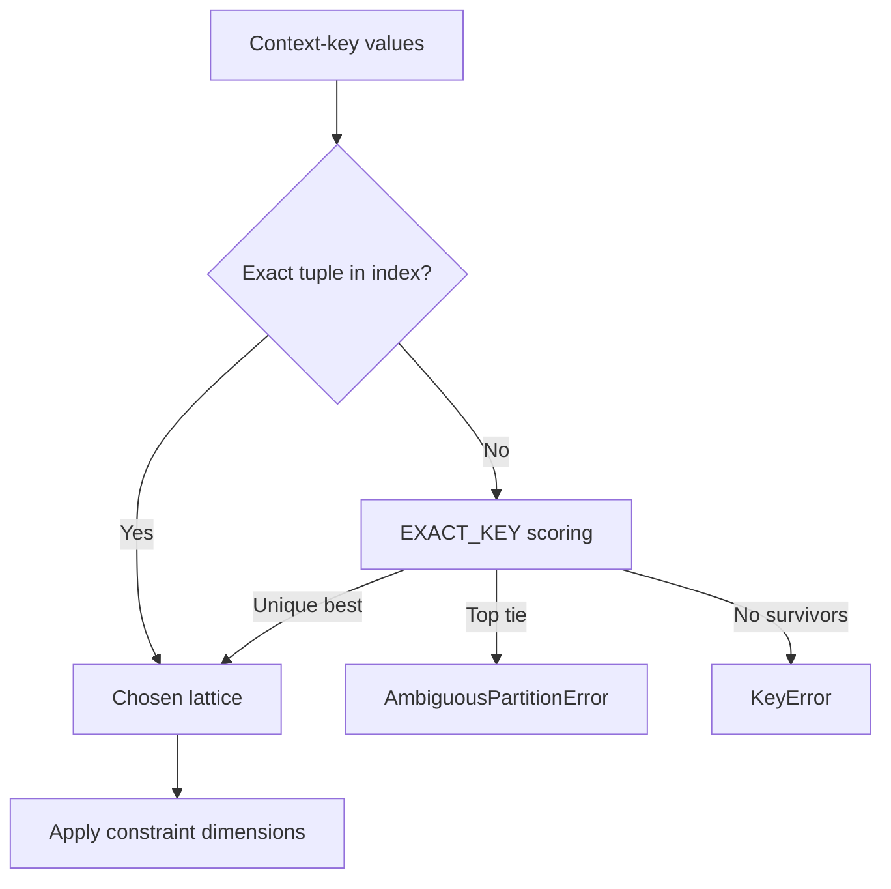

# Chapter 8: Accumulator Lattices, Results and Routing

A lattice is prepared combination data, not a second copy of the source rule table. This chapter explains the public information carried by a lattice and an accumulator result, then introduces partitioned builds and routing. It assumes the build/apply workflow from [Chapter 7](../07-accumulator-engine/index.md#accumulatorengine).

The internal compatibility search, prime generation and frontier algorithm belong to [Chapter 10](../10-accumulator-engine-internals/index.md). Readers need one practical fact now: a built row has coalesced conditions and accumulated values, so its source payload alone is not the combined meaning.

<!-- concept:79 -->
## Lattice partition key {#lattice-partition-key}

A lattice's `partition_key` records the key dictionary supplied to construction. A dimension with role `CONTEXT_KEY` is intended to isolate a slice before combinations are built; it is not coalesced with constraint dimensions. Correct isolation requires a complete key with non-null stored values, as the [build-filter boundary](#partition-key-filtering) below explains.

For example, `region` can be a context key when Australian and New Zealand rule libraries must be built independently. A lattice built for `{"region": "AU"}` records that key; its combinations contain only Australian source rows. Conditions such as `service` remain constraint dimensions and are coalesced inside that one partition.

Partition keys are not a new matching language. They describe which lattice a context should use. After routing has chosen a lattice, `apply()` evaluates its constraint dimensions in the ordinary way.

An applicable accumulator configuration must still have at least one `CONSTRAINT` dimension. Construction accepts context-key-only metadata, but `apply()`, `apply_auto()` and indexed application then fail because the delegated filter engine has no matching dimensions. Routing alone does not provide an apply-time constraint.

<!-- concept:81 -->
## NA flag columns {#na-flag-columns}

Every constraint dimension has a coalesced NA flag. `co_<rule_field>_na` is `1` when every contributing rule leaves that scalar or set dimension unrestricted; it is `0` when the combined condition is concrete. A range has two coalesced bounds, so its flag is named `co_<dimension_name>_na` and becomes `1` only when both bounds are unrestricted.

The flag distinguishes an unconstrained combined condition from a concrete value that happens to resemble a sentinel in another domain. It is part of the coalesced row representation and helps the lattice preserve wildcard semantics. It does not replace the coalesced condition: `co_region` or the pair of range bounds remains the value that the apply-phase metadata reads.

<!-- concept:82 -->
## Combination depth {#combination-depth}

`__level` is a zero-based expansion depth: a singleton has level 0, a pair has level 1, and a three-rule combination has level 2. Add one to obtain the count of contributing rules.

Depth is not apply-time specificity. Depth is fixed during build; specificity is recomputed for each context from the coalesced dimensions. A singleton may match a context exactly while a deeper combination leaves a dimension unrestricted. The result order therefore follows matching specificity, not `__level`.

<!-- concept:85 -->
## Provenance accessor {#provenance-accessor}

A built lattice gives each combination an encoded provenance value in `__prime_product`. `result.provenance` projects that column for the combinations which survived one apply. The number identifies a rule set only within the original partition's prime assignment; it is not a list of business rule names. Chapter 10 explains the encoding. To attribute a product to source rules later, retain the partition's original row order or a separate prime-to-source mapping. `Lattice.save()` does not persist that mapping, and one combined row's original payload does not list all its contributors.

<!-- concept:86 -->
## Depths accessor {#depths-accessor}

`result.depths` projects `__level` for the matching rows. The small complete session below makes the two accessors concrete. The broad rule has prime-product `2` and level `0`. The AU combination has product `6` and level `1`, meaning that it contains two source rules. `6` is not a rule name, a minute total or a rank.

```python
import polars as pl
from mountainash.relations import relation
from mountainash_rules import (
    AccumulatorEngine,
    Aggregate,
    DataType,
    Dimension,
    DimensionsMetadata,
)

rules = pl.DataFrame({
    "region": ["<NA>", "AU"],
    "minutes": [1, 2],
})
metadata = DimensionsMetadata(dimensions=[
    Dimension(dimension_name="region", data_type=DataType.STR),
])
engine = AccumulatorEngine(metadata, [Aggregate(column_name="minutes")])
lattice = engine.build(rules)
result = engine.apply(lattice, {"region": "AU"})

print(relation(lattice.combinations).to_polars().select(
    "co_region", "__agg_minutes", "__prime_product", "__level",
).sort("co_region").to_dicts())
print(relation(result.provenance).to_polars().to_dicts())
print(relation(result.depths).to_polars().to_dicts())
```

```text
[{'co_region': '<NA>', '__agg_minutes': 1, '__prime_product': 2, '__level': 0}, {'co_region': 'AU', '__agg_minutes': 3, '__prime_product': 6, '__level': 1}]
[{'__prime_product': 6}, {'__prime_product': 2}]
[{'__level': 1}, {'__level': 0}]
```

The apply result orders the more specific AU combination before the wildcard singleton. Its provenance and depth accessors follow that result order. The aggregate `__agg_minutes=3` is the reader-facing accumulated value; it should not be inferred from, or confused with, its encoded provenance `6`.

<!-- concept:88 -->
## Partition key filtering {#partition-key-filtering}

`build(rules, partition_key={...})` is the single-partition entry point. With context-key dimensions, callers must supply every configured key name and its stored, non-`None` value. The current implementation checks only that the dictionary is truthy; for each key dimension, an absent entry or a `None` value silently skips that filter. An incomplete key can therefore combine rules across a dimension that was meant to separate them. With no context-key dimensions, a supplied key does not filter anything but is still stored on the lattice and in snapshots. Omit it for an unpartitioned build.

For non-null values, this filter uses exact equality over the stored columns, not wildcard-aware routing. A typed, non-null UNKNOWN sentinel is therefore a separate partition. Boolean wildcards need special care: their stored representation is `None`, so `build_all()` discovers the wildcard key but `build()` skips its Boolean filter and can include rules from the concrete Boolean partitions. Avoid Boolean wildcard context-key partitions at this revision. This is a construction limitation; the router's Boolean wildcard matching is a separate operation.

<!-- concept:89 -->
## Build all partitions {#build-all-partitions}

`build_all(rules)` discovers each distinct context-key tuple and returns one `Lattice` per tuple. It avoids manually omitting key dimensions, but retains the `None`-filtering limitation just described. The following independent session uses string keys and has two isolated partitions: a wildcard default and an Australian override. `service` remains a constraint dimension for application after routing.

```python
import tempfile
from pathlib import Path

import polars as pl
from mountainash.relations import relation
from mountainash_rules import (
    AccumulatorEngine,
    Aggregate,
    AmbiguousPartitionError,
    DataType,
    Dimension,
    DimensionRole,
    DimensionsMetadata,
    Lattice,
)

metadata = DimensionsMetadata(dimensions=[
    Dimension(
        dimension_name="region",
        role=DimensionRole.CONTEXT_KEY,
        data_type=DataType.STR,
    ),
    Dimension(dimension_name="service", data_type=DataType.STR),
])
engine = AccumulatorEngine(metadata, aggregates=[Aggregate(column_name="minutes")])
rules = pl.DataFrame({
    "rule_name": ["default", "australia"],
    "region": ["<NA>", "AU"],
    "service": ["<NA>", "<NA>"],
    "minutes": [1, 2],
})
lattices = engine.build_all(rules)
print("partitions", sorted((x.partition_key for x in lattices), key=repr))
```

```text
partitions [{'region': '<NA>'}, {'region': 'AU'}]
```


<!-- concept:90 -->
## Apply auto selection {#apply-auto-selection}

`apply_auto(lattices, context)` combines routing and application for an occasional call. It first tries an exact partition-key dictionary lookup, then uses the same routing semantics as `LatticeIndex` if there is no exact key. It constructs an index with `validate=False` each time, so it does not repeat the potentially larger exhaustive ambiguity check for a convenience call.

For occasional routed applications, pass the partition list and context directly. These three calls exercise an exact key, a different concrete key, and a missing key:

```python
for label, context in [
    ("exact", {"region": "AU", "service": "express"}),
    ("default", {"region": "NZ", "service": "express"}),
    ("missing", {"service": "express"}),
]:
    routed_result = engine.apply_auto(lattices, context)
    row = relation(routed_result.survivors).to_polars().select(
        "__agg_minutes", "__specificity", "__rank",
    ).to_dicts()
    print(label, row)
```

```text
exact [{'__agg_minutes': 2, '__specificity': 0, '__rank': 1}]
default [{'__agg_minutes': 1, '__specificity': 0, '__rank': 1}]
missing [{'__agg_minutes': 1, '__specificity': 0, '__rank': 1}]
```

The Australian context selects the AU partition and its two-minute aggregate. New Zealand and the missing region select the wildcard partition. The returned `__specificity` is zero in each case because the selected lattice leaves `service` unrestricted. Routing specificity concerns the context keys; apply-result specificity concerns the constraints inside the chosen lattice.

For repeated requests, construct one reusable `LatticeIndex`, as shown below, rather than reconstructing routing metadata on each call.

<!-- concept:122 -->
## Apply-phase caching {#apply-phase-caching}

The accumulator keeps a memoized expression filter engine for each `Lattice` object it applies. The cache belongs to one `AccumulatorEngine` instance and is keyed by lattice object identity through a weak-key dictionary. Repeating `engine.apply(the_same_lattice, context)` reuses the remapped constraint metadata and compiled filter expressions.

This scope has two consequences. A lattice loaded again from disk is a new object and gets a new entry. A second `AccumulatorEngine` has its own cache. The weak key allows an entry to disappear when no strong reference to its lattice remains; it is not a process-wide cache and does not cache accumulated result rows.

Treat a lattice's combinations as immutable after construction. Mutating the exposed frame is outside this cache contract; rebuild or load a new lattice when its decision data changes.

<!-- concept:124 -->
## Lattice save method {#lattice-save-method}

`lattice.save(directory)` writes two snapshot files: `lattice.parquet` contains the combinations relation, and `manifest.yaml` contains serialized metadata, aggregate declarations and the partition key. The method creates the directory when necessary and returns its path. Select the Australian lattice explicitly rather than relying on partition-discovery order:

```python
australian_lattice = next(
    item for item in lattices if item.partition_key == {"region": "AU"}
)
snapshot_directory = tempfile.TemporaryDirectory()
snapshot_path = australian_lattice.save(snapshot_directory.name)
print(sorted(item.name for item in Path(snapshot_path).iterdir()))
```

```text
['lattice.parquet', 'manifest.yaml']
```

A saved lattice is useful when building is an offline step and a service only needs to apply contexts. The snapshot is not a write-back store for new source rules. Rebuild and save a new lattice when its rules or metadata change.

<!-- concept:125 -->
## Lattice load method {#lattice-load-method}

`Lattice.load(directory)` reads both files, validates the serialized `DimensionsMetadata` and aggregate models, and constructs a new lattice. That model validation does not establish that the Parquet columns and rows agree with the manifest. For application after a restart, construct an engine from the loaded configuration, or use one known to be equivalent: `apply()` and `index()` use the calling engine's metadata and aggregates rather than adopting or comparing the lattice's declarations.

```python
loaded = Lattice.load(snapshot_path)
print(loaded.is_composed, loaded.partition_key)
print(relation(loaded.combinations).to_polars().select("__agg_minutes").rows())
restored_engine = AccumulatorEngine(loaded.metadata, loaded.aggregates)
print(restored_engine.apply(
    loaded, {"service": "express"}
).accumulated("minutes").rows())
snapshot_directory.cleanup()
```

```text
True {'region': 'AU'}
[(2,)]
[(2,)]
```

The `express` context matches the chosen Australian lattice's unrestricted service condition. The new engine returns its stored two-minute aggregate without another build; the two tuple lists show the stored value and the applied value respectively.

The round trip preserves the stored combinations columns, including coalesced values, NA flags, `__agg_*`, `__prime_product`, and `__level`; it does not recompute combinations. A directory without `manifest.yaml` raises `FileNotFoundError`. The current load path reads Parquet into a Polars frame rather than restoring a previous execution backend.

<!-- concept:126 -->
## Lattice is composed {#lattice-is-composed}

`is_composed` reports whether the combinations frame contains `__prime_product`, the tracking column a build creates. It is a structural representation check, not proof that the current object was personally constructed by this engine instance. Saving and loading a built lattice preserves that column, so the snapshot in the example remains composed.

A flat or externally imported lattice can carry coalesced conditions and aggregate columns without `__prime_product`; it then reports `is_composed=False`. Result accessors project the tracking columns actually present: `provenance` needs `__prime_product`, and `depths` needs `__level`. Missing tracking columns cause a backend column-not-found error. Their absence does not prevent matching properly formed coalesced conditions.

The constructor accepts this stored representation; it does not resume combination search or reconcile prime assignments from independently built lattices. Keep the coalesced schema, dimension metadata and aggregate declarations together when importing data.

<!-- concept:128 -->
## The LatticeIndex router {#the-latticeindex-router}

`engine.index(lattices, validate=True, max_witnesses=1_000_000)` builds a reusable `LatticeIndex`. It accepts lattices from `build_all()` or `Lattice.load()`. The index keeps an O(1) fast path for exact tuples and otherwise evaluates a small meta rules table—one row per partition—using the same ternary and specificity model as rule matching.

```python
index = engine.index(lattices)
indexed_result = index.apply({"region": "AU", "service": "express"})
print(relation(indexed_result.accumulated("minutes")).to_polars().rows())
```

```text
[(2,)]
```

This call reuses the routing structure and selects the same Australian aggregate as `apply_auto()`. Further calls can reuse `index` with other contexts.



An exact tuple lookup avoids scoring. On a dictionary miss, the router scores compatible wildcard-bearing partitions, selects a unique best match, or raises for a tie or absence of candidates.

By default, index construction performs an exhaustive witness-matrix ambiguity check. For each key dimension, it examines known concrete values and one typed “other/missing” class, then checks their cross-product in bounded chunks. If the required witness count exceeds `max_witnesses`, construction raises `ValueError` rather than sampling. Passing `validate=False` opts out only of this exhaustive check.

Some key validation is always on: the list must be nonempty, partition keys cannot be duplicated, every configured key must be present, and context-side `NOT_SET` sentinels are rejected. Boolean `None` is a rule-side wildcard key rather than a rejected key; it remains subject to the construction limitation above. These checks validate routing keys, not whether each lattice's rows were isolated correctly.

<!-- concept:129 -->
## AmbiguousPartitionError {#ambiguouspartitionerror}

`AmbiguousPartitionError` is a `KeyError` subclass raised when two or more surviving partitions tie at top routing specificity. The `crossing_rules` example contains `region="AU", channel=wildcard` and `region=wildcard, channel="BROKER"`. A context with both `AU` and `BROKER` gives each partition one definite key match and one wildcard match. Neither is more specific.

```python
crossing_metadata = DimensionsMetadata(dimensions=[
    Dimension(
        dimension_name="region", role=DimensionRole.CONTEXT_KEY,
        data_type=DataType.STR,
    ),
    Dimension(
        dimension_name="channel", role=DimensionRole.CONTEXT_KEY,
        data_type=DataType.STR,
    ),
    Dimension(dimension_name="service", data_type=DataType.STR),
])
crossing_engine = AccumulatorEngine(
    crossing_metadata, aggregates=[Aggregate(column_name="minutes")],
)
crossing_rules = pl.DataFrame({
    "region": ["AU", "<NA>"],
    "channel": ["<NA>", "BROKER"],
    "service": ["<NA>", "<NA>"],
    "minutes": [8, 12],
})
crossing = crossing_engine.build_all(crossing_rules)
try:
    crossing_engine.index(crossing)
except AmbiguousPartitionError as exc:
    print("validated-ambiguous", type(exc).__name__)
try:
    crossing_engine.apply_auto(
        crossing,
        {"region": "AU", "channel": "BROKER", "service": "express"},
    )
except AmbiguousPartitionError as exc:
    print("runtime-ambiguous", type(exc).__name__)
```

```text
validated-ambiguous AmbiguousPartitionError
runtime-ambiguous AmbiguousPartitionError
```

The first exception line comes from `index(crossing)` with validation enabled: the exhaustive check finds the tie before serving a context. The second comes from `apply_auto`, which skipped that load-time check but still detects the real runtime tie. Do not resolve this by relying on order. Make the partition keys disjoint or introduce an intentional, uniquely more-specific partition.

<!-- concept:130 -->
## EXACT_KEY partition routing {#exact_key-partition-routing}

The routing meta-engine represents context-key dimensions with `EXACT_KEY`. Its ternary behavior gives the default case a precise rule: a wildcard partition survives for every context but contributes no specificity, while a concrete matching partition contributes one and wins. The default `{"region": "<NA>"}` partition in the example therefore serves NZ and missing-region contexts, but the AU partition wins for an AU context.

Missing or explicit `None` context-key values are normalized to the type's `NOT_SET` sentinel (Boolean keys retain `None`). A `NOT_SET` key does not match a concrete partition; it can route to a wildcard partition. If no wildcard partition exists, the router raises `KeyError` and includes the requested and served keys. This behavior preserves the distinction between a missing key fact and a deliberate wildcard in the stored rule table.

For example, removing the wildcard partition leaves no candidate for an absent region:

```python
concrete_index = engine.index([australian_lattice])
try:
    concrete_index.apply({"service": "express"})
except KeyError as exc:
    print(type(exc).__name__)
```

```text
KeyError
```

## Next steps {#next-steps}

[Chapter 7](../07-accumulator-engine/index.md#accumulatorengine) is the build/apply workflow to revisit when choosing aggregates and reading accumulated results. [Chapter 10](../10-accumulator-engine-internals/index.md) explains the compatibility, coalescing, identity and frontier mechanisms behind the structures used here.

## Implementation references {#implementation-references}

The examples were executed against Rules revision `730a8583ee9d4fd6b52dc5350699eb66cc7487e9`.

- [Accumulator engine][accumulator-engine-source] — partitioned build, `apply_auto`, cache scope and index creation.
- [Lattice and router][lattice-source] — snapshot contract, `LatticeIndex`, exact-key meta routing and ambiguity validation.
- [Accumulator result][result-source] — provenance and depth projections.

[accumulator-engine-source]: https://github.com/mountainash-io/mountainash-rules/blob/730a8583ee9d4fd6b52dc5350699eb66cc7487e9/src/mountainash_rules/engines/accumulator/engine.py
[lattice-source]: https://github.com/mountainash-io/mountainash-rules/blob/730a8583ee9d4fd6b52dc5350699eb66cc7487e9/src/mountainash_rules/engines/accumulator/lattice.py
[result-source]: https://github.com/mountainash-io/mountainash-rules/blob/730a8583ee9d4fd6b52dc5350699eb66cc7487e9/src/mountainash_rules/engines/accumulator/result.py
