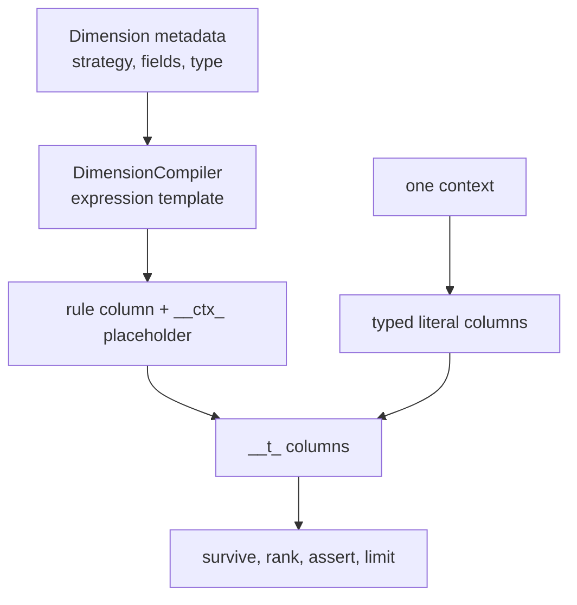

# Chapter 9: Inside the Expression Rules Engine

`ExpressionRulesEngine` turns dimension metadata into a small set of reusable column expressions. At evaluation time it binds one context as literal columns, evaluates those expressions over every rule row, then selects from the survivors. This chapter traces that implementation pipeline after the public workflow in [Chapter 4](../04-expression-rules-engine/index.md), the policy contract in [Chapter 5](../05-expression-results-and-policies/index.md), and the matching vocabulary in [Chapter 3](../03-matching-concepts/index.md).

The names beginning with `__` are engine working columns, not a public table schema to construct manually. They are useful when reading a result with observability enabled and when maintaining the engine, because they make each phase inspectable.

<!-- concept:31 -->
## DimensionCompiler {#dimensioncompiler}

`DimensionCompiler` is the bridge from a `Dimension` to a Mountainash expression template. An engine built with `DimensionsMetadata` creates one template per dimension at construction. The template refers to the dimension's rule field and to a placeholder named `__ctx_<dimension name>`; it contains no value from a particular request. Reusing the compiled template is what lets a new context be a binding operation rather than a new Python loop over rules.



`compile_dimension()` dispatches to a strategy-specific method in the [compiler source][compiler-source]. `compile_dimensions()` applies that dispatch to every dimension in a metadata object and returns a dictionary keyed by logical dimension name. The private methods implement the comparisons; [Chapter 11](../11-extending-and-maintaining/index.md) explains the coordinated changes needed to add a strategy. Every branch returns the same ternary contract: `1` for a definite match, `0` for unknown or unrestricted, and `-1` for a contradiction.

The engine requires at least one configured dimension. A table with zero rules can still be evaluated when its schema is valid, but a zero-dimension filter engine is rejected. Conversely, `dimensions=None` means *all configured dimensions*, not no dimensions. An explicit projection must be a nonempty, duplicate-free list of configured names. Those checks prevent a caller from accidentally turning an evaluation into an unrestricted table pass.

To inspect a template independently of engine selection, construct the rule and context columns it references. This example compiles equality once, then binds two different region values. Although the application field is named `requested_region`, the compiled placeholder uses the logical name `region`. The engine normally performs this mapping and binding.

```python
import polars as pl
import mountainash.expressions as ma
from mountainash.relations import relation
from mountainash_rules import (
    DataType, Dimension, DimensionCompiler, MatchStrategy, unknown_sentinel_for,
)

compiler = DimensionCompiler()
region_dimension = Dimension(
    dimension_name="region", context_field="requested_region", data_type=DataType.STR,
)
region_template = compiler.compile_dimension(region_dimension)
template_rules = relation(pl.DataFrame({
    "rule_name": ["local", "fallback"],
    "region": ["AU", "<NA>"],
}))
for region_value in ["AU", "NZ"]:
    bound_rules = template_rules.with_columns(
        ma.lit(region_value).alias("__ctx_region"),
    )
    scored_rules = bound_rules.with_columns(region_template.alias("__t_region"))
    print(scored_rules.select(
        "rule_name", "__ctx_region", "__t_region",
    ).to_polars().rows())
```

```text
[('local', 'AU', 1), ('fallback', 'AU', 0)]
[('local', 'NZ', -1), ('fallback', 'NZ', 0)]
```

The template changes neither the rule table nor its comparison when the context changes. Binding supplies a new literal column; evaluation produces a new ternary column. No survival filter or rank has been applied here, so the second output still includes the Australian rule with outcome `-1`. The following sections examine how each strategy constructs that expression.

<!-- concept:32 -->
## Exact templates {#compile-exact-expression}

For non-Boolean `EXACT`, the compiler creates ternary columns for the rule value and bound context value using the declared type's sentinel set, then calls ternary equality. A string wildcard in the rule therefore yields `0`; two concrete unequal values yield `-1`. `NOT_EQUAL` has the same shape with ternary inequality.

Boolean dimensions require a separate template. Booleans have no spare in-band value that could safely represent absence, so a null rule or context is the unknown state. The compiler explicitly returns `0` if either side is null and otherwise compares the two Boolean values. It must not cast a null context to `False`: that would make an absent fact contradict a `True` rule and falsely match a `False` rule.

`EXACT_KEY` is deliberately stricter than ordinary exact matching. It first accepts a rule-side wildcard as `0`, then returns `-1` when a concrete key rule meets a non-concrete context, then compares two concrete values. That order matters to partition routing: an unknown key may keep a wildcard partition in consideration, but it must not match a specific partition key. The routing workflow belongs to [Chapter 8](../08-lattices-results-and-routing/index.md#exact_key-partition-routing).

<!-- concept:33 -->
## Range templates {#compile-range-expression}

A range dimension has two ternary comparisons: lower bound versus context and upper bound versus context. Inclusive flags select `≤` or `<` at the lower side and `≥` or `>` at the upper side. The range outcome is the lower of those ternary results: one `-1` rejects the row, two matches give `1`, and a wildcard or missing value can give `0`.

The current source writes that row-wise minimum as a `when(lower.le(upper)).then(lower).otherwise(upper)` expression. It is equivalent to `min(lower, upper)`, but it avoids a Polars 1.44 shape failure where a horizontal-minimum operation could collapse constant branches to a one-element series. Preserve the row-shaped form when changing this code; a result with correct values but the wrong length is not a valid rule relation.

A useful boundary is a table in which every lower-bound check is unknown and every upper-bound check passes. The outcome is zero for every row, but it must still have the table's full row count. Here all three rules have an unrestricted lower bound and an inclusive upper bound of ten:

```python
hours_dimension = Dimension(
    dimension_name="hours", data_type=DataType.INT,
    match_strategy=MatchStrategy.RANGE,
    range_min_field="lower", range_max_field="upper",
)
range_template = compiler.compile_dimension(hours_dimension)
unknown_hours = unknown_sentinel_for(DataType.INT)
constant_rules = relation(pl.DataFrame({
    "rule_name": ["a", "b", "c"],
    "lower": [unknown_hours] * 3,
    "upper": [10] * 3,
}))
constant_scoring = constant_rules.with_columns(
    ma.lit(5).alias("__ctx_hours"),
).with_columns(range_template.alias("__t_hours"))
print(constant_scoring.select("rule_name", "__t_hours").to_polars().rows())
```

```text
[('a', 0), ('b', 0), ('c', 0)]
```

Each original rule has its own result even though the outcomes are identical. This is the shape invariant needed by subsequent column assignment, survival filtering and explanation. An implementation change must preserve both the ternary value and its correspondence to every rule row.

<!-- concept:34 -->
## String templates {#compile-string-match}

`PREFIX`, `SUFFIX`, and `CONTAINS` share one wrapper. The context string performs the operation against the rule string; for example, `"X-7".starts_with("X-")`. Before that Boolean result becomes ternary, the wrapper checks for a rule marker (`<NA>` or `<NOT_SET>`) and for a non-concrete context. Either produces `0`; otherwise the Boolean result becomes `1` or `-1`.

This guard is consequential. String backends can differ in how their predicates treat nulls or marker-shaped strings. The compiler establishes the Rules meaning before the backend predicate can leak a backend-specific null result into scoring. It also means absent text has strategy-specific semantics rather than being silently treated as a failed string match.

<!-- concept:35 -->
## Per-row regular expressions {#compile-regex-expression}

`REGEX` uses the same sentinel and context guard as the other string predicates, but each rule row supplies its own pattern. The compiler uses Polars' column-pattern `str.contains` through `ma.native`, because Mountainash's portable regex operation accepts only a literal pattern. A wildcard pattern and a non-concrete context still yield `0`; otherwise matching uses search semantics and yields `1` or `-1`.

That native call is an explicit backend boundary. A non-Polars relation reaches Mountainash's native-expression error at evaluation; compilation alone does not establish support. Keep the `# allow:` annotation beside this import and verify per-row regex on its actual backend. `CONTEXT_REGEX` is different: its pattern lives in metadata, every rule receives the same result, and a non-concrete context is a strict `-1`, never an unknown. It supplies a shared format condition during matching rather than reading a rule-column pattern.

<!-- concept:36 -->
## Set templates {#compile-set-expression}

Set strategies normalize a rule-side list and identify the in-band singleton wildcard list before comparison. `SET_MEMBERSHIP` asks whether the normalized list ternarily contains the scalar context value. `SET_EXCLUSION` negates that ternary membership result. In either case a wildcard list returns `0`, not an ordinary list comparison.

The element type remains the dimension's declared scalar type. A null element is not a portable wildcard, and rule lists containing the reserved sentinel in addition to ordinary values are rejected by the engine before scoring. This preserves a single representation for “no restriction” and avoids a list backend assigning different meanings to null, empty list and marker list. Chapter 3 defines the public set-wildcard model; this is the compiler consequence.

<!-- concept:37 -->
## Threshold templates {#compile-threshold-expression}

Threshold templates are simpler shapes: `GREATER_THAN` computes ternary `context > rule_threshold`, and `LESS_THAN` computes `context < rule_threshold`. Both use typed ternary columns, so their handling of sentinels follows the same encoding as exact and range comparisons. The direction is easy to invert during maintenance because the rule stores the threshold while the context supplies the measured value. Preserve the context-on-left ordering in both methods.

<!-- concept:38 -->
## The sentinel-aware ternary boundary {#sentinel-aware-ternary}

The compiler uses related mechanisms for different expression families. `ma.t_col(..., unknown=sentinels)` provides sentinel-aware operands for ternary comparisons. String and regex wrappers convert an ordinary Boolean predicate into `0`, `1` or `-1` after checking missing-value guards. Set matching already uses the ternary list operation `list.t_contains`, with an additional rule-wildcard branch; exclusion applies `t_not()` to its result. Each route must produce one ternary outcome per rule and active dimension.

The following example combines exact, range, prefix, set-membership and threshold templates in one engine. The `wild` row contains several wildcard conditions; the `reject` row has a threshold contradiction. The output shows how the separate templates contribute to scoring.

```python
import polars as pl
from mountainash.relations import relation
from mountainash_rules import (
    DataType, Dimension, DimensionsMetadata, ExpressionRulesEngine, MatchStrategy,
)

rules = pl.DataFrame({
    "rule_name": ["specific", "wild", "reject"],
    "region": ["AU", "<NA>", "NZ"],
    "low": [0, 0, 0], "high": [10, 10, 5],
    "code": ["X-", "<NA>", "N-"],
    "tags": [["new", "vip"], ["<NA>"], ["blocked"]],
    "minimum": [3, 1, 7], "payload": ["A", "B", "C"],
})
metadata = DimensionsMetadata(dimensions=[
    Dimension(dimension_name="region", data_type=DataType.STR),
    Dimension(dimension_name="amount", data_type=DataType.INT,
              match_strategy=MatchStrategy.RANGE, range_min_field="low", range_max_field="high"),
    Dimension(dimension_name="code", data_type=DataType.STR, match_strategy=MatchStrategy.PREFIX),
    Dimension(dimension_name="tag", data_type=DataType.STR,
              match_strategy=MatchStrategy.SET_MEMBERSHIP, rule_field="tags"),
    Dimension(dimension_name="score", data_type=DataType.INT,
              match_strategy=MatchStrategy.GREATER_THAN, rule_field="minimum"),
], output_fields=["payload"])
engine = ExpressionRulesEngine(rules, metadata)
result = engine.evaluate({"region": "AU", "amount": 5, "code": "X-7", "tag": "vip", "score": 4})
print(relation(result.survivors).to_polars().select(
    "rule_name", "__t_region", "__t_amount", "__t_code", "__t_tag", "__t_score", "__specificity", "__rank",
).to_dicts())
```

```text
[{'rule_name': 'specific', '__t_region': 1, '__t_amount': 1, '__t_code': 1, '__t_tag': 1, '__t_score': 1, '__specificity': 5, '__rank': 1}, {'rule_name': 'wild', '__t_region': 0, '__t_amount': 1, '__t_code': 0, '__t_tag': 0, '__t_score': 1, '__specificity': 2, '__rank': 2}]
```

The `specific` row has five definite comparisons. The wildcards allow the second row to survive but add no specificity. The rejected row is absent because its score comparison is `-1`; the next section shows it in an unfiltered explanation frame.

<!-- concept:39 -->
## Context value extraction {#context-value-extraction}

`extract_context_values()` accepts a dictionary or Pydantic `BaseModel`, resolves each active dimension's `context_field`, and returns values keyed by *dimension name*. Missing keys and `None` become the type's `NOT_SET` sentinel, except Boolean absence stays `None`. This keeps the mapping from an application field such as `requested_region` to the compiler placeholder `__ctx_region` explicit.

Extraction does not broadly clean malformed values, and it does not validate an application's required fields. It normalizes only absence. The compiler then decides whether that absence is unknown or rejecting for the selected strategy.

<!-- concept:44 -->
## Context binding phase {#context-binding-phase}

The single-context scorer gives each extracted value a literal expression and aliases it to `__ctx_<dimension>`. It adds those literals to the rules relation, so every rule row can reference the same context fact without changing a rule column. `_context_literal` preserves a null Boolean through a nullable Boolean expression because some backend casts otherwise turn it into `False`.

Conceptually, binding the previous context produces this temporary relation shape before any ternaries:

| `rule_name` | `region` | `low` | `high` | `__ctx_region` | `__ctx_amount` | `__ctx_code` |
|---|---|---:|---:|---|---:|---|
| specific | AU | 0 | 10 | AU | 5 | X-7 |
| wild | `<NA>` | 0 | 10 | AU | 5 | X-7 |
| reject | NZ | 0 | 5 | AU | 5 | X-7 |

The injected names prevent the rule condition and context fact from colliding. Rule input must therefore avoid reserved prefixes such as `__ctx_` and `__t_`, plus reserved engine columns including `__rank`, `__specificity` and `__survived`.

<!-- concept:45 -->
## Dimension expression phase {#dimension-expression-phase}

The scorer aliases each precompiled template to `__t_<dimension>`, adds all of them in one `with_columns` operation, and then adds `__survived` and `__specificity`. Survival is a conjunction of `ternary >= 0` for every active dimension. It intentionally does not use a horizontal minimum: the same Polars row-shape issue that affects range expressions can collapse identical inputs. Specificity is the sum of `ternary == 1` indicators.

`engine.explain()` calls this shared `_scored_relation` path and stops there. It does not filter, rank, check a policy or apply cardinality. That is why the rejected row can be inspected without making explanation a second, drifting implementation of matching:

```python
explanation = engine.explain({"region": "AU", "amount": 5, "code": "X-7", "tag": "vip", "score": 4})
print(relation(explanation.frame).to_polars().select(
    "rule_name", "__survived", "__specificity",
).to_dicts())
```

```text
[{'rule_name': 'specific', '__survived': True, '__specificity': 5}, {'rule_name': 'wild', '__survived': True, '__specificity': 2}, {'rule_name': 'reject', '__survived': False, '__specificity': 1}]
```

`ExplainResult` has no `__rank` or selection methods precisely because its frame includes non-survivors. Do not wrap it as a `RuleResult` to force a policy operation; evaluate the context instead.

<!-- concept:106 -->
## SelectionInfo {#selectioninfo-dataclass}

`SelectionInfo` records the effective selection configuration and result state. It is prepared for both metadata-backed and expressions-only evaluation; call-level priority settings can override the metadata default. The fields have distinct purposes:

| Field | Meaning |
|---|---|
| `dimension_rule_fields` | Rule inputs excluded from inferred business outputs. A range contributes both bounds; `CONTEXT_REGEX` contributes none. |
| `priority_field` | The effective priority column after applying a call-level override. |
| `output_fields` | Explicit output fields from metadata, or from the expressions-only constructor. An empty tuple can leave inference to a metadata-backed engine. |
| `metadata_backed` | Whether dimension metadata is available to support output inference; it does not mean an explicit output list was supplied. |
| `observability` | Whether the result retains per-dimension ternary columns. |
| `truncated` | Whether filters or cardinality may have removed candidates. |

The initial record has `truncated=False`. Selection replaces that state when it applies a limit or one-row policy, so later consumers can distinguish a complete candidate basis from a possibly incomplete result.

`ANY` needs a resolved output schema to compare surviving rows, and reselection needs a complete candidate basis plus `__rule_index`, `__specificity` and `__rank`. Wrapping a frame as `RuleResult` without selection information establishes neither provenance nor completeness, so `select()` rejects that wrapper. The record preserves the selection contract; it cannot reconstruct discarded rows.

<!-- concept:108 -->
## Cardinality after complete selection {#cardinality-application}

After scoring, the engine filters survivors, orders them for the selected policy, assigns one-based `__rank`, and runs `UNIQUE` or `ANY` assertions over the complete survivor set. Only then does it apply `min_specificity`, `top_n`, and cardinality. `FIRST`, `PRIORITY` and `ANY` use `head(1)` after their prerequisite assertion and ordering; `COLLECT`, `UNIQUE` and `RULE_ORDER` retain all rows.

This order protects a useful invariant: a caller limit cannot hide a policy violation. It also explains why ranks are not rewritten after a specificity filter. They record the policy order of the full survivor set, while a result accessor such as `best_match` chooses the lowest **remaining** rank.

```python
from mountainash_rules import HitPolicy

first = engine.evaluate(
    {"region": "AU", "amount": 5, "code": "X-7", "tag": "vip", "score": 4},
    hit_policy=HitPolicy.FIRST,
)
print(relation(first.survivors).to_polars().select("rule_name", "__rank").to_dicts())
```

```text
[{'rule_name': 'specific', '__rank': 1}]
```

A `FIRST`, `PRIORITY`, `ANY`, `top_n`, or `min_specificity` result is conservatively marked truncated, even when this particular input happened to have one candidate. Calling `select()` again would risk deciding from information that may have been discarded, so the result directs the caller to evaluate the complete candidate set again.

<!-- concept:132 -->
## `CTX_PREFIX` injection pattern {#ctx_prefix-column-injection-pattern}

`CTX_PREFIX` is the shared constant behind `__ctx_`. The compiler is intentionally written against `__ctx_<dimension name>`, not against a Python value captured at construction. Binding creates that column immediately before scoring, and cleanup drops it before a normal result is returned. The companion `__t_` prefix gives every compiled dimension a non-colliding observability column.

This protocol belongs to the relation layer. Engine code manipulates rules through `mountainash.relations.relation()` and templates through `mountainash.expressions`; it should not add a second backend-specific implementation for ordinary compilation or selection. The native per-row regex escape is the documented exception. A relation's backend is preserved for ordinary `RuleResult.survivors`, while display code may explicitly convert it, as the examples do with `to_polars()`.

A batch performs the same injection per context after its cross join. It has additional identity, conversion, chunking and per-context ranking contracts, so this chapter intentionally links rather than repeats its primary explanation: see [Chapter 6's prepared context relation](../06-batch-evaluation/index.md#keep-each-context-identifiable) and [per-context ranking](../06-batch-evaluation/index.md#rank-matches-within-each-request).

## Maintenance checklist

- Keep every template ternary and row-shaped; test a constant branch as well as a mixed row set.
- Preserve typed missing binding, especially nullable Boolean literals and strict `CONTEXT_REGEX` handling.
- Treat `__ctx_`, `__t_` and ranking columns as one coordinated protocol: inject before templates, remove temporary context columns after scoring, and keep observability only when requested.
- Keep explanation on the shared scoring path and policy assertions before caller filters.
- Use the expression/relation protocol for ordinary work; document and isolate any unavoidable native escape with its backend boundary.

## Source notes {#source-notes}

This chapter describes implementation details in Rules revision `730a8583ee9d4fd6b52dc5350699eb66cc7487e9`; application code should continue to use the public package-root API. The executable outputs were observed against that revision with Polars.

- [Comparison compiler][compiler-source]: strategy templates, sentinel guards and the Polars-only regex path.
- [Context utilities][context-source]: extraction, typed absence and nullable Boolean literals.
- [Filter engine][filter-source]: shared scoring, survival, ranking and temporary-column cleanup.
- [Hit-policy layer][policy-source]: `SelectionInfo`, assertions and cardinality.
- [Result types][result-source]: complete-candidate reselection and unfiltered explanations.

[compiler-source]: https://github.com/mountainash-io/mountainash-rules/blob/730a8583ee9d4fd6b52dc5350699eb66cc7487e9/src/mountainash_rules/core/compiler.py
[context-source]: https://github.com/mountainash-io/mountainash-rules/blob/730a8583ee9d4fd6b52dc5350699eb66cc7487e9/src/mountainash_rules/core/context.py
[filter-source]: https://github.com/mountainash-io/mountainash-rules/blob/730a8583ee9d4fd6b52dc5350699eb66cc7487e9/src/mountainash_rules/engines/filter/engine.py
[policy-source]: https://github.com/mountainash-io/mountainash-rules/blob/730a8583ee9d4fd6b52dc5350699eb66cc7487e9/src/mountainash_rules/core/hit_policy.py
[result-source]: https://github.com/mountainash-io/mountainash-rules/blob/730a8583ee9d4fd6b52dc5350699eb66cc7487e9/src/mountainash_rules/core/result.py
