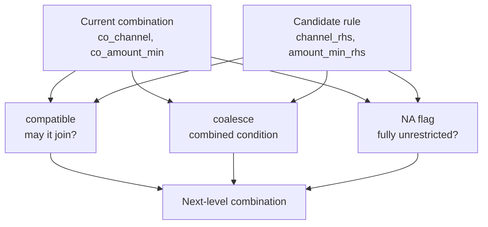
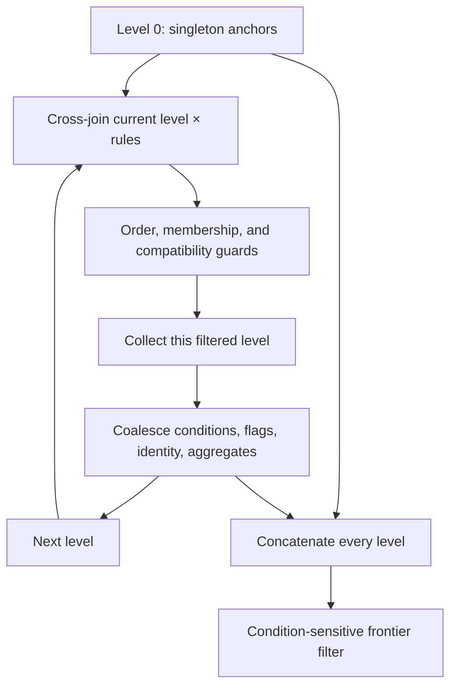

# Chapter 10: Inside the Accumulator Engine

`AccumulatorEngine.build()` turns individual rules into a table of compatible combinations. Chapter 7 established the public build-and-apply workflow, and [Chapter 8](../08-lattices-results-and-routing/index.md) explains how to inspect a finished lattice. This chapter explains the build mechanism: pairwise constraint algebra, prime-encoded identity, breadth-first expansion, and condition-sensitive pruning.

The build phase maintains the combined meaning of rule constraints, then the apply phase evaluates that meaning through the shared expression engine over `co_` columns. Compatibility and coalescing describe declared rule conditions; they do not enumerate an application's possible input values. The examples below form one Python session and use the pinned package source.

<!-- concept:59 -->
## The `AccumulatorCompiler` {#accumulatorcompiler}

`AccumulatorCompiler` compiles expressions for a *pair of rules*. The left-hand side is the current combination and therefore reads coalesced columns such as `co_channel`; the right-hand side is a candidate rule added by a cross join and reads columns such as `channel_rhs`. It produces three expression families for each `CONSTRAINT` dimension:

| Compiler method | Question answered | Result written during expansion |
|---|---|---|
| `compile_compatible()` | Do the implemented compatibility rules admit this pair? | A Boolean guard; a false result rejects the candidate. |
| `compile_coalesce()` | What condition represents both sides? | One or more updated `co_` columns. |
| `compile_coalesce_na_flag()` | Does the combined condition remain fully unrestricted? | A `co_*_na` flag, `1` or `0`. |

The engine compiles all three families once in its constructor and stores them by dimension name. `CONTEXT_KEY` dimensions do not enter this pairwise compiler: they partition rules before this search. The supported constraint strategies are `EXACT`, `RANGE`, `GREATER_THAN`, `LESS_THAN`, `SET_MEMBERSHIP`, and `SET_EXCLUSION`. Other strategies raise `ValueError` during engine construction rather than receiving an approximate combination interpretation.

The data-type boundary matters as well. The accumulator's `EXACT` path does not implement the filter compiler's Boolean-null wildcard handling. For example, a concrete Boolean row and a null wildcard row can remain separate, with a null coalesced NA flag instead of a valid `0` or `1`. Treat Boolean `EXACT` constraints as unsupported for accumulator construction at this revision; the metadata model accepting them is not a guarantee of correct coalescing.

The column convention makes a build step readable. The current combination has already accumulated its condition; the candidate remains an original rule until the expressions update the combination.



The source implementation dispatches these expressions in the [accumulator compiler][compiler-source]. The compiler recognizes only rule-side `UNKNOWN` sentinels as wildcards. `NOT_SET` is the representation for an absent context fact and is not a valid accumulator rule-side wildcard.

<!-- concept:60 -->
## Compatible expressions {#compatible-expression}

A **compatible expression** asks whether the intersection of two rule conditions is nonempty. For an exact channel requirement, `AU` and `NZ` have no satisfying context in common. `AU` and the `"<NA>"` wildcard do: an Australian context satisfies both. This is not an evaluation against one supplied context; it is an existence question used to decide whether a candidate can join a combination.

The compatibility predicate is the admission guard for the strategy's coalescing operation. Exact values must agree unless wildcarded, ranges require compatible bounds, and concrete membership lists require a shared member. Coalescing then stores the joint constraint for later application.

This is constraint composition, not a general satisfiability check over an application's legal inputs. Same-direction thresholds and exclusion sets are admitted without enumerating that domain. Rule wildcards also have their own admission branches. A caller must still validate source conditions and admissible values; a missing context's ternary survival behavior is not a reason to combine contradictory concrete rule conditions.

<!-- concept:61 -->
## Coalesce expressions {#coalesce-expression}

A **coalesce expression** writes the condition for an admitted pair. It returns a list because a strategy can require more than one output column: an exact dimension produces one value, while a range produces a minimum and a maximum.

The common wildcard rule is simple: a concrete constraint wins over a wildcard; two wildcards remain a wildcard. When both inputs are concrete, the strategy supplies the operation. Exact values must already agree, ranges and membership sets intersect, exclusion sets union, and thresholds select the stricter bound. Coalescing changes a condition; it is separate from folding numeric payload into `__agg_*` columns.

<!-- concept:62 -->
## Coalesced NA flags {#coalesce-na-flag}

A `co_*_na` flag records whether a whole coalesced dimension is still unrestricted. Scalar and set flags use `co_<rule_field>_na`; a range uses `co_<dimension_name>_na` because it has two fields. A flag is `1` only when neither side contributes a concrete constraint. It becomes `0` as soon as any source rule narrows that dimension.

For a range, all four relevant checks must be sentinel checks: current minimum, current maximum, candidate minimum, and candidate maximum. A combination of `[50, UNKNOWN]` and `[UNKNOWN, 60]` has both a lower and upper restriction, so its range flag is `0`, not `1`. Anchor rows make the same distinction with their own two bounds: a one-sided range is constrained.

The flags are not display decoration. The frontier filter joins on every `co_` value *and* every NA flag, so a wrong flag would classify two different effective constraints as the same fingerprint.

<!-- concept:63 -->
## Compatible exact values {#compatible-exact}

For `EXACT`, compatibility is the disjunction of three conditions: the current coalesced value is the typed `UNKNOWN` sentinel, the candidate is that sentinel, or both concrete values are equal.

| `co_channel` | `channel_rhs` | Compatible? | Reason |
|---|---|---:|---|
| `"<NA>"` | `AU` | Yes | The current combination does not constrain channel. |
| `AU` | `"<NA>"` | Yes | The candidate adds no channel constraint. |
| `AU` | `AU` | Yes | One context can satisfy both requirements. |
| `AU` | `NZ` | No | No channel value can be both strings. |

The comparison is against the coalesced LHS, not merely the last original rule. At a deeper level, that LHS may already represent several source rules. This is why a candidate that agrees with the last-added rule can still be rejected when it conflicts with an earlier member.

<!-- concept:64 -->
## Compatible ranges {#compatible-range}

A range is compatible when its effective intervals overlap. A sentinel minimum means no lower bound (negative infinity for this purpose); a sentinel maximum means no upper bound. The implementation checks the two directions independently:

- the current lower bound must be below the candidate upper bound, unless either of those bounds is unbounded;
- the current upper bound must be above the candidate lower bound, unless either of those bounds is unbounded.

When both dimension endpoints are inclusive, a shared endpoint overlaps. Thus `[0, 10]` and `[10, 20]` can form the point interval `[10, 10]`. If either endpoint configuration is exclusive, the same two intervals do not overlap at 10. The flags are dimension configuration, so the compiler chooses the inclusive or strict comparisons once.

| Current interval | Candidate interval | Compatible? | Coalesced result when admitted |
|---|---|---:|---|
| `[50, 100]` | `[70, 90]` | Yes | `[70, 90]` |
| `[50, 70]` | `[80, 100]` | No | No combination |
| `[50, UNKNOWN]` | `[UNKNOWN, 40]` | No | No combination: 50 is still above 40. |
| `[0, 10]` | `[10, 20]`, both inclusive | Yes | `[10, 10]` |

Treating a sentinel on one side as permission to ignore the other concrete bound would make the third row incorrectly compatible. The [correctness design][correctness-design] defines the bound-by-bound rule and uses the apply filter as its oracle.

<!-- concept:65 -->
## Coalesce exact values {#coalesce-exact}

After an exact pair passes compatibility, coalescing retains its concrete value. Internally, the compiler temporarily maps sentinel values to null, takes the first non-null value, and falls back to the original LHS when both inputs were sentinels. That fallback preserves the typed wildcard rather than turning a wildcard into a database null.

| `co_channel` | `channel_rhs` | New `co_channel` |
|---|---|---|
| `"<NA>"` | `AU` | `AU` |
| `AU` | `"<NA>"` | `AU` |
| `AU` | `AU` | `AU` |
| `"<NA>"` | `"<NA>"` | `"<NA>"` |

The absent `AU`/`NZ` row is deliberate: compatibility rejects it before the coalesce expression is applied.

<!-- concept:66 -->
## Coalesce ranges {#coalesce-range}

Range coalescing computes an interval intersection. The new minimum is the greater concrete minimum; the new maximum is the lesser concrete maximum. Each bound has four cases: both unbounded stays sentinel, one unbounded adopts the other bound, and two concrete bounds choose the tighter value.

The following build uses two overlapping ranges. It prints the finished outermost rows, including a retained singleton whose condition differs from the pair.

```python
import polars as pl
from mountainash.relations import relation
from mountainash_rules import (
    AccumulatorEngine,
    Aggregate,
    DataType,
    Dimension,
    DimensionsMetadata,
    MatchStrategy,
)

range_rules = pl.DataFrame({
    "rule_name": ["wide", "narrow"],
    "minimum": [50, 70],
    "maximum": [100, 90],
    "margin": [1, 2],
})
range_engine = AccumulatorEngine(
    dimension_metadata=DimensionsMetadata(dimensions=[
        Dimension(
            dimension_name="amount",
            match_strategy=MatchStrategy.RANGE,
            data_type=DataType.INT,
            range_min_field="minimum",
            range_max_field="maximum",
        ),
    ]),
    aggregates=[Aggregate(column_name="margin")],
)
range_rows = relation(range_engine.build(range_rules).combinations).to_polars()
print(range_rows.select(
    "__prime_product", "__level", "co_minimum", "co_maximum",
    "co_amount_na", "__agg_margin",
).sort("__prime_product").rows())
```

```text
[(2, 0, 50, 100, 0, 1), (6, 1, 70, 90, 0, 3)]
```

Prime product `6` identifies the pair of the first two assigned primes, and its level is `1`: levels are zero-based, so a pair is level 1. Its `[70, 90]` condition is the intersection and its aggregate sum is `1 + 2`. The `[50, 100]` singleton remains because it has a different coalesced fingerprint and can match amounts that the narrower pair cannot.

<!-- concept:67 -->
## Coalesce thresholds {#coalesce-threshold}

The compiler admits two `GREATER_THAN` constraints and keeps the greater threshold. It likewise admits two `LESS_THAN` constraints and keeps the lesser threshold. These are the stricter combined conditions; the compiler does not check whether an application's bounded value domain contains a value beyond the resulting threshold. Wildcards follow the same sentinel cases as exact values.

The engine uses the same pairwise helper for both directions, passing `greatest` for `GREATER_THAN` and `least` for `LESS_THAN`. The threshold rows below make the resulting fingerprints visible.

```python
threshold_rules = pl.DataFrame({
    "score": [5, 10, 100],
    "margin": [1, 2, 3],
})
threshold_engine = AccumulatorEngine(
    dimension_metadata=DimensionsMetadata(dimensions=[
        Dimension(
            dimension_name="score",
            match_strategy=MatchStrategy.GREATER_THAN,
            data_type=DataType.INT,
        ),
    ]),
    aggregates=[Aggregate(column_name="margin")],
)
threshold_rows = relation(threshold_engine.build(threshold_rules).combinations).to_polars()
print(threshold_rows.select(
    "__prime_product", "__level", "co_score", "__agg_margin",
).sort("__prime_product").rows())
```

```text
[(2, 0, 5, 1), (6, 1, 10, 3), (30, 2, 100, 6)]
```

All three rules can coexist, but the coalesced conditions `score > 5`, `score > 10`, and `score > 100` are different. Consequently, the singleton and pair are not removed merely because the triple contains their rules. The frontier filter only removes a strict subset when its effective condition fingerprint is identical.

## Prime identities and the build starting point

The compiler can decide whether a candidate joins and how it changes the condition. The search also needs to identify membership and subset relationships without carrying a variable-length Python collection in every row.

<!-- concept:69 -->
## Prime number encoding {#prime-number-encoding}

The engine assigns each rule in one partition a distinct prime and stores a combination as their product in `__prime_product`. Unique prime factorization makes this an unambiguous encoded provenance identity. For rules assigned 2, 3, and 5, `{R1, R3}` has product 10, while `{R1, R2, R3}` has product 30.

| Combination | Product | Membership/subset consequence |
|---|---:|---|
| `{R1}` | 2 | `30 % 2 == 0`, so the triple contains R1. |
| `{R2}` | 3 | The product is distinct from every other rule set. |
| `{R1, R2}` | 6 | `30 % 6 == 0`, so it is a subset of the triple. |
| `{R1, R2, R3}` | 30 | The complete three-rule identity. |

The modulo operation supports two later mechanisms: rejecting a candidate already in a combination and recognizing strict supersets during frontier pruning. It also supplies the provenance value exposed by a composed lattice. Encoding provenance does not change `__level`: a singleton is level 0, a pair is level 1, and a three-rule combination is level 2.

<!-- concept:70 -->
## Prime table sieve {#prime-table-sieve}

`primes.py` builds `PRIME_TABLE` once at module import. `_first_n_primes()` estimates an upper bound for the nth prime, runs a bounded Sieve of Eratosthenes, and defensively doubles the bound if the first sieve ever contains too few primes. The table contains the *first* `MAX_RULES_PER_PARTITION` primes. It is indexed by rule position, not by the numeric magnitude of a prime.

The sieve marks multiples from each discovered prime; values still marked at the end are primes. This is preferable to a literal table because changing the configured capacity regenerates the required prefix at import. The implementation's `10_000` capacity therefore means 10,000 distinct rule positions in one partition, not “primes up to 10,000.”

<!-- concept:71 -->
## `get_prime()` {#get-prime-function}

`get_prime(index)` is the guarded, zero-based table lookup used when `build()` injects the `__prime` column. Index 0 returns 2; index 1 returns 3. Negative indices and indices at or above the table length raise `IndexError`, preventing an identity from being silently reused.

The following inspection imports private implementation helpers to make the encoding and bounds visible. These module paths are not the public application API; application code imports public names from `mountainash_rules` and lets `build()` manage prime identities.

```python
import math
from mountainash_rules.engines.accumulator.primes import (
    MAX_RULES_PER_PARTITION,
    checked_multiply,
    get_prime,
)

print(MAX_RULES_PER_PARTITION, get_prime(0), get_prime(9_999))
print(checked_multiply(2 * 3 * 5, 7))
print(math.prod(get_prime(i) for i in range(15)))
try:
    get_prime(10_000)
except IndexError as exc:
    print(type(exc).__name__)
try:
    checked_multiply(2**62, 2)
except OverflowError as exc:
    print(type(exc).__name__)
```

```text
10000 2 104729
210
614889782588491410
IndexError
OverflowError
```

The final lookup does not construct a 10,001-rule lattice; it demonstrates the capacity boundary directly. A full build assigns primes before anchor creation, so an over-cap partition fails at this lookup stage.

<!-- concept:72 -->
## Checked multiplication {#checked-multiply}

`__prime_product` is stored in a signed 64-bit column. `checked_multiply(a, b)` first computes the mathematical product with Python integers, then raises `OverflowError` when it exceeds `2**63 - 1`. The build converts that error to `LatticeWidthExceededError` after adding the level and partition context.

This guard protects combination *identity*. It is not a general numeric safety mechanism: the independent aggregate columns are folded by their backend operations. In particular, aggregate `PRODUCT` can overflow an aggregate dtype even when the prime product remains small, while an identity overflow can occur with small aggregate values.

<!-- concept:73 -->
## Anchor creation {#anchor-creation}

After prime assignment, `_create_anchor()` builds one singleton row per rule at level 0. It copies every constraint into `co_` columns, initializes a dimension's NA flag, sets `__prime_product` equal to that rule's prime, sets `__level` to 0, and seeds each `__agg_<column>` from the source payload. Original rule columns stay available in the anchor; the `co_` columns are the conditions that later extension changes.

For example, a rule with prime 2, `channel="AU"`, and `margin=10` begins as `co_channel="AU"`, `co_channel_na=0`, `__prime_product=2`, `__level=0`, and `__agg_margin=10`. A wildcard `channel="<NA>"` anchor has `co_channel_na=1`. This zero-based depth convention is retained in the finished lattice, even when the frontier removes some anchor rows.

<!-- concept:74 -->
## Level expansion {#level-expansion}

`build()` performs breadth-first expansion. It starts with the level-0 anchor, cross-joins the current level with the original rules, filters candidate pairs, materializes the filtered level, then computes coalesced conditions, tracking columns, and aggregate folds. A level with no rows ends the search. The engine concatenates *all* produced levels before pruning, so candidates are not limited to the deepest level reached.



Materialization is a correctness and resource-management choice. A lazy relation for level 2 otherwise contains the full level-1 plan, which contains the anchor plan and its joins. Reusing that growing plan for later expansion repeatedly re-derives prior levels, causing exponential plan growth. `relation(joined.filter(...).collect())` makes each accepted level a concrete input to the next one.

At the same update point, aggregates use their declared reducer: `SUM` adds, `MIN` selects the least, `MAX` selects the greatest, and `PRODUCT` multiplies. Their mathematical folds are associative and commutative, but fixed-width overflow and floating-point rounding remain backend and dtype concerns. For the compatible integer values 4 and 6, the four one-aggregate builds produce these finished pair values:

```python
from mountainash_rules import AggregateOp

aggregate_rules = pl.DataFrame({"channel": ["AU", "AU"], "amount": [4, 6]})
for operation in AggregateOp:
    reducer_engine = AccumulatorEngine(
        dimension_metadata=DimensionsMetadata(dimensions=[
            Dimension(dimension_name="channel", data_type=DataType.STR),
        ]),
        aggregates=[Aggregate(column_name="amount", operation=operation)],
    )
    value = relation(reducer_engine.build(aggregate_rules).combinations).to_polars().select(
        "__agg_amount"
    ).item()
    print(operation.value, value)
```

```text
sum 10
min 4
max 6
product 24
```

<!-- concept:75 -->
## Canonical ordering guard {#canonical-ordering-guard}

A combination must be generated once, not once for every insertion order. `__prime` holds the prime of the last rule added to a current-level row. The ordering guard accepts a candidate only when `__prime < __prime_rhs`. Because primes are assigned in input order, the search extends every combination in increasing prime order.

For example, `{R1, R2}` is formed from R1 then R2 (2 then 3). The reverse attempt, R2 then R1, fails `3 < 2`. This guard removes duplicate construction paths without changing the rule set that the product represents. A separate modulo guard rejects a candidate whose prime already divides `__prime_product`; it stops a rule from being added twice.

<!-- concept:76 -->
## Frontier filtering {#frontier-filter}

The frontier filter removes a combination only when a larger combination carries the same effective conditions. It self-joins all levels on the fingerprint made from every `co_` column and every NA flag. Within one fingerprint namespace, a row is dominated when another product is a strict multiple of it: `super % sub == 0` and `super != sub`. An anti-join then keeps only non-dominated products.

There is an explicit degenerate case: with no `CONSTRAINT` dimensions, there are no fingerprint columns, and `_frontier_filter()` returns every generated combination without pruning. Two compatible source rows then retain both singletons and their pair. Such context-key-only metadata can produce a combinatorial build result and cannot be applied, because the apply-phase filter requires at least one dimension.

This is why build output is **not** merely the globally largest combinations. A concrete `AU` singleton and a pair containing that rule plus a wildcard can have the same `co_channel="AU"` fingerprint; the pair then dominates the concrete singleton. The wildcard singleton has a different fingerprint and remains. The following example adds a second Australian rule, so the largest Australian combination contains all three source rules:

```python
from mountainash_rules import UNKNOWN

exact_rules = pl.DataFrame({
    "rule_name": ["au_base", "all_channels", "au_extra"],
    "channel": ["AU", UNKNOWN, "AU"],
    "margin": [10, 2, 3],
})
exact_engine = AccumulatorEngine(
    dimension_metadata=DimensionsMetadata(dimensions=[
        Dimension(dimension_name="channel", data_type=DataType.STR),
    ]),
    aggregates=[Aggregate(column_name="margin")],
)
exact_rows = relation(exact_engine.build(exact_rules).combinations).to_polars()
print(exact_rows.select(
    "__prime_product", "__level", "co_channel", "co_channel_na", "__agg_margin",
).sort("__prime_product").rows())
```

```text
[(3, 0, '<NA>', 1, 2), (30, 2, 'AU', 0, 15)]
```

The `AU` triple product 30 supersedes all smaller `AU` combinations. The unrestricted singleton product 3 remains, because it represents a broader condition with a different aggregate and can match any channel. This preservation is essential: an outermost lattice contains non-dominated combinations *within their condition fingerprints*, not only combinations with the most contributing rules.

## Set constraints

Set dimensions use the shared non-null, in-band wildcard list `[sentinel]`. During build, whole-list null values are normalized to that representation; concrete lists are sorted and deduplicated. A concrete list may not embed the reserved sentinel, and accumulator build rejects element-level nulls. These rules make wildcard detection unambiguous and make equal sets compare identically in the frontier fingerprint.

<!-- concept:120 -->
## Set membership compatibility {#set-membership-compatible}

For `SET_MEMBERSHIP`, two concrete lists are compatible when their intersection is nonempty. `['AU', 'NZ']` and `['NZ', 'UK']` can coexist because a context with `region='NZ'` satisfies both. `['AU']` and `['NZ']` cannot. A wildcard list is compatible with either side because it imposes no membership restriction.

`SET_EXCLUSION` is always compatible: excluding `AU` and excluding `NZ` can coexist, leaving contexts outside both exclusions. Its coalesced value will record both exclusions.

<!-- concept:121 -->
## Set membership coalescing {#set-membership-coalesce}

Coalescing membership intersects allowed values; coalescing exclusion unions forbidden values. For both strategies, wildcard-plus-concrete adopts the concrete list, and two wildcards remain the typed sentinel list. Concrete outcomes are canonicalized by sorting and removing duplicates before frontier filtering.

```python
membership_engine = AccumulatorEngine(
    dimension_metadata=DimensionsMetadata(dimensions=[
        Dimension(
            dimension_name="region",
            match_strategy=MatchStrategy.SET_MEMBERSHIP,
            data_type=DataType.STR,
        ),
    ]),
    aggregates=[Aggregate(column_name="amount")],
)
membership_rules = pl.DataFrame({
    "region": [["AU", "NZ"], ["NZ", "UK"]],
    "amount": [4, 6],
})
membership_rows = relation(membership_engine.build(membership_rules).combinations).to_polars()
print(membership_rows.select(
    "__prime_product", "co_region", "co_region_na", "__agg_amount",
).sort("__prime_product").rows())

exclusion_engine = AccumulatorEngine(
    dimension_metadata=DimensionsMetadata(dimensions=[
        Dimension(
            dimension_name="region",
            match_strategy=MatchStrategy.SET_EXCLUSION,
            data_type=DataType.STR,
        ),
    ]),
    aggregates=[Aggregate(column_name="amount")],
)
exclusion_rules = pl.DataFrame({
    "region": [["AU", "NZ"], ["NZ", "US"]],
    "amount": [4, 6],
})
exclusion_rows = relation(exclusion_engine.build(exclusion_rules).combinations).to_polars()
print(exclusion_rows.select(
    "__prime_product", "co_region", "co_region_na", "__agg_amount",
).sort("__prime_product").rows())
```

```text
[(2, ['AU', 'NZ'], 0, 4), (3, ['NZ', 'UK'], 0, 6), (6, ['NZ'], 0, 10)]
[(2, ['AU', 'NZ'], 0, 4), (3, ['NZ', 'US'], 0, 6), (6, ['AU', 'NZ', 'US'], 0, 10)]
```

The membership pair narrows its allowed set to `['NZ']`; the exclusion pair broadens its forbidden set to `['AU', 'NZ', 'US']`. The source normalization ensures neither result is a null list, allowing the frontier's ordinary equality join to recognize matching set fingerprints.

## Capacity and overflow boundaries

Prime-table capacity, prime-product identity overflow, and aggregate-value overflow are separate limits. They can require different remedies and should not be reported as one generic “lattice too large” condition.

<!-- concept:123 -->
## Prime table size cap {#prime-table-size-cap}

`MAX_RULES_PER_PARTITION = 10_000` is a policy cap on the number of distinct rules in one partition. It equals the size of `PRIME_TABLE`; `get_prime()` raises `IndexError` for the 10,001st position. The cap applies even when rules are mutually incompatible and no deep combination would be created.

A maintainer can raise this configured table size, which causes a wider sieve on import. That does not expand the signed-identity range below. For a rule library that naturally separates into independent groups, a `CONTEXT_KEY` partition can reduce the number of rules needing distinct primes in each build.

<!-- concept:133 -->
## `LatticeWidthExceededError` {#latticewidthexceedederror}

`LatticeWidthExceededError` is the build-time form of a prime-product identity overflow. The engine first checks whether the product of *all* assigned primes fits signed int64; if it does, every possible combination is safe and no level check is needed. Otherwise, each admitted level is screened by its maximum pending product and candidate prime, then suspect rows receive exact `checked_multiply()` verification. A failure reports the level, clique size, and partition key and recommends splitting the partition or reducing the mutually compatible clique.

| Boundary | What it measures | Enforcement | Important consequence |
|---|---|---|---|
| Prime-table capacity | Distinct rule positions in one partition | `get_prime()` raises `IndexError` beyond 10,000. | Raising table capacity does not change int64 identity space. |
| Signed identity overflow | Primes multiplied in one compatible combination | `checked_multiply()` becomes `LatticeWidthExceededError` during build. | It depends on the combinations actually admitted, not partition row count alone. |
| Aggregate-value overflow | Values in `__agg_*` during sum/min/max/product folds | Backend-defined and unguarded by the prime check. | Choose suitable payload dtypes and account for `PRODUCT` magnitude separately. |

The product of the first 15 primes, `614889782588491410`, fits signed int64; including the 16th does not. That is a useful worst-case illustration, not a universally safe “15 rules” promise: later, larger assigned primes can overflow with fewer compatible members. Conversely, a partition with many rules can build successfully when its compatible groups remain shallow.

## Summary {#key-takeaways}

- The accumulator compiler builds pairwise compatibility, coalescing, and unrestricted-dimension expressions for supported constraint strategies.
- Coalescing preserves the joint meaning of source rules: equal exact values, intersected ranges and memberships, stricter thresholds, and unioned exclusions.
- Prime products identify rule sets and make membership and strict-superset checks inexpensive; `__level` remains zero-based depth.
- Breadth-first expansion materializes each filtered level so later levels do not re-derive an ever-growing lazy plan.
- Frontier pruning is condition-sensitive. A broader singleton can remain beside a more specific pair when their coalesced fingerprints differ.
- Set wildcards are normalized in-band lists, not null join keys. Prime capacity, identity width, and aggregate numeric magnitude are independent concerns.

## Sources and implementation notes {#sources-and-implementation-notes}

The examples and implementation descriptions use Mountainash Rules revision `730a8583ee9d4fd6b52dc5350699eb66cc7487e9`:

- [Accumulator compiler][compiler-source] — strategy dispatch, compatibility, coalescing, and NA flags.
- [Accumulator engine][engine-source] — anchor creation, materialized level expansion, aggregate folds, overflow checks, and frontier filtering.
- [Prime utilities][primes-source] — sieve, table capacity, checked multiplication, and `LatticeWidthExceededError`.
- [Set wildcard helpers][sets-source] — normalization, canonicalization, and validation used by build and apply.
- [Accumulator correctness design][correctness-design] — range-bound, frontier, and prime-identity reasoning.

[compiler-source]: https://github.com/mountainash-io/mountainash-rules/blob/730a8583ee9d4fd6b52dc5350699eb66cc7487e9/src/mountainash_rules/engines/accumulator/compiler.py
[engine-source]: https://github.com/mountainash-io/mountainash-rules/blob/730a8583ee9d4fd6b52dc5350699eb66cc7487e9/src/mountainash_rules/engines/accumulator/engine.py
[primes-source]: https://github.com/mountainash-io/mountainash-rules/blob/730a8583ee9d4fd6b52dc5350699eb66cc7487e9/src/mountainash_rules/engines/accumulator/primes.py
[sets-source]: https://github.com/mountainash-io/mountainash-rules/blob/730a8583ee9d4fd6b52dc5350699eb66cc7487e9/src/mountainash_rules/core/set_wildcard.py
[correctness-design]: https://github.com/mountainash-io/mountainash-rules/blob/730a8583ee9d4fd6b52dc5350699eb66cc7487e9/docs/superpowers/specs/2026-07-12-accumulator-correctness-design.md
