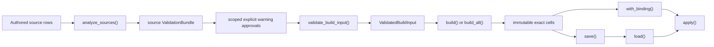

# Chapter 10: Inside the Exact Accumulator

The accumulator is an exact-artifact pipeline, not a rule-expansion engine. It accepts authored source rows only after source validation, compiles their normalized predicates into immutable, disjoint cells, and resolves a normalized context against a contract-bound artifact. It exposes cell and contributor identity rather than legacy combination bookkeeping or a reused filter-engine execution path.

Use the public package root for application imports. The implementation packages that produce predicates, layouts, native tables, and codec records are private implementation details.

## The bounded lifecycle

`AccumulatorEngine` requires explicit limits at construction:

```text
AccumulatorEngine(
    dimension_metadata,
    aggregates=None,
    *,
    boolean_coercion=BooleanCoercion.NONE,
    segmentation_dimensions=(),
    limits,
)
```

`limits` must be an `ExactLimits` instance. It is not optional and has no documented default. `boolean_coercion` must remain `BooleanCoercion.NONE`; segmentation names must be a unique sequence of declared dimensions. Aggregate declarations must be complete native declarations: an output name, data type, and `numeric_semantics="numeric-1"` are required together.

Every public operation opens an operation-scoped `OperationBudget`. The budget accounts for input and output bytes, work, live memory, predicate and theory state, regions, scopes, source-scope edges, contributor edges, narrow-word rows, numeric bits, and witnesses. An exhausted reservation raises `ExactResourceError` with the operation, phase, counter, requested amount, limit, and available scope information. Limits are part of the caller's safety contract, not a performance hint.



## Source analysis is separate from compilation

Source analysis and compiled evidence are different stages with different claims.

1. `analyze_sources(...)` normalizes the current authored rows, metadata, aggregate declarations, domains, predicates, languages, routing, contracts, validation policy, and limits. It returns a `ValidationBundle` containing a **source** report and findings. A returned bundle is diagnostic evidence, not build permission and not a compiled artifact.
2. `attach_warning_approvals(bundle, approvals, *, limits)` records only explicit `WarningApproval` records. Each approval identifies the source analysis and report, names the warnings it approves, and carries a scope. It does not invent authority, expand scope, or convert any finding into a clean result.
3. `validate_build_input(...)` re-admits the supplied current source material, checks that it matches the selected analysis, replays retained source witnesses, validates the source policy, and invokes the real permission gate. It returns `ValidatedBuildInput` only when that gate admits the selected source report and scoped approvals.

`ValidatedBuildInput` names the selected `analysis_input_id`, `source_report_id`, approval IDs, and bundle. `build()` does not take separate report IDs or approvals; it takes this validated value:

```python
lattice = engine.build(rules, validation=validated_build_input, partition_key=None)
lattices = engine.build_all(rules, validation=validated_build_input)
```

When context-key dimensions are configured, `build()` also requires a `partition_key` whose names exactly equal the configured context-key dimension names and whose values are declared by source validation. `build_all()` publishes all declared partitions from one preparation. Neither method is a shortcut around the source gate.

## Normalized predicates and disjoint cells

The compiler first creates a stable source record for every admitted row. A source record has a source UUID, a normalized predicate, routing values, aggregate contributions, and retained origins. The UUID is the provenance handle; source position and mutable row identity are not substitutes.

Compilation works over predicates in the declared domain. It discovers scoped regions, applies configured segmentation only to scope discovery, and materializes cells whose predicates are nonempty and mutually disjoint within their scope. The compiled evidence proves the relevant cell non-emptiness, disjointness, source-union, source-membership, output-fold, and profile-consistency checks before it is retained.

A cell is identified by `cell_id`, `predicate_id`, and `contributor_set_id`. The public `lattice.combinations` relation is an inspection view over those exact cells and declared output names. `lattice.contributors` relates contributor-set IDs to source UUIDs. To inspect one cell's declared contributors and outputs, use `lattice.lineage(cell_id)`; do not infer contributors from a numeric identity or from a source row displayed beside a cell.

The artifact deliberately keeps source meaning and compiled meaning separate:

| Material | Meaning |
|---|---|
| Source records and origins | What was authored and admitted for analysis. |
| Predicates, domains, contracts, reports, and approvals | Portable evidence and the policy context that governed admission. |
| Exact cells and contributor sets | The compiled, disjoint decision space and each cell's participating source UUIDs. |
| Narrow layout relations | Scoped execution state for the exact artifact. |

## Scoped narrow state

The compiled layout is five immutable relations: scopes, scope keys, source maps, vectors, and words. A scope owns a source map; that map gives each source UUID a scope-local position. A vector identifies a cell and contributor set within that scope. Membership is held in `words` as dense 63-bit values (`__word_value`), indexed by vector and word position.

The 63-bit representation is deliberately scoped. It bounds one word below the signed-int64 sign bit while allowing large source sets to use multiple words. Membership, union, intersection, and strict-subset checks operate word by word within one compatible map. A word allocation is not a cross-scope identifier, an ordered rank, or an application-visible provenance value. Cross-scope work remaps by source UUID before it compares membership.

`ExactLimits.max_scopes`, `max_source_scope_edges`, `max_contributor_edges`, and `max_word_rows` bound this representation. The compiler reserves these capacities before retaining the corresponding records. Extension code must preserve both the scoping rule and the reservation rule; replacing narrow words with an unbounded in-memory membership collection changes the resource contract.

## Numeric-1 output folds

`AggregateOp` offers `sum`, `min`, `max`, and `product`. An exact aggregate declares the source column, namespaced output name, data type, and `numeric_semantics="numeric-1"`; `SUM` and `PRODUCT` require an integer or float declaration. A datetime aggregate must declare `timezone="naive"` or `"utc"`.

The compiled cell's output is an exact-native fold over its contributor set, not a backend aggregate over an intermediate table. Integer folds reserve the required numeric-bit workspace. Float folds decode finite binary64 values, combine the exact dyadic representation, and round once to finite binary64 using ties-to-even. The budget's `max_numeric_bits` applies to this work. Unsupported input, non-finite values, a type mismatch, or a resource exhaustion remains an error; the pipeline does not substitute a rounded or partial value.

`lattice.lineage(cell_id)` joins declared aggregate outputs to contributor UUIDs and optional source labels. `AccumulatorResult.lineage` is available only for definite contributors. `candidate_cells`, `candidate_contributors`, and `candidate_lineage(cell_id)` are inspection surfaces for possible cells; candidate information never becomes a definite output.

## Contract-bound resolution

`apply()` is contract-bound and requires named identifiers:

```python
result = engine.apply(
    lattice,
    context,
    contract_id=contract_id,
    profile_id=profile_id,
    dont_care=None,
)
```

The engine first requires an exact lattice and verifies that its dimension records and aggregate declarations agree with the engine. It then opens an `apply` budget, admits the context against the chosen contract and profile, resolves the applicable exact cell, and returns an `AccumulatorResult`. `dont_care` is an optional request input; it is not a replacement for a contract field.

The result exposes a typed `OutcomeRecord` through `outcome`, along with `status`, `reason`, `binding_id`, `contract_id`, `profile_id`, decoded `values`, `cell_id`, `contributor_ids`, observations, and issues. `raise_for_status()` re-raises invalid or unresolved contexts as their typed errors. The accumulator does not provide filter-style survivors, ranks, or policy reselection.

For multiple declared partitions, `engine.index(lattices)` creates a coherent exact `LatticeIndex`; `apply_auto(...)` constructs that routing path for one call. Indexed application also requires `contract_id`, `profile_id`, and optional `dont_care`. A missing route raises `KeyError`; an admissible top-specificity tie raises `AmbiguousPartitionError`. Routing and resolution remain subject to the same limits and binding checks.

## Persistence and native restoration

Persistence is a bounded lifecycle, not an opaque table export:

```python
path = lattice.save(directory, limits=limits)
restored = Lattice.load(path, limits=limits)
bound = restored.with_binding(binding, evidence=evidence, limits=limits)
```

`save()` publishes a self-contained exact snapshot under a `save` budget. `load()` reconstructs an exact artifact only after it validates the manifest, typed native relations, source records, cells, layouts, semantic evidence, and replayed proof conditions under a `load` budget. `with_binding()` validates complete portable evidence and returns a new immutable binding view under its own budget. Failed restoration is not downgraded to an executable flat lattice.

The public `Lattice` constructor can represent flat data for inspection, but `_require_exact()` rejects that state for build-derived execution, lineage, binding, indexing, and application. Flat or legacy data is therefore inspection-only. Native codecs and the compiled native bridge are private boundaries; applications import their public models and errors from `mountainash_rules`, never from `_native` or private accumulator modules.

## Extension obligations

An exact-accumulator change is incomplete until it preserves the whole lifecycle:

- normalize and validate the authored source representation before analysis;
- state its predicate and domain meaning precisely enough for source diagnostics and compiled proofs;
- preserve source UUID provenance and cell disjointness;
- reserve every retained and temporary resource through `OperationBudget`;
- define exact `numeric-1` folding and native storage for every output type it introduces;
- serialize enough typed state for strict restoration, then replay the applicable semantic checks; and
- expose only stable package-root API, leaving source, layout, codec, and native-bridge internals private.

[Chapter 11](../11-extending-and-maintaining/index.md) turns these obligations into maintainer guidance. Chapters 7 and 8 describe the public workflow and inspection surfaces.